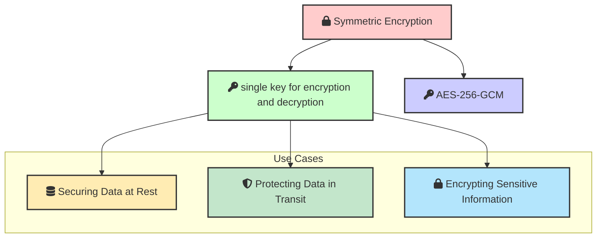
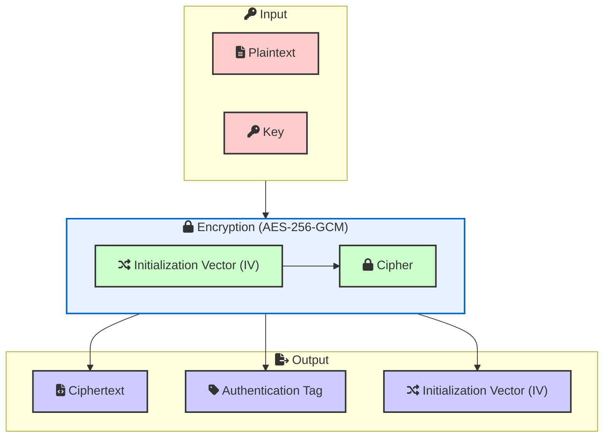
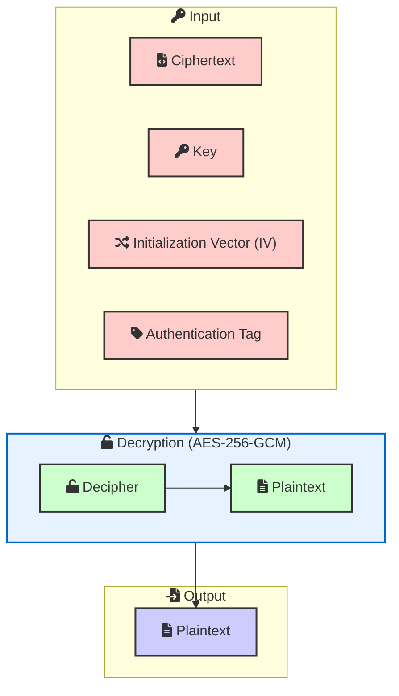

Symmetric encryption is a type of encryption where the same key is used for both encryption and decryption. We will cover the basics of encryption, how to implement it using Node.js, and how to ensure the security of your encrypted data.

## Introduction to Symmetric Encryption



Symmetric encryption is a method of encryption where a single key is used to both encrypt and decrypt data. This means that both the sender and receiver must have access to the same key. Symmetric encryption is generally faster and less complex than asymmetric encryption, making it suitable for encrypting large amounts of data.

**Use Cases of Symmetric Encryption**
Symmetric encryption is commonly used in various scenarios, including:
- Securing data at rest (e.g., encrypting files on disk)
- Protecting data in transit (e.g., securing network communication)
- Encrypting sensitive information in databases

**AES-256-GCM** 
AES (Advanced Encryption Standard) is a widely used symmetric encryption algorithm. The AES-256-GCM (Galois/Counter Mode) variant provides both encryption and authentication, ensuring data confidentiality and integrity.


## Writing the Encryption Code

To implement symmetric encryption in Node.js, we need to create functions for encrypting and decrypting data using the AES-256-GCM algorithm. We will use the `crypto` module, which provides cryptographic functionality.


```javascript
const crypto = require('crypto');

function encryptSymmetric(key, plaintext) {
  const iv = crypto.randomBytes(12); 
  const cipher = crypto.createCipheriv('aes-256-gcm', Buffer.from(key, 'base64'), iv);
  let ciphertext = cipher.update(plaintext, 'utf8', 'base64');
  ciphertext += cipher.final('base64');
  const tag = cipher.getAuthTag().toString('base64');

  return {
    ciphertext,
    iv: iv.toString('base64'), 
    tag 
  };
}

function decryptSymmetric(key, ciphertext, iv, tag) {
  const decipher = crypto.createDecipheriv('aes-256-gcm', Buffer.from(key, 'base64'), Buffer.from(iv, 'base64'));
  decipher.setAuthTag(Buffer.from(tag, 'base64'));
  let plaintext = decipher.update(ciphertext, 'base64', 'utf8');
  plaintext += decipher.final('utf8');

  return plaintext;
}
```

### encryptSymmetric



**Encryption Process: A Simplified Explanation**

1. **Input:**
   * **Plaintext:** This is your original data—the information you want to protect. It could be a text message, a document, or any digital data.
   * **Key:** This is your secret password. It's a string of characters or numbers that you and the recipient of the encrypted data must both know.  
   * **Initialization Vector (IV):** This is a random value generated for each encryption operation. It adds an extra layer of security to prevent identical plaintexts from resulting in the same ciphertext.

2. **Encryption (AES-256-GCM):**
   * The encryption algorithm (AES-256-GCM) is like a powerful machine. It takes the plaintext, key, and IV as input.
   * Inside the encryption "machine," these inputs are combined through a complex mathematical process. This process scrambles the plaintext in a way that's impossible to understand without the correct key and IV.

3. **Output:**
   * **Ciphertext:** The result of encryption is the ciphertext. This is the transformed version of your original data. It is unreadable without the key and IV.
   * **Authentication Tag:** This is a unique code generated during the encryption process. It's like a digital signature that ensures the ciphertext hasn't been tampered with.


### decryptSymmetric




1. **Input**:
   - **Ciphertext**: The encrypted data that needs to be decrypted.
   - **Key**: The secret key used for both encryption and decryption.
   - **Initialization Vector (IV)**: The IV used during encryption, needed for decryption.
   - **Authentication Tag**: The tag used to verify the integrity and authenticity of the data.

2. **Decryption Process (AES-256-GCM)**:
   - **Decipher**: The process of transforming ciphertext back into plaintext using the AES-256-GCM algorithm.
   - **Plaintext**: The original data after decryption.

3. **Output**:
   - **Plaintext**: The result of the decryption process.


## Security Considerations

### Key Management
Proper key management is crucial for the security of your encrypted data. Store keys securely and avoid hardcoding them in your source code.

### Using a Strong IV
Always use a strong and random initialization vector (IV) for each encryption operation. Reusing an IV can compromise the security of your encrypted data.

### Handling Sensitive Data
Ensure that sensitive data, such as keys and plaintext, are securely handled in your application. Avoid logging sensitive information and use secure memory management practices.


## Full Source Code

```js
const crypto = require('crypto');

function encryptSymmetric(key, plaintext) {
  // Generate a random initialization vector (IV)
  const iv = crypto.randomBytes(12); 

  // Create a Cipher object with the AES algorithm, key, and IV
  const cipher = crypto.createCipheriv('aes-256-gcm', Buffer.from(key, 'base64'), iv);

  // Encrypt the plaintext
  let ciphertext = cipher.update(plaintext, 'utf8', 'base64');
  ciphertext += cipher.final('base64');

  // Retrieve the authentication tag
  const tag = cipher.getAuthTag().toString('base64');

  return {
    ciphertext,
    iv: iv.toString('base64'), 
    tag 
  };
}

function decryptSymmetric(key, ciphertext, iv, tag) {
  // Create a Decipher object with the same algorithm, key, and IV
  const decipher = crypto.createDecipheriv('aes-256-gcm', Buffer.from(key, 'base64'), Buffer.from(iv, 'base64'));

  // Set the authentication tag
  decipher.setAuthTag(Buffer.from(tag, 'base64'));

  // Decrypt the ciphertext
  let plaintext = decipher.update(ciphertext, 'base64', 'utf8');
  plaintext += decipher.final('utf8');

  return plaintext;
}

// Example Usage
const originalText = 'This is a secret message.';
const key = crypto.randomBytes(32).toString('base64');

const { ciphertext, iv, tag } = encryptSymmetric(key, originalText);
console.log('Ciphertext:', ciphertext);
console.log('IV:', iv);
console.log('Tag:', tag);

const decryptedText = decryptSymmetric(key, ciphertext, iv, tag);
console.log('Decrypted Text:', decryptedText);
```

<a href="/posts/password-hashing">Next Post: Hashing Passwords</a> 
