## Why Hash Passwords? 🛡️

*Plaintext storage is dangerous*


*Hashing protects against breaches*


- **Insecure Plaintext:** Storing passwords in plain text is like leaving your front door unlocked. If a database is breached, attackers can easily steal and use the passwords.
- **Hashing as Protection:** Hashing transforms passwords into unique, scrambled codes (hashes). This process is irreversible, meaning even if hackers get the hashes, they can't directly obtain the original passwords.

## Hashing is a one-way street


- **Hash Functions:** A hash function takes an input (password) and produces a fixed-size string of characters (hash). Good hash functions are designed so different inputs result in very different outputs.
- **One-Way Street:** Hash functions are one-way, meaning you can't reverse the process to get the original password from the hash. This is essential for security.

## Salt and Pepper: Adding Flavor to Security 🧂🌶️

### Salt

*Salting makes each hash unique, even for identical passwords*


- **Salt:** A unique, random value added to each password before hashing. This ensures that even if two users have the same password, their hashes will be different.
  


### Sample code for salting and verifying passwords

```js
const bcrypt = require('bcrypt');
const saltRounds = 10;

// Hashing a password
function hashPassword(password) {
    const salt = bcrypt.genSaltSync(saltRounds);
    const hash = bcrypt.hashSync(password, salt);
    return { salt, hash };
}

// Verifying a password
function verifyPassword(storedHash, storedSalt, inputPassword) {
    const hash = bcrypt.hashSync(inputPassword, storedSalt);
    return hash === storedHash;
}

// Example usage
const password = '123445';
const { salt, hash } = hashPassword(password);
console.log(`Salt: ${salt}`);
console.log(`Hash: ${hash}`);

const isValid = verifyPassword(hash, salt, '123445');
console.log(`Password is valid: ${isValid}`);
```


**Table**: `users`

Sample table structure for storing salted passwords:

| id  | username | email            | salt                  | password_hash               |
|-----|----------|------------------|-----------------------|-----------------------------|
| 1   | joe      | joe@gmail.com    | random_salt_for_joe   | hashed_password_with_salt_for_joe |
| 2   | doe      | doe@gmail.com    | random_salt_for_doe   | hashed_password_with_salt_for_doe |


### Pepper
*Pepper adds a secret layer*

```mermaid
graph LR
subgraph peppering["fa:fa-pepper-hot Peppering"]
    plaintextPassword["fa:fa-keyboard Plaintext Password"] --> |fa:fa-plus|pepper["fa:fa-pepper-hot Secret Pepper"]
    saltedHash["🧂 Salted Hash"]

    pepper --> hashFunction
    saltedHash --> hashFunction

    hashFunction --> pepperedHash["fa:fa-lock Peppered Hash"]
end

style plaintextPassword fill:#ffebcc,stroke:#800
style pepper fill:#ffcccc,stroke:#800
style saltedHash fill:#ccffcc,stroke:#080
style hashFunction fill:#ccffcc,stroke:#080
style pepperedHash fill:#fff0cc,stroke:#880

```




- **Pepper:** A secret key added to the hashing process. Unlike salt, pepper is not stored with the hash, adding an extra layer of security. Typically kept in a separate, secure location such as in the application code or a secure environment variable. Even if the database is compromised, attackers won't have access to the pepper.

### Sample code for peppering passwords

```js
const bcrypt = require('bcrypt');
const crypto = require('crypto');
const saltRounds = 10;
const PEPPER = process.env.PASSWORD_PEPPER || 'default_pepper'; // For testing, set default value
const HMAC_KEY = process.env.HMAC_KEY || 'default_hmac_key'; // For testing, set default value

// Generate HMAC for a given input
function generateHmac(input) {
    return crypto.createHmac('sha256', HMAC_KEY).update(input).digest('hex');
}

// User registration
function registerUser(password) {
    const salt = bcrypt.genSaltSync(saltRounds);
    const hmacPassword = generateHmac(password + PEPPER);
    const hashedPassword = bcrypt.hashSync(hmacPassword, salt);
    // Store salt and hashedPassword in the database
    // Example: return { username: 'joe', salt: salt, password_hash: hashedPassword }
    return { salt, hashedPassword };
}

// User login
function loginUser(storedSalt, storedHash, inputPassword) {
    const hmacInputPassword = generateHmac(inputPassword + PEPPER);
    const hashedInputPassword = bcrypt.hashSync(hmacInputPassword, storedSalt);
    if (hashedInputPassword === storedHash) {
        console.log('Login successful!');
        return true;
    } else {
        console.log('Invalid password.');
        return false;
    }
}

// Test code
function runTests() {
    console.log('Running tests...');

    // Test 1: Register and login with correct password
    console.log(`Test 1: Register and login with correct password`)
    const password1 = 'mypassword';
    const { salt, hashedPassword } = registerUser(password1);
    console.log('Registered user with salt:', salt);
    const loginSuccess1 = loginUser(salt, hashedPassword, password1);
    console.assert(loginSuccess1, 'Test 1 failed: login should succeed with correct password');

    // Test 2: Attempt to login with incorrect password
     console.log(`\n Test 2: Attempt to login with incorrect password`)
    const incorrectPassword = 'wrongpassword';
    const loginSuccess2 = loginUser(salt, hashedPassword, incorrectPassword);
    console.assert(!loginSuccess2, 'Test 2 failed: login should fail with incorrect password');

}

// Run tests
runTests();

```


## Popular Hashing Algorithms 🧮

*Different algorithms offer varying strengths*


- **PBKDF2:** Uses multiple iterations of a hash function to make it slower and more resistant to brute-force attacks.
- **BCrypt:** Specifically designed for password hashing. It's slower than PBKDF2 and uses more memory, making it harder to crack.
- **Argon2:** The current standard for password hashing. It's memory-hard, highly customizable, and resistant to various attacks.

### Sample code for hashing and verifying passwords using Argon2

```js
const argon2 = require('argon2');

async function hashPassword(password) {
  // Hashing the password
  const hash = await argon2.hash(password, {
    type: argon2.argon2id, // Recommended variant
    memoryCost: 2 ** 16,   // Adjust memory usage (higher is slower)
    timeCost: 3,           // Adjust processing time (higher is slower)
    parallelism: 1         // Number of parallel threads (usually 1)
  });
  return hash;
}

async function verifyPassword(password, hash) {
  // Verifying the password against the stored hash
  try {
    if (await argon2.verify(hash, password)) {
      return true; // Password matches
    } else {
      return false; // Password does not match
    }
  } catch (err) {
    // Handle potential errors (e.g., invalid hash)
    console.error('Error verifying password:', err);
    return false;
  }
}

// Example usage
async function main() {
  const password = 'your_super_secret_password';

  // Hash the password
  const hashedPassword = await hashPassword(password);
  console.log('Hashed password:', hashedPassword);

  // Verify the password (replace with the actual stored hash)
  const isMatch = await verifyPassword(password, hashedPassword);
  console.log('Password match:', isMatch); 
}

main();
```

### Avoiding Weak Algorithms

Outdated algorithms like `MD5` and `SHA-1` should be avoided due to their vulnerability to collision attacks. `DES` is insecure because of its short 56-bit key, making it susceptible to brute-force attacks. `LANMAN` is weak as it splits passwords, converts them to uppercase, and uses DES, leading to easy brute-forcing. Using `SHA-2` without salting is also insecure, as it leaves hashes open to rainbow table attacks


## Considerations for Secure Password Hashing 🔒


  
  - Prioritize **Argon2** as the recommended algorithm.
  - **Tune parameters** (memory, time) to balance security and performance based on your system's resources.
  - **Stay updated** with the latest security guidelines and consider upgrading algorithms as needed.
  - **Key stretching:** Applies the hash function multiple times to further slow down attackers.
  - **Hardware Security Modules (HSMs):** Dedicated hardware for secure cryptographic operations, offering an extra layer of protection.

## Use Hash to ensure data integrity

Hash functions are not only used for password hashing but also for ensuring data integrity. Hash-based message authentication codes (HMACs) combine a secret key with a hash function to create a secure way to verify data integrity.

```mermaid
graph 
   subgraph message
    style message fill:#ccffcc,stroke:#,stroke-width:2px
    data["💽 data"]
    subgraph hash["HMAC"]
        subgraph sha["✂️ SHA-256"]
            style sha fill:#ccffff,stroke:#,stroke-width:2px
            data1["💽 data"]
            secret["㊙️ secret"]
        end
  end
end

```



Create a hash-based message authentication 

```js
const crypto = require('crypto');
const secretKey = 'your-secret-key';
const data = 'your-message-data';

const hmac = crypto.createHmac('sha256', secretKey);
hmac.update(data);
const hash = hmac.digest('hex');

console.log('HMAC:', hash);
```

Verify the integrity of the data using the HMAC

```js
const receivedData = 'your-message-data';
const receivedHMAC = 'received-hmac-value';  // This should be the HMAC value received along with the data

const verifyHmac = crypto.createHmac('sha256', secretKey);
verifyHmac.update(receivedData);
const newHash = verifyHmac.digest('hex');

if (newHash === receivedHMAC) {
    console.log('Data integrity verified');
} else {
    console.log('Data has been tampered with');
}
```


## Keywords To Remember

```mermaid
graph 

  
 subgraph  
    data["💽"]
    salt["🧂"]
  end

  subgraph  
    hmac["#️"]
    secret["㊙️"]
  end
  pepper["🌶️"] 
  hash["✂️"]
  
  
```

