# Transaction - Block

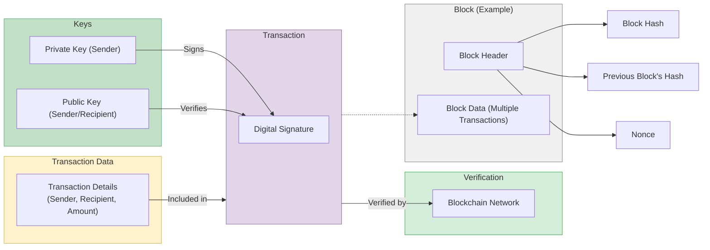

- **Transaction**: A digital record of value transfer between two parties (sender and recipient) with a specific amount. It's signed with the sender's private key and verified by the network using their public key.

- **Block**: A collection of verified transactions grouped together, along with a header containing metadata (e.g., timestamp, previous block's hash).

# Miner - Node - Wallet

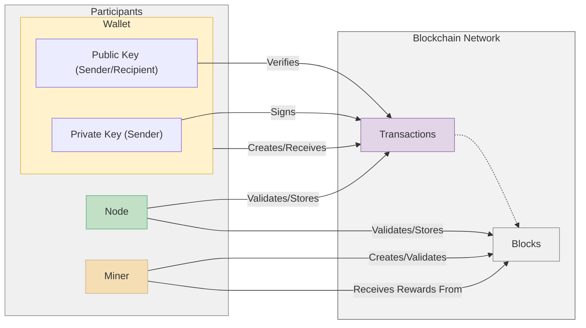

- **Miner**: Miners solve complex puzzles to add new blocks to the blockchain, ensuring its security and earning rewards in the process.

- **Node**: Nodes maintain copies of the blockchain, validate transactions, and relay information across the network.

- **Wallet**:  Wallets store users' private keys (used for signing transactions) and public keys (used for receiving transactions), allowing them to interact with the blockchain.

# Hashrate

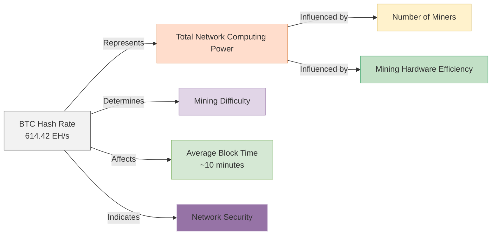

**Bitcoin Hashrate** measures the total computing power miners use to secure the network, currently at 614.42 EH/s. A higher hashrate enhances security by making it harder for bad actors to control the network. It also influences mining difficulty, ensuring consistent block creation times.

# ETH (proof of stake)

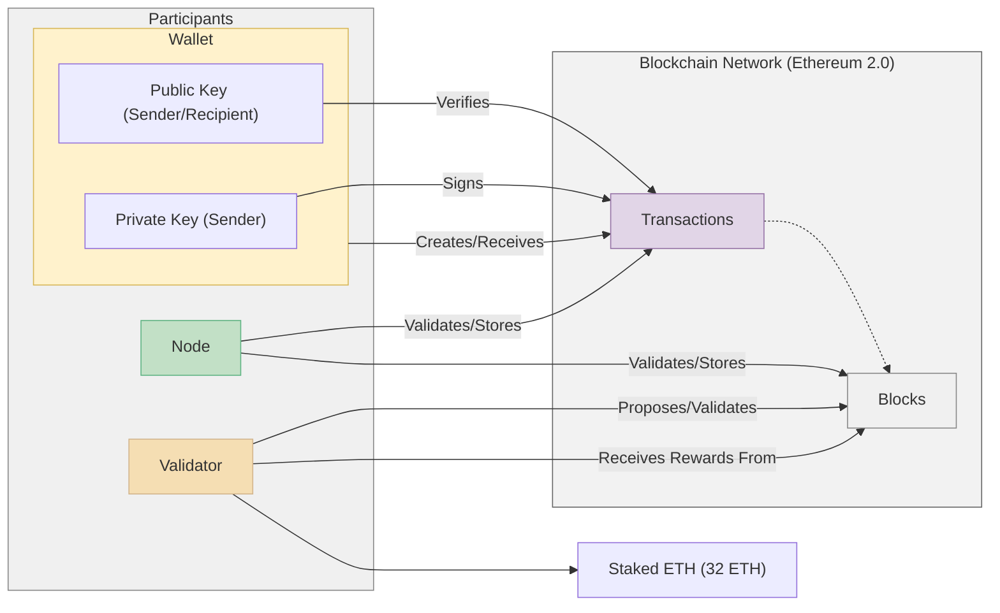

**POS (proof of stake)**: stake ETH to become validators. Validators are randomly selected to propose new blocks, with others attesting to their validity. Correct validators earn rewards, while incorrect ones are penalized. This replaces mining, making Ethereum more scalable and eco-friendly.

# Restaking

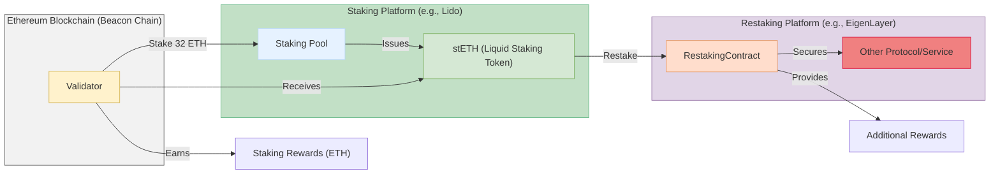

**Restaking** : allows Ethereum validators to use their staked ETH to secure additional protocols, like EigenLayer, beyond the main Ethereum network. This increases security for multiple protocols and enables validators to earn additional rewards. Validators' staked ETH is verified and utilized across different applications, enhancing capital efficiency and network robustness.

# Smart Contracts

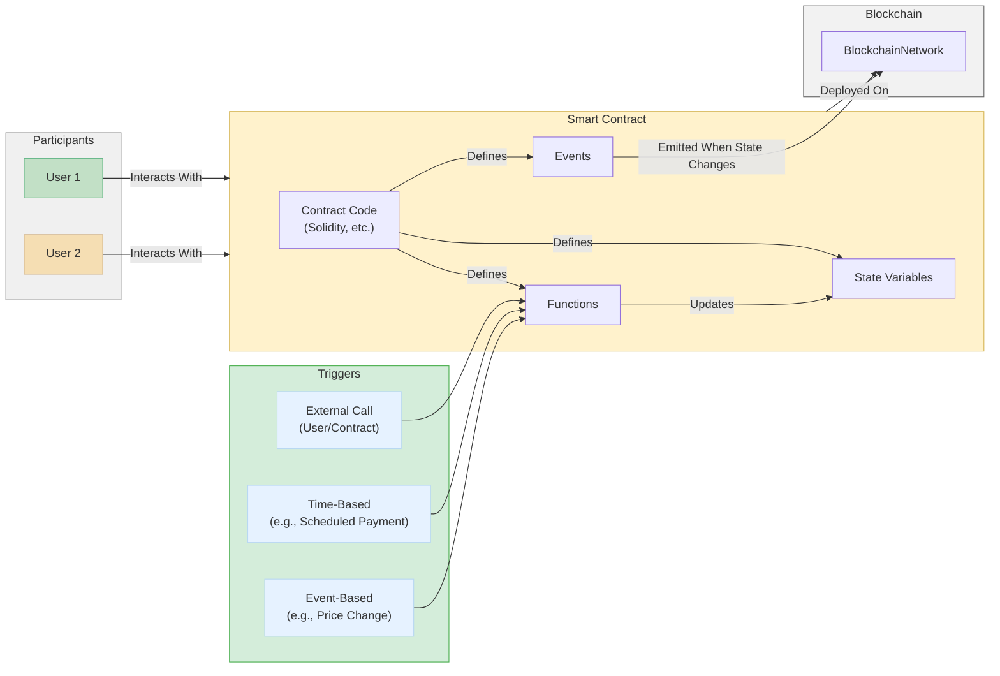

**Smart contract**: A smart contract is a self-executing contract with the terms directly written into code on a blockchain. It automatically enforces and executes the terms of an agreement when predefined conditions are met. This eliminates the need for intermediaries, reducing costs and enhancing security. Smart contracts are commonly used in various applications, including finance, real estate, and supply chain management.

## NFT (Non-Fungible Token)

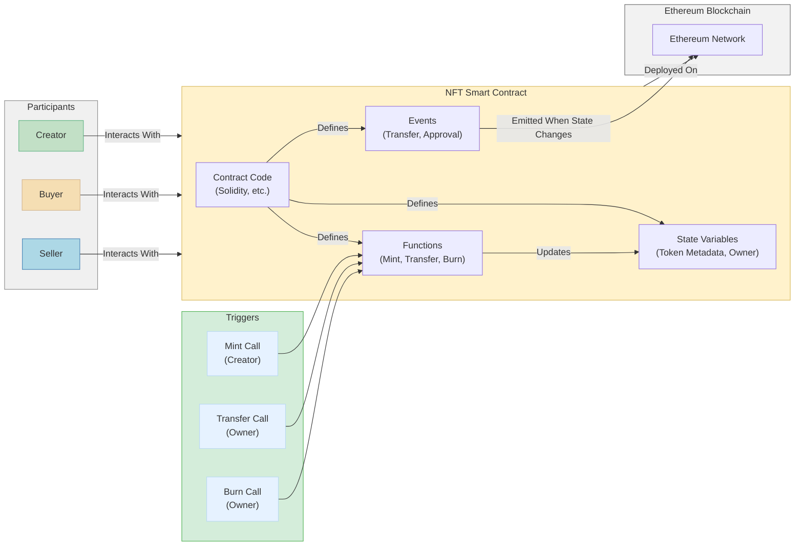

**An NFT (Non-Fungible Token)** is a unique digital asset represented by a smart contract. The smart contract contains code that defines state variables like token metadata and ownership, and functions for minting, transferring, and burning NFTs. Creators can mint new NFTs, owners can transfer them, and events like transfers and approvals are logged on the blockchain. Participants such as creators, buyers, and sellers interact with the NFT smart contract to manage the lifecycle of NFTs, ensuring transparency and security in ownership.
##  Lending and Borrowing

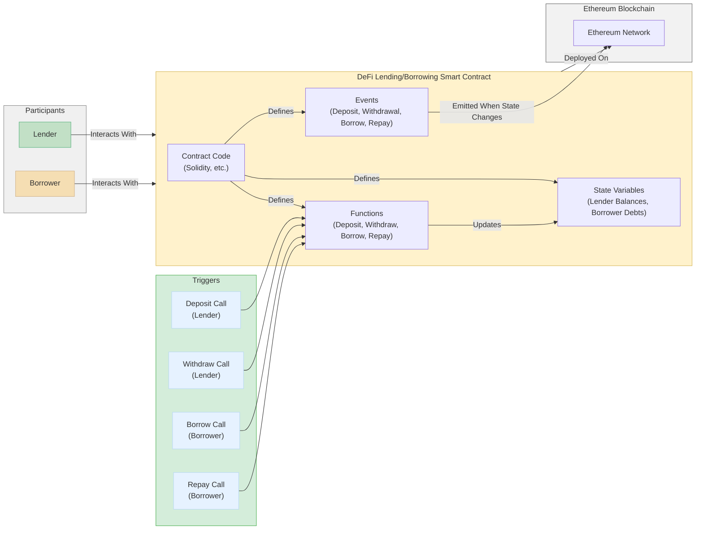

**Lenders** deposit funds into a smart contract to earn interest. **Borrowers** take out loans by using collateral and paying interest. Smart contracts manage balances, debts, and ensure transparent transactions. Lenders can withdraw their funds, and borrowers can repay loans through specific function calls. This system enhances accessibility and efficiency in financial services without intermediaries.
# ETH VM ( Virtual Machine)

This is a virtual computer that runs on the Ethereum network. It's responsible for executing smart contracts.

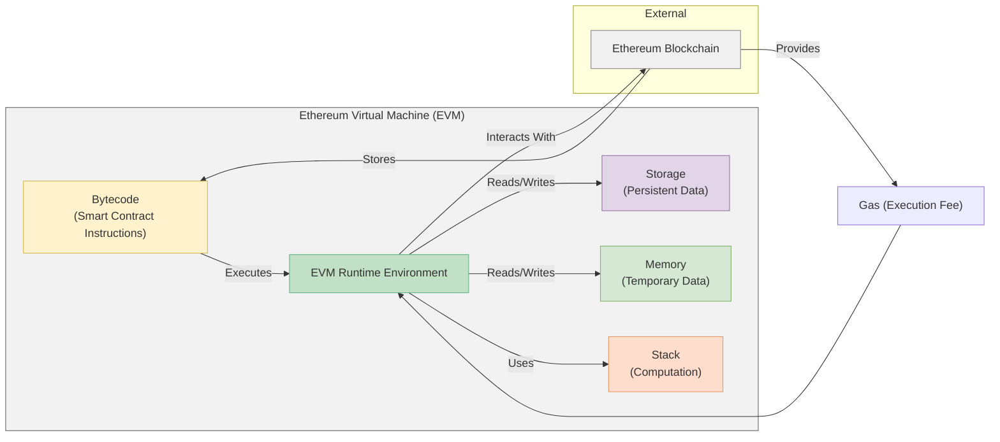

# TVL (Total Value Locked)

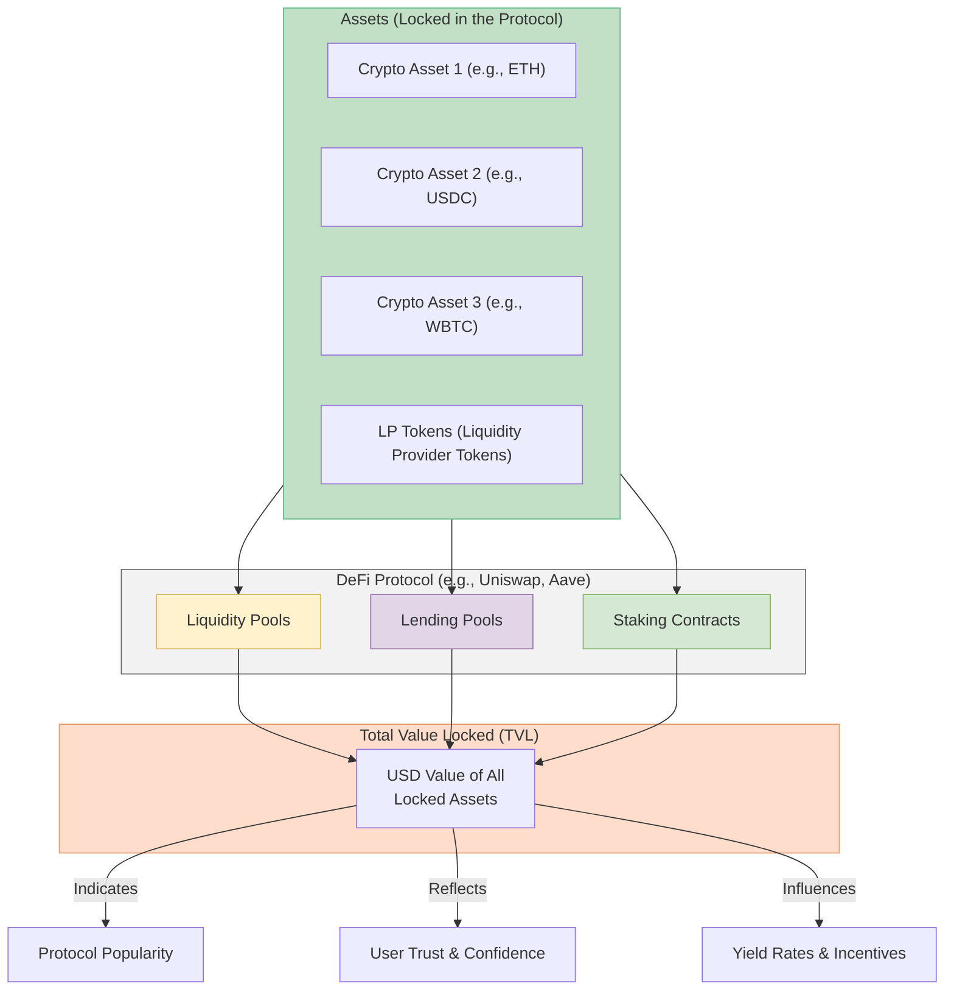

# Total/Locked/Circulating Supply

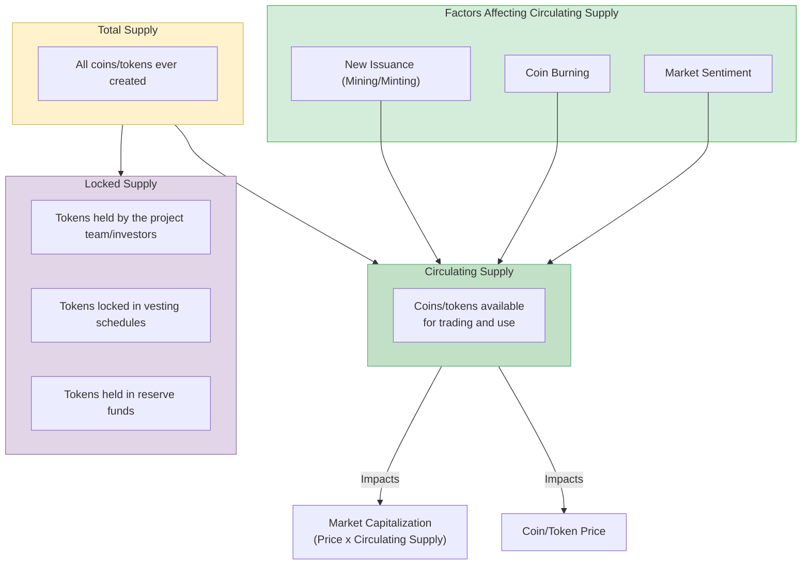
- **Total Supply**: The maximum number of coins or tokens that will ever exist for a particular cryptocurrency. This number is often fixed or predetermined.

- **Locked Supply**:  The portion of the total supply that is not currently available for trading or use. This includes tokens held by the project team, investors, or in reserve funds, often subject to vesting schedules (gradual release over time).

- **Circulating Supply**:  The number of coins or tokens that are currently available and actively traded on the market. This is the supply that directly impacts the market dynamics of the cryptocurrency.

# TPS ( Transactions Per Second)

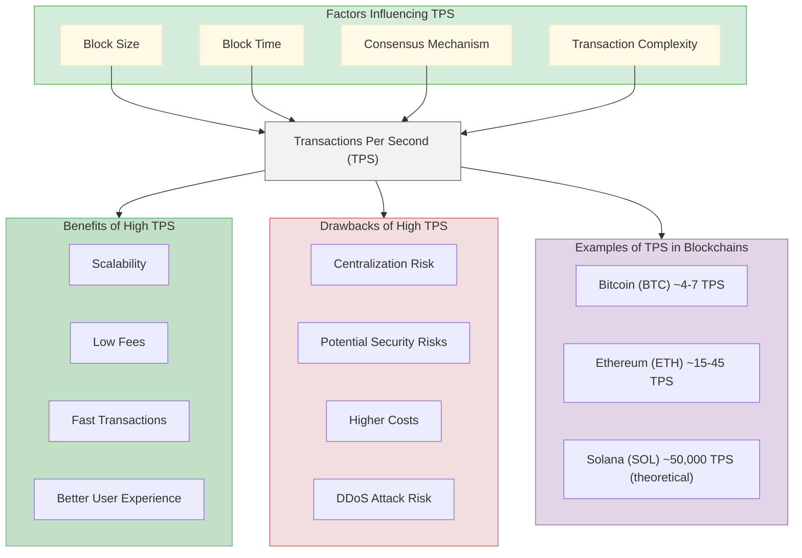
**TPS**: measures a blockchain's transaction processing speed, influenced by block size, time, consensus, and complexity.
High TPS offers scalability and fast transactions, but can risk security and decentralization.

# Layer 2

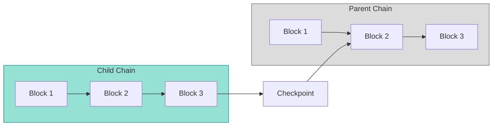
## Rollup

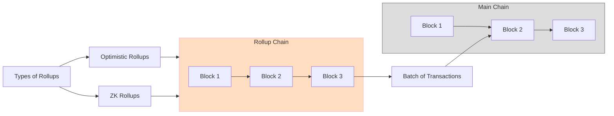

# Sharding

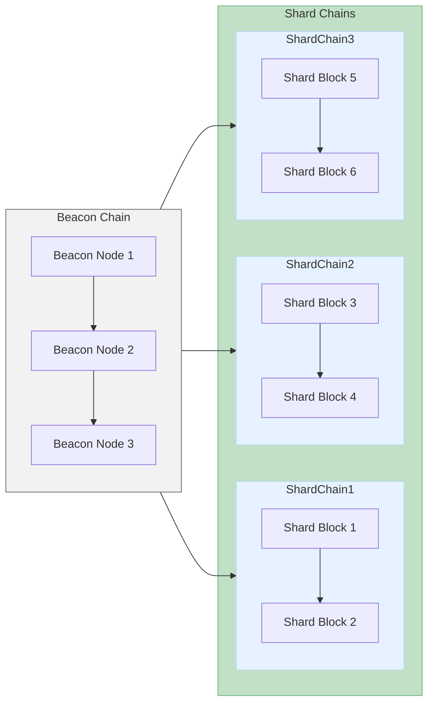

- **Beacon Chain** (Coordinator): This is the main chain that manages the entire sharded network. It assigns validators to different shard chains and ensures consensus across the network.

- **Shard Chains** (Parallel Processing): These are smaller chains that run in parallel, each processing a portion of the network's transactions and state. This parallel processing significantly increases the overall transaction throughput of the blockchain.

- **Shard Blocks**: Blocks on individual shard chains contain transactions and data relevant to that specific shard.
