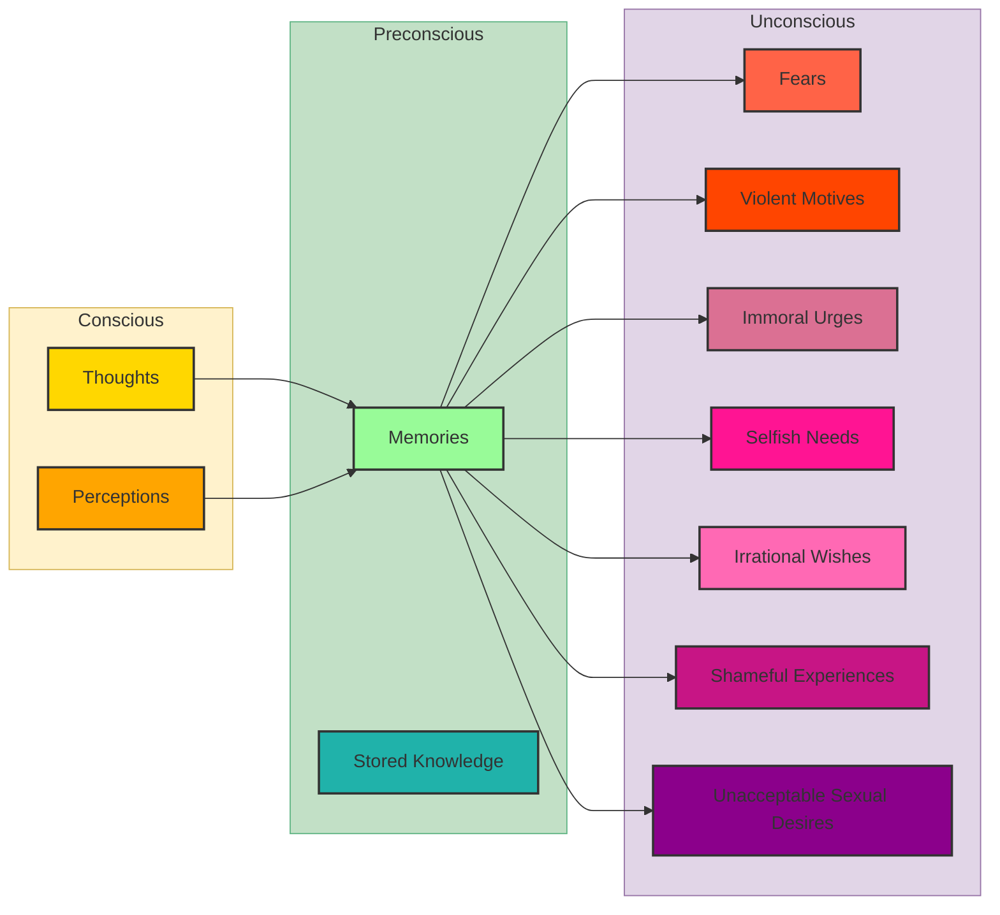
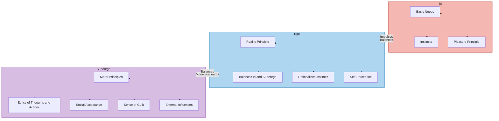

## Sigmund Freud

Sigmund Freud, the father of psychoanalysis, introduced a groundbreaking theory of the mind that revolutionized our understanding of human psychology. Central to his theory is the structure of the mind, which he divided into three distinct parts: the conscious, the preconscious, and the unconscious. Each of these parts plays a crucial role in shaping our thoughts, behaviors, and emotions.

## The Conscious

The conscious mind encompasses everything that we are aware of at any given moment. This includes our current thoughts, perceptions, and feelings. It is the aspect of our mental processing that we can think about and discuss rationally.

- **Thoughts**: These are the ideas and considerations actively occupying our minds.
- **Perceptions**: These are our interpretations of sensory information from our environment.

## The Preconscious

The preconscious contains thoughts and feelings that are not currently in our conscious awareness but can be brought to consciousness easily. It serves as a bridge between the conscious and unconscious parts of the mind.

- **Memories**: These are past experiences that can be recalled when needed.
- **Stored Knowledge**: This includes learned information and skills that we can access when necessary.

## The Unconscious

The unconscious mind is the largest and most enigmatic part of Freud's model. It comprises thoughts, memories, and desires that are outside of conscious awareness but still influence our behavior and emotions. The contents of the unconscious are often disturbing or socially unacceptable, leading to their repression.

- **Fears**: Deep-seated anxieties that influence our behavior.
- **Violent Motives**: Aggressive impulses kept out of conscious awareness.
- **Immoral Urges**: Desires that conflict with societal norms and personal ethics.
- **Selfish Needs**: Strong desires for self-gratification that are socially unacceptable.
- **Irrational Wishes**: Desires that do not align with rational thought or reality.
- **Shameful Experiences**: Past events that cause feelings of shame.
- **Unacceptable Sexual Desires**: Sexual urges that are considered taboo.

## Interaction Between the Parts

Freud's theory suggests that the different parts of the mind interact dynamically:

- **Conscious Thoughts and Perceptions** can trigger memories in the preconscious.
- **Memories in the Preconscious** can influence the unconscious, leading to the emergence of repressed fears, motives, and desires.

## Personality Structure

**Id**: The most primitive part of the personality, driven by the pleasure principle. It seeks immediate gratification of basic needs and desires, such as hunger, thirst, and sexual urges. It is impulsive, irrational, and unconscious.

**Ego**: The mediator between the Id and the Superego, operating on the reality principle. It seeks to satisfy the Id's desires in socially acceptable ways. It is rational, logical, and conscious.

**Superego**: The moral compass of the personality, driven by the morality principle. It represents internalized ideals and values learned from parents and society. It strives for perfection and adherence to social norms. It is both conscious and unconscious.
