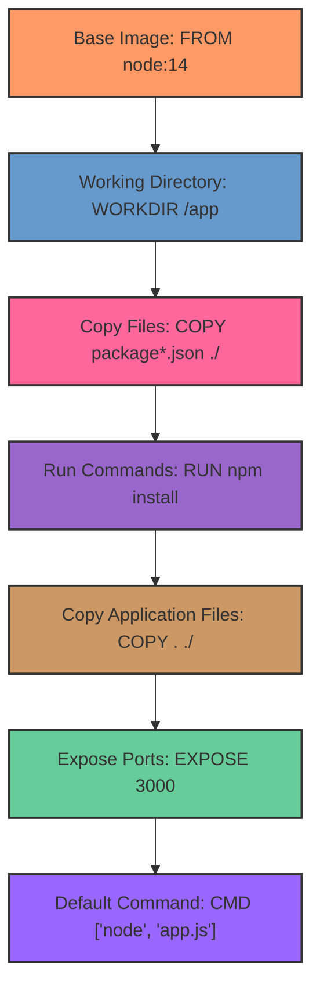
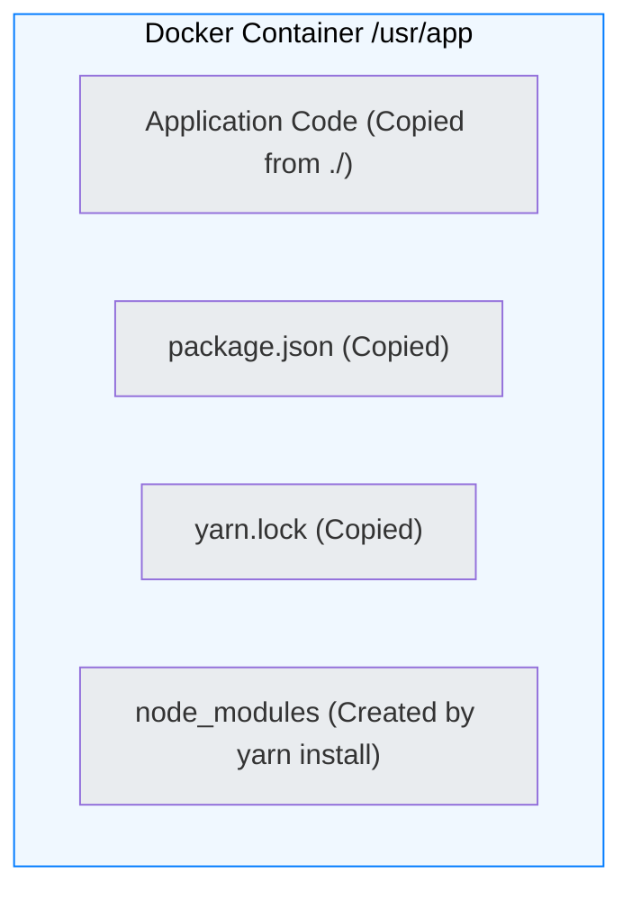
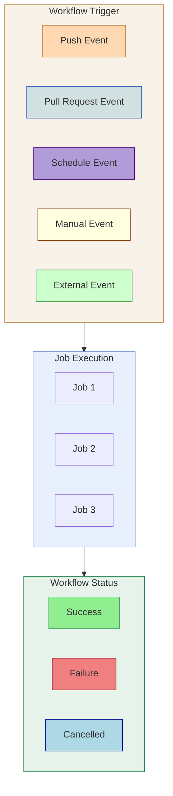
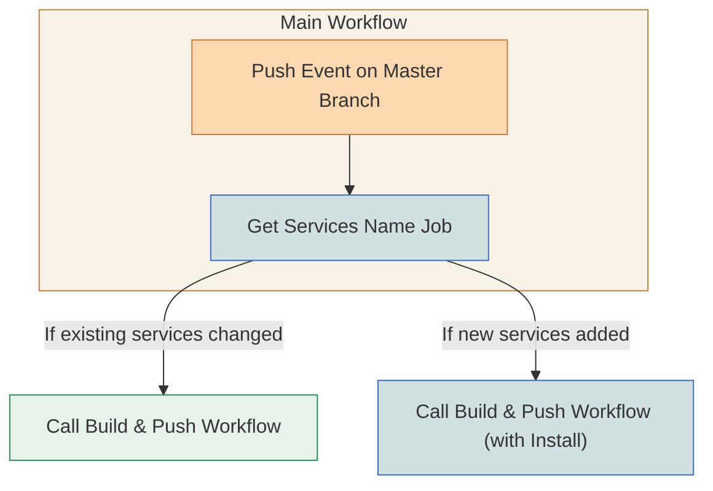
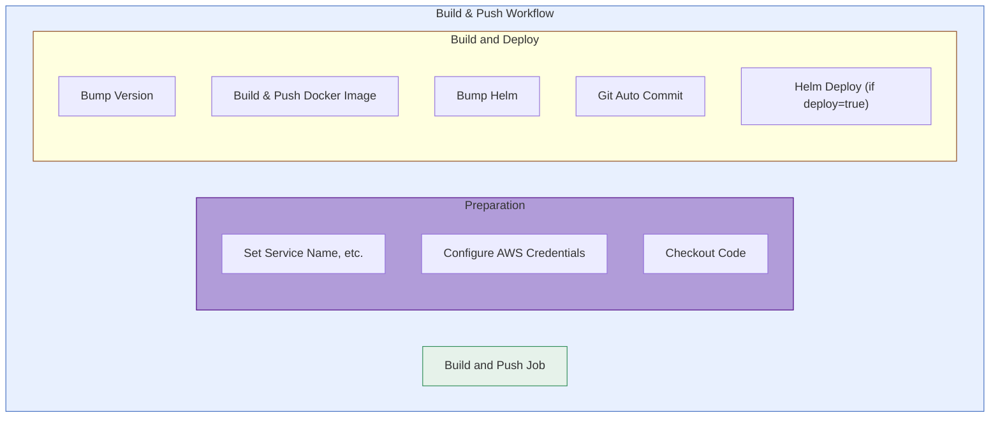

This is the workflow I use to build and push Docker images to AWS ECR and deploy to Kubernetes using Helm. The workflow is triggered by a push to the master branch. It checks the services that have changed and calls the appropriate workflow to build and push the Docker images.


## Project Directory Structure

```bash
main-repo/
├── .github/
│   └── workflows/
│       ├── build-push.yml
│       └── main.yml
├── serviceA/
│   ├── build/
│   │   └── Dockerfile
│   ├── helm/
│   └── Makefile
└── serviceB/
    ├── build/
    │   └── Dockerfile
    ├── helm/
    └── Makefile

```

## Dockerfile


```bash
FROM node:18-alpine
WORKDIR /usr/app
COPY ./package.json ./
COPY ./yarn.lock ./
RUN yarn install --production
COPY ./ ./
CMD ["yarn", "start"]
```


## Contents of a Docker container



## Github Workflow



- **Workflow Trigger**: Represents the event that initiates the workflow (e.g., push, pull request, schedule, manual, external).
- **Job Execution**: The individual jobs within the workflow are executed in parallel or sequentially.
- **Workflow Status**: The final outcome of the workflow (success, failure, or cancellation).

## Workflow Chaining


### Main Workflow

The main workflow is triggered by a push to the master. Base on the changes in the services, it calls the appropriate workflow to build and push the Docker images.

### Build & Push Workflow



