Before reading this article, you should have a basic understanding of concepts and blockchain technology at this post [blockchain-for-dummies](https://kelvin-bz.github.io/posts/blockchain-for-dummies/)


## Introduction to Solidity

Solidity is a high-level programming language designed for writing smart contracts on the Ethereum blockchain.


## Solidity Language Fundamentals


### Structure of a Solidity File


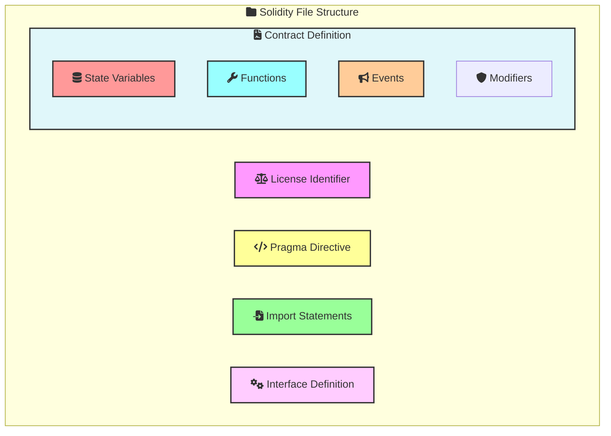

```js
// SPDX-License-Identifier: MIT

pragma solidity ^0.8.0;

contract MyContract {
    // State variables
    uint256 public myVariable;

    // Constructor
    constructor(uint256 initialValue) {
        myVariable = initialValue;
    }

    // Functions
    function set(uint256 newValue) public {
        myVariable = newValue;
    }

    function get() public view returns (uint256) {
        return myVariable;
    }

    // Events
    event ValueChanged(uint256 newValue);
}
```

### Data Types and Variables

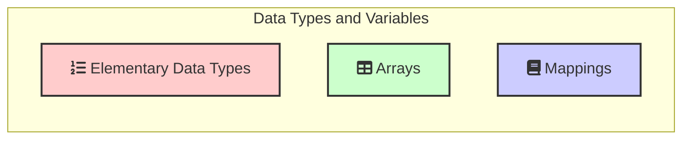

#### Elementary Data Types

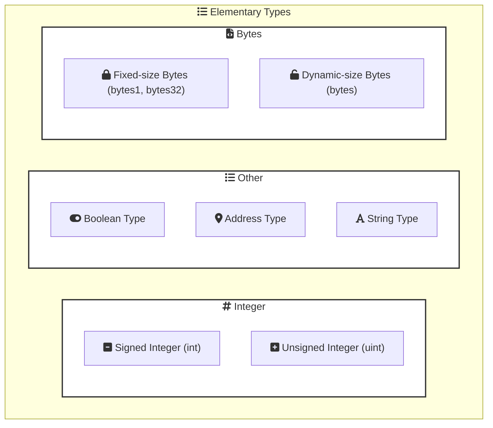


- **Use `bytes` when:**
  - You need to handle raw binary data or arbitrary byte arrays.
  - You need to perform operations on individual bytes directly.
  - You want to save gas by avoiding the overhead of UTF-8 encoding.

- **Use `string` when:**
  - You need to handle text data that requires UTF-8 encoding.
  - You want to store and manipulate human-readable text.

```js
// SPDX-License-Identifier: MIT
pragma solidity ^0.8.17;

// Creating a contract
contract ExampleTypes {   

    // Initializing bool variable
    bool public isActive = true;
    
    // Initializing a signed integer variable
    int32 public temperature = -273;

    // Initializing an unsigned integer variable
    uint32 public maxSupply = 1000000;

    // Initializing an address variable
    address public wallet = 0x0000000000000000000000000000000000000000;
 
    // Initializing a string variable
    string public greeting = "Welcome";
 
    // Initializing a byte variable
    bytes1 public initial = "W";
     
    // Defining an enumerator
    enum Status { PENDING, ACTIVE, INACTIVE } 
 
    // Defining a function to return values stored in an enumerator
    function getStatus() public pure returns(Status) {   
        return Status.ACTIVE;   
    }   
}
```


#### Arrays

Arrays are collections of elements of the same type.

**Static Arrays:**
```js
uint256[5] public staticArray;
```

**Dynamic Arrays:**
```js
uint256[] public dynamicArray;
```

**Array Operations:**

```js
function arrayOperations() public {
    dynamicArray.push(1);
    uint256 length = dynamicArray.length;
    uint256 firstElement = dynamicArray[0];
}
```

#### Mappings

Mappings are key-value data structures.

```js
mapping(address => uint256) public balances;

function updateBalance(address account, uint256 amount) public {
    balances[account] = amount;
}

function getBalance(address account) public view returns (uint256) {
    return balances[account];
}
```


### Control Structures (if, else, loops)
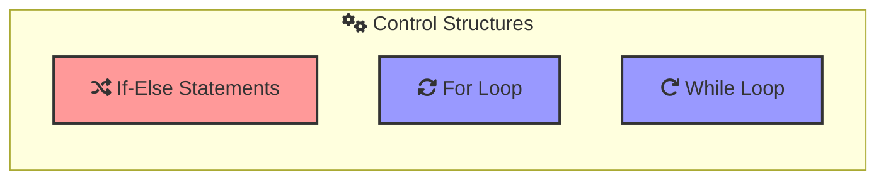

Solidity supports standard control structures for conditional execution and loops.

#### Conditional Statements

**If-Else Statements:**
```js
function checkValue(uint256 value) public pure returns (string memory) {
    if (value > 10) {
        return "Greater than 10";
    } else {
        return "10 or less";
    }
}
```

#### Loops

**For Loop:**
```js
function sumArray(uint256[] memory array) public pure returns (uint256) {
    uint256 sum = 0;
    for (uint256 i = 0; i < array.length; i++) {
        sum += array[i];
    }
    return sum;
}
```

**While Loop:**
```js
function sumWhileLoop(uint256[] memory array) public pure returns (uint256) {
    uint256 sum = 0;
    uint256 i = 0;
    while (i < array.length) {
        sum += array[i];
        i++;
    }
    return sum;
}
```

## Working with Functions

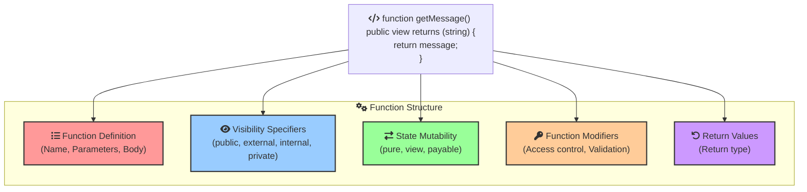

### Function Definition 

A function in Solidity is defined using the `function` keyword, followed by the function name, parameters, visibility specifier, and the function body.

**Syntax:**
```js
function functionName(parameters) visibility returns (returnType) {
    // function body
}
```

### Function Visibility

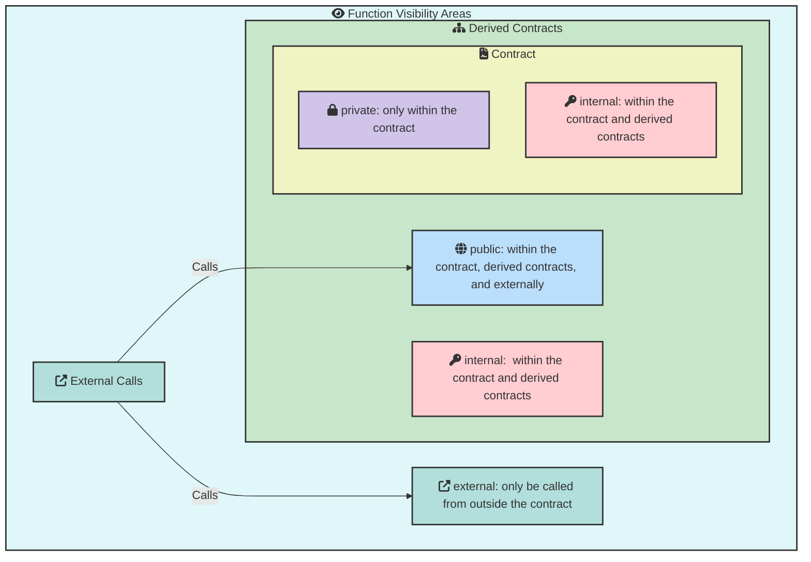
Visibility specifiers determine who can call the function. There are four types of visibility specifiers:

- `public`: The function can be called from within the contract, derived contracts, and externally.
- `external`: The function can only be called from outside the contract.
- `internal`: The function can only be called from within the contract and derived contracts.
- `private`: The function can only be called from within the contract.


```js
// SPDX-License-Identifier: MIT
pragma solidity ^0.8.0;

contract VisibilityExample {
    // Public function
    function publicFunction() public view returns (string memory) {
        return "Public function";
    }

    // External function
    function externalFunction() external view returns (string memory) {
        return "External function";
    }

    // Internal function
    function internalFunction() internal view returns (string memory) {
        return "Internal function";
    }

    // Private function
    function privateFunction() private view returns (string memory) {
        return "Private function";
    }
}
```

### State Mutability

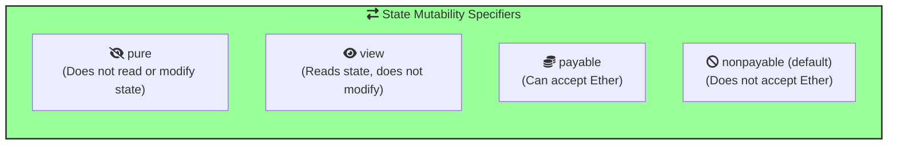

Functions can also have state mutability specifiers to indicate whether they modify the blockchain state:

- `pure`: The function does not read or modify the state.
- `view`: The function reads the state but does not modify it.
- `payable`: The function can accept Ether while being called.
- `nonpayable`: Functions that do not explicitly specify any mutability keyword default to nonpayable, meaning they do not accept Ether and can read and write to the state.


```js
// SPDX-License-Identifier: MIT
pragma solidity ^0.8.0;

contract StateMutabilityExample {
    uint256 public value;

    // Pure function
    function multiply(uint256 a, uint256 b) public pure returns (uint256) {
        return a * b;
    }

    // View function
    function getValue() public view returns (uint256) {
        return value;
    }

    // Payable function
    function setValue(uint256 newValue) public payable {
        require(msg.value > 0, "Must send some Ether");
        value = newValue;
    }
    
}
```

### Function Modifiers 

Function modifiers are used to change the behavior of functions. They can be used for access control, validation, and more.

```js
// SPDX-License-Identifier: MIT
pragma solidity ^0.8.0;

contract ModifierExample {
    address public owner;

    constructor() {
        owner = msg.sender;
    }

    // Modifier to check if the caller is the owner
    modifier onlyOwner() {
        require(msg.sender == owner, "Not the contract owner");
        _;
    }

    // Function using the onlyOwner modifier
    function setValue(uint256 newValue) public onlyOwner {
        value = newValue;
    }
}
```

### Return Values

Functions can return values. The return type is specified after the visibility specifier and before the function body.


```js
// SPDX-License-Identifier: MIT
pragma solidity ^0.8.0;

contract ReturnValueExample {
    function add(uint256 a, uint256 b) public pure returns (uint256) {
        return a + b;
    }

    function getMessage() public pure returns (string memory) {
        return "Hello, Solidity!";
    }
}
```

## Events and Logging


Events in Solidity are a way to communicate that something has happened on the blockchain. They are used for logging important activities and can be helpful for debugging and creating a history of contract interactions. This chapter covers how to declare, emit, and use events for debugging.

### Declaring And Emitting Events

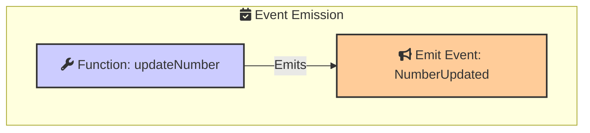


```js
// SPDX-License-Identifier: MIT
pragma solidity ^0.8.0;

contract EventExample {
    // Declare an event
    event NumberUpdated(uint256 oldNumber, uint256 newNumber);

    uint256 public myNumber;

    constructor(uint256 initialNumber) {
        myNumber = initialNumber;
    }

    // Function to update the number and emit an event
    function updateNumber(uint256 newNumber) public {
        uint256 oldNumber = myNumber;
        myNumber = newNumber;
        emit NumberUpdated(oldNumber, newNumber);
    }
}
```


- **Event Declaration:** `NumberUpdated` event is declared with two parameters: `oldNumber` and `newNumber`.
- 
- **Emit Statement:** The `emit` keyword is used to trigger the `NumberUpdated` event inside the `updateNumber` function.


### How Events Are Handled

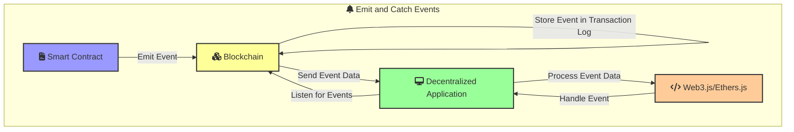


1. **Transaction Logs:**
   - When an event is emitted, it is included in the transaction logs.
   - These logs are part of the transaction receipt and are stored on the blockchain.

2. **Listening for Events:**
   - External applications can listen for events using libraries like web3.js or ethers.js.
   - These libraries provide methods to filter and retrieve events from the blockchain.

3. **Processing Events:**
   - Once an event is detected, the external application can process the event data as needed.
   - This can include updating user interfaces, triggering backend processes, or storing the data in a database.

### Example with web3.js

Here's an example of how you might listen for events using web3.js:

1. **Set up web3.js:**
   ```javascript
   const Web3 = require('web3');
   const web3 = new Web3('http://127.0.0.1:7545'); // Ganache network URL
   ```

2. **Get the Contract Instance:**
   ```javascript
   const abi = [/* ABI of the contract */];
   const contractAddress = '0x...'; // Deployed contract address
   const contract = new web3.eth.Contract(abi, contractAddress);
   ```

3. **Listen for Events:**
   ```javascript
   contract.events.NumberUpdated({
       filter: {}, // Optional filter options
       fromBlock: 'latest' // Listen from the latest block
   })
   .on('data', (event) => {
       console.log('Event:', event);
       const { oldNumber, newNumber } = event.returnValues;
       console.log(`Number updated from ${oldNumber} to ${newNumber}`);
   })
   .on('error', (error) => {
       console.error('Error:', error);
   });
   ```


## Handling Payments and Transfers

### Sending and Receiving Ether

To send and receive Ether in Solidity, you need to use payable functions and the appropriate transfer methods.


```js
// SPDX-License-Identifier: MIT
pragma solidity ^0.8.0;

contract Payments {
    address public owner;

    constructor() {
        owner = msg.sender;
    }

    // Function to send Ether
    function sendEther(address payable recipient) public payable {
        require(msg.value > 0, "Must send some Ether");
        recipient.transfer(msg.value);
    }
    /// ...
}
```


### Fallback Functions

Fallback functions are special functions that are executed when a contract receives Ether and no other function matches the call data. They can be used to handle plain Ether transfers and interact with contracts that do not explicitly call a function.

```js
// SPDX-License-Identifier: MIT
pragma solidity ^0.8.0;

contract FallbackExample {
    address public owner;

    constructor() {
        owner = msg.sender;
    }

    // Fallback function to receive Ether
    fallback() external payable {
        // Logic to execute when Ether is received without data
    }

    // Function to withdraw Ether
    function withdraw(uint256 amount) public {
        require(msg.sender == owner, "Only owner can withdraw");
        require(amount <= address(this).balance, "Insufficient balance");
        payable(owner).transfer(amount);
    }

    // Function to check contract balance
    function getBalance() public view returns (uint256) {
        return address(this).balance;
    }
}
```


## Access Control and Security

Access control and security are crucial aspects of smart contract development. Ensuring that only authorized users can perform certain actions is essential to maintain the integrity and security of your contracts. 

### Ownership and Permissions

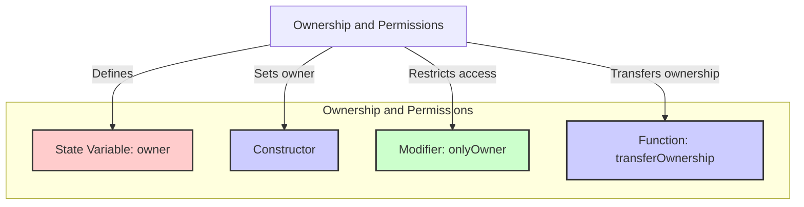

Ownership is a common pattern used to restrict access to certain functions to the contract's owner. This is typically done using an `owner` state variable and functions to transfer ownership.

```js
// SPDX-License-Identifier: MIT
pragma solidity ^0.8.0;

contract OwnershipExample {
    address public owner;

    constructor() {
        owner = msg.sender;
    }

    modifier onlyOwner() {
        require(msg.sender == owner, "Caller is not the owner");
        _;
    }

    function transferOwnership(address newOwner) public onlyOwner {
        require(newOwner != address(0), "New owner is the zero address");
        owner = newOwner;
    }
}
```


- **Owner State Variable:** The `owner` variable stores the address of the contract owner.
- **Constructor:** Sets the initial owner to the address that deploys the contract.
- **Only Owner Modifier:** Restricts access to certain functions to the owner.
- **Transfer Ownership:** Allows the current owner to transfer ownership to a new owner.


### Using Modifiers for Access Control

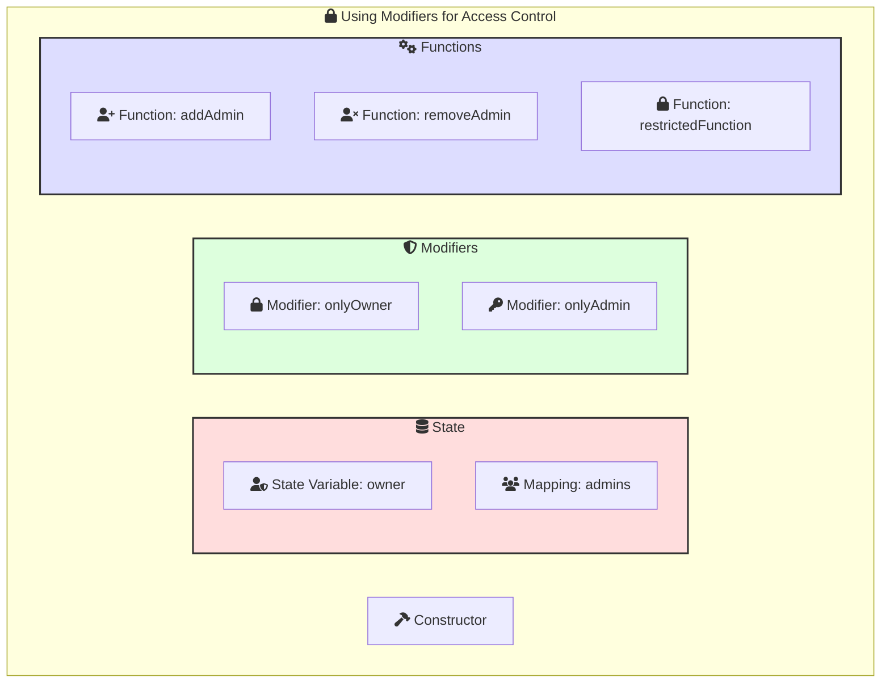

Modifiers are used to add reusable code to functions, often for access control purposes. They help ensure that only authorized users can execute specific functions.


```js
// SPDX-License-Identifier: MIT
pragma solidity ^0.8.0;

contract AccessControlExample {
    address public owner;
    mapping(address => bool) public admins;

    constructor() {
        owner = msg.sender;
    }

    modifier onlyOwner() {
        require(msg.sender == owner, "Caller is not the owner");
        _;
    }

    modifier onlyAdmin() {
        require(admins[msg.sender], "Caller is not an admin");
        _;
    }

    function addAdmin(address account) public onlyOwner {
        admins[account] = true;
    }

    function removeAdmin(address account) public onlyOwner {
        admins[account] = false;
    }

    function restrictedFunction() public onlyAdmin {
        // Function logic here
    }
}
```


- **Admin Mapping:** The `admins` mapping stores addresses with admin privileges.
- **Only Owner Modifier:** Restricts certain functions to the owner.
- **Only Admin Modifier:** Restricts certain functions to admins.
- **Add/Remove Admin:** Allows the owner to manage admin privileges.
- **Restricted Function:** Only admins can call this function.

## Inheritance, Abstract Contracts, and Interfaces

### Inheritance
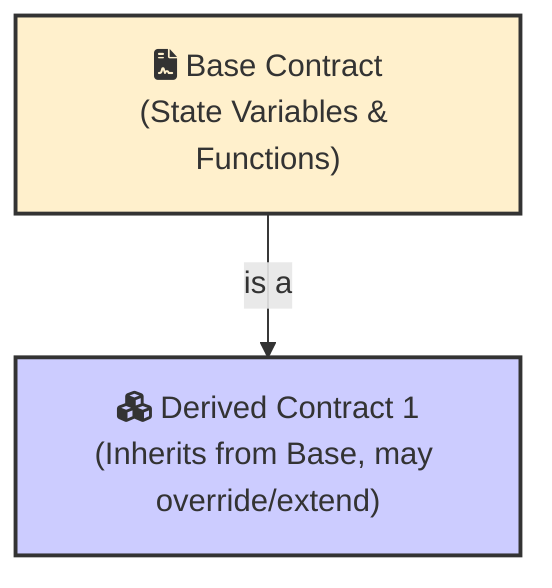

```js
// SPDX-License-Identifier: MIT
pragma solidity ^0.8.17;

// Inheritance Example
contract BaseContract {
    function baseFunction() public pure returns (string memory) {
        return "Base function";
    }
}

contract DerivedContract is BaseContract {
    function derivedFunction() public pure returns (string memory) {
        return "Derived function";
    }
}
```

### Abstract Contracts
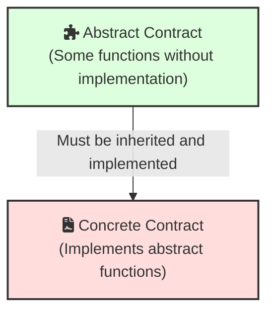

```js
// SPDX-License-Identifier: MIT
pragma solidity ^0.8.17;

// Abstract Contracts Example
abstract contract AbstractContract {
    function abstractFunction() public view virtual returns (string memory);
}

contract ConcreteContract is AbstractContract {
    function abstractFunction() public view override returns (string memory) {
        return "Implemented";
    }
}

```
### Interfaces
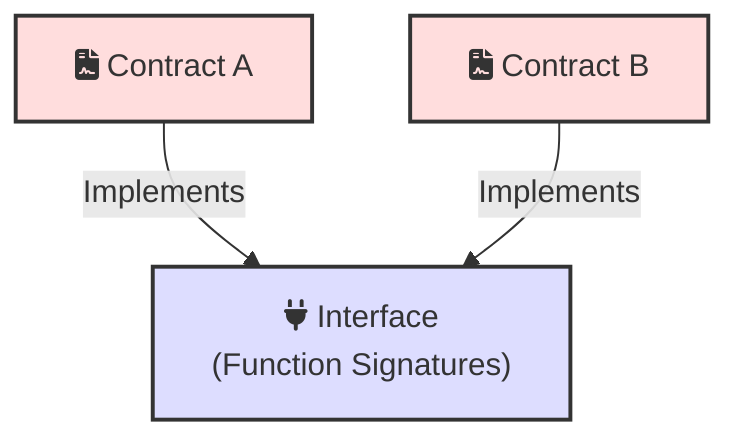

```js
// SPDX-License-Identifier: MIT
pragma solidity ^0.8.17;

// Interfaces Example
interface IExampleInterface {
    function interfaceFunction() external view returns (string memory);
}

contract ImplementingContract is IExampleInterface {
    function interfaceFunction() external view override returns (string memory) {
        return "Interface function implemented";
    }
}

```

## Libraries

Libraries in Solidity are similar to contracts but are deployed only once at a specific address and are meant to be reused by other contracts.


Libraries provide reusable code that can be called by other contracts. They help in reducing gas costs and promoting code reuse.


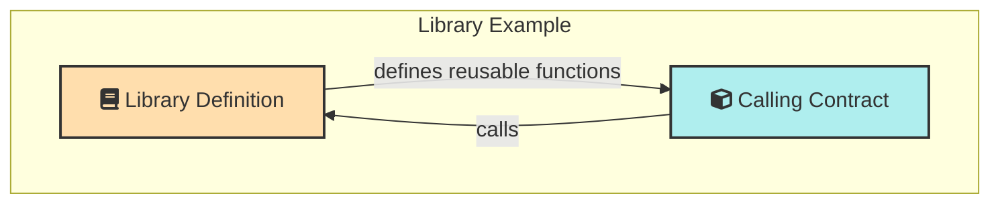

These sections provide a structured approach to understanding various advanced concepts in Solidity, complete with explanations and colorful illustrative Mermaid diagrams.

```js
// Libraries Example
library SafeERC20 {
    function safeTransfer(
        IERC20 token,
        address to,
        uint256 value
    ) internal {
        bytes memory returndata = address(token).functionCall(
            abi.encodeWithSelector(token.transfer.selector, to, value),
            "SafeERC20: low-level call failed"
        );
        require(returndata.length == 0 || abi.decode(returndata, (bool)), "SafeERC20: ERC20 operation failed");
    }
}

contract LotteryContract {
    using SafeERC20 for IERC20;

    IERC20 public cakeToken;

    function transferFunds(address to, uint256 amount) public {
        cakeToken.safeTransfer(to, amount);
    }
}
```

## Real-World Examples


Let take a look to the real world example of a smart contract written in Solidity of [PanCakeSwap](https://pancakeswap.finance/) Lottery Contract. You can get the full code from this on BSCScan 

 [https://bscscan.com/address/0x5af6d33de2ccec94efb1bdf8f92bd58085432d2c#code](https://bscscan.com/address/0x5af6d33de2ccec94efb1bdf8f92bd58085432d2c#code)


## Keywords To Remember

Guess these icons and their meanings 

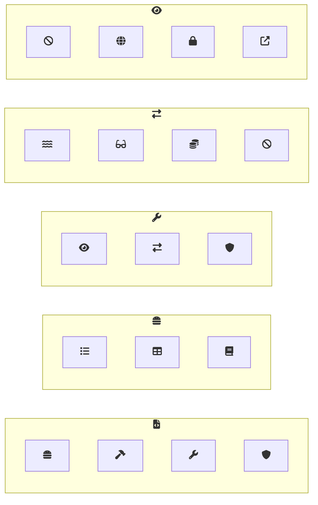


<a href="/posts/lottery-smart-contract-remix">Next Post: Blockchain Basics P3 - Lottery Contract: A Beginner’s Guide with Remix and Solidity"</a> 
