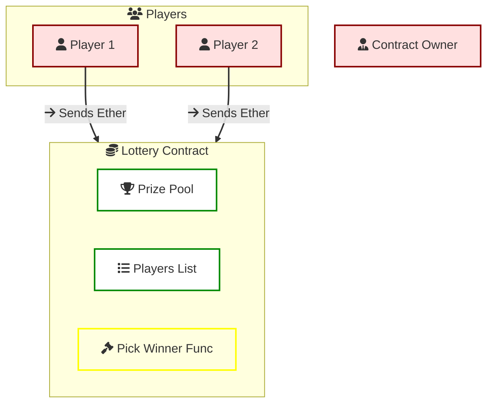
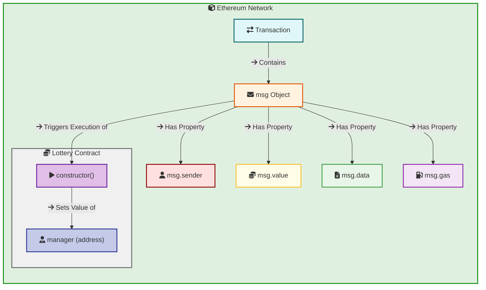
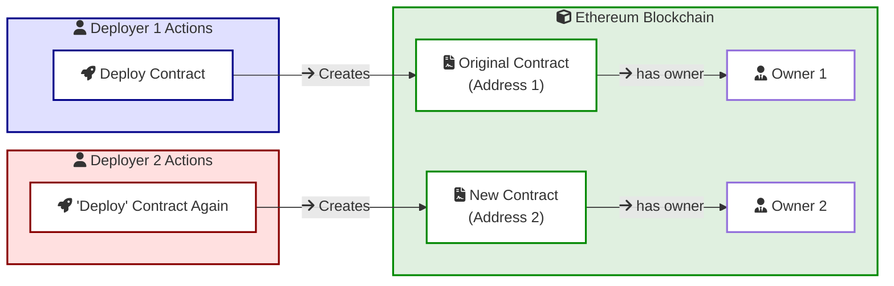
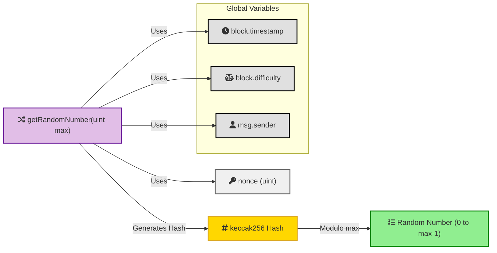
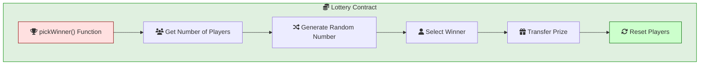
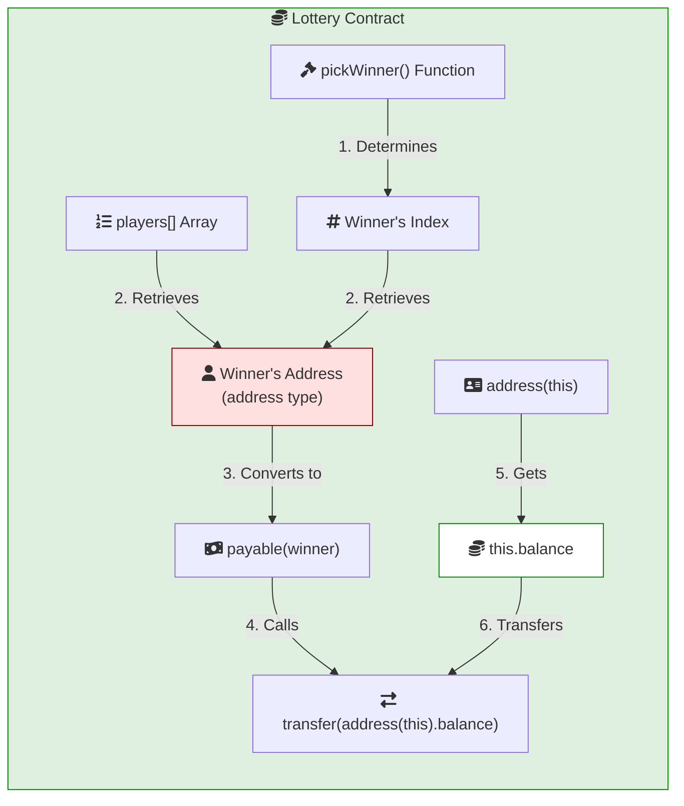
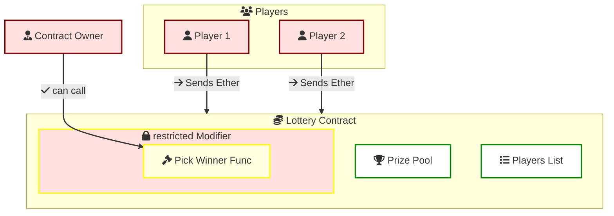
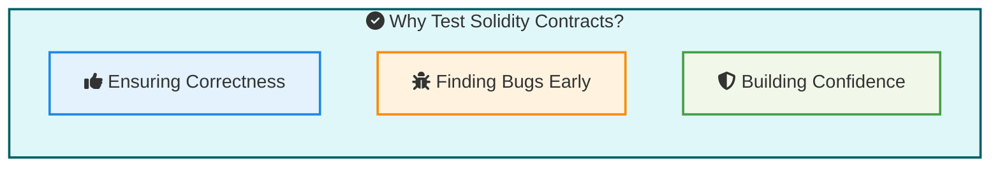

In this guide, we will explore the creation of a simple lottery smart contract using Solidity and Remix. We will cover the key concepts of smart contracts, such as state variables, functions, modifiers, and testing. By the end of this guide, we will have a basic understanding of how to create, deploy, and test a smart contract on the Ethereum blockchain.

## Overview of the Lottery Contract



## Set Owner Of The Contract

The Lottery contract has a state variable called manager, which stores the address of the contract owner. The manager is the person who deploys the contract and has special privileges, such as picking the winner.




- `msg` Object: The Ethereum network automatically creates a special msg object for the transaction. This object contains relevant details about the transaction:
msg.sender: The address of the account that initiated the transaction.
- The `msg` object may contain other details like the amount of Ether sent (msg.value), the data sent with the transaction (msg.data), and the remaining gas (msg.gas)

- constructor(): When a new Lottery contract is created, its constructor function is executed.
manager. This state variable within the contract is designed to store the address of the contract's owner (the person who deployed it).

## What Happens When You "Deploy" Again



- **Deployment is a One-Time Event**:  When you deploy a smart contract to the Ethereum blockchain, it's a one-time action. The contract's bytecode (its compiled code) is permanently stored on the blockchain at a specific address.

- **When You "Deploy" Again**: you are essentially creating a new, separate instance of the contract at a different address on the blockchain. This new instance will have its own independent state, and its manager variable will be set to the address of the person who deployed this new instance. The original contract instance, with its original owner, will still exist and function independently.


## Enter Function

```js
// SPDX-License-Identifier: MIT
pragma solidity ^0.8.0;


contract Lottery {
    address public manager;
    address[] public players;
    
    
    function Lottery() public {
        manager = msg.sender;
    }

    function enter() public payable {
        require(msg.value > .01 ether);
        players.push(msg.sender);
    }
    
}
```
## Get A Random Number Function


```js
uint private nonce;

function getRandomNumber(uint max) private returns (uint) {
      nonce++;
      return uint(keccak256(abi.encodePacked(block.timestamp, block.difficulty, msg.sender, nonce))) % max;
  }
```

## Pick A Winner Function


```js
//..
uint private nonce;

function getRandomNumber(uint max) private returns (uint) {
      nonce++;
      return uint(keccak256(abi.encodePacked(block.timestamp, block.difficulty, msg.sender, nonce))) % max;
  }

function pickWinner() public {
        uint index = getRandomNumber(players.length);
        address winner = players[index];
        // ...
    }
//..    
```


## Sending Ether to the Winner



```js
// ..
  function pickWinner() public {
        uint256 index = getRandomNumber(players.length);
        address winner = players[index];
        // Transfer the contract balance to the winner
        address payable payableWinner = payable(winner);
        uint256 contractBalance = address(this).balance;
        payableWinner.transfer(contractBalance);
        // Reset the players array for the next round
        players = new address[](0);
    }

//.. 
```

- `payableWinner`: In Solidity, the transfer method can only be called on a payable address. The winner address is of type address, and in order to use the transfer method, it needs to be explicitly converted to address payable. This distinction helps prevent accidental transfers to non-payable addresses, enhancing type safety.

- `transferFunction`: The transfer() function is called to transfer the contract balance to the winner.

## Adding a Modifier



```js
  function pickWinner() public restricted {
        uint index = getRandomNumber(players.length);
        address winner = players[index];
        // Transfer the contract balance to the winner
        payable(winner).transfer(address(this).balance);
        // Reset the players array for the next round
        players = new address ;
    }

    modifier restricted() {
        require(msg.sender == manager, "Only the manager can call this function");
        _;
    }
```

## Full Contract Code

```js
// // SPDX-License-Identifier: MIT
pragma solidity ^0.8.0;

contract Lottery {
    address public manager;
    address[] public players;
    uint256 private nonce;

    constructor() {
        manager = msg.sender;
        nonce = 0;
    }

    function enter() public payable {
        require(msg.value > .01 ether, "Minimum ether required is .01");
        players.push(msg.sender);
    }

    function getRandomNumber(uint256 max) private returns (uint256) {
        nonce++;
        return
            uint256(
                keccak256(
                    abi.encodePacked(
                        block.timestamp,
                        block.difficulty,
                        msg.sender,
                        nonce
                    )
                )
            ) % max;
    }

    function pickWinner() public {
        uint256 index = getRandomNumber(players.length);
        address winner = players[index];
        // Transfer the contract balance to the winner
        address payable payableWinner = payable(winner);
        uint256 contractBalance = address(this).balance;
        payableWinner.transfer(contractBalance);
        // Reset the players array for the next round
        players = new address[](0);
    }

    modifier restricted() {
        require(
            msg.sender == manager,
            "Only the manager can call this function"
        );
        _;
    }

    function getPlayers() public view returns (address[] memory) {
        return players;
    }
}

```

## Remix

Remix is a powerful online IDE for developing smart contracts on the Ethereum blockchain. It provides a Solidity compiler, a debugger, and various plugins to enhance the development experience. One of the plugins available in Remix is the Solidity Unit Testing plugin, which allows you to write and run tests for your smart contracts directly in the IDE.

To use Remix user interface, you can visit [Remix IDE](https://remix.ethereum.org/)

### Why Test Solidity Contracts?



Testing your Solidity smart contracts is a crucial practice for several reasons:

- **Ensuring Correctness**: Smart contracts are immutable once deployed on the blockchain. Rigorous testing helps guarantee that your code behaves as intended and meets all requirements. This is especially critical for contracts dealing with financial assets or sensitive data.

- **Finding Bugs Early**: Testing allows you to uncover errors and vulnerabilities before deploying your contract to the mainnet. This prevents costly mistakes and potential exploits that could result in financial loss or damage to your project's reputation.

- **Building Confidence**: Thorough testing instills confidence in your contract's reliability and security. This confidence is essential for attracting users and investors, as well as ensuring the long-term success of your project.

### Generating Test Files in Remix


Click on the **Generate** button on the Solidity Unit Testing plugin. This will generate a new test contract on the right side.

Inside the test contract, you will find a function named "before all". This function is called before any of the tests are run.

Inside the "before all" function, you will need to deploy the contract that you want to test. 

```js
// SPDX-License-Identifier: GPL-3.0

pragma solidity >=0.4.22 <0.9.0;
import "remix_tests.sol"; 
import "remix_accounts.sol";
import "../contracts/4_Lottery.sol";

contract LotteryTestSuite is Lottery {
    address acc0 = TestsAccounts.getAccount(0); // manager by default
    address acc1 = TestsAccounts.getAccount(1);
    address acc2 = TestsAccounts.getAccount(2);
    address acc3 = TestsAccounts.getAccount(3);

    function beforeAll() public {
        // Create an instance of the Lottery contract
        manager = acc0;
    }

    /// #sender: account-1
    /// #value: 20000000000000000
    function testEnterAcc1() public payable {
        Assert.equal(msg.value, 20000000000000000, 'value should be 0.02 Eth');
        enter();
        Assert.equal(players.length, 1, 'players array should have 1 entry');
        Assert.equal(players[0], acc1, 'first player should be account-1');
    }

    /// #sender: account-2
    /// #value: 30000000000000000
    function testEnterAcc2() public payable {
        Assert.equal(msg.value, 30000000000000000, 'value should be 0.03 Eth');
        enter();
        Assert.equal(players.length, 2, 'players array should have 2 entries');
        Assert.equal(players[1], acc2, 'second player should be account-2');
    }

    /// #sender: account-3
    /// #value: 40000000000000000
    function testEnterAcc3() public payable {
        Assert.equal(msg.value, 40000000000000000, 'value should be 0.04 Eth');
        enter();
        Assert.equal(players.length, 3, 'players array should have 3 entries');
        Assert.equal(players[2], acc3, 'third player should be account-3');
    }

    /// #sender: account-0
    function testPickWinner() public {
        uint contractBalance = address(this).balance;
        uint[3] memory initialBalances = [
            acc1.balance,
            acc2.balance,
            acc3.balance
        ];

        pickWinner();

        uint[3] memory finalBalances = [
            acc1.balance,
            acc2.balance,
            acc3.balance
        ];

        bool foundWinner = false;
        for (uint i = 0; i < 3; i++) {
            if (finalBalances[i] > initialBalances[i]) {
                Assert.equal(finalBalances[i], initialBalances[i] + contractBalance, "Winner should receive the contract balance");
                foundWinner = true;
            }
        }

        Assert.equal(foundWinner, true, "There should be one winner with an increased balance");
        Assert.equal(players.length, 0, "Players array should be reset");
    }

}
```


### Run the test

Click on the Solidity Unit Testing plugin again.
Unselect all the tests and select the test for the contract.
Click on the "Run" button.


### Deploy And Interact With The Contract


- **Deploy the contract**: Click on the "Deploy" button in Remix to deploy the Lottery contract to the Ethereum blockchain. This will create a new instance of the contract with its own address.

- **Interact with the contract**: You can interact with the deployed contract by calling its functions. For example, you can call the enter() function to participate in the lottery by sending a minimum amount of Ether. You can also call the pickWinner() function to select a winner and transfer the prize pool to them.

- **Accouunts**: You can use different accounts in Remix to simulate multiple users interacting with the contract. This allows you to test the contract's functionality from various perspectives and ensure that it behaves as expected for different scenarios.


## References
- Stephen Grider Udemey Course: [Ethereum and Solidity: The Complete Developer's Guide](https://www.udemy.com/course/ethereum-and-solidity-the-complete-developers-guide)


<a href="/posts/truffle-pet-shop-tutorial">Next Post: Blockchain Basics P4 - Truffle Pet-Shop Smart Contract</a> 