Before reading this article, you should have a basic understanding of concepts and blockchain technology at this post [blockchain-for-dummies](https://kelvin-bz.github.io/posts/blockchain-for-dummies/)


## Introduction to Solidity

**Explanation:**
Solidity is a high-level programming language designed for writing smart contracts on the Ethereum blockchain.


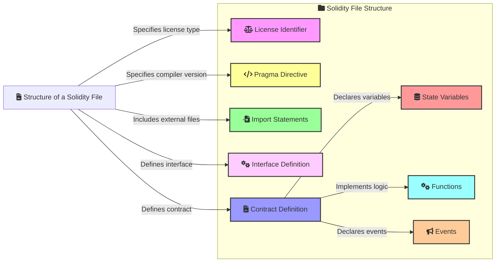
**Example of a simple Solidity contract**:

```js
// SPDX-License-Identifier: MIT
pragma solidity ^0.8.0;

interface IERC20 {
    function totalSupply() external view returns (uint256);
    function balanceOf(address account) external view returns (uint256);
    function transfer(address recipient, uint256 amount) external returns (bool);
    function allowance(address owner, address spender) external view returns (uint256);
    function approve(address spender, uint256 amount) external returns (bool);
    function transferFrom(address sender, address recipient, uint256 amount) external returns (bool);
    event Transfer(address indexed from, address indexed to, uint256 value);
    event Approval(address indexed owner, address indexed spender, uint256 value);
}

contract MyToken is IERC20 {
    string public constant name = "MyToken";
    string public constant symbol = "MTK";
    uint8 public constant decimals = 18;
    uint256 private _totalSupply;
    mapping(address => uint256) private _balances;
    mapping(address => mapping(address => uint256)) private _allowances;

    constructor(uint256 initialSupply) {
        _totalSupply = initialSupply * (10 ** uint256(decimals));
        _balances[msg.sender] = _totalSupply;
        emit Transfer(address(0), msg.sender, _totalSupply);
    }

    function totalSupply() public view override returns (uint256) {
        return _totalSupply;
    }

    function balanceOf(address account) public view override returns (uint256) {
        return _balances[account];
    }

    function transfer(address recipient, uint256 amount) public override returns (bool) {
        require(_balances[msg.sender] >= amount, "Insufficient balance");
        _balances[msg.sender] -= amount;
        _balances[recipient] += amount;
        emit Transfer(msg.sender, recipient, amount);
        return true;
    }

    function allowance(address owner, address spender) public view override returns (uint256) {
        return _allowances[owner][spender];
    }

    function approve(address spender, uint256 amount) public override returns (bool) {
        _allowances[msg.sender][spender] = amount;
        emit Approval(msg.sender, spender, amount);
        return true;
    }

    function transferFrom(address sender, address recipient, uint256 amount) public override returns (bool) {
        require(_balances[sender] >= amount, "Insufficient balance");
        require(_allowances[sender][msg.sender] >= amount, "Allowance exceeded");
        _balances[sender] -= amount;
        _balances[recipient] += amount;
        _allowances[sender][msg.sender] -= amount;
        emit Transfer(sender, recipient, amount);
        return true;
    }
}

```

### Setting up the Development Environment

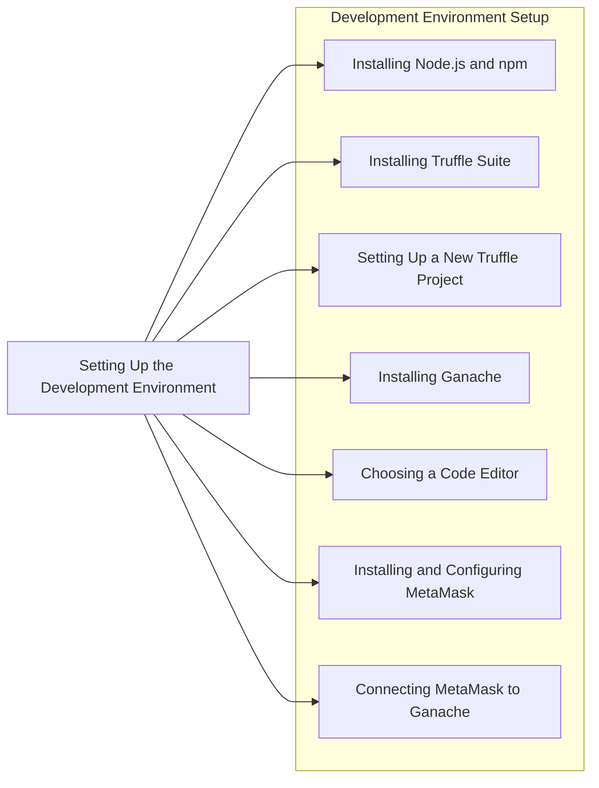

1. Installing Node.js and npm
2. Installing Truffle Suite

**Truffle** is a development environment, testing framework, and asset pipeline for Ethereum, making it easier to manage smart contract projects.


```bash
npm install -g truffle
```
3.  Install Ganache CLI globally

**Ganache** is a personal Ethereum blockchain used to deploy contracts, develop applications, and run tests.

```bash
npm install -g ganache-cli
```

4.  Connecting MetaMask to Ganache

To interact with your local blockchain, you need to connect MetaMask to Ganache.

Steps:

- Open MetaMask and go to Settings -> Networks -> Add Network.
- Fill in the details:
```
Network Name: Ganache
New RPC URL: http://127.0.0.1:8545
Chain ID: 1337 (default for Ganache)
```
Save and switch to the Ganache network.


## Solidity Language Fundamentals

### Structure of a Solidity File


Solidity is a statically-typed programming language designed for developing smart contracts that run on the Ethereum Virtual Machine (EVM). Understanding the syntax and structure is crucial for writing effective and secure smart contracts.

#### License Identifier

A Solidity file usually starts with a license identifier. This is an optional comment that specifies the license under which the code is distributed.

**Example:**
```js
// SPDX-License-Identifier: MIT
```

#### Pragma Directive

The pragma directive is used to enable certain compiler features or checks. It specifies the version of the Solidity compiler to be used.

**Example:**
```js
pragma solidity ^0.8.0;
```

#### Import Statements

Import statements are used to include code from other files, promoting modularity and code reuse.

**Example:**
```js
import "./SafeMath.sol";
```

#### Contract Definition

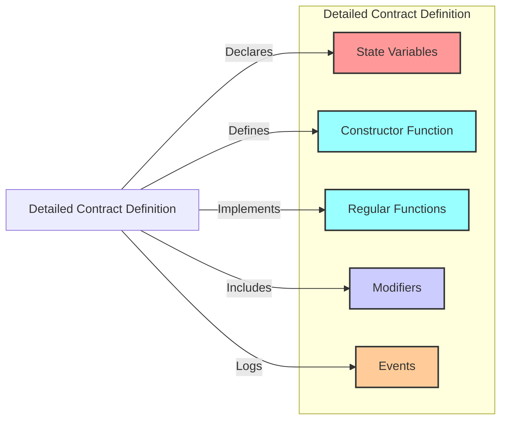

The main body of a Solidity file is the contract definition. This is where you define the smart contract, including its state variables, functions, and events.

**Example:**
```js
contract MyContract {
    // State variables
    uint256 public myVariable;

    // Constructor
    constructor(uint256 initialValue) {
        myVariable = initialValue;
    }

    // Functions
    function set(uint256 newValue) public {
        myVariable = newValue;
    }

    function get() public view returns (uint256) {
        return myVariable;
    }

    // Events
    event ValueChanged(uint256 newValue);
}
```

### Data Types and Variables

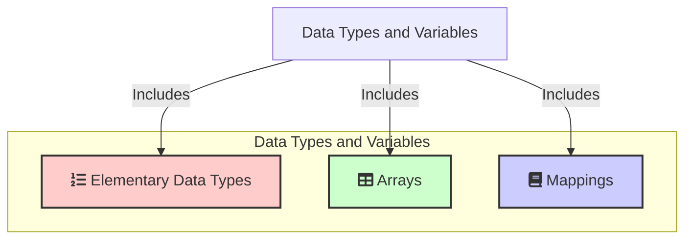

#### Elementary Data Types

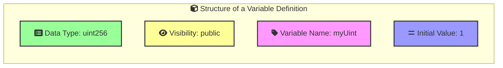

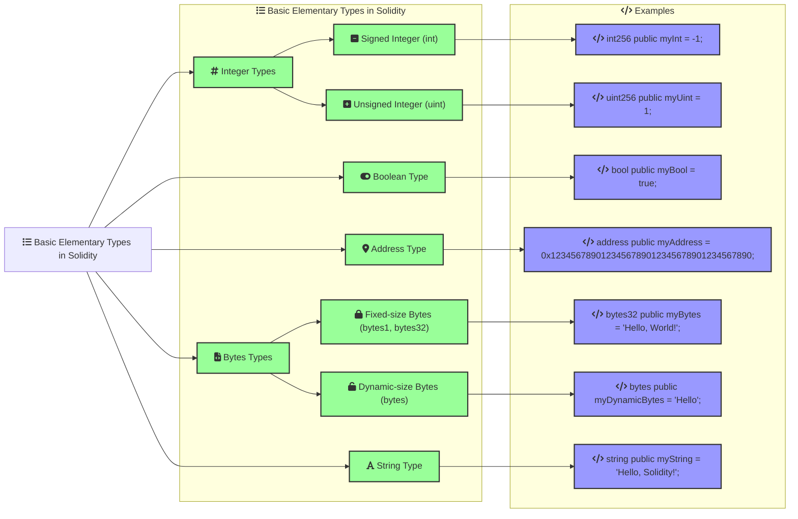

**Integer Types:**
- Signed (`int`) and unsigned (`uint`) integers of various sizes (e.g., `uint8`, `uint256`).

**Example:**
```js
uint256 public myUint = 1;
int256 public myInt = -1;
```

**Boolean Type:**
- Represents true or false.

**Example:**
```js
bool public myBool = true;
```

**Address Type:**
- Holds 20-byte Ethereum addresses.

**Example:**
```js
address public myAddress = 0x1234567890123456789012345678901234567890;
```

**Bytes and Strings:**
- Fixed-size (`bytes1`, `bytes32`) and dynamic-size (`bytes`, `string`) byte arrays.


- **Use `bytes` when:**
  - You need to handle raw binary data or arbitrary byte arrays.
  - You need to perform operations on individual bytes directly.
  - You want to save gas by avoiding the overhead of UTF-8 encoding.

- **Use `string` when:**
  - You need to handle text data that requires UTF-8 encoding.
  - You want to store and manipulate human-readable text.


- **Bytes Usage:**
  ```js
  bytes public data = "raw data";
  data[0] = 0x01; // Direct access to individual bytes
  ```

- **String Usage:**
  ```js
  string public message = "Hello, Solidity!";
  // Cannot access individual characters directly
  ```

In summary, use `bytes` for low-level byte manipulation and `string` for human-readable text.

#### Arrays

Arrays are collections of elements of the same type.

**Static Arrays:**
```js
uint256[5] public staticArray;
```

**Dynamic Arrays:**
```js
uint256[] public dynamicArray;
```

**Array Operations:**
- Pushing elements, getting the length, and accessing elements.

**Example:**
```js
function arrayOperations() public {
    dynamicArray.push(1);
    uint256 length = dynamicArray.length;
    uint256 firstElement = dynamicArray[0];
}
```

#### Mappings

Mappings are key-value data structures.

**Example:**
```js
mapping(address => uint256) public balances;

function updateBalance(address account, uint256 amount) public {
    balances[account] = amount;
}

function getBalance(address account) public view returns (uint256) {
    return balances[account];
}
```


### Control Structures (if, else, loops)
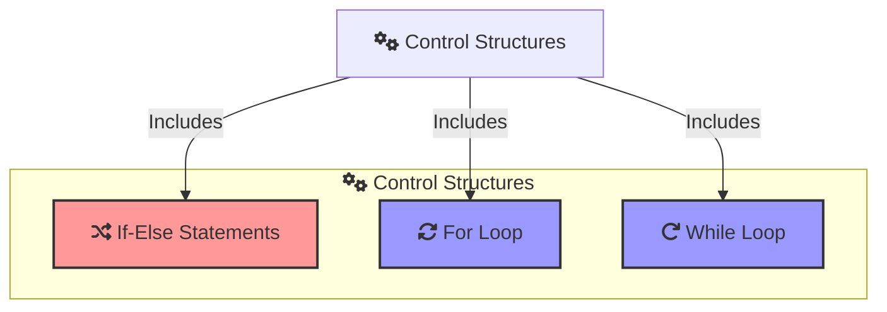

Solidity supports standard control structures for conditional execution and loops.

#### Conditional Statements

**If-Else Statements:**
```js
function checkValue(uint256 value) public pure returns (string memory) {
    if (value > 10) {
        return "Greater than 10";
    } else {
        return "10 or less";
    }
}
```

#### Loops

**For Loop:**
```js
function sumArray(uint256[] memory array) public pure returns (uint256) {
    uint256 sum = 0;
    for (uint256 i = 0; i < array.length; i++) {
        sum += array[i];
    }
    return sum;
}
```

**While Loop:**
```js
function sumWhileLoop(uint256[] memory array) public pure returns (uint256) {
    uint256 sum = 0;
    uint256 i = 0;
    while (i < array.length) {
        sum += array[i];
        i++;
    }
    return sum;
}
```


## Writing Your First Smart Contract


```bash
├── build
│   └── contracts
│       └── MyFirstContract.json
├── contracts
│   └── MyFirstContract.sol
├── migrations
│   └── 2_deploy_contracts.js
├── test
└── truffle-config.js
```

### Basic Contract Structure

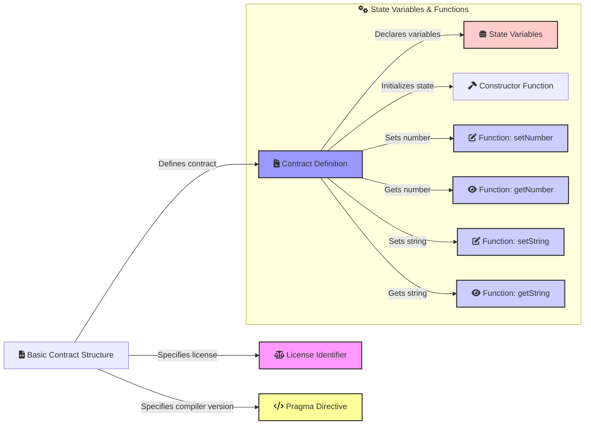

### Steps to Create Smart Contract

1. **Install Node.js and npm**

   If you haven't already, download and install Node.js from [nodejs.org](https://nodejs.org/). This will also install npm (Node Package Manager).

   Verify the installation:
   ```bash
   node -v
   npm -v
   ```

2. **Install Truffle**

   Install Truffle globally using npm:
   ```bash
   npm install -g truffle
   ```

   Verify the installation:
   ```bash
   truffle version
   ```

3. **Install Ganache CLI**

   Install Ganache CLI globally using npm:
   ```bash
   npm install -g ganache-cli
   ```

   Start Ganache CLI to simulate an Ethereum blockchain locally:
   ```bash
   ganache-cli -p 7545
   ```

4. **Initialize a New Truffle Project**

   Create a new directory for your project and navigate into it:
   ```bash
   mkdir my-solidity-project
   cd my-solidity-project
   ```

   Initialize a new Truffle project:
   ```bash
   truffle init
   ```

5. **Create the Solidity Contract**

   Navigate to the `contracts` directory and create a new file called `MyFirstContract.sol`:
   ```bash
   cd contracts
   touch MyFirstContract.sol
   ```

   Open `MyFirstContract.sol` in a text editor and add the following code:
   ```js
   // SPDX-License-Identifier: MIT
   pragma solidity ^0.8.0;

   contract MyFirstContract {
       uint256 public myNumber;
       string public myString;

       constructor(uint256 _initialNumber, string memory _initialString) {
           myNumber = _initialNumber;
           myString = _initialString;
       }

       function setNumber(uint256 _newNumber) public {
           myNumber = _newNumber;
       }

       function getNumber() public view returns (uint256) {
           return myNumber;
       }

       function setString(string memory _newString) public {
           myString = _newString;
       }

       function getString() public view returns (string memory) {
           return myString;
       }

       event ValueChanged(uint256 newValue);
   }
   ```

6. **Create the Migration Script**

   Navigate to the `migrations` directory and create a new file called `2_deploy_contracts.js`:
   ```bash
   cd ../migrations
   touch 2_deploy_contracts.js
   ```

   Open `2_deploy_contracts.js` in a text editor and add the following code:
   ```javascript
   const MyFirstContract = artifacts.require("MyFirstContract");

   module.exports = function (deployer) {
       deployer.deploy(MyFirstContract, 42, "Hello, World!");
   };
   ```

7. **Configure Truffle**

   Open the `truffle-config.js` file in a text editor and configure it to use port 7545:
   ```javascript
   module.exports = {
     networks: {
       development: {
         host: "127.0.0.1",
         port: 7545,
         network_id: "*" // Match any network id
       },
     },
     compilers: {
       solc: {
         version: "0.8.0", // Fetch exact version from solc-bin
       }
     }
   };
   ```

8. **Compile the Contract**

   Navigate back to the root directory of your project and compile the contract:
   ```bash
   cd ..
   truffle compile
   ```

9. **Deploy the Contract**

   Ensure Ganache CLI is running, then deploy the contract:
   ```bash
   truffle migrate
   ```

10. **Interact with the Contract**

    You can interact with your deployed contract using the Truffle console:
    ```bash
    truffle console
    ```

    In the console, you can retrieve and interact with the contract instance:
    ```javascript
    let instance = await MyFirstContract.deployed();
    let number = await instance.getNumber();
    console.log(number.toString());
    await instance.setNumber(100);
    number = await instance.getNumber();
    console.log(number.toString());
    ```

By following these steps, you will have created, compiled, and deployed your first Solidity smart contract using Truffle and Ganache CLI.


## Working with Functions

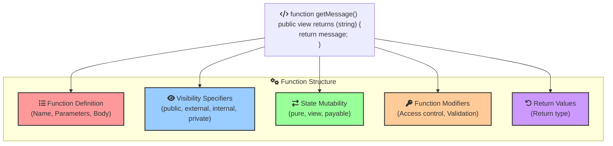

Functions in Solidity are blocks of code designed to perform specific tasks. They are fundamental building blocks of smart contracts, allowing developers to execute predefined instructions on the Ethereum blockchain. Let's break down the basics of functions in Solidity.


### Function Definition 

A function in Solidity is defined using the `function` keyword, followed by the function name, parameters, visibility specifier, and the function body.

**Syntax:**
```js
function functionName(parameters) visibility returns (returnType) {
    // function body
}
```

### Function Visibility

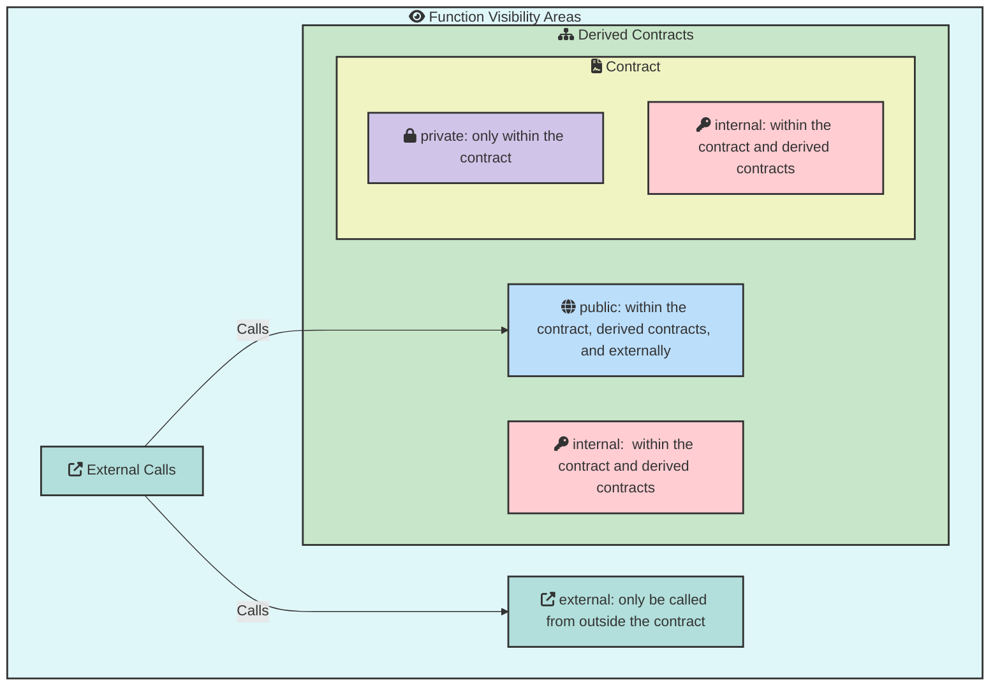
Visibility specifiers determine who can call the function. There are four types of visibility specifiers:

- `public`: The function can be called from within the contract, derived contracts, and externally.
- `external`: The function can only be called from outside the contract.
- `internal`: The function can only be called from within the contract and derived contracts.
- `private`: The function can only be called from within the contract.

**Example:**
```js
// SPDX-License-Identifier: MIT
pragma solidity ^0.8.0;

contract VisibilityExample {
    // Public function
    function publicFunction() public view returns (string memory) {
        return "Public function";
    }

    // External function
    function externalFunction() external view returns (string memory) {
        return "External function";
    }

    // Internal function
    function internalFunction() internal view returns (string memory) {
        return "Internal function";
    }

    // Private function
    function privateFunction() private view returns (string memory) {
        return "Private function";
    }
}
```

### State Mutability

Functions can also have state mutability specifiers to indicate whether they modify the blockchain state:

- `pure`: The function does not read or modify the state.
- `view`: The function reads the state but does not modify it.
- `payable`: The function can accept Ether while being called.

**Example:**
```js
// SPDX-License-Identifier: MIT
pragma solidity ^0.8.0;

contract StateMutabilityExample {
    uint256 public value;

    // Pure function
    function multiply(uint256 a, uint256 b) public pure returns (uint256) {
        return a * b;
    }

    // View function
    function getValue() public view returns (uint256) {
        return value;
    }

    // Payable function
    function setValue(uint256 newValue) public payable {
        require(msg.value > 0, "Must send some Ether");
        value = newValue;
    }
}
```

### Function Modifiers 

Function modifiers are used to change the behavior of functions. They can be used for access control, validation, and more.

**Example:**
```js
// SPDX-License-Identifier: MIT
pragma solidity ^0.8.0;

contract ModifierExample {
    address public owner;

    constructor() {
        owner = msg.sender;
    }

    // Modifier to check if the caller is the owner
    modifier onlyOwner() {
        require(msg.sender == owner, "Not the contract owner");
        _;
    }

    // Function using the onlyOwner modifier
    function setValue(uint256 newValue) public onlyOwner {
        value = newValue;
    }
}
```

### Return Values

Functions can return values. The return type is specified after the visibility specifier and before the function body.

**Example:**
```js
// SPDX-License-Identifier: MIT
pragma solidity ^0.8.0;

contract ReturnValueExample {
    function add(uint256 a, uint256 b) public pure returns (uint256) {
        return a + b;
    }

    function getMessage() public pure returns (string memory) {
        return "Hello, Solidity!";
    }
}
```

### Summary

- **Function Definition:** Defines the function's name, parameters, and body.
- **Visibility Specifiers:** Determine who can call the function (`public`, `external`, `internal`, `private`).
- **State Mutability:** Specifies whether the function modifies the state (`pure`, `view`, `payable`).
- **Function Modifiers:** Allow altering function behavior for access control and validation.
- **Return Values:** Functions can return values by specifying the return type.

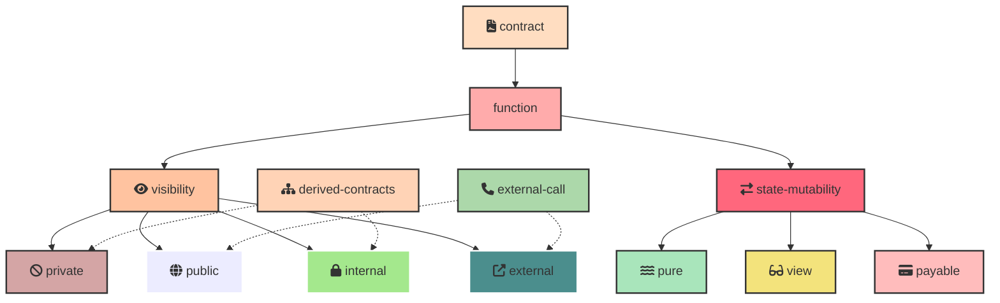

## Application Binary Interface (ABI)
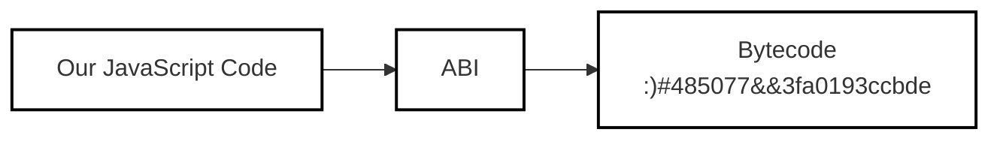

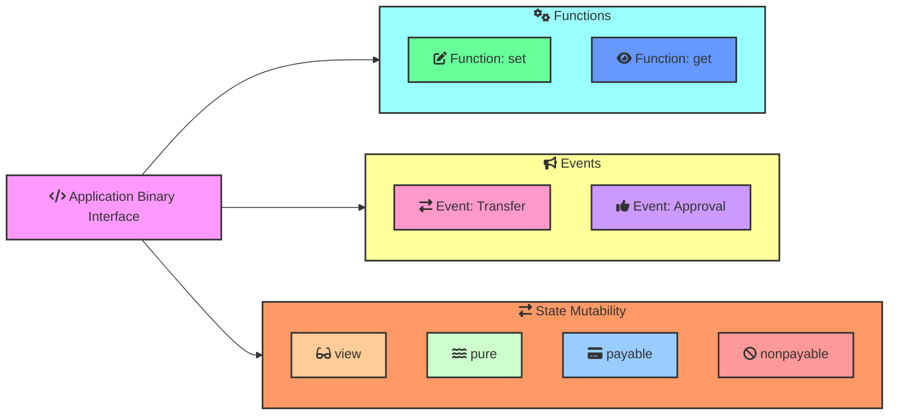


The Application Binary Interface (ABI) is a JSON array that defines the methods and structures used to interact with a smart contract on the Ethereum blockchain. It specifies how data structures and functions are accessed in the binary code of the contract.

### Components of ABI

**Functions**
- Define callable functions within the smart contract.
- Include names, input parameters, and return types.

**Events**
- Describe events that the smart contract can emit.
- Include event names and parameter types.

**State Mutability**
- Indicates the state of a function: `view` (read-only), `pure` (read-only with no state access), `payable` (can receive Ether), or `nonpayable`.


### Example of an ABI

Here's a sample ABI for a smart contract with a `set` and `get` function.

```json
[
  {
    "constant": false,
    "inputs": [
      {
        "name": "x",
        "type": "uint256"
      }
    ],
    "name": "set",
    "outputs": [],
    "payable": false,
    "stateMutability": "nonpayable",
    "type": "function"
  },
  {
    "constant": true,
    "inputs": [],
    "name": "get",
    "outputs": [
      {
        "name": "",
        "type": "uint256"
      }
    ],
    "payable": false,
    "stateMutability": "view",
    "type": "function"
  }
]
```

###  Using ABI

**Interacting with Contracts**
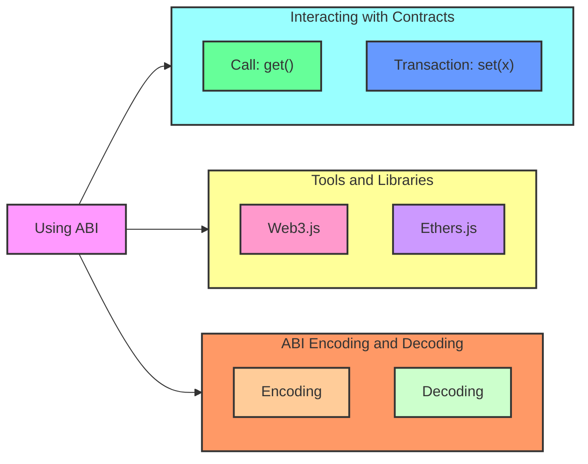


- Use the ABI to call functions and read data from a smart contract.

**Example in JavaScript using Web3.js**
```javascript
const Web3 = require('web3');
const web3 = new Web3('https://mainnet.infura.io/v3/YOUR-PROJECT-ID');

const abi = [ /* ABI from above */ ];
const contractAddress = '0xYourContractAddress';

const contract = new web3.eth.Contract(abi, contractAddress);

// Call the get function
contract.methods.get().call()
  .then(result => {
    console.log('Value:', result);
  });

// Send a transaction to set function
const account = '0xYourAccount';
const privateKey = 'your-private-key';

const setData = contract.methods.set(42).encodeABI();

const tx = {
  from: account,
  to: contractAddress,
  gas: 2000000,
  data: setData
};

web3.eth.accounts.signTransaction(tx, privateKey)
  .then(signed => {
    web3.eth.sendSignedTransaction(signed.rawTransaction)
      .on('receipt', console.log);
  });
```

**Tools and Libraries**
- Web3.js: A JavaScript library for interacting with the Ethereum blockchain.
- Ethers.js: A lightweight library for interacting with the Ethereum blockchain.

**ABI Encoding and Decoding**
- Encoding: The process of converting function calls and arguments into a format that can be sent to the Ethereum network.
- Decoding: The process of converting the returned data from the Ethereum network into a readable format.


## Events and Logging

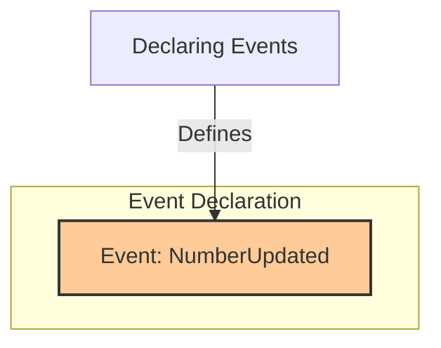

Events in Solidity are a way to communicate that something has happened on the blockchain. They are used for logging important activities and can be helpful for debugging and creating a history of contract interactions. This chapter covers how to declare, emit, and use events for debugging.

### Declaring Events

Events are declared within the contract. They define the structure of the log entry that will be recorded when the event is emitted.

**Example:**
```js
// SPDX-License-Identifier: MIT
pragma solidity ^0.8.0;

contract EventExample {
    // Declare an event
    event NumberUpdated(uint256 oldNumber, uint256 newNumber);

    uint256 public myNumber;

    constructor(uint256 initialNumber) {
        myNumber = initialNumber;
    }
}
```

**Explanation:**
- **Event Declaration:** `NumberUpdated` event is declared with two parameters: `oldNumber` and `newNumber`.


### Emitting Events

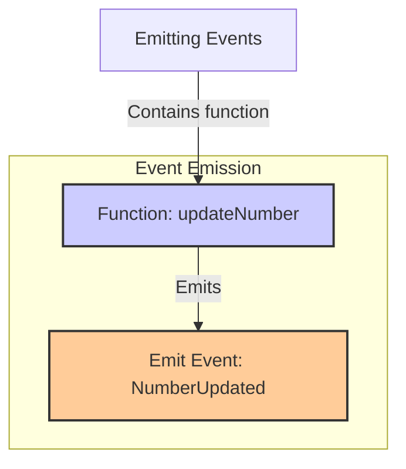

To log an event, you need to emit it within a function. This records the event on the blockchain and makes it accessible for external listeners.

**Example:**
```js
// SPDX-License-Identifier: MIT
pragma solidity ^0.8.0;

contract EventExample {
    // Declare an event
    event NumberUpdated(uint256 oldNumber, uint256 newNumber);

    uint256 public myNumber;

    constructor(uint256 initialNumber) {
        myNumber = initialNumber;
    }

    // Function to update the number and emit an event
    function updateNumber(uint256 newNumber) public {
        uint256 oldNumber = myNumber;
        myNumber = newNumber;
        emit NumberUpdated(oldNumber, newNumber);
    }
}
```

**Explanation:**
- **Emit Statement:** The `emit` keyword is used to trigger the `NumberUpdated` event inside the `updateNumber` function.


### Using Events for Debugging

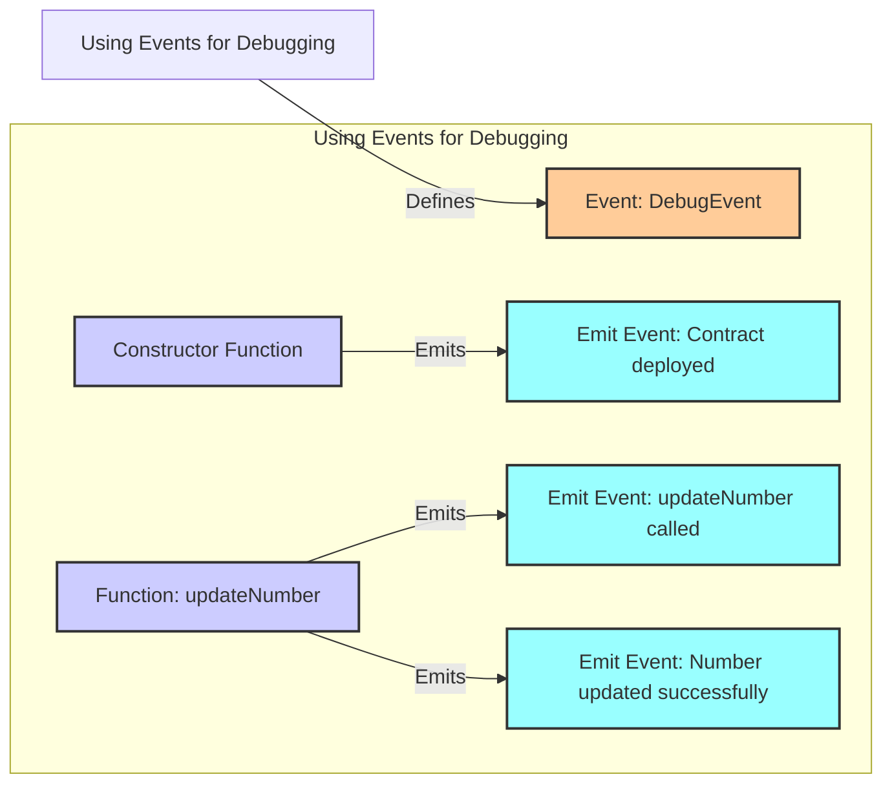

Events can be used for debugging by providing a way to track the flow of execution and state changes within your contract. They are particularly useful because they do not cost gas once stored in the log.

**Example:**
```js
// SPDX-License-Identifier: MIT
pragma solidity ^0.8.0;

contract EventExample {
    // Declare an event
    event NumberUpdated(uint256 oldNumber, uint256 newNumber);
    event DebugEvent(string message);

    uint256 public myNumber;

    constructor(uint256 initialNumber) {
        myNumber = initialNumber;
        emit DebugEvent("Contract deployed");
    }

    // Function to update the number and emit events for debugging
    function updateNumber(uint256 newNumber) public {
        emit DebugEvent("updateNumber function called");
        uint256 oldNumber = myNumber;
        myNumber = newNumber;
        emit NumberUpdated(oldNumber, newNumber);
        emit DebugEvent("Number updated successfully");
    }
}
```

**Explanation:**
- **Debug Event:** `DebugEvent` is used to log messages indicating the flow of execution, such as the deployment of the contract and the calling of functions.


After an event is emitted by a smart contract on the Ethereum blockchain, it is recorded in the transaction logs. These logs are stored on the blockchain and can be accessed by external applications or services. Typically, these external entities are decentralized applications (dApps), web3.js or ethers.js scripts, or backend services that interact with the blockchain. 

### How Events Are Handled

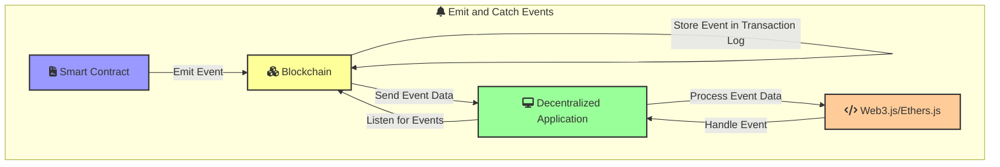


1. **Transaction Logs:**
   - When an event is emitted, it is included in the transaction logs.
   - These logs are part of the transaction receipt and are stored on the blockchain.

2. **Listening for Events:**
   - External applications can listen for events using libraries like web3.js or ethers.js.
   - These libraries provide methods to filter and retrieve events from the blockchain.

3. **Processing Events:**
   - Once an event is detected, the external application can process the event data as needed.
   - This can include updating user interfaces, triggering backend processes, or storing the data in a database.

### Example with web3.js

Here's an example of how you might listen for events using web3.js:

1. **Set up web3.js:**
   ```javascript
   const Web3 = require('web3');
   const web3 = new Web3('http://127.0.0.1:7545'); // Ganache network URL
   ```

2. **Get the Contract Instance:**
   ```javascript
   const abi = [/* ABI of the contract */];
   const contractAddress = '0x...'; // Deployed contract address
   const contract = new web3.eth.Contract(abi, contractAddress);
   ```

3. **Listen for Events:**
   ```javascript
   contract.events.NumberUpdated({
       filter: {}, // Optional filter options
       fromBlock: 'latest' // Listen from the latest block
   })
   .on('data', (event) => {
       console.log('Event:', event);
       const { oldNumber, newNumber } = event.returnValues;
       console.log(`Number updated from ${oldNumber} to ${newNumber}`);
   })
   .on('error', (error) => {
       console.error('Error:', error);
   });
   ```


## Handling Payments and Transfers

### Sending and Receiving Ether

To send and receive Ether in Solidity, you need to use payable functions and the appropriate transfer methods.

**Example:**
```js
// SPDX-License-Identifier: MIT
pragma solidity ^0.8.0;

contract Payments {
    address public owner;

    constructor() {
        owner = msg.sender;
    }

    // Function to send Ether
    function sendEther(address payable recipient) public payable {
        require(msg.value > 0, "Must send some Ether");
        recipient.transfer(msg.value);
    }

    // Function to receive Ether
    receive() external payable {
        // Logic to execute when Ether is received
    }

    // Function to check contract balance
    function getBalance() public view returns (uint256) {
        return address(this).balance;
    }
}
```

**Explanation:**
- **Send Ether:** The `sendEther` function allows sending Ether to a specified recipient. It requires the function to be called with a `msg.value` greater than zero.
- **Receive Ether:** The `receive` function is a special function that executes when the contract receives Ether.
- **Check Balance:** The `getBalance` function returns the current balance of the contract.


### Payable Functions

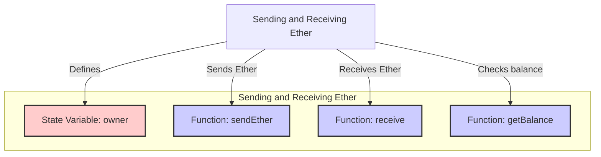

Payable functions in Solidity are functions that can receive Ether along with the call. They are denoted by the `payable` keyword.

**Example:**
```js
// SPDX-License-Identifier: MIT
pragma solidity ^0.8.0;

contract PayableExample {
    address public owner;

    constructor() {
        owner = msg.sender;
    }

    // Payable function to receive Ether
    function receiveEther() public payable {
        require(msg.value > 0, "Must send some Ether");
    }

    // Function to withdraw Ether
    function withdraw(uint256 amount) public {
        require(msg.sender == owner, "Only owner can withdraw");
        require(amount <= address(this).balance, "Insufficient balance");
        payable(owner).transfer(amount);
    }

    // Function to check contract balance
    function getBalance() public view returns (uint256) {
        return address(this).balance;
    }
}
```

**Explanation:**
- **Receive Ether:** The `receiveEther` function is a payable function that allows the contract to receive Ether.
- **Withdraw Ether:** The `withdraw` function allows the owner to withdraw a specified amount of Ether from the contract.
- **Check Balance:** The `getBalance` function returns the current balance of the contract.


### Fallback Functions

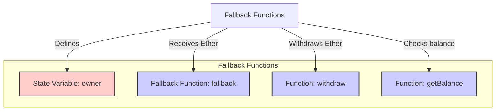

Fallback functions are special functions that are executed when a contract receives Ether and no other function matches the call data. They can be used to handle plain Ether transfers and interact with contracts that do not explicitly call a function.

**Example:**
```js
// SPDX-License-Identifier: MIT
pragma solidity ^0.8.0;

contract FallbackExample {
    address public owner;

    constructor() {
        owner = msg.sender;
    }

    // Fallback function to receive Ether
    fallback() external payable {
        // Logic to execute when Ether is received without data
    }

    // Function to withdraw Ether
    function withdraw(uint256 amount) public {
        require(msg.sender == owner, "Only owner can withdraw");
        require(amount <= address(this).balance, "Insufficient balance");
        payable(owner).transfer(amount);
    }

    // Function to check contract balance
    function getBalance() public view returns (uint256) {
        return address(this).balance;
    }
}
```

**Explanation:**
- **Fallback Function:** The `fallback` function is a special function that executes when the contract receives Ether without any call data or when no other function matches.
- **Withdraw Ether:** The `withdraw` function allows the owner to withdraw a specified amount of Ether from the contract.
- **Check Balance:** The `getBalance` function returns the current balance of the contract.


## Managing Data with Mappings and Arrays

```mermaid
graph TB
    understandingMappings["Understanding Mappings"]
    balancesMapping["Mapping: balances"]
    updateBalanceFunc["Function: updateBalance"]
    getBalanceFunc["Function: getBalance"]

    understandingMappings -->|Defines| balancesMapping
    understandingMappings -->|Updates balance| updateBalanceFunc
    understandingMappings -->|Gets balance| getBalanceFunc

    subgraph mappingStructure["Understanding Mappings"]
        balancesMapping
        updateBalanceFunc
        getBalanceFunc
    end

    classDef mapping fill:#ffcccc,stroke:#333,stroke-width:2px;
    classDef function fill:#ccccff,stroke:#333,stroke-width:2px;

    balancesMapping:::mapping
    updateBalanceFunc:::function
    getBalanceFunc:::function
```

### Understanding Mappings

Mappings are key-value data structures that provide efficient data storage and retrieval. In Solidity, mappings are declared using the `mapping` keyword.

**Example:**
```js
// SPDX-License-Identifier: MIT
pragma solidity ^0.8.0;

contract MappingExample {
    // Declare a mapping
    mapping(address => uint256) public balances;

    // Function to update balance
    function updateBalance(address account, uint256 amount) public {
        balances[account] = amount;
    }

    // Function to get balance
    function getBalance(address account) public view returns (uint256) {
        return balances[account];
    }
}
```

**Explanation:**
- **Mapping Declaration:** The `balances` mapping stores a uint256 value for each address key.
- **Update Balance:** The `updateBalance` function sets the balance for a given address.
- **Get Balance:** The `getBalance` function retrieves the balance for a given address.


### Working with Arrays
```mermaid
graph TB
    workingWithArrays["Working with Arrays"]
    numbersArray["Array: numbers"]
    addNumberFunc["Function: addNumber"]
    getNumberFunc["Function: getNumber"]
    getLengthFunc["Function: getLength"]

    workingWithArrays -->|Defines| numbersArray
    workingWithArrays -->|Adds number| addNumberFunc
    workingWithArrays -->|Gets number| getNumberFunc
    workingWithArrays -->|Gets length| getLengthFunc

    subgraph arrayStructure["Working with Arrays"]
        numbersArray
        addNumberFunc
        getNumberFunc
        getLengthFunc
    end

    classDef array fill:#ffcccc,stroke:#333,stroke-width:2px;
    classDef function fill:#ccccff,stroke:#333,stroke-width:2px;

    numbersArray:::array
    addNumberFunc:::function
    getNumberFunc:::function
    getLengthFunc:::function
```

Arrays are ordered collections of elements. Solidity supports both fixed-size and dynamic-size arrays.

**Example:**
```js
// SPDX-License-Identifier: MIT
pragma solidity ^0.8.0;

contract ArrayExample {
    // Declare a dynamic array
    uint256[] public numbers;

    // Function to add a number to the array
    function addNumber(uint256 number) public {
        numbers.push(number);
    }

    // Function to get a number from the array by index
    function getNumber(uint256 index) public view returns (uint256) {
        require(index < numbers.length, "Index out of bounds");
        return numbers[index];
    }

    // Function to get the length of the array
    function getLength() public view returns (uint256) {
        return numbers.length;
    }
}
```

**Explanation:**
- **Dynamic Array Declaration:** The `numbers` array can grow dynamically.
- **Add Number:** The `addNumber` function adds a new number to the array.
- **Get Number:** The `getNumber` function retrieves a number from the array by its index.
- **Get Length:** The `getLength` function returns the current length of the array.


### Structs and Nested Data Structures

```mermaid
graph TB
    structsNestedData["Structs and Nested Data Structures"]
    personStruct["Struct: Person"]
    peopleMapping["Mapping: people"]
    addPersonFunc["Function: addPerson"]
    getPersonFunc["Function: getPerson"]

    structsNestedData -->|Defines| personStruct
    structsNestedData -->|Maps to struct| peopleMapping
    structsNestedData -->|Adds person| addPersonFunc
    structsNestedData -->|Gets person| getPersonFunc

    subgraph structStructure["Structs and Nested Data Structures"]
        personStruct
        peopleMapping
        addPersonFunc
        getPersonFunc
    end

    classDef struct fill:#ffcccc,stroke:#333,stroke-width:2px;
    classDef mapping fill:#ffcccc,stroke:#333,stroke-width:2px;
    classDef function fill:#ccccff,stroke:#333,stroke-width:2px;

    personStruct:::struct
    peopleMapping:::mapping
    addPersonFunc:::function
    getPersonFunc:::function
```


Structs are custom data types that allow you to group related variables. Nested data structures combine mappings, arrays, and structs for complex data management.

**Example:**
```js
// SPDX-License-Identifier: MIT
pragma solidity ^0.8.0;

contract StructExample {
    // Define a struct
    struct Person {
        string name;
        uint256 age;
    }

    // Declare a mapping of addresses to Person structs
    mapping(address => Person) public people;

    // Function to add a person
    function addPerson(address account, string memory name, uint256 age) public {
        people[account] = Person(name, age);
    }

    // Function to get a person
    function getPerson(address account) public view returns (string memory name, uint256 age) {
        Person storage person = people[account];
        return (person.name, person.age);
    }
}
```

**Explanation:**
- **Struct Definition:** The `Person` struct groups name and age variables.
- **Mapping with Structs:** The `people` mapping associates addresses with `Person` structs.
- **Add Person:** The `addPerson` function adds a new person to the mapping.
- **Get Person:** The `getPerson` function retrieves a person's details from the mapping.


## Access Control and Security

Access control and security are crucial aspects of smart contract development. Ensuring that only authorized users can perform certain actions is essential to maintain the integrity and security of your contracts. This chapter covers ownership and permissions, using modifiers for access control, and common security vulnerabilities.

### Ownership and Permissions

```mermaid
graph TB
    ownershipPermissions["Ownership and Permissions"]
    ownerVar["State Variable: owner"]
    constructorFunc["Constructor"]
    onlyOwnerModifier["Modifier: onlyOwner"]
    transferOwnershipFunc["Function: transferOwnership"]

    ownershipPermissions -->|Defines| ownerVar
    ownershipPermissions -->|Sets owner| constructorFunc
    ownershipPermissions -->|Restricts access| onlyOwnerModifier
    ownershipPermissions -->|Transfers ownership| transferOwnershipFunc

    subgraph ownershipStructure["Ownership and Permissions"]
        ownerVar
        constructorFunc
        onlyOwnerModifier
        transferOwnershipFunc
    end

    classDef state fill:#ffcccc,stroke:#333,stroke-width:2px;
    classDef function fill:#ccccff,stroke:#333,stroke-width:2px;
    classDef modifier fill:#ccffcc,stroke:#333,stroke-width:2px;

    ownerVar:::state
    constructorFunc:::function
    onlyOwnerModifier:::modifier
    transferOwnershipFunc:::function
```

Ownership is a common pattern used to restrict access to certain functions to the contract's owner. This is typically done using an `owner` state variable and functions to transfer ownership.

**Example:**
```js
// SPDX-License-Identifier: MIT
pragma solidity ^0.8.0;

contract OwnershipExample {
    address public owner;

    constructor() {
        owner = msg.sender;
    }

    modifier onlyOwner() {
        require(msg.sender == owner, "Caller is not the owner");
        _;
    }

    function transferOwnership(address newOwner) public onlyOwner {
        require(newOwner != address(0), "New owner is the zero address");
        owner = newOwner;
    }
}
```

**Explanation:**
- **Owner State Variable:** The `owner` variable stores the address of the contract owner.
- **Constructor:** Sets the initial owner to the address that deploys the contract.
- **Only Owner Modifier:** Restricts access to certain functions to the owner.
- **Transfer Ownership:** Allows the current owner to transfer ownership to a new owner.


### Using Modifiers for Access Control

```mermaid
graph LR
    accessControlModifiers["Using Modifiers for Access Control"]
    ownerVar["State Variable: owner"]
    adminsMapping["Mapping: admins"]
    constructorFunc["Constructor"]
    onlyOwnerModifier["Modifier: onlyOwner"]
    onlyAdminModifier["Modifier: onlyAdmin"]
    addAdminFunc["Function: addAdmin"]
    removeAdminFunc["Function: removeAdmin"]
    restrictedFunc["Function: restrictedFunction"]

    accessControlModifiers -->|Defines| ownerVar
    accessControlModifiers -->|Defines| adminsMapping
    accessControlModifiers -->|Sets owner| constructorFunc
    accessControlModifiers -->|Restricts access| onlyOwnerModifier
    accessControlModifiers -->|Restricts access| onlyAdminModifier
    accessControlModifiers -->|Adds admin| addAdminFunc
    accessControlModifiers -->|Removes admin| removeAdminFunc
    accessControlModifiers -->|Restricted function| restrictedFunc

    subgraph accessControlStructure["Using Modifiers for Access Control"]
        ownerVar
        adminsMapping
        constructorFunc
        onlyOwnerModifier
        onlyAdminModifier
        addAdminFunc
        removeAdminFunc
        restrictedFunc
    end

    classDef state fill:#ffcccc,stroke:#333,stroke-width:2px;
    classDef mapping fill:#ffcccc,stroke:#333,stroke-width:2px;
    classDef function fill:#ccccff,stroke:#333,stroke-width:2px;
    classDef modifier fill:#ccffcc,stroke:#333,stroke-width:2px;

    ownerVar:::state
    adminsMapping:::mapping
    constructorFunc:::function
    onlyOwnerModifier:::modifier
    onlyAdminModifier:::modifier
    addAdminFunc:::function
    removeAdminFunc:::function
    restrictedFunc:::function
```

Modifiers are used to add reusable code to functions, often for access control purposes. They help ensure that only authorized users can execute specific functions.

**Example:**
```js
// SPDX-License-Identifier: MIT
pragma solidity ^0.8.0;

contract AccessControlExample {
    address public owner;
    mapping(address => bool) public admins;

    constructor() {
        owner = msg.sender;
    }

    modifier onlyOwner() {
        require(msg.sender == owner, "Caller is not the owner");
        _;
    }

    modifier onlyAdmin() {
        require(admins[msg.sender], "Caller is not an admin");
        _;
    }

    function addAdmin(address account) public onlyOwner {
        admins[account] = true;
    }

    function removeAdmin(address account) public onlyOwner {
        admins[account] = false;
    }

    function restrictedFunction() public onlyAdmin {
        // Function logic here
    }
}
```

**Explanation:**
- **Admin Mapping:** The `admins` mapping stores addresses with admin privileges.
- **Only Owner Modifier:** Restricts certain functions to the owner.
- **Only Admin Modifier:** Restricts certain functions to admins.
- **Add/Remove Admin:** Allows the owner to manage admin privileges.
- **Restricted Function:** Only admins can call this function.


### Common Security Vulnerabilities

```mermaid
graph TB
    commonVulnerabilities["Common Security Vulnerabilities"]
    reentrancyIssue["Issue: Reentrancy"]
    depositFunc["Function: deposit"]
    withdrawFunc["Function: withdraw"]

    commonVulnerabilities -->|Defines| reentrancyIssue
    commonVulnerabilities -->|Deposits Ether| depositFunc
    commonVulnerabilities -->|Withdraws Ether| withdrawFunc

    subgraph vulnerabilityStructure["Common Security Vulnerabilities"]
        reentrancyIssue
        depositFunc
        withdrawFunc
    end

    classDef issue fill:#ff9999,stroke:#333,stroke-width:2px;
    classDef function fill:#ccccff,stroke:#333,stroke-width:2px;

    reentrancyIssue:::issue
    depositFunc:::function
    withdrawFunc:::function
```

Smart contracts are prone to various security vulnerabilities. Understanding and mitigating these vulnerabilities is crucial for secure contract development.

**Reentrancy:**
- **Issue:** A reentrant call can exploit the contract by calling back into the contract before the previous execution is complete.
- **Solution:** Use the "checks-effects-interactions" pattern and `ReentrancyGuard`.

**Example:**
```js
// SPDX-License-Identifier: MIT
pragma solidity ^0.8.0;

contract ReentrancyExample {
    mapping(address => uint256) public balances;

    function deposit() public payable {
        balances[msg.sender] += msg.value;
    }

    function withdraw(uint256 amount) public {
        require(balances[msg.sender] >= amount, "Insufficient balance");
        balances[msg.sender] -= amount;
        (bool success, ) = msg.sender.call{value: amount}("");
        require(success, "Transfer failed");
    }
}
```


**Integer Overflow and Underflow:**
- **Issue:** Arithmetic operations that exceed the maximum or minimum value can lead to incorrect results.
- **Solution:** Use SafeMath library or built-in overflow checks.

**Example:**
```js
// SPDX-License-Identifier: MIT
pragma solidity ^0.8.0;

contract OverflowExample {
    using SafeMath for uint256;
    uint256 public maxUint = type(uint256).max;

    function increment(uint256 value) public pure returns (uint256) {
        return value.add(1);
    }

    function decrement(uint256 value) public pure returns (uint256) {
        return value.sub(1);
    }
}
```

**Mermaid Diagram:**
```mermaid
graph TB
    integerOverflowUnderflow["Common Security Vulnerabilities"]
    overflowUnderflowIssue["Issue: Integer Overflow/Underflow"]
    incrementFunc["Function: increment"]
    decrementFunc["Function: decrement"]

    integerOverflowUnderflow -->|Defines| overflowUnderflowIssue
    integerOverflowUnderflow -->|Increments value| incrementFunc
    integerOverflowUnderflow -->|Decrements value| decrementFunc

    subgraph overflowUnderflowStructure["Integer Overflow and Underflow"]
        overflowUnderflowIssue
        incrementFunc
        decrementFunc
    end

    classDef issue fill:#ff9999,stroke:#333,stroke-width:2px;
    classDef function fill:#ccccff,stroke:#333,stroke-width:2px;

    overflowUnderflowIssue:::issue
    incrementFunc:::function
    decrementFunc:::function
```

### Summary

This chapter covered the essentials of access control and security in Solidity:
- **Ownership and Permissions:** Using ownership patterns to restrict access to certain functions.
- **Using Modifiers for Access Control:** Adding reusable code to restrict function access.
- **Common Security Vulnerabilities:** Understanding and mitigating issues like reentrancy and integer overflow/underflow.

These concepts are crucial for building secure and robust smart contracts.

## Inheritance and Interfaces

Inheritance and interfaces in Solidity allow you to write modular and reusable code. Inheritance lets you create new contracts based on existing ones, while interfaces define a contract’s external behavior without implementing it. This chapter covers inheriting from other contracts, overriding functions, and implementing interfaces.

### Inheriting from Other Contracts
```mermaid
graph TB
    inheritanceContracts["Inheriting from Other Contracts"]
    parentContract["Contract: ParentContract"]
    childContract["Contract: ChildContract"]

    inheritanceContracts -->|Defines| parentContract
    inheritanceContracts -->|Inherits| childContract

    subgraph inheritanceStructure["Inheriting from Other Contracts"]
        parentContract
        childContract
    end

    classDef contract fill:#99f,stroke:#333,stroke-width:2px;

    parentContract:::contract
    childContract:::contract
```

Inheritance allows one contract to inherit properties and methods from another contract. This promotes code reuse and modularity.

**Example:**
```js
// SPDX-License-Identifier: MIT
pragma solidity ^0.8.0;

// Base contract
contract ParentContract {
    string public parentMessage;

    constructor(string memory message) {
        parentMessage = message;
    }

    function setParentMessage(string memory message) public {
        parentMessage = message;
    }
}

// Derived contract
contract ChildContract is ParentContract {
    string public childMessage;

    constructor(string memory parentMessage, string memory childMessage)
        ParentContract(parentMessage)
    {
        childMessage = childMessage;
    }

    function setChildMessage(string memory message) public {
        childMessage = message;
    }
}
```

**Explanation:**
- **Parent Contract:** Defines a base contract with a message and functions to set it.
- **Child Contract:** Inherits from `ParentContract` and adds its own message and functions.


### Overriding Functions

```mermaid
graph TB
    overridingFunctions["Overriding Functions"]
    parentContract["Contract: Parent"]
    childContract["Contract: Child"]

    overridingFunctions -->|Defines| parentContract
    overridingFunctions -->|Overrides| childContract

    subgraph overridingStructure["Overriding Functions"]
        parentContract
        childContract
    end

    classDef contract fill:#99f,stroke:#333,stroke-width:2px;

    parentContract:::contract
    childContract:::contract
```

Overriding allows derived contracts to provide specific implementations for functions defined in their parent contracts.

**Example:**
```js
// SPDX-License-Identifier: MIT
pragma solidity ^0.8.0;

contract Parent {
    function greet() public virtual returns (string memory) {
        return "Hello from Parent";
    }
}

contract Child is Parent {
    function greet() public override returns (string memory) {
        return "Hello from Child";
    }
}
```

**Explanation:**
- **Virtual Function:** The `greet` function in `Parent` is marked as `virtual`, indicating it can be overridden.
- **Override Function:** The `greet` function in `Child` overrides the `greet` function in `Parent`.


### Implementing Interfaces

```mermaid
graph TB
    implementingInterfaces["Implementing Interfaces"]
    exampleInterface["Interface: IExample"]
    exampleContract["Contract: Example"]

    implementingInterfaces -->|Defines| exampleInterface
    implementingInterfaces -->|Implements| exampleContract

    subgraph interfaceStructure["Implementing Interfaces"]
        exampleInterface
        exampleContract
    end

    classDef interface fill:#f9c,stroke:#333,stroke-width:2px;
    classDef contract fill:#99f,stroke:#333,stroke-width:2px;

    exampleInterface:::interface
    exampleContract:::contract
```

Interfaces define a contract's external behavior without implementing it. Any contract that implements an interface must provide implementations for all its functions.

**Example:**
```js
// SPDX-License-Identifier: MIT
pragma solidity ^0.8.0;

// Interface
interface IExample {
    function setValue(uint256 value) external;
    function getValue() external view returns (uint256);
}

// Contract implementing the interface
contract Example is IExample {
    uint256 private value;

    function setValue(uint256 newValue) external override {
        value = newValue;
    }

    function getValue() external view override returns (uint256) {
        return value;
    }
}
```

**Explanation:**
- **Interface Definition:** `IExample` defines the `setValue` and `getValue` functions.
- **Implementing Contract:** `Example` implements the `IExample` interface and provides implementations for its functions.


### Summary

This chapter covered the essentials of inheritance and interfaces in Solidity:
- **Inheriting from Other Contracts:** Reuse and extend functionality from existing contracts.
- **Overriding Functions:** Provide specific implementations for inherited functions.
- **Implementing Interfaces:** Define and enforce a contract's external behavior.

These concepts enable you to write modular, reusable, and maintainable smart contracts.

## Advanced Topics and Best Practices

```mermaid
graph TB
    gasOptimization["Gas Optimization"]
    minimizeStorage["Minimize Storage Operations"]
    useFixedSize["Use Fixed-Size Data Types"]
    optimizeVisibility["Optimize Function Visibility"]
    avoidComputations["Avoid Unnecessary Computations"]

    gasOptimization -->|Tips| minimizeStorage
    gasOptimization -->|Tips| useFixedSize
    gasOptimization -->|Tips| optimizeVisibility
    gasOptimization -->|Tips| avoidComputations

    subgraph optimizationStructure["Gas Optimization"]
        minimizeStorage
        useFixedSize
        optimizeVisibility
        avoidComputations
    end

    classDef optimization fill:#ccffcc,stroke:#333,stroke-width:2px;

    minimizeStorage:::optimization
    useFixedSize:::optimization
    optimizeVisibility:::optimization
    avoidComputations:::optimization
```

In this chapter, we will delve into advanced topics and best practices in Solidity development. These include gas optimization, error handling and exceptions, and writing secure smart contracts.

### Gas Optimization

Gas optimization is crucial for reducing the cost of executing smart contracts. Efficient use of gas ensures that contracts are cost-effective and performant.

**Tips for Gas Optimization:**

1. **Minimize Storage Operations:**
   - Reading from and writing to storage is expensive. Minimize these operations by using memory and calldata when possible.
   - Example:
     ```js
     // Using memory instead of storage for temporary variables
     function compute(uint256[] memory data) public view returns (uint256) {
         uint256 sum = 0;
         for (uint256 i = 0; i < data.length; i++) {
             sum += data[i];
         }
         return sum;
     }
     ```

2. **Use Fixed-Size Data Types:**
   - Use smaller, fixed-size data types (e.g., `uint8`, `uint16`) to save gas.
   - Example:
     ```js
     uint8 public smallNumber; // Cheaper than uint256
     ```

3. **Optimize Function Visibility:**
   - Functions with external visibility are cheaper to call from other contracts.
   - Example:
     ```js
     function externalFunction() external {
         // Cheaper than public function
     }
     ```

4. **Avoid Unnecessary Computations:**
   - Perform complex calculations off-chain whenever possible and pass the results to the contract.
   - Example:
     ```js
     function storeResult(uint256 result) external {
         // Store precomputed result
     }
     ```

### Error Handling and Exceptions
```mermaid
graph TB
    errorHandling["Error Handling and Exceptions"]
    requireStatement["Require Statement"]
    revertStatement["Revert Statement"]
    assertStatement["Assert Statement"]

    errorHandling -->|Mechanisms| requireStatement
    errorHandling -->|Mechanisms| revertStatement
    errorHandling -->|Mechanisms| assertStatement

    subgraph errorHandlingStructure["Error Handling and Exceptions"]
        requireStatement
        revertStatement
        assertStatement
    end

    classDef errorHandling fill:#ffcccc,stroke:#333,stroke-width:2px;

    requireStatement:::errorHandling
    revertStatement:::errorHandling
    assertStatement:::errorHandling
```

Proper error handling is essential for ensuring the robustness of smart contracts. Solidity provides several mechanisms for handling errors and exceptions.

1. **Require Statement:**
   - Use `require` to check conditions and revert if the condition is not met. It refunds remaining gas and reverts changes.
   - Example:
     ```js
     function withdraw(uint256 amount) public {
         require(amount <= balances[msg.sender], "Insufficient balance");
         balances[msg.sender] -= amount;
         payable(msg.sender).transfer(amount);
     }
     ```

2. **Revert Statement:**
   - Use `revert` for custom error handling with a message. It stops execution and reverts state changes.
   - Example:
     ```js
     function transfer(address to, uint256 amount) public {
         if (amount > balances[msg.sender]) {
             revert("Insufficient balance");
         }
         balances[msg.sender] -= amount;
         balances[to] += amount;
     }
     ```

3. **Assert Statement:**
   - Use `assert` for internal errors and invariants. It should not be used for input validation.
   - Example:
     ```js
     function setOwner(address newOwner) public {
         assert(newOwner != address(0));
         owner = newOwner;
     }
     ```


### Writing Secure Smart Contracts

```mermaid
graph TB
    secureContracts["Writing Secure Smart Contracts"]
    useSafeMath["Use SafeMath"]
    implementAccessControl["Implement Access Control"]
    avoidReentrancy["Avoid Reentrancy"]
    useKnownPatterns["Use Known Patterns and Libraries"]

    secureContracts -->|Best Practices| useSafeMath
    secureContracts -->|Best Practices| implementAccessControl
    secureContracts -->|Best Practices| avoidReentrancy
    secureContracts -->|Best Practices| useKnownPatterns

    subgraph secureStructure["Writing Secure Smart Contracts"]
        useSafeMath
        implementAccessControl
        avoidReentrancy
        useKnownPatterns
    end

    classDef secure fill:#ccffff,stroke:#333,stroke-width:2px;

    useSafeMath:::secure
    implementAccessControl:::secure
    avoidReentrancy:::secure
    useKnownPatterns:::secure
```

Security is paramount in smart contract development. Adopting best practices helps prevent vulnerabilities and ensures the safety of user funds.

1. **Use SafeMath:**
   - Prevent integer overflows and underflows by using the SafeMath library.
   - Example:
     ```js
     using SafeMath for uint256;
     uint256 public totalSupply;

     function addSupply(uint256 amount) public {
         totalSupply = totalSupply.add(amount);
     }
     ```

2. **Implement Access Control:**
   - Restrict access to sensitive functions using modifiers like `onlyOwner`.
   - Example:
     ```js
     modifier onlyOwner() {
         require(msg.sender == owner, "Caller is not the owner");
         _;
     }

     function changeOwner(address newOwner) public onlyOwner {
         owner = newOwner;
     }
     ```

3. **Avoid Reentrancy:**
   - Use the "checks-effects-interactions" pattern to prevent reentrancy attacks.
   - Example:
     ```js
     function withdraw(uint256 amount) public {
         require(amount <= balances[msg.sender], "Insufficient balance");
         balances[msg.sender] -= amount;
         (bool success, ) = msg.sender.call{value: amount}("");
         require(success, "Transfer failed");
     }
     ```

4. **Use Known Patterns and Libraries:**
   - Leverage audited libraries and patterns from reputable sources like OpenZeppelin.
   - Example:
     ```js
     import "@openzeppelin/contracts/token/ERC20/ERC20.sol";

     contract MyToken is ERC20 {
         constructor(uint256 initialSupply) ERC20("MyToken", "MTK") {
             _mint(msg.sender, initialSupply);
         }
     }
     ```


### Summary

This chapter covered advanced topics and best practices in Solidity development:
- **Gas Optimization:** Techniques to reduce gas usage and costs.
- **Error Handling and Exceptions:** Mechanisms to handle errors and ensure robustness.
- **Writing Secure Smart Contracts:** Best practices to prevent vulnerabilities and ensure contract security.

These advanced topics and best practices are essential for writing efficient, robust, and secure smart contracts on the Ethereum blockchain.

