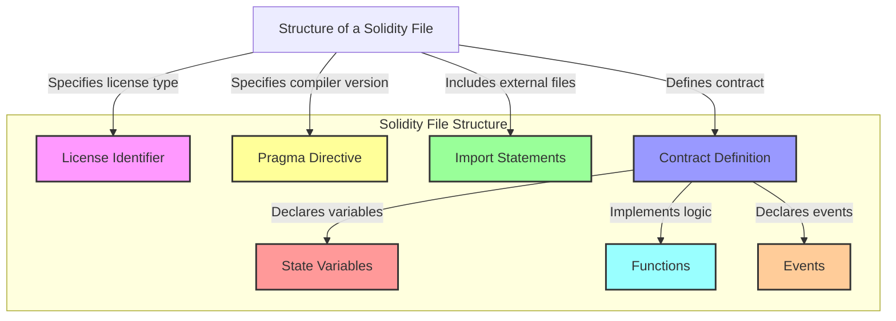
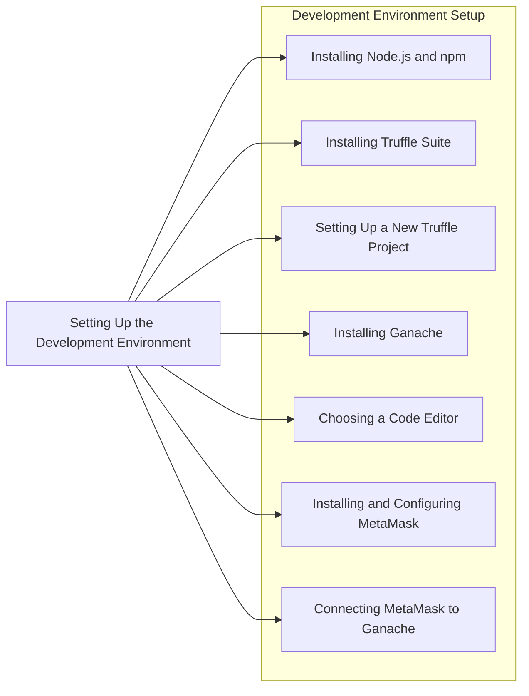
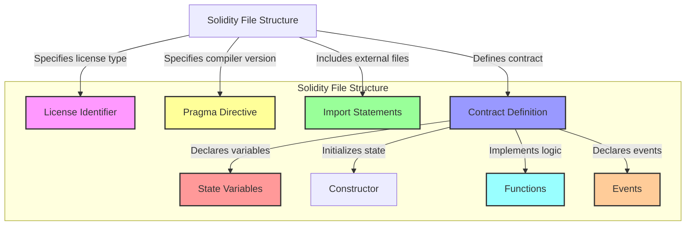
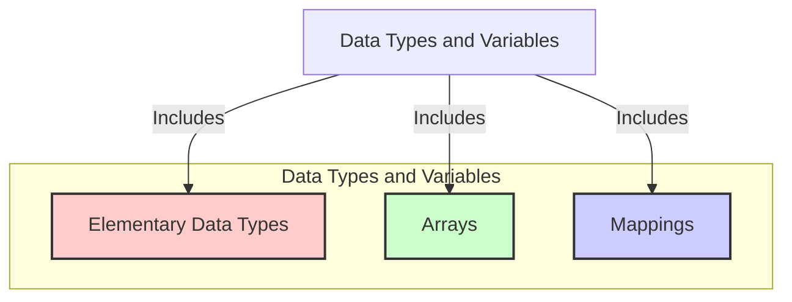
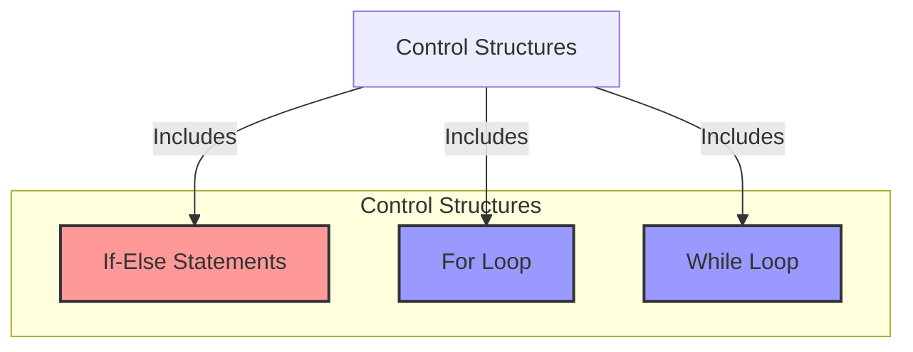

## Introduction to Solidity

**Explanation:**
Solidity is a high-level programming language designed for writing smart contracts on the Ethereum blockchain. It is influenced by C++, Python, and JavaScript. 



**Example of a simple Solidity contract**:

```solidity
// SPDX-License-Identifier: MIT
pragma solidity ^0.8.0;

interface IERC20 {
    function totalSupply() external view returns (uint256);
    function balanceOf(address account) external view returns (uint256);
    function transfer(address recipient, uint256 amount) external returns (bool);
    function allowance(address owner, address spender) external view returns (uint256);
    function approve(address spender, uint256 amount) external returns (bool);
    function transferFrom(address sender, address recipient, uint256 amount) external returns (bool);
    event Transfer(address indexed from, address indexed to, uint256 value);
    event Approval(address indexed owner, address indexed spender, uint256 value);
}

contract MyToken is IERC20 {
    string public constant name = "MyToken";
    string public constant symbol = "MTK";
    uint8 public constant decimals = 18;
    uint256 private _totalSupply;
    mapping(address => uint256) private _balances;
    mapping(address => mapping(address => uint256)) private _allowances;

    constructor(uint256 initialSupply) {
        _totalSupply = initialSupply * (10 ** uint256(decimals));
        _balances[msg.sender] = _totalSupply;
        emit Transfer(address(0), msg.sender, _totalSupply);
    }

    function totalSupply() public view override returns (uint256) {
        return _totalSupply;
    }

    function balanceOf(address account) public view override returns (uint256) {
        return _balances[account];
    }

    function transfer(address recipient, uint256 amount) public override returns (bool) {
        require(_balances[msg.sender] >= amount, "Insufficient balance");
        _balances[msg.sender] -= amount;
        _balances[recipient] += amount;
        emit Transfer(msg.sender, recipient, amount);
        return true;
    }

    function allowance(address owner, address spender) public view override returns (uint256) {
        return _allowances[owner][spender];
    }

    function approve(address spender, uint256 amount) public override returns (bool) {
        _allowances[msg.sender][spender] = amount;
        emit Approval(msg.sender, spender, amount);
        return true;
    }

    function transferFrom(address sender, address recipient, uint256 amount) public override returns (bool) {
        require(_balances[sender] >= amount, "Insufficient balance");
        require(_allowances[sender][msg.sender] >= amount, "Allowance exceeded");
        _balances[sender] -= amount;
        _balances[recipient] += amount;
        _allowances[sender][msg.sender] -= amount;
        emit Transfer(sender, recipient, amount);
        return true;
    }
}

```

### Setting up the Development Environment



1. Installing Node.js and npm
2. Installing Truffle Suite

**Truffle** is a development environment, testing framework, and asset pipeline for Ethereum, making it easier to manage smart contract projects.


```bash
npm install -g truffle
```
3.  Install Ganache CLI globally

**Ganache** is a personal Ethereum blockchain used to deploy contracts, develop applications, and run tests.

```bash
npm install -g ganache-cli
```

4.  Connecting MetaMask to Ganache

To interact with your local blockchain, you need to connect MetaMask to Ganache.

Steps:

- Open MetaMask and go to Settings -> Networks -> Add Network.
- Fill in the details:
```
Network Name: Ganache
New RPC URL: http://127.0.0.1:8545
Chain ID: 1337 (default for Ganache)
```
Save and switch to the Ganache network.


## Solidity Language Fundamentals

### Syntax and Structure

Solidity is a statically-typed programming language designed for developing smart contracts that run on the Ethereum Virtual Machine (EVM). Understanding the syntax and structure is crucial for writing effective and secure smart contracts.

#### License Identifier

A Solidity file usually starts with a license identifier. This is an optional comment that specifies the license under which the code is distributed.

**Example:**
```solidity
// SPDX-License-Identifier: MIT
```

#### Pragma Directive

The pragma directive is used to enable certain compiler features or checks. It specifies the version of the Solidity compiler to be used.

**Example:**
```solidity
pragma solidity ^0.8.0;
```

#### Import Statements

Import statements are used to include code from other files, promoting modularity and code reuse.

**Example:**
```solidity
import "./SafeMath.sol";
```

#### Contract Definition





The main body of a Solidity file is the contract definition. This is where you define the smart contract, including its state variables, functions, and events.

**Example:**
```solidity
contract MyContract {
    // State variables
    uint256 public myVariable;

    // Constructor
    constructor(uint256 initialValue) {
        myVariable = initialValue;
    }

    // Functions
    function set(uint256 newValue) public {
        myVariable = newValue;
    }

    function get() public view returns (uint256) {
        return myVariable;
    }

    // Events
    event ValueChanged(uint256 newValue);
}
```
#### Basic Solidity Syntax

**Comments:**
- Single-line comments start with `//`.
- Multi-line comments are enclosed in `/* */`.

**Example:**
```solidity
// This is a single-line comment
/*
This is a
multi-line comment
*/
```

**Data Types:**
- Solidity supports various data types, including integers, booleans, addresses, and more.

**Example:**
```solidity
uint256 public myUint;
bool public myBool;
address public myAddress;
```

**Control Structures:**
- Solidity supports standard control structures like `if`, `else`, `for`, `while`, and `do-while`.

**Example:**
```solidity
function controlExample(uint256 x) public pure returns (bool) {
    if (x > 10) {
        return true;
    } else {
        return false;
    }
}
```

### Data Types and Variables



Solidity supports various data types that help manage data within smart contracts. Understanding these data types and how to use them is essential for developing robust smart contracts.

#### Elementary Data Types

**Integer Types:**
- Signed (`int`) and unsigned (`uint`) integers of various sizes (e.g., `uint8`, `uint256`).

**Example:**
```solidity
uint256 public myUint = 1;
int256 public myInt = -1;
```

**Boolean Type:**
- Represents true or false.

**Example:**
```solidity
bool public myBool = true;
```

**Address Type:**
- Holds 20-byte Ethereum addresses.

**Example:**
```solidity
address public myAddress = 0x1234567890123456789012345678901234567890;
```

**Bytes and Strings:**
- Fixed-size (`bytes1`, `bytes32`) and dynamic-size (`bytes`, `string`) byte arrays.

**Example:**
```solidity
bytes32 public myBytes = "Hello, World!";
string public myString = "Hello, Solidity!";
```

#### Arrays

Arrays are collections of elements of the same type.

**Static Arrays:**
```solidity
uint256[5] public staticArray;
```

**Dynamic Arrays:**
```solidity
uint256[] public dynamicArray;
```

**Array Operations:**
- Pushing elements, getting the length, and accessing elements.

**Example:**
```solidity
function arrayOperations() public {
    dynamicArray.push(1);
    uint256 length = dynamicArray.length;
    uint256 firstElement = dynamicArray[0];
}
```

#### Mappings

Mappings are key-value data structures.

**Example:**
```solidity
mapping(address => uint256) public balances;

function updateBalance(address account, uint256 amount) public {
    balances[account] = amount;
}

function getBalance(address account) public view returns (uint256) {
    return balances[account];
}
```


### Control Structures (if, else, loops)


Solidity supports standard control structures for conditional execution and loops.

#### Conditional Statements

**If-Else Statements:**
```solidity
function checkValue(uint256 value) public pure returns (string memory) {
    if (value > 10) {
        return "Greater than 10";
    } else {
        return "10 or less";
    }
}
```

#### Loops

**For Loop:**
```solidity
function sumArray(uint256[] memory array) public pure returns (uint256) {
    uint256 sum = 0;
    for (uint256 i = 0; i < array.length; i++) {
        sum += array[i];
    }
    return sum;
}
```

**While Loop:**
```solidity
function sumWhileLoop(uint256[] memory array) public pure returns (uint256) {
    uint256 sum = 0;
    uint256 i = 0;
    while (i < array.length) {
        sum += array[i];
        i++;
    }
    return sum;
}
```


This concludes Chapter 2 on Solidity Language Fundamentals, covering Syntax and Structure, Data Types and Variables, and Control Structures. These fundamentals provide the foundation needed to write more complex smart contracts.

## Chapter 3: Writing Your First Smart Contract
- Basic Contract Structure
- State Variables and Functions
- Compiling and Deploying a Contract

## Chapter 4: Working with Functions
- Function Modifiers
- Visibility (public, private, internal, external)
- View and Pure Functions

## Chapter 5: Events and Logging
- Declaring Events
- Emitting Events
- Using Events for Debugging

## Chapter 6: Handling Payments and Transfers
- Sending and Receiving Ether
- Payable Functions
- Fallback Functions

## Chapter 7: Managing Data with Mappings and Arrays
- Understanding Mappings
- Working with Arrays
- Structs and Nested Data Structures

## Chapter 8: Access Control and Security
- Ownership and Permissions
- Using Modifiers for Access Control
- Common Security Vulnerabilities

## Chapter 9: Inheritance and Interfaces
- Inheriting from Other Contracts
- Overriding Functions
- Implementing Interfaces

## Chapter 10: Advanced Topics and Best Practices
- Gas Optimization
- Error Handling and Exceptions
- Writing Secure Smart Contracts

These chapters provide a comprehensive introduction to Solidity, covering essential concepts and practical applications to build a solid foundation in smart contract development.
