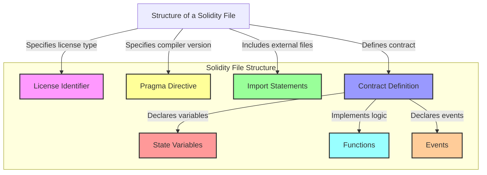
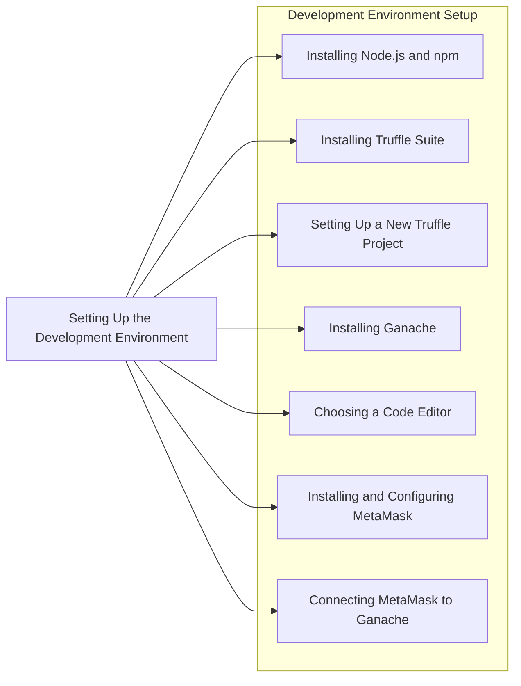
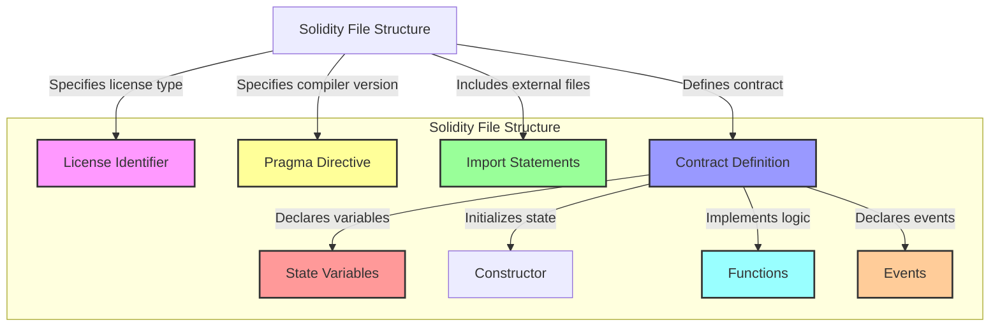
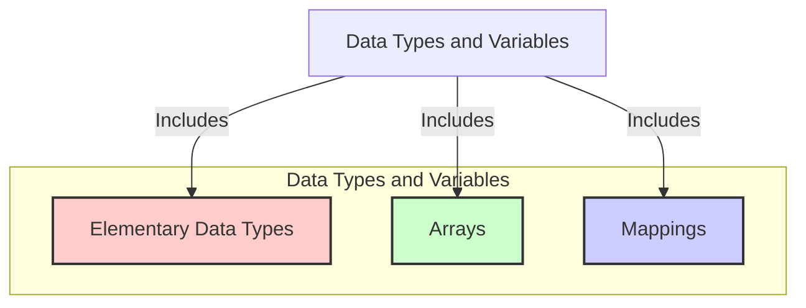
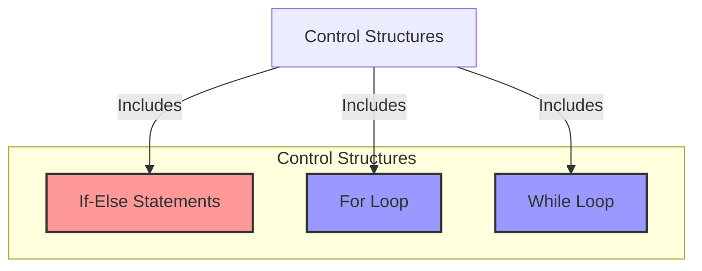
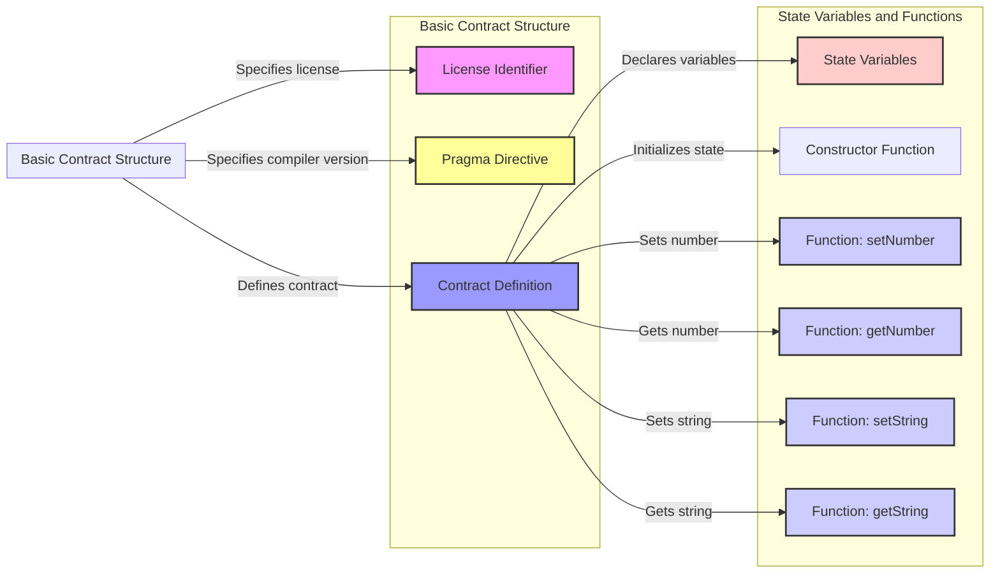
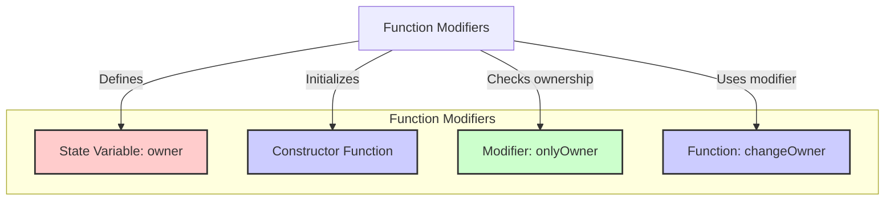
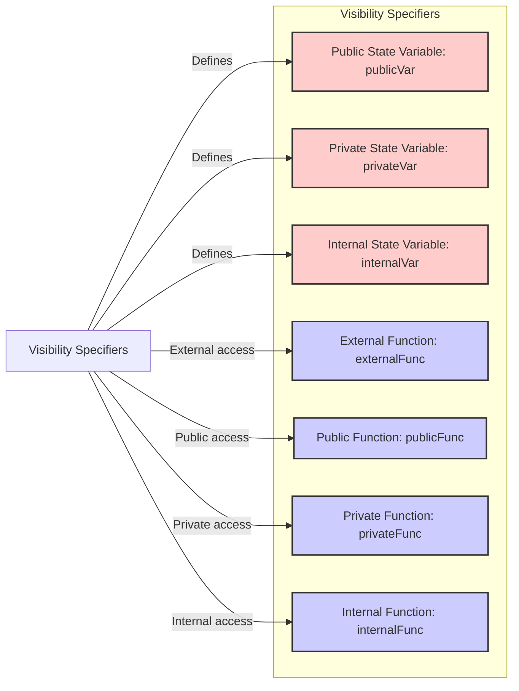
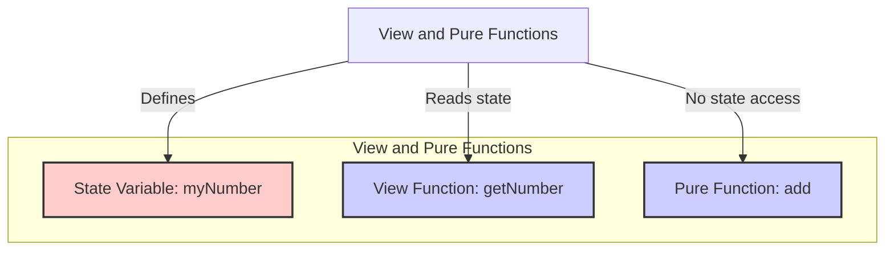

## Introduction to Solidity

**Explanation:**
Solidity is a high-level programming language designed for writing smart contracts on the Ethereum blockchain. It is influenced by C++, Python, and JavaScript. 



**Example of a simple Solidity contract**:

```js
// SPDX-License-Identifier: MIT
pragma solidity ^0.8.0;

interface IERC20 {
    function totalSupply() external view returns (uint256);
    function balanceOf(address account) external view returns (uint256);
    function transfer(address recipient, uint256 amount) external returns (bool);
    function allowance(address owner, address spender) external view returns (uint256);
    function approve(address spender, uint256 amount) external returns (bool);
    function transferFrom(address sender, address recipient, uint256 amount) external returns (bool);
    event Transfer(address indexed from, address indexed to, uint256 value);
    event Approval(address indexed owner, address indexed spender, uint256 value);
}

contract MyToken is IERC20 {
    string public constant name = "MyToken";
    string public constant symbol = "MTK";
    uint8 public constant decimals = 18;
    uint256 private _totalSupply;
    mapping(address => uint256) private _balances;
    mapping(address => mapping(address => uint256)) private _allowances;

    constructor(uint256 initialSupply) {
        _totalSupply = initialSupply * (10 ** uint256(decimals));
        _balances[msg.sender] = _totalSupply;
        emit Transfer(address(0), msg.sender, _totalSupply);
    }

    function totalSupply() public view override returns (uint256) {
        return _totalSupply;
    }

    function balanceOf(address account) public view override returns (uint256) {
        return _balances[account];
    }

    function transfer(address recipient, uint256 amount) public override returns (bool) {
        require(_balances[msg.sender] >= amount, "Insufficient balance");
        _balances[msg.sender] -= amount;
        _balances[recipient] += amount;
        emit Transfer(msg.sender, recipient, amount);
        return true;
    }

    function allowance(address owner, address spender) public view override returns (uint256) {
        return _allowances[owner][spender];
    }

    function approve(address spender, uint256 amount) public override returns (bool) {
        _allowances[msg.sender][spender] = amount;
        emit Approval(msg.sender, spender, amount);
        return true;
    }

    function transferFrom(address sender, address recipient, uint256 amount) public override returns (bool) {
        require(_balances[sender] >= amount, "Insufficient balance");
        require(_allowances[sender][msg.sender] >= amount, "Allowance exceeded");
        _balances[sender] -= amount;
        _balances[recipient] += amount;
        _allowances[sender][msg.sender] -= amount;
        emit Transfer(sender, recipient, amount);
        return true;
    }
}

```

### Setting up the Development Environment



1. Installing Node.js and npm
2. Installing Truffle Suite

**Truffle** is a development environment, testing framework, and asset pipeline for Ethereum, making it easier to manage smart contract projects.


```bash
npm install -g truffle
```
3.  Install Ganache CLI globally

**Ganache** is a personal Ethereum blockchain used to deploy contracts, develop applications, and run tests.

```bash
npm install -g ganache-cli
```

4.  Connecting MetaMask to Ganache

To interact with your local blockchain, you need to connect MetaMask to Ganache.

Steps:

- Open MetaMask and go to Settings -> Networks -> Add Network.
- Fill in the details:
```
Network Name: Ganache
New RPC URL: http://127.0.0.1:8545
Chain ID: 1337 (default for Ganache)
```
Save and switch to the Ganache network.


## Solidity Language Fundamentals

### Syntax and Structure

Solidity is a statically-typed programming language designed for developing smart contracts that run on the Ethereum Virtual Machine (EVM). Understanding the syntax and structure is crucial for writing effective and secure smart contracts.

#### License Identifier

A Solidity file usually starts with a license identifier. This is an optional comment that specifies the license under which the code is distributed.

**Example:**
```js
// SPDX-License-Identifier: MIT
```

#### Pragma Directive

The pragma directive is used to enable certain compiler features or checks. It specifies the version of the Solidity compiler to be used.

**Example:**
```js
pragma solidity ^0.8.0;
```

#### Import Statements

Import statements are used to include code from other files, promoting modularity and code reuse.

**Example:**
```js
import "./SafeMath.sol";
```

#### Contract Definition





The main body of a Solidity file is the contract definition. This is where you define the smart contract, including its state variables, functions, and events.

**Example:**
```js
contract MyContract {
    // State variables
    uint256 public myVariable;

    // Constructor
    constructor(uint256 initialValue) {
        myVariable = initialValue;
    }

    // Functions
    function set(uint256 newValue) public {
        myVariable = newValue;
    }

    function get() public view returns (uint256) {
        return myVariable;
    }

    // Events
    event ValueChanged(uint256 newValue);
}
```
#### Basic Solidity Syntax

**Comments:**
- Single-line comments start with `//`.
- Multi-line comments are enclosed in `/* */`.

**Example:**
```js
// This is a single-line comment
/*
This is a
multi-line comment
*/
```

**Data Types:**
- Solidity supports various data types, including integers, booleans, addresses, and more.

**Example:**
```js
uint256 public myUint;
bool public myBool;
address public myAddress;
```

**Control Structures:**
- Solidity supports standard control structures like `if`, `else`, `for`, `while`, and `do-while`.

**Example:**
```js
function controlExample(uint256 x) public pure returns (bool) {
    if (x > 10) {
        return true;
    } else {
        return false;
    }
}
```

### Data Types and Variables



Solidity supports various data types that help manage data within smart contracts. Understanding these data types and how to use them is essential for developing robust smart contracts.

#### Elementary Data Types

**Integer Types:**
- Signed (`int`) and unsigned (`uint`) integers of various sizes (e.g., `uint8`, `uint256`).

**Example:**
```js
uint256 public myUint = 1;
int256 public myInt = -1;
```

**Boolean Type:**
- Represents true or false.

**Example:**
```js
bool public myBool = true;
```

**Address Type:**
- Holds 20-byte Ethereum addresses.

**Example:**
```js
address public myAddress = 0x1234567890123456789012345678901234567890;
```

**Bytes and Strings:**
- Fixed-size (`bytes1`, `bytes32`) and dynamic-size (`bytes`, `string`) byte arrays.

**Example:**
```js
bytes32 public myBytes = "Hello, World!";
string public myString = "Hello, Solidity!";
```

#### Arrays

Arrays are collections of elements of the same type.

**Static Arrays:**
```js
uint256[5] public staticArray;
```

**Dynamic Arrays:**
```js
uint256[] public dynamicArray;
```

**Array Operations:**
- Pushing elements, getting the length, and accessing elements.

**Example:**
```js
function arrayOperations() public {
    dynamicArray.push(1);
    uint256 length = dynamicArray.length;
    uint256 firstElement = dynamicArray[0];
}
```

#### Mappings

Mappings are key-value data structures.

**Example:**
```js
mapping(address => uint256) public balances;

function updateBalance(address account, uint256 amount) public {
    balances[account] = amount;
}

function getBalance(address account) public view returns (uint256) {
    return balances[account];
}
```


### Control Structures (if, else, loops)


Solidity supports standard control structures for conditional execution and loops.

#### Conditional Statements

**If-Else Statements:**
```js
function checkValue(uint256 value) public pure returns (string memory) {
    if (value > 10) {
        return "Greater than 10";
    } else {
        return "10 or less";
    }
}
```

#### Loops

**For Loop:**
```js
function sumArray(uint256[] memory array) public pure returns (uint256) {
    uint256 sum = 0;
    for (uint256 i = 0; i < array.length; i++) {
        sum += array[i];
    }
    return sum;
}
```

**While Loop:**
```js
function sumWhileLoop(uint256[] memory array) public pure returns (uint256) {
    uint256 sum = 0;
    uint256 i = 0;
    while (i < array.length) {
        sum += array[i];
        i++;
    }
    return sum;
}
```


## Writing Your First Smart Contract


```bash
├── build
│   └── contracts
│       └── MyFirstContract.json
├── contracts
│   └── MyFirstContract.sol
├── migrations
│   └── 2_deploy_contracts.js
├── test
└── truffle-config.js
```

### Basic Contract Structure



### Steps to Create Smart Contract

1. **Install Node.js and npm**

   If you haven't already, download and install Node.js from [nodejs.org](https://nodejs.org/). This will also install npm (Node Package Manager).

   Verify the installation:
   ```bash
   node -v
   npm -v
   ```

2. **Install Truffle**

   Install Truffle globally using npm:
   ```bash
   npm install -g truffle
   ```

   Verify the installation:
   ```bash
   truffle version
   ```

3. **Install Ganache CLI**

   Install Ganache CLI globally using npm:
   ```bash
   npm install -g ganache-cli
   ```

   Start Ganache CLI to simulate an Ethereum blockchain locally:
   ```bash
   ganache-cli -p 7545
   ```

4. **Initialize a New Truffle Project**

   Create a new directory for your project and navigate into it:
   ```bash
   mkdir my-solidity-project
   cd my-solidity-project
   ```

   Initialize a new Truffle project:
   ```bash
   truffle init
   ```

5. **Create the Solidity Contract**

   Navigate to the `contracts` directory and create a new file called `MyFirstContract.sol`:
   ```bash
   cd contracts
   touch MyFirstContract.sol
   ```

   Open `MyFirstContract.sol` in a text editor and add the following code:
   ```solidity
   // SPDX-License-Identifier: MIT
   pragma solidity ^0.8.0;

   contract MyFirstContract {
       uint256 public myNumber;
       string public myString;

       constructor(uint256 _initialNumber, string memory _initialString) {
           myNumber = _initialNumber;
           myString = _initialString;
       }

       function setNumber(uint256 _newNumber) public {
           myNumber = _newNumber;
       }

       function getNumber() public view returns (uint256) {
           return myNumber;
       }

       function setString(string memory _newString) public {
           myString = _newString;
       }

       function getString() public view returns (string memory) {
           return myString;
       }

       event ValueChanged(uint256 newValue);
   }
   ```

6. **Create the Migration Script**

   Navigate to the `migrations` directory and create a new file called `2_deploy_contracts.js`:
   ```bash
   cd ../migrations
   touch 2_deploy_contracts.js
   ```

   Open `2_deploy_contracts.js` in a text editor and add the following code:
   ```javascript
   const MyFirstContract = artifacts.require("MyFirstContract");

   module.exports = function (deployer) {
       deployer.deploy(MyFirstContract, 42, "Hello, World!");
   };
   ```

7. **Configure Truffle**

   Open the `truffle-config.js` file in a text editor and configure it to use port 7545:
   ```javascript
   module.exports = {
     networks: {
       development: {
         host: "127.0.0.1",
         port: 7545,
         network_id: "*" // Match any network id
       },
     },
     compilers: {
       solc: {
         version: "0.8.0", // Fetch exact version from solc-bin
       }
     }
   };
   ```

8. **Compile the Contract**

   Navigate back to the root directory of your project and compile the contract:
   ```bash
   cd ..
   truffle compile
   ```

9. **Deploy the Contract**

   Ensure Ganache CLI is running, then deploy the contract:
   ```bash
   truffle migrate
   ```

10. **Interact with the Contract**

    You can interact with your deployed contract using the Truffle console:
    ```bash
    truffle console
    ```

    In the console, you can retrieve and interact with the contract instance:
    ```javascript
    let instance = await MyFirstContract.deployed();
    let number = await instance.getNumber();
    console.log(number.toString());
    await instance.setNumber(100);
    number = await instance.getNumber();
    console.log(number.toString());
    ```

By following these steps, you will have created, compiled, and deployed your first Solidity smart contract using Truffle and Ganache CLI.


## Working with Functions

Functions are essential in Solidity as they define the logic and behavior of your smart contracts. This chapter will cover function modifiers, visibility specifiers, and the concepts of view and pure functions.

### Function Modifiers



Function modifiers are used to change the behavior of functions in a declarative way. They can be used to add preconditions, postconditions, or to enforce access control.

**Example:**
```solidity
// SPDX-License-Identifier: MIT
pragma solidity ^0.8.0;

contract FunctionModifiers {
    address public owner;

    constructor() {
        owner = msg.sender;
    }

    modifier onlyOwner() {
        require(msg.sender == owner, "Caller is not the owner");
        _;
    }

    function changeOwner(address newOwner) public onlyOwner {
        owner = newOwner;
    }
}
```

**Explanation:**
- **Modifier Definition:** The `onlyOwner` modifier checks if the caller is the owner.
- **Modifier Usage:** The `changeOwner` function uses the `onlyOwner` modifier to ensure only the owner can call it.


### Visibility (public, private, internal, external)



Visibility specifiers define the accessibility of functions and state variables. Solidity supports four types of visibility: `public`, `private`, `internal`, and `external`.

**Example:**
```solidity
// SPDX-License-Identifier: MIT
pragma solidity ^0.8.0;

contract Visibility {
    // Public state variable
    uint256 public publicVar = 1;

    // Private state variable
    uint256 private privateVar = 2;

    // Internal state variable
    uint256 internal internalVar = 3;

    // External function
    function externalFunc() external view returns (uint256) {
        return publicVar + privateVar + internalVar;
    }

    // Public function
    function publicFunc() public view returns (uint256) {
        return privateVar;
    }

    // Private function
    function privateFunc() private view returns (uint256) {
        return internalVar;
    }

    // Internal function
    function internalFunc() internal view returns (uint256) {
        return publicVar;
    }
}
```

**Explanation:**
- **Public:** Accessible from anywhere, including external calls.
- **Private:** Accessible only within the contract.
- **Internal:** Accessible within the contract and derived contracts.
- **External:** Accessible only from external calls, not from within the contract itself.


### View and Pure Functions



View and pure functions are used to access data without modifying the state. View functions can read state variables, while pure functions cannot even read state variables.

**Example:**
```solidity
// SPDX-License-Identifier: MIT
pragma solidity ^0.8.0;

contract ViewAndPureFunctions {
    uint256 public myNumber = 42;

    // View function
    function getNumber() public view returns (uint256) {
        return myNumber;
    }

    // Pure function
    function add(uint256 a, uint256 b) public pure returns (uint256) {
        return a + b;
    }
}
```

**Explanation:**
- **View Function:** `getNumber` reads the state variable `myNumber`.
- **Pure Function:** `add` does not read or modify any state variables.


## Chapter 5: Events and Logging
- Declaring Events
- Emitting Events
- Using Events for Debugging

## Chapter 6: Handling Payments and Transfers
- Sending and Receiving Ether
- Payable Functions
- Fallback Functions

## Chapter 7: Managing Data with Mappings and Arrays
- Understanding Mappings
- Working with Arrays
- Structs and Nested Data Structures

## Chapter 8: Access Control and Security
- Ownership and Permissions
- Using Modifiers for Access Control
- Common Security Vulnerabilities

## Chapter 9: Inheritance and Interfaces
- Inheriting from Other Contracts
- Overriding Functions
- Implementing Interfaces

## Chapter 10: Advanced Topics and Best Practices
- Gas Optimization
- Error Handling and Exceptions
- Writing Secure Smart Contracts

These chapters provide a comprehensive introduction to Solidity, covering essential concepts and practical applications to build a solid foundation in smart contract development.
