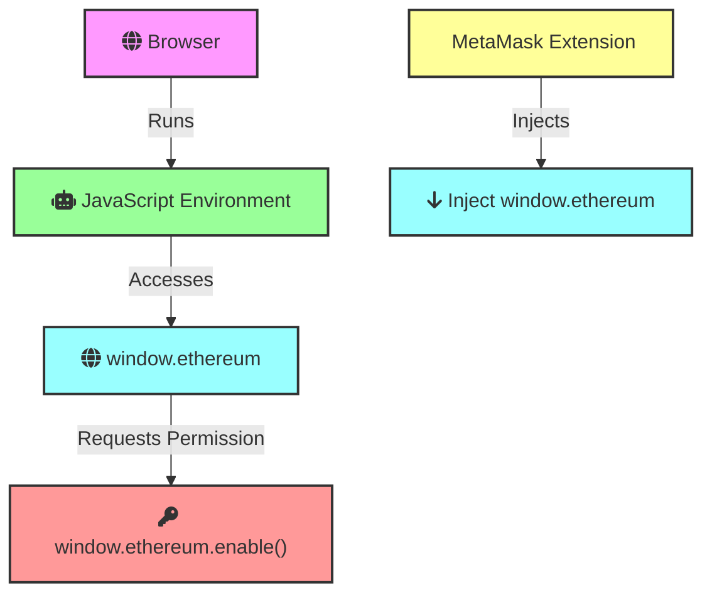
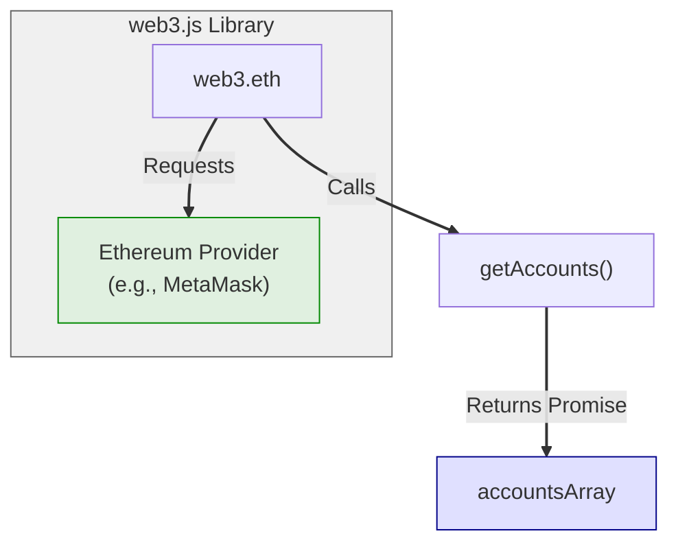
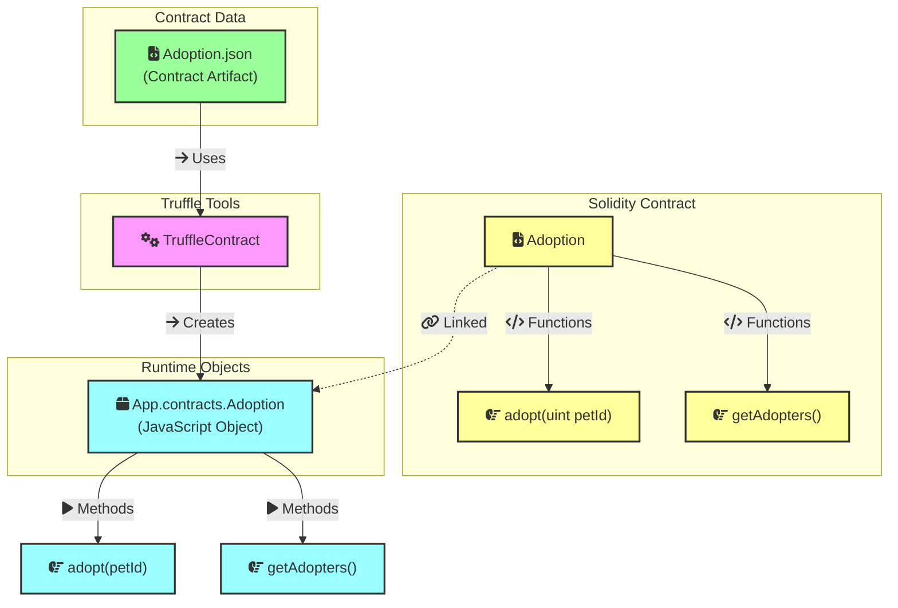
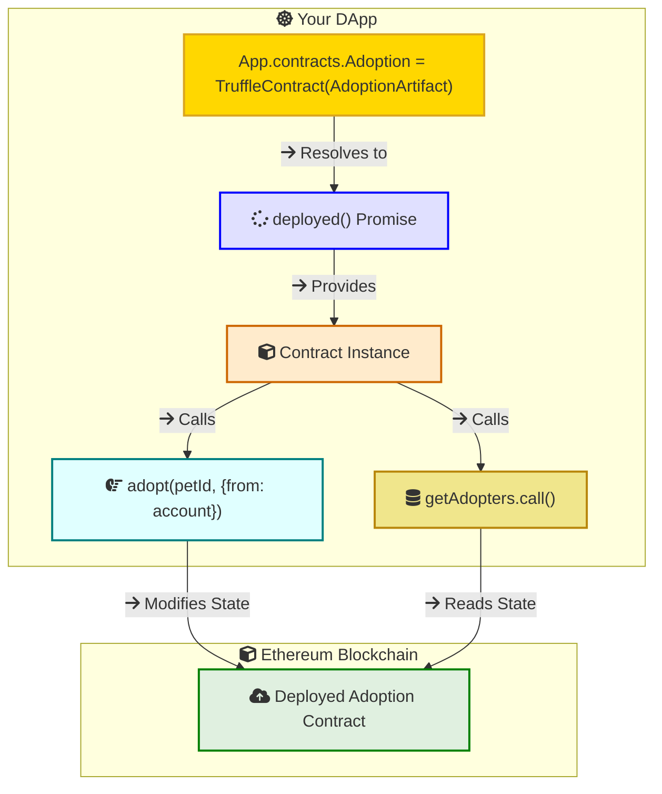
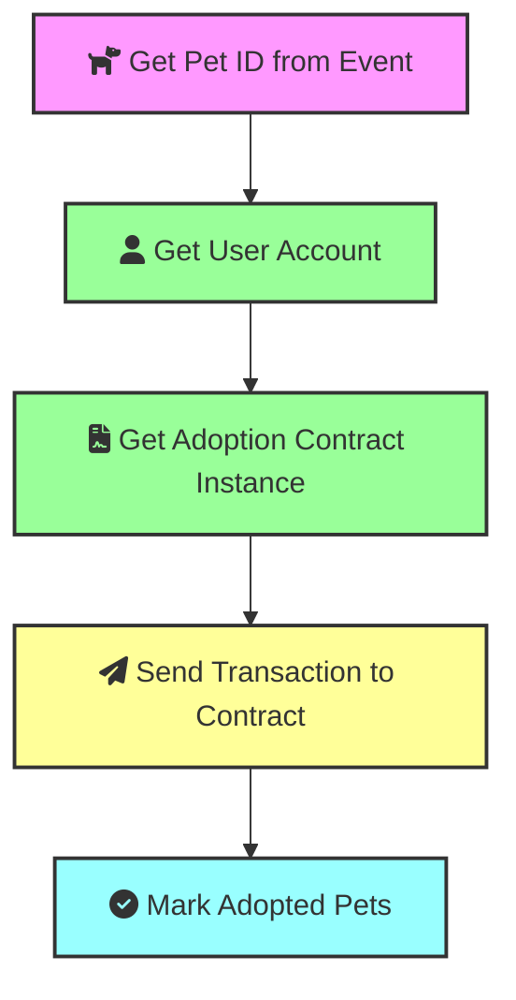

In this post, we will explore the Truffle Pet Shop interface and the underlying code that powers it. The Truffle Pet Shop is a sample decentralized application (DApp) that showcases how to interact with smart contracts on the Ethereum blockchain. We will look at the key components of the interface and the JavaScript code that connects the frontend to the blockchain.

## About the Pet Shop Tutorial

The Truffle Pet Shop tutorial is a great place to start learning about Ethereum development. It's a simple dApp that allows users to adopt pets. 

Previously, we covered the smart contract development part of the tutorial. In this post, we will focus on the frontend interface and the JavaScript code that interacts with the smart contract.


## window.ethereum object



The window.ethereum object is injected into the browser's window object by Ethereum-enabled browser extensions or wallets. The most common example is MetaMask. The extension injects the window.ethereum object into the global scope of your browser's JavaScript environment. This makes the object available for your web applications (like DApps) to use.

`window.ethereum.enable()` to request permission from the user to connect their Ethereum accounts to the DApp

## web3.eth.getAccounts() 
The `web3.eth` module provides functions to interact with the Ethereum blockchain, including account management, transaction handling, and smart contract interaction.




   - **Purpose:** Retrieves Ethereum addresses that the user has authorized your dapp to access.
   - **Returns:** A Promise that resolves to an array of strings (Ethereum addresses).
   - **Example:**
     ```javascript
     web3.eth.getAccounts().then(accounts => {
       // Use accounts[0] as the user's address
     });
     ```

## TruffleContract() Function



- **Purpose:** The `TruffleContract()` function is a utility provided by the Truffle framework. It takes a contract artifact as input and creates a JavaScript object that represents your smart contract.

- **What It Does:**
    - **Loads ABI:** It parses the ABI from the artifact, allowing your DApp to understand how to interact with the contract's functions.
    - **Connects to Provider:**  You set a Web3 provider to connect this contract object to an Ethereum node or wallet, enabling communication with the blockchain.
    - **Provides Methods:** It dynamically creates JavaScript methods based on the ABI. These methods match the names of the functions defined in your Solidity contract.  
    
- **Example:**
   ```javascript
    // 'adoptionInstance' now lets you call contract functions
    const adoptionInstance = await App.contracts.Adoption.deployed();
    const adopters = await adoptionInstance.getAdopters.call(); 
   ```

You don't have to manually construct complex data structures for function calls or event subscriptions. Truffle handles the low-level details for you. It hides the complexities of the ABI and bytecode, allowing you to focus on the business logic of your DApp.

## Calling Contract Functions



To get the instance of the contract, you can use the `deployed()` function, which returns a promise that resolves to the contract instance. You can then call the contract functions using the instance.

```js
App.contracts.Adoption.deployed().then(function (instance) {
            // Use the contract instance to call functions
        }
```

To adopt a pet, you can call the `adopt()` function on the contract instance by passing the pet ID and the account address.

```js
adoptionInstance.adopt(petId, {from: account})
```

To read data from the blockchain, you can call the `call()` function on the contract instance. This function is used for reading data from the blockchain and does not require a transaction.

```js
adoptionInstance.getAdopters.call();
```

## Click Adopt Button




```js
App = {
    web3Provider: null,
    contracts: {},
    // ...
    bindEvents: function () {
        $(document).on('click', '.btn-adopt', App.handleAdopt);
    },
    ///..
    handleAdopt: function (event) {
        event.preventDefault();
        var petId = parseInt($(event.target).data('id'));
        var adoptionInstance;
        web3.eth.getAccounts(function (error, accounts) {
            if (error) {
                console.log(error);
            }
            var account = accounts[0];
            App.contracts.Adoption.deployed().then(function (instance) {
                adoptionInstance = instance;

                // Execute adopt as a transaction by sending account
                return adoptionInstance.adopt(petId, {from: account});
            }).then(function (result) {
                return App.markAdopted();
            }).catch(function (err) {
                console.log(err.message);
            });
        });

    }
    ///.
}
```

## Prepare MetaMask Wallet

To interact with the DApp in your browser, follow these steps:

1. **Install and Configure MetaMask:**
   - Install the MetaMask browser extension.
   - Import your wallet using the mnemonic from Ganache.
   - Connect MetaMask to the local blockchain at `http://127.0.0.1:7545`.

2. **Install and Configure lite-server:**
   - Ensure `bs-config.json` includes the `./src` and `./build/contracts` directories.
   - Verify that the `package.json` file has a `dev` script that runs `lite-server`.

3. **Start the DApp:**
   - Run `npm run dev` in your terminal to start the local web server and launch the DApp in your browser. 
   - You can now interact with the DApp using MetaMask and your local blockchain.


## Confirm Adoption Transaction


## Source Code

Full source code for the Truffle Pet Shop tutorial can be found on GitHub here: [Truffle Pet Shop](https://github.com/kelvin-bz/smart-contract-pet-shop)


## References

- The [Truffle Suite](https://archive.trufflesuite.com/guides/pet-shop/)

- [Web3.js Documentation](https://web3js.readthedocs.io/en/v1.3.4/)

