## Fundamentals

```mermaid
graph LR
subgraph Fundamentals["⚡ Fundamentals"]
    runtime["🏃 Runtime"]
    eventdriven["⚡ Event-Driven"]
    eventloop["🔁 Event Loop"]
end
```





- **Runtime** :The environment where your Node.js code execute


- **Event Driven** :Code reacts to events (clicks, network requests, etc.).
  ```javascript
  const EventEmitter = require('events');
  const eventEmitter = new EventEmitter();
  
  eventEmitter.on('start', () => {
    console.log('Event-driven programming');
  });
  
  eventEmitter.emit('start');
  ```

- **Event Loop** : Continuously checks for and processes events.

  ```javascript
  console.log("Start");
  
  setTimeout(() => {
    console.log("Event Loop");
  }, 0);
  
  console.log("End");
  ```

## Event Driven

```mermaid
graph TD
    subgraph eventLoop["🔄 Event Loop"]
    end

    callStack["📚 Call Stack"]
    
    subgraph callbackQueue["fa:fa-lines-leaning Callback Queue"]
        callback1([📞 Callback 1])
        callback2([📞 Callback 2])
    end

    subgraph webAPIs["🌐 APIs"]
        setTimeout["⏳ setTimeout()"]
        fetch["🌐 fetch()"]
        readFile["📂 fs.readFile()"]
    end

    eventLoop --> callStack
    eventLoop --> callbackQueue
    webAPIs --> callbackQueue
    
    style eventLoop fill:#f9f,stroke:#333,stroke-width:2px
    style callStack fill:#ccf,stroke:#f66,stroke-width:2px
    style callbackQueue fill:#ff9,stroke:#333,stroke-width:2px
    style webAPIs fill:#9cf,stroke:#333,stroke-width:2px
```



- **Event Loop**: Continuously checks if the Call Stack  is empty.

  - If empty, it takes the next callback from the Callback Queue.
  - If not empty, it continues checking.
- **Call Stack**: Executes JavaScript code, including callbacks. After execution, control returns to the Event Loop.

- **Callback Queue**: Holds callbacks until they are ready to be executed. Receives callbacks from Web APIs.

- **Web APIs**: Perform asynchronous operations (timers, network requests, etc.). When complete, they add their callbacks to the Callback Queue.


## Asynchronous

```mermaid
graph LR
subgraph Asynchronous["⏱ Asynchronous"]
    callback["📞 Callback"]
    promise["🤝 Promise"]
end
```



- **Callback:** A function passed as an argument to be executed later (after an async operation completes).
  ```javascript
  function fetchData(callback) {
    setTimeout(() => {
      callback('Data received');
    }, 1000);
  }
  
  fetchData((data) => {
    console.log(data);
  });
  ```

- **Promise**: A cleaner way to handle asynchronous results and errors. Prevents callback hell.

  ```javascript
  const fetchData = () => {
    return new Promise((resolve, reject) => {
      setTimeout(() => {
        resolve('Data received');
      }, 1000);
    });
  };
  
  fetchData().then(data => console.log(data));
  ```

## Core Modules

```mermaid
graph LR
subgraph CoreModules["📦 Core Modules"]
    fs["📄 fs (File System)"]
    http["🌐 http"]
    path["🛣️ path"]
    os["🖥️ os"]
    events["🗓️ events"]
end
```





- **fs (File System)** : Interact with the file system.
  ```javascript
  const fs = require('fs');
  fs.writeFileSync('example.txt', 'Hello, Node.js');
  ```

- **http** : Create web servers.
  ```javascript
  const http = require('http');
  const server = http.createServer((req, res) => {
    res.end('Hello, World!');
  });
  
  server.listen(3000);
  ```

- **path** : Work with file and directory paths.
  ```javascript
  const path = require('path');
  console.log(path.join(__dirname, 'example.txt'));
  ```

- **os** : Get operating system information.
  ```javascript
  const os = require('os');
  console.log(os.platform());
  ```

- **events**: Create and manage custom events.
  ```javascript
  const EventEmitter = require('events');
  const eventEmitter = new EventEmitter();
  eventEmitter.on('greet', () => console.log('Hello, Event!'));
  eventEmitter.emit('greet');
  ```

## Modules

```mermaid
graph LR
subgraph Modules["📥 Modules"]
    import["🔽 import"]
    export["🔼 export"]
end
```





- **Import/Export** : Way to define and use reusable code
  ```javascript
  // module.js
  const message = 'Hello, Export!';
  module.exports = message;

  // main.js
  const message = require('./module');
  console.log(message);
  ```

## Globals

```mermaid
graph LR
subgraph Globals["🌐 Globals"]
    process["⚙️ process"]
    dirname["📁 __dirname"]
    filename["📄 __filename"]
end
```





- **process** : Information about the current Node.js process
  ```javascript
  console.log(process.platform);
  ```

- **__dirname** : Absolute path of the current directory
  ```javascript
  console.log(__dirname);
  ```

- **__filename** : Absolute path of the current file
  ```javascript
  console.log(__filename);
  ```

## Data

```mermaid
graph LR
subgraph Data["🗃️ Data Handling in Node.js"]
    buffer["📦 Buffer"]
    stream["🌊 Stream"]
end

buffer --> smallFile["📄 Small Files"]
buffer --> fullAccess["🔍 Full File Access"]
buffer --> simplicity["🧩 Simplicity"]
stream --> largeFile["📚 Large Files"]
stream --> networkData["🌐 Network Data"]
stream --> realTime["⏳ Real-Time Processing"]

style buffer fill:#f9f,stroke:#333,stroke-width:2px
style stream fill:#ccf,stroke:#f66,stroke-width:2px
style smallFile fill:#ff9,stroke:#333,stroke-width:2px
style largeFile fill:#9cf,stroke:#333,stroke-width:2px
style networkData fill:#f66,stroke:#333,stroke-width:2px
style realTime fill:#ccc,stroke:#333,stroke-width:2px
style fullAccess fill:#e6b8af,stroke:#333,stroke-width:2px
style simplicity fill:#d8bfd8,stroke:#333,stroke-width:2px

```




**Buffer**: Represents raw binary data (e.g., images, audio).

* **Suitable for small files:** If you're working with small files that easily fit in memory, using buffers can be simpler and more convenient.
* **Full file access:** When you read a file into a buffer, you have immediate access to the entire file contents, making it easy to perform operations on the whole data set.
* **Simplicity:** Working with buffers is often more straightforward for simple use cases where you don't need the advanced features of streams.

  ```javascript
  const buffer = Buffer.from('Hello');
  console.log(buffer.toString());
  ```

**Stream** : Efficiently read or write large amounts of data in chunks.
  ```javascript
  const fs = require('fs');
  const readStream = fs.createReadStream('example.txt');
  readStream.on('data', chunk => {
    console.log(chunk.toString());
  });
  ```


* **Ideal for large files:** Streams are designed to handle large amounts of data efficiently. They read the file in chunks, so you don't have to load the entire file into memory at once. This is crucial when dealing with files that might be too big to fit comfortably in memory.
* **Processing data on-the-fly:** Streams allow you to process the file data as it's being read. This is useful if you need to transform, filter, or modify the data without waiting for the entire file to be loaded.
* **Memory efficiency:** Since streams work with smaller chunks of data, they consume significantly less memory compared to loading the entire file into a buffer.
* **Network operations:** Streams are commonly used for network operations, as data is typically transmitted over the network in chunks.


## Error Handling

```mermaid
graph LR
subgraph Error["⚠️ Error Handling"]
    catch["🚫 catch"]
    errorfirst["🚨 Error-First"]
end
```





- **Catch** : Handle errors using try-catch blocks.
  ```javascript
  try {
    throw new Error('Something went wrong');
  } catch (error) {
    console.log(error.message);
  }
  ```

- **Error-First** : Convention where callbacks take an error as the first argument.
  ```javascript
  const fs = require('fs');
  fs.readFile('nonexistentfile.txt', (err, data) => {
    if (err) {
      console.error(err);
    } else {
      console.log(data);
    }
  });
  ```


## Keywords To Remember

```mermaid
graph LR

subgraph Fundamentals["⚡ Fundamentals"]
    runtime["🏃 Runtime"]
    eventdriven["⚡ Event-Driven"]
    eventloop["🔁 Event Loop"]
    
end

subgraph Asynchronous["⏱ Asynchronous"]
    callback["📞 Callback"]
    promise["🤝 Promise"]
end

subgraph CoreModules["📦 Core Modules"]
    fs["📄 fs (File System)"]
    http["🌐 http"]
    path["🛣️ path"]
    os["🖥️ os"]
    events["🗓️ events"]
end

subgraph Modules["📥 Modules"]
    import["🔽 import"]
    export["🔼 export"]
end

subgraph Globals["🌐 Globals"]
    process["⚙️ process"]
    dirname["📁 __dirname"]
    filename["📄 __filename"]
end

subgraph Data["📄 Data"]
    buffer["📦 Buffer"]
    stream["🌊 Stream"]
end

subgraph Error["⚠️ Error Handling"]
    catch["🚫 catch"]
    errorfirst["🚨 Error-First"]
end
```


