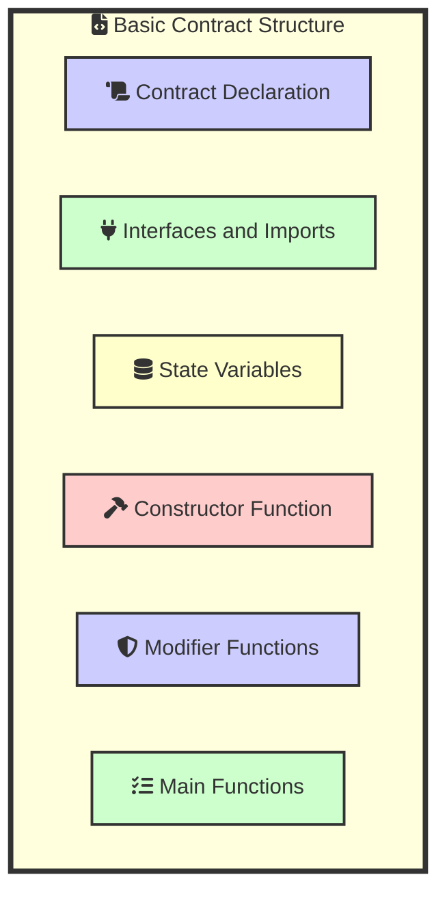
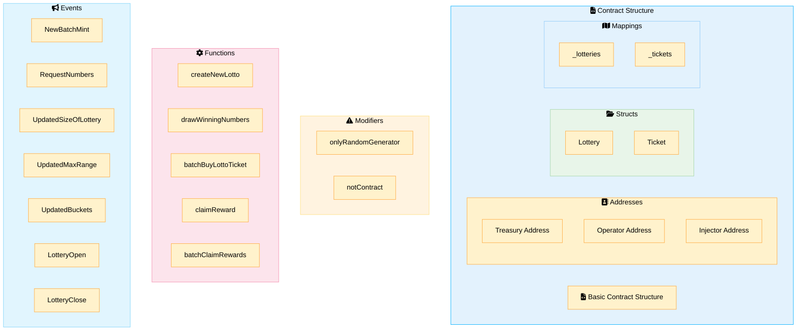
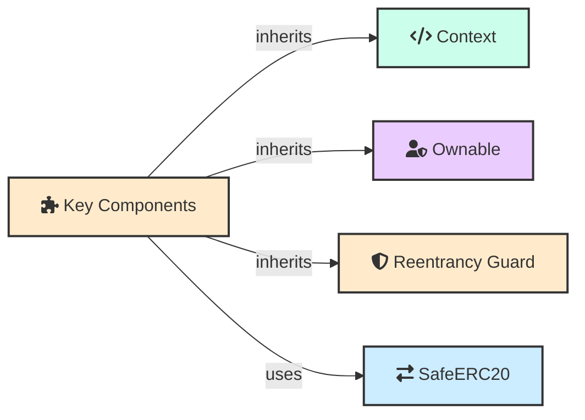
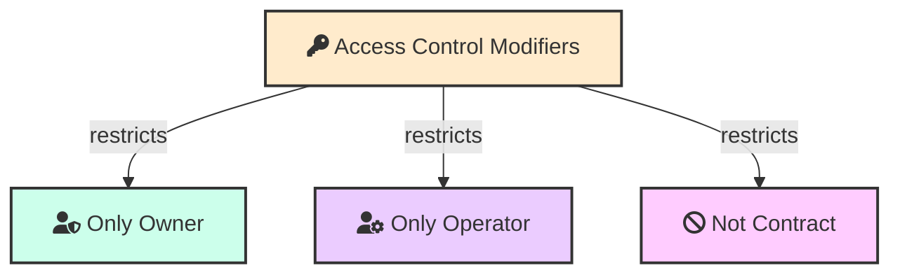
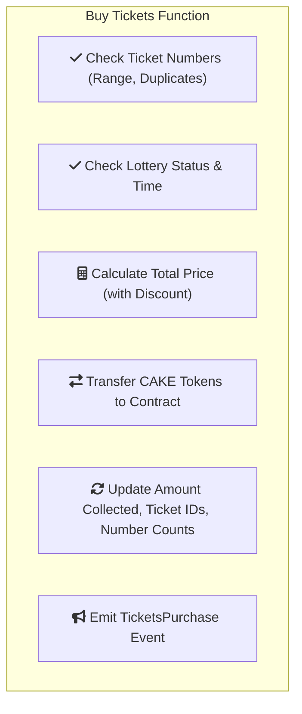
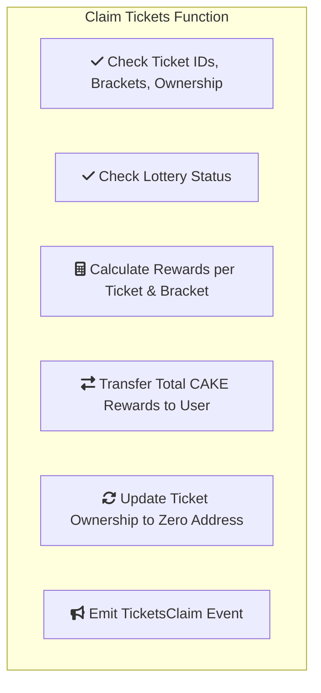
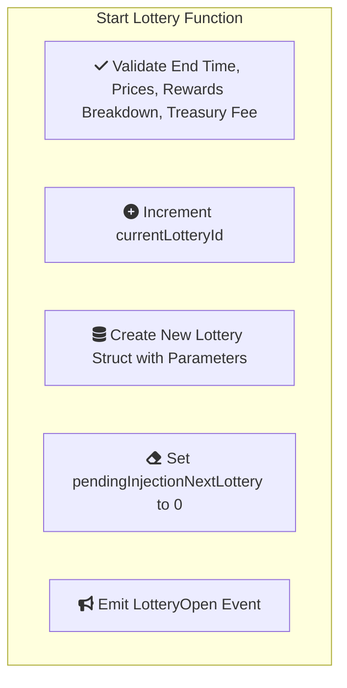
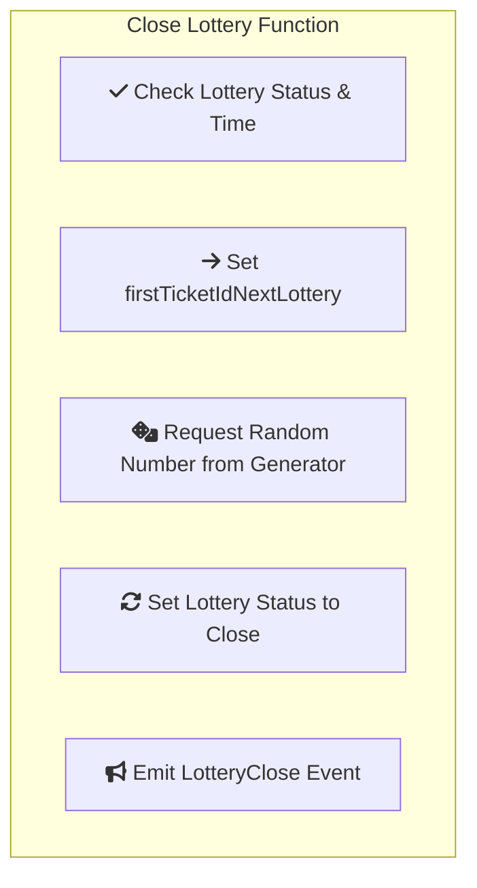
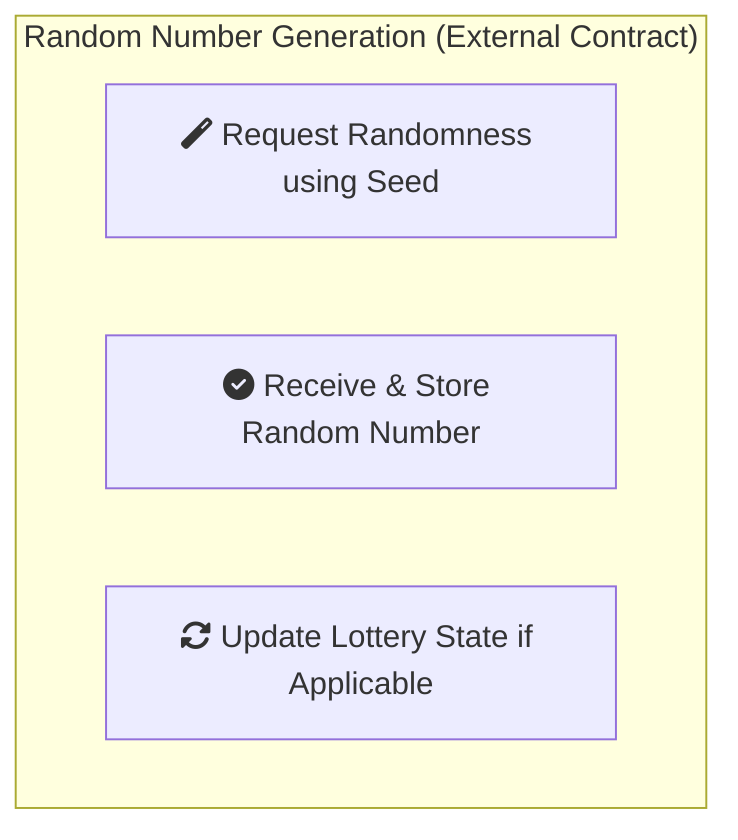
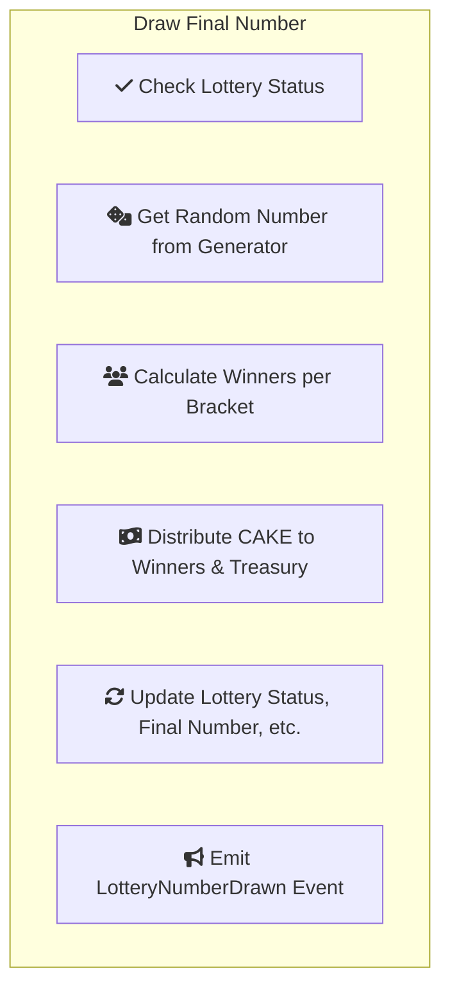

### Overview of the PancakeSwap Lottery Contract

#### Introduction to PancakeSwap Lottery

The PancakeSwap lottery contract is a decentralized application (dApp) that allows users to participate in a lottery system using the Binance Smart Chain (BSC). The contract is designed to be transparent, secure, and fair, providing users with an opportunity to win rewards based on their ticket purchases.

The contract code [https://bscscan.com/address/0x5af6d33de2ccec94efb1bdf8f92bd58085432d2c#code](https://bscscan.com/address/0x5af6d33de2ccec94efb1bdf8f92bd58085432d2c#code)


#### Basic Structure of the Contract








##### ReentrancyGuard

Reentrancy is a type of attack where a malicious contract can repeatedly call a function within your contract before that function has finished executing. This can disrupt the expected flow of your contract's logic and potentially allow attackers to drain funds or manipulate data.

```js
abstract contract ReentrancyGuard {
    uint256 private constant _NOT_ENTERED = 1;
    uint256 private constant _ENTERED = 2;

    uint256 private _status;

    constructor() {
        _status = _NOT_ENTERED;
    }

    modifier nonReentrant() {
        require(_status != _ENTERED, "ReentrancyGuard: reentrant call");
        _status = _ENTERED;
        _;
        _status = _NOT_ENTERED;
    }
}
```

The ReentrancyGuard contract offers a simple yet effective mechanism to prevent reentrancy attacks. It works like a lock that ensures only one function call can be active at a time.

   **`nonReentrant` Modifier:**
   - This is the core of the protection mechanism. It's a modifier that you can attach to functions that you want to safeguard against reentrancy.
   - **Before entering the function:**
      - It checks if `_status` is NOT `_ENTERED`. This means no other function is running, so it's safe to proceed.
      - It sets `_status` to `_ENTERED` to lock the contract, preventing re-entry.
   - **After the function's code (`_;`) executes:**
      - It resets `_status` to `_NOT_ENTERED`, unlocking the contract for further calls.

**Code Wrapping**: When you attach a modifier to a function in Solidity, the compiler doesn't simply call the modifier function before or after the main function. Instead, it wraps the code of your function within the modifier's code.

Similar concept in javascript

```js
function nonReentrant(originalFunction) {
  return async function (...args) {
    if (this._status === 'ENTERED') {
      throw new Error('Reentrancy detected');
    }
    this._status = 'ENTERED';
    try {
      await originalFunction.apply(this, args);
    } finally {
      this._status = 'NOT_ENTERED';
    }
  };
}

myProtectedFunction = nonReentrant(myProtectedFunction);

```


##### SafeERC20

```js
library SafeERC20 {
    using Address for address;

    function safeTransfer(IERC20 token, address to, uint256 value) internal {
        _callOptionalReturn(token, abi.encodeWithSelector(token.transfer.selector, to, value));
    }

    function safeTransferFrom(IERC20 token, address from, address to, uint256 value) internal {
        _callOptionalReturn(token, abi.encodeWithSelector(token.transferFrom.selector, from, to, value));
    }

    function _callOptionalReturn(IERC20 token, bytes memory data) private {
        bytes memory returndata = address(token).functionCall(data, "SafeERC20: low-level call failed");
        if (returndata.length > 0) {
            require(abi.decode(returndata, (bool)), "SafeERC20: ERC20 operation did not succeed");
        }
    }
}
```

### State Variables 


```mermaid
graph LR
    subgraph  [" "]
        subgraph lotteriesDetails["fa:fa-database Lotteries"]
        lotteries["fa:fa-database Mapping(uint256 => Lottery)"]
        end

        subgraph ticketsDetails["fa:fa-ticket Tickets"]
        tickets["fa:fa-ticket Mapping(uint256 => Ticket)"]
        end

        subgraph addressesDetails["fa:fa-address-book Addresses"]
        injectorAddress["fa:fa-user-secret Injector Address"]
        operatorAddress["fa:fa-user-cog Operator Address"]
        treasuryAddress["fa:fa-piggy-bank Treasury Address"]
        end

        subgraph parametersDetails["fa:fa-sliders-h Parameters"]
        currentLotteryId["fa:fa-id-card Current Lottery ID"]
        currentTicketId["fa:fa-ticket-alt Current Ticket ID"]
        maxNumberTicketsPerBuyOrClaim["fa:fa-sort-numeric-up Max Tickets Per Buy/Claim"]
        maxPriceTicketInCake["fa:fa-money-check-alt Max Price Ticket in CAKE"]
        minPriceTicketInCake["fa:fa-money-bill-wave Min Price Ticket in CAKE"]
        pendingInjectionNextLottery["fa:fa-arrow-alt-circle-right Pending Injection Next Lottery"]
        end

        lotteriesDetails
        ticketsDetails
        addressesDetails
        parametersDetails

        style lotteriesDetails fill:#ccffeb,stroke:#333,stroke-width:2px
        style ticketsDetails fill:#ebccff,stroke:#333,stroke-width:2px
        style addressesDetails fill:#ffccff,stroke:#333,stroke-width:2px
        style parametersDetails fill:#ccf2ff,stroke:#333,stroke-width:2px

        style lotteries fill:#ccffeb,stroke:#333,stroke-width:2px
        style tickets fill:#ebccff,stroke:#333,stroke-width:2px
        style injectorAddress fill:#ffccff,stroke:#333,stroke-width:2px
        style operatorAddress fill:#ffccff,stroke:#333,stroke-width:2px
        style treasuryAddress fill:#ffccff,stroke:#333,stroke-width:2px
        style currentLotteryId fill:#ccf2ff,stroke:#333,stroke-width:2px
        style currentTicketId fill:#ccf2ff,stroke:#333,stroke-width:2px
        style maxNumberTicketsPerBuyOrClaim fill:#ccf2ff,stroke:#333,stroke-width:2px
        style maxPriceTicketInCake fill:#ccf2ff,stroke:#333,stroke-width:2px
        style minPriceTicketInCake fill:#ccf2ff,stroke:#333,stroke-width:2px
        style pendingInjectionNextLottery fill:#ccf2ff,stroke:#333,stroke-width:2px
    end
```

###  Modifiers

#### Access Control Modifiers

Access control modifiers are essential in smart contracts to ensure that only authorized users can execute certain functions. In the PancakeSwap lottery contract, there are three main access control modifiers: `onlyOwner`, `onlyOperator`, and `notContract`.

- **`onlyOwner` Modifier**: Restricts access to the owner of the contract.
- **`onlyOperator` Modifier**: Restricts access to the designated operator address.
- **`notContract` Modifier**: Restricts access to non-contract addresses (prevents contracts from interacting with certain functions).

Here's a detailed explanation of each modifier along with a visual representation:




1. **`onlyOperator` Modifier**
    ```solidity
    modifier onlyOperator() {
        require(msg.sender == operatorAddress, "Not operator");
        _;
    }
    ```
    This modifier restricts access to the operator address. The operator is a designated address that has permission to perform specific operational functions within the contract.

2. **`notContract` Modifier**
    ```solidity
    modifier notContract() {
        require(!_isContract(msg.sender), "Contract not allowed");
        require(msg.sender == tx.origin, "Proxy contract not allowed");
        _;
    }

    function _isContract(address _addr) internal view returns (bool) {
        uint256 size;
        assembly {
            size := extcodesize(_addr)
        }
        return size > 0;
    }
    ```
    This modifier ensures that only externally owned accounts (EOAs) can call the function, preventing other contracts from interacting with it. This is useful for preventing automated interactions and ensuring that functions are called by real users.

#### Who is the Operator?

The operator is an address with specific permissions to manage certain aspects of the lottery contract. This address is typically set by the owner and can perform functions like starting and closing lotteries, injecting funds, and drawing numbers.

- **Code Snippet for Setting the Operator:**
    ```solidity
    address public operatorAddress;

    function setOperator(address _operatorAddress) external onlyOwner {
        require(_operatorAddress != address(0), "Cannot be zero address");
        operatorAddress = _operatorAddress;
    }
    ```

- **Functions Restricted to the Operator:**
    - `startLottery`
    - `closeLottery`
    - `drawFinalNumberAndMakeLotteryClaimable`

These access control mechanisms are crucial for maintaining the integrity and security of the PancakeSwap lottery contract, ensuring that only authorized parties can perform critical operations.

Absolutely! Here are the updated Mermaid diagrams, removing the root nodes and using subgraphs instead, as per your request:

### Core Functions

#### Buying Tickets



#### Claiming Tickets




#### Starting a Lottery



#### Closing a Lottery




#### Random Number Generation



#### Drawing the Winning Number



