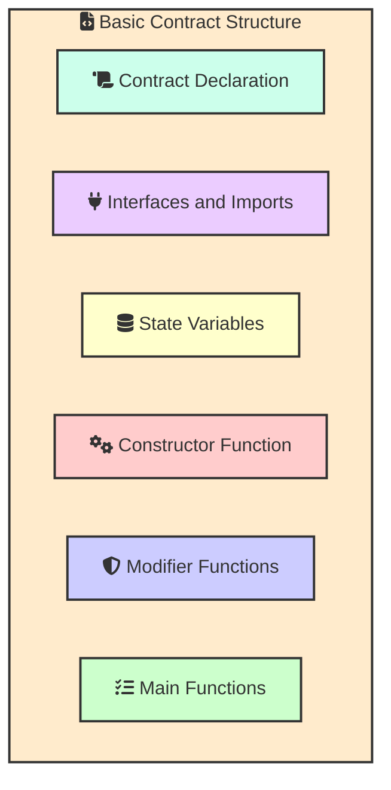
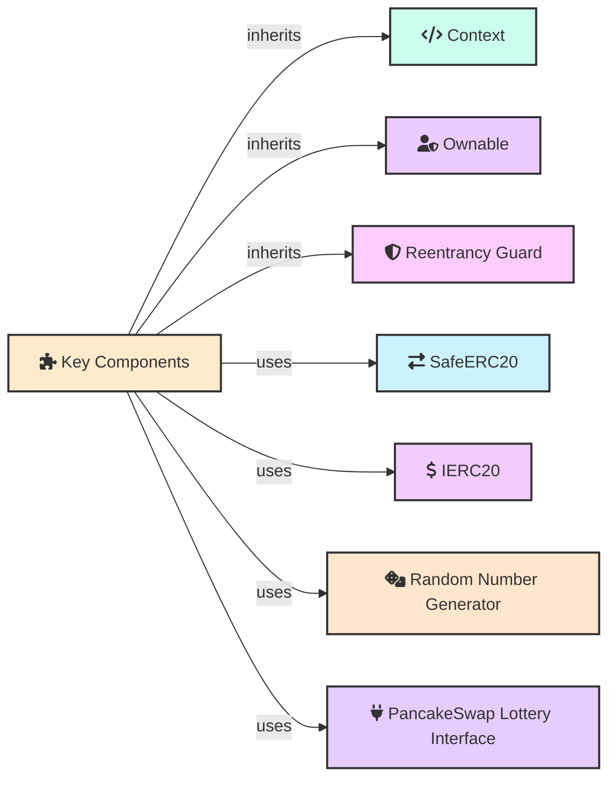
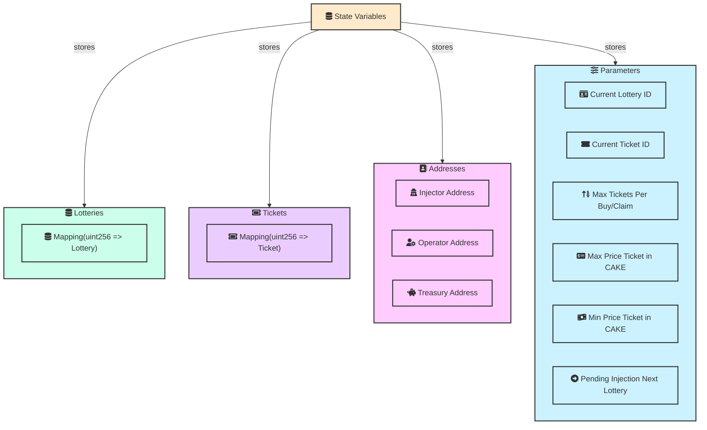
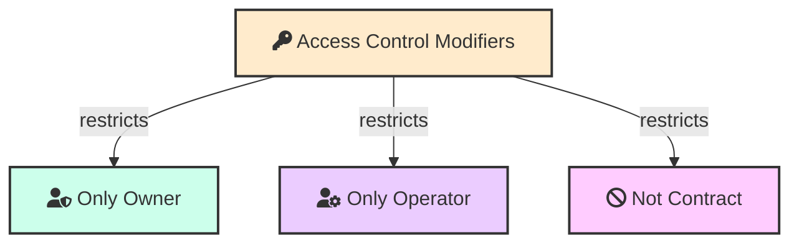
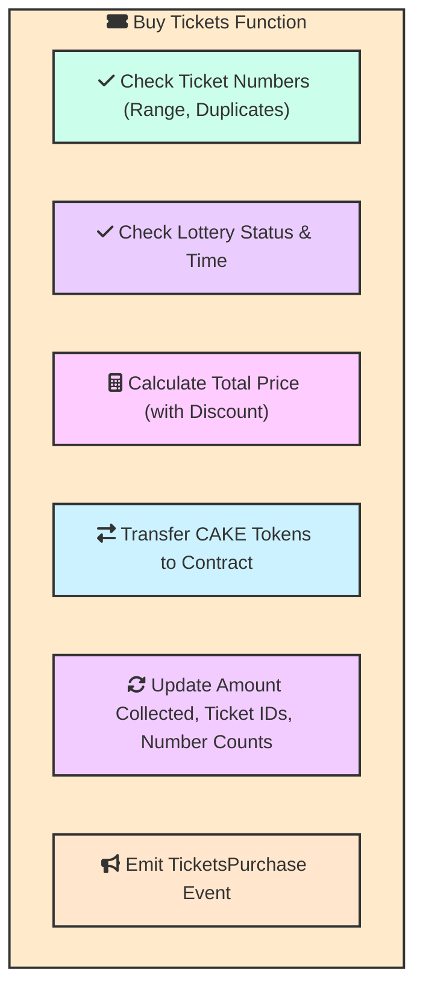

## Basic Contract Structure
This diagram gives a high-level overview of the PancakeSwap Lottery contract's structure, including its key components.

## Key Components
This diagram shows the key components inherited and used by the PancakeSwap Lottery contract.

## State Variables
This diagram details the state variables used in the contract, organized into relevant categories.

## Access Control Modifiers
This diagram shows the access control modifiers and their associated access restrictions.

## Buy Tickets Function
This diagram details the steps involved in the `buyTickets` function.

These diagrams provide a comprehensive overview of the PancakeSwap Lottery contract, from its basic structure to detailed functionalities.