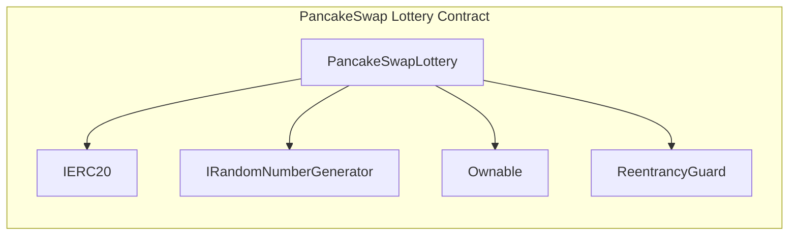
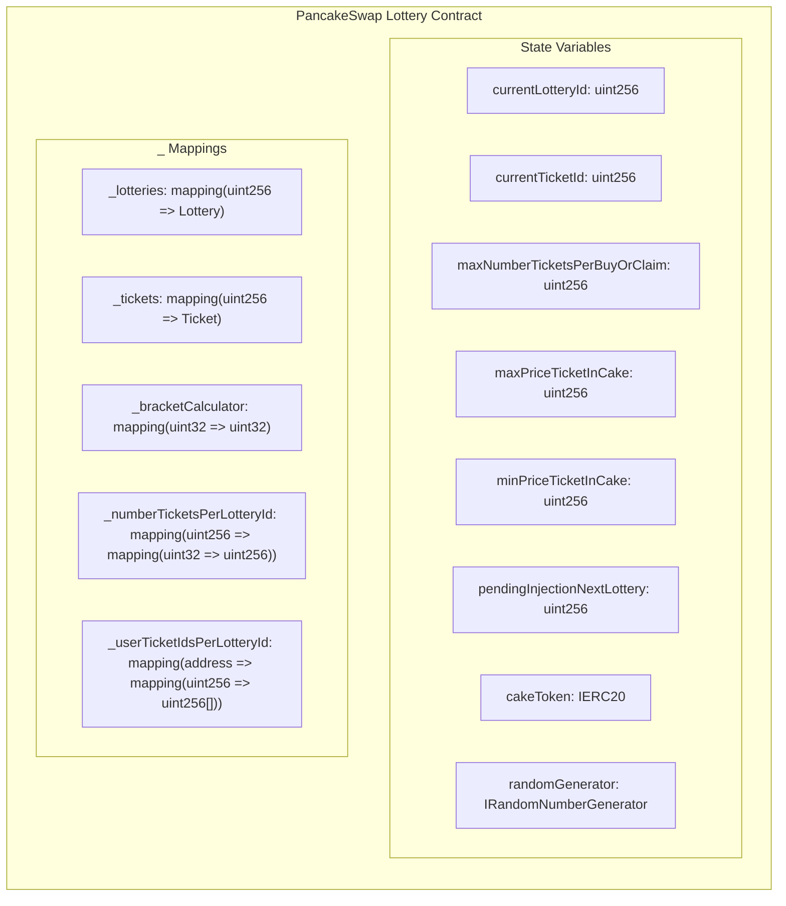
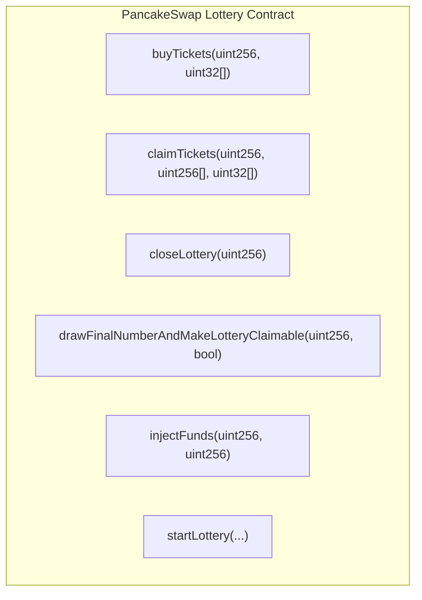
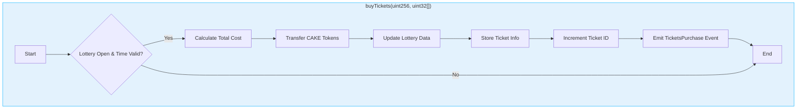
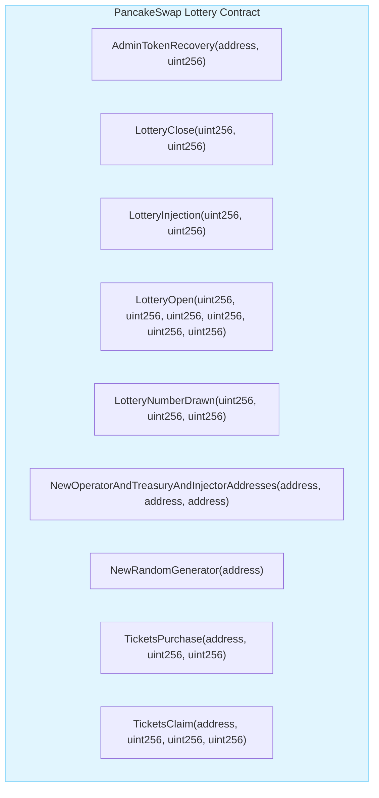
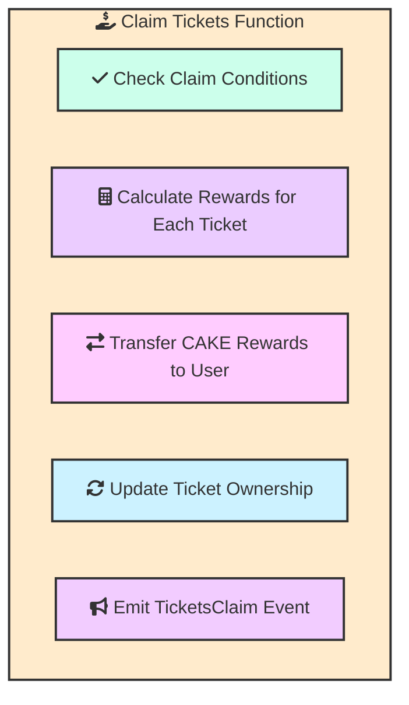
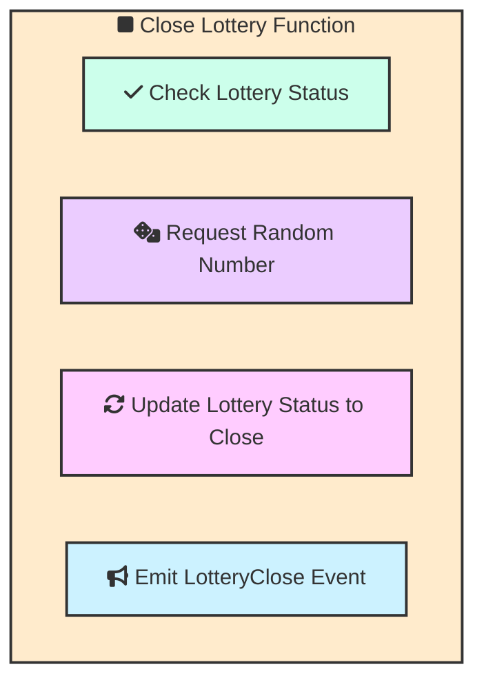
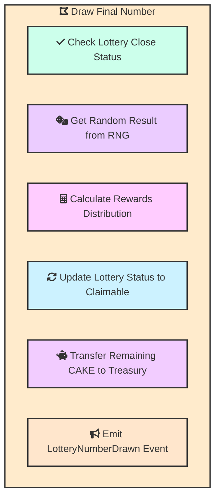
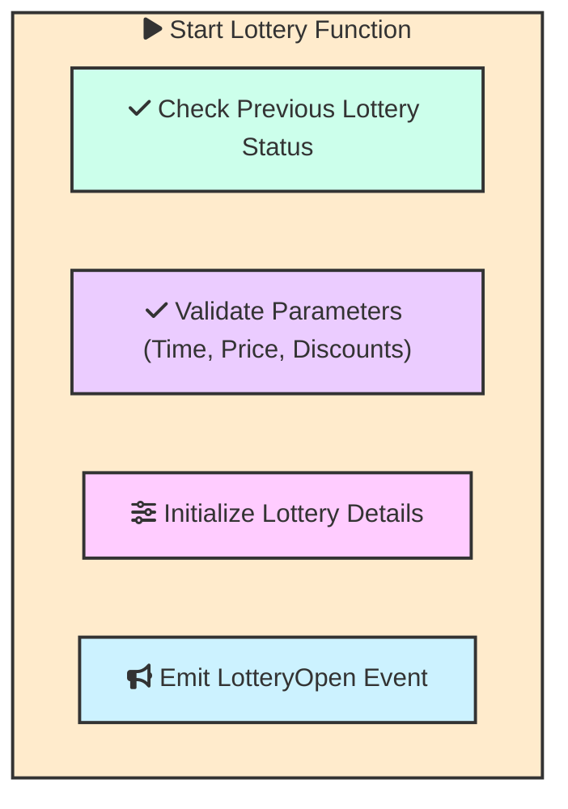
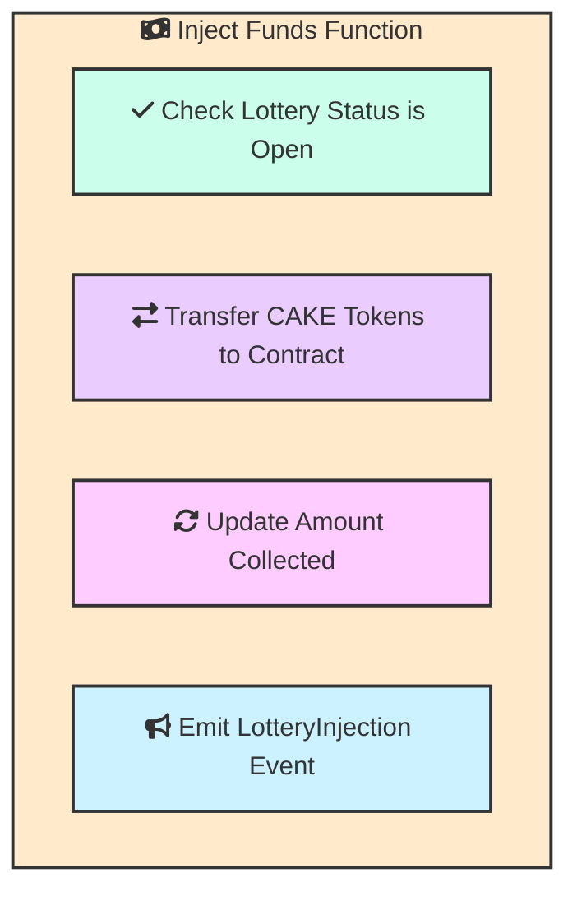

Absolutely! Let's recreate the progression of Mermaid diagrams for the PancakeSwap Lottery contract, this time using headers and improved styling:

## Core Contract Structure

This diagram visually represents the `PancakeSwapLottery` contract inheriting from the `Ownable` and `ReentrancyGuard` contracts and using the `IERC20` and `IRandomNumberGenerator` interfaces.

## State Variables and Mappings

The above diagram now shows the key state variables (e.g., `currentLotteryId`, `cakeToken`) and the mappings (e.g., `_lotteries`, `_tickets`) that store the lottery data and user information.

## Function Overview

This updated diagram displays the main functions of the `PancakeSwapLottery` contract, providing a clear overview of the contract's capabilities.

## Function Flow: `buyTickets`

This flowchart details the `buyTickets` function's execution flow, from checking if the lottery is open to emitting an event upon successful ticket purchase.

## Events

## Claim Tickets Function
This diagram details the steps involved in the `claimTickets` function.

## Close Lottery Function
This diagram details the steps involved in the `closeLottery` function.

## Draw Final Number Function
This diagram details the steps involved in the `drawFinalNumberAndMakeLotteryClaimable` function.

## Start Lottery Function
This diagram details the steps involved in the `startLottery` function.

## Inject Funds Function
This diagram details the steps involved in the `injectFunds` function.

