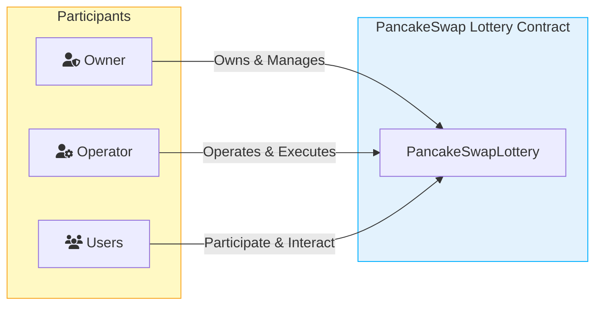
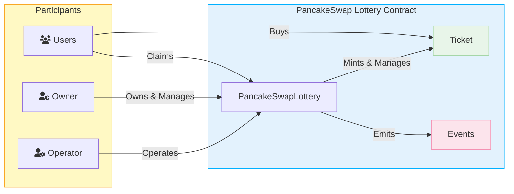
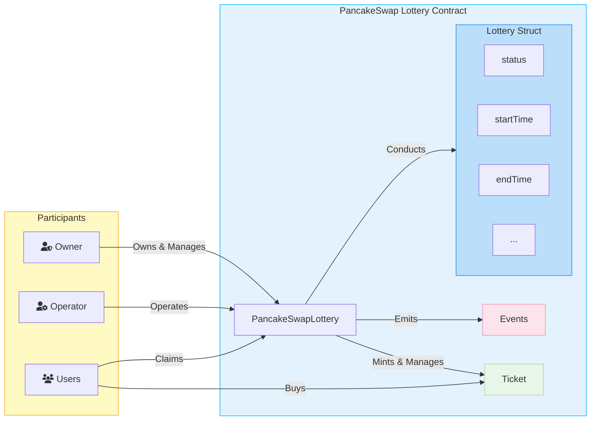
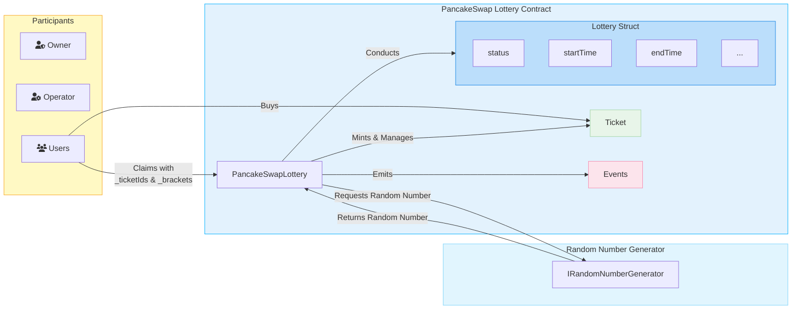

## Participants

```mermaid
graph LR
    subgraph Contract["PancakeSwap Lottery Contract"]
        PancakeSwapLottery["PancakeSwapLottery"]
    end

    subgraph Participants["Participants"]
        owner["fa:fa-user-shield Owner"]
        operator["fa:fa-user-cog Operator"]
        users["fa:fa-users Users"]
    end
    
    owner --> |Owns & Manages| PancakeSwapLottery
    operator --> |Operates & Executes| PancakeSwapLottery
    users --> |Participate & Interact| PancakeSwapLottery

    style Contract fill:#e3f2fd,stroke:#00b0ff
    style Participants fill:#fff9c4,stroke:#f9a825

```

## Tickets

```mermaid
graph LR
    subgraph Contract["PancakeSwap Lottery Contract"]
        PancakeSwapLottery["PancakeSwapLottery"]
        
        Ticket["Ticket"]
        Events["Events"]
    end

    subgraph Participants["Participants"]
        owner["fa:fa-user-shield Owner"]
        operator["fa:fa-user-cog Operator"]
        users["fa:fa-users Users"]
    end

    users --> |Buys| Ticket
    users --> |Claims| PancakeSwapLottery
    PancakeSwapLottery --> |Mints & Manages| Ticket
    PancakeSwapLottery --> |Emits| Events

    owner --> |Owns & Manages| PancakeSwapLottery
    operator --> |Operates| PancakeSwapLottery

    style Contract fill:#e3f2fd,stroke:#00b0ff
    style Participants fill:#fff9c4,stroke:#f9a825
    style Ticket fill:#e8f5e9,stroke:#a5d6a7
    style Events fill:#fce4ec,stroke:#f48fb1
```

## Lottery

```mermaid
graph LR
    subgraph Contract["PancakeSwap Lottery Contract"]
        PancakeSwapLottery["PancakeSwapLottery"]
        
        Ticket["Ticket"]
        Events["Events"]

        subgraph Lottery["Lottery Struct"]
            direction LR
            LotteryStatus["status"]
            StartTime["startTime"]
            EndTime["endTime"]
            ...
        end
    end

    subgraph Participants["Participants"]
        owner["fa:fa-user-shield Owner"]
        operator["fa:fa-user-cog Operator"]
        users["fa:fa-users Users"]
    end

   
    users --> |Buys| Ticket
    users --> |Claims| PancakeSwapLottery
    PancakeSwapLottery --> |Mints & Manages| Ticket
    PancakeSwapLottery --> |Emits| Events
    PancakeSwapLottery --> |Conducts| Lottery

    owner --> |Owns & Manages| PancakeSwapLottery
    operator --> |Operates| PancakeSwapLottery

    style Contract fill:#e3f2fd,stroke:#00b0ff
    style Participants fill:#fff9c4,stroke:#f9a825
    style Ticket fill:#e8f5e9,stroke:#a5d6a7
    style Events fill:#fce4ec,stroke:#f48fb1
    style Lottery fill:#bbdefb,stroke:#1e88e5
```

## Random Number Generator

```mermaid
graph LR
    subgraph Contract["PancakeSwap Lottery Contract"]
        PancakeSwapLottery["PancakeSwapLottery"]
        
        Ticket["Ticket"]
        Events["Events"]

        subgraph Lottery["Lottery Struct"]
            LotteryStatus["status"]
            StartTime["startTime"]
            EndTime["endTime"]
            ...
        end
    end

    subgraph Participants["Participants"]
        owner["fa:fa-user-shield Owner"]
        operator["fa:fa-user-cog Operator"]
        users["fa:fa-users Users"]
    end

    subgraph RNG["Random Number Generator"]
        RNGContract["IRandomNumberGenerator"]
    end


    users --> |Buys| Ticket
    users --> |Claims with\n_ticketIds & _brackets| PancakeSwapLottery
    PancakeSwapLottery --> |Mints & Manages| Ticket
    PancakeSwapLottery --> |Emits| Events
    PancakeSwapLottery --> |Conducts| Lottery
    PancakeSwapLottery --> |Requests Random Number| RNGContract
    RNGContract --> |Returns Random Number| PancakeSwapLottery


    style Contract fill:#e3f2fd,stroke:#00b0ff
    style Participants fill:#fff9c4,stroke:#f9a825
    style Ticket fill:#e8f5e9,stroke:#a5d6a7
    style Events fill:#fce4ec,stroke:#f48fb1
    style Lottery fill:#bbdefb,stroke:#1e88e5
    style RNG fill:#e1f5fe,stroke:#81d4fa
```