## Security Vulnerabilities
### Cors

Cross-Origin Resource Sharing (CORS) is a mechanism that uses additional HTTP headers to tell browsers to give a web application running at one origin, access to selected resources from a different origin. A web application makes a cross-origin HTTP request when it requests a resource that has a different origin (domain, protocol, and port) than its own origin.

For example a client from `http://domain-a.com` makes a request to `http://domain-b.com`. The browser will block the request unless the server at `http://domain-b.com` sends the appropriate headers to allow the request.

### CSRF
Cross-Site Request Forgery (CSRF) is an attack that tricks the victim into submitting a malicious request. The user is authenticated. The attacker tricks the user into clicking a link or visiting a page that contains a hidden request.

```mermaid
sequenceDiagram
    participant Attacker as 🦹 Attacker
    participant Victim as 👤 Victim's Browser
    participant Bank as 🏦 Bank

    Attacker->>Victim: Sends malicious link/email
    Note right of Victim: User clicks the link/visits page
    Victim->>Bank: Sends forged request with credentials
    Note left of Bank: Authenticated request<br/>appears legitimate
    Bank-->>Victim: Response (e.g., action confirmation)
    Bank-->>Attacker: Performs action (e.g., money transfer)

    Note over Attacker,Bank: CSRF Attack Completed

```

To prevent CSRF attacks, use CSRF tokens. A CSRF token is a unique, random value that is generated for each user session. It is included in the form or request and validated by the server to ensure that the request is legitimate. 
 

### XSS

Cross-Site Scripting (XSS) is a security vulnerability that allows an attacker to inject malicious scripts into web pages viewed by other users. This can be used to steal sensitive information, such as cookies, or to perform actions on behalf of the user.

Types of XSS attacks: Stored XSS, Reflected XSS, DOM-based XSS.

The immpact of XSS attacks can be severe, including data theft, session hijacking, and defacement of websites.

```mermaid
graph 
 attacker["fa:fa-user-secret Attacker"]
 subgraph server["fa:fa-server server"]
 style server stroke-width:2px
  script1["fa:fa-code script"]
   sanitization["fa:fa-soap sanitization"]
 end
 
 subgraph browswer["fa:fa-computer browswer"]
  contentSecurityPolicy["👮‍♂️ CSP"]
  subgraph url["fa:fa-chain url"]
  style url fill:#eeffee,stroke:#333,stroke-width:2px
  script2["fa:fa-code script"]
 end

  subgraph dom["fa:fa-tree dom"]
 style dom fill:#eeffee,stroke:#333,stroke-width:2px
  script3["fa:fa-code script"]
 end
 end 


```

To prevent XSS attacks, you should always sanitize user input and escape output. You can also use Content Security Policy (CSP) headers to restrict the sources of content that can be loaded on your page.

## Cookies And Sessions

Cookies are small pieces of data that are stored in the browser. They are sent to the server with every request. Sessions are server-side storage of user data. The session ID is stored in the cookie and is used to retrieve the session data from the server.

```mermaid
graph LR
  subgraph browser["fa:fa-computer browser"]
    style browser  stroke-width:2px
    subgraph cookie["🍪 Cookie "]
        style cookie fill:#eeffee, stroke-width:2px
        sessionId
    end
  end

  subgraph server2["fa:fa-server server"]
    style server2  stroke-width:2px
    session["📁  Session Storage"]
  end

  cookie <-.-> |🍪|server2

  
```

## System Reliability
###  Fault Tolerance

Fault tolerance is the property that enables a system to continue operating properly in the event of the failure of some of its components. It is commonly achieved by redundancy, which means that the system has multiple copies of critical components so that if one fails, another can take over.

```mermaid
graph TD
    
    
   
    subgraph errorHandling["📁 Error Handling"]
      errorDetection["fa:fa-bug Error Detection"]
      errorRecovery["fa:fa-tools Error Recovery"]
      errorDetection --> |"Detects errors"|errorRecovery
    end

 subgraph failover["📁 Failover"]
      primarySystem["fa:fa-hdd Primary System"]
      backupSystem["fa:fa-hdd Backup System"]
      primarySystem --> |"Switches to secondary if primary fails"|backupSystem
    end

    subgraph redundancy["📁 Redundancy"]
      primaryComponent["fa:fa-server Primary Component"]
      secondaryComponent["fa:fa-server Secondary Component"]
      primaryComponent --> |"Monitors and takes over if primary fails"|secondaryComponent
    end

    style redundancy fill:#cce5ee,stroke:#008
    style failover fill:#cce5ff,stroke:#008 
```

### High Availability

High availability is the property that enables a system to continue operating properly for a long period of time without interruption. It is commonly achieved by redundancy, load balancing, and failover mechanisms.

```mermaid
graph TD
    subgraph loadBalancing["📁 Load Balancing"]
      request["fa:fa-paper-plane Request"]
      loadBalancer["fa:fa-balance-scale Load Balancer"]
      server1["fa:fa-server Server 1"]
      server2["fa:fa-server Server 2"]
      server3["fa:fa-server Server 3"]
      request --> |"Distributes requests"|loadBalancer
      loadBalancer --> |"Routes requests to servers"|server1
      loadBalancer --> |"Routes requests to servers"|server2
      loadBalancer --> |"Routes requests to servers"|server3
    end

    subgraph failover["📁 Failover"]
      primarySystem["fa:fa-hdd Primary System"]
      backupSystem["fa:fa-hdd Backup System"]
      primarySystem --> |"Switches to secondary if primary fails"|backupSystem
    end

    subgraph redundancy["📁 Redundancy"]
      primaryComponent["fa:fa-server Primary Component"]
      secondaryComponent["fa:fa-server Secondary Component"]
      primaryComponent --> |"Monitors and takes over if primary fails"|secondaryComponent
    end

    style loadBalancing fill:#cce5ee,stroke:#008
    style failover fill:#cce5ff,stroke:#008
    style redundancy fill:#cce5ff,stroke:#008
```

### Scalability

Scalability is the property that enables a system to handle a growing amount of work or its potential to accommodate growth. It is commonly achieved by adding more resources, such as servers, to the system.

## Cryptography
### Hashing

Hashing is the process of converting an input (e.g. a password) into a fixed-length string of characters. Hash functions are deterministic, meaning that the same input will always produce the same output. They are also one-way, meaning that it is computationally infeasible to reverse the process and obtain the original input from the hash.

### Encryption

Encryption is the process of converting data into a form that is unreadable without the correct key. It is reversible, meaning that the original data can be recovered by decrypting the encrypted data with the key.

## System Design

### Event-Driven Architecture
Event-driven architecture is a software design pattern that promotes the production, detection, consumption of, and reaction to events. It is commonly used to build scalable, loosely coupled systems.

### Pub/Sub
Publish/Subscribe (Pub/Sub) is a messaging pattern where senders of messages (publishers) do not program the messages to be sent directly to specific receivers (subscribers). Instead, the messages are published to topics, without knowledge of what (if any) subscribers there may be.

### Rate Limiting
Rate limiting is a technique used to control the rate of traffic sent or received by a network interface. It is commonly used to prevent abuse of an API by limiting the number of requests that can be made in a given time period.

### Load Balancing

Load balancing is the process of distributing incoming network traffic across multiple servers. It is commonly used to improve the performance, reliability, and scalability of web applications.

## WebHooks
Webhooks are user-defined HTTP callbacks that are triggered by specific events. They are commonly used to integrate external services with web applications.

## Caching
Caching is the process of storing copies of data in a cache to reduce the time it takes to access the data. It is commonly used to improve the performance of web applications by reducing the load on the server.

## Indexing
Indexing is the process of creating an index for a database table to improve the speed of data retrieval. It is commonly used to optimize the performance of database queries.

## OAuth
OAuth is an open standard for access delegation that is commonly used for authentication and authorization. It allows a user to grant a third-party application access to their resources without sharing their credentials.

## Queues
A queue is a data structure that stores elements in a first-in, first-out (FIFO) order. It is commonly used to manage the flow of data between different parts of a system.

## Zero Trust Security
Zero Trust Security is a security model that assumes that threats exist both inside and outside the network. It requires strict identity verification for every person and device trying to access resources on the network.

