## High Traffic E-Commerce Site: Handling Concurrent Requests

```mermaid
graph LR
    subgraph HighTraffic["🛍️ High Traffic Event"]
        MultipleUsers["👥 Multiple Users"]
        SimultaneousRequests["🔃 Simultaneous Requests"]
    end


    subgraph Issues["⚠️ Issues"]
        RaceCondition["🏁 Race Condition"]
        InventoryInaccuracy["❌ Inventory Inaccuracy"]
    end
```



During high-traffic events like Black Friday sales, a large number of customers may attempt to purchase the same product simultaneously, leading to a potential race condition where multiple users could "buy" the last few items, resulting in overselling and inventory inconsistencies.

## Problems

* **Race Condition:** Multiple users try to access and modify the same data (inventory count) simultaneously, leading to incorrect results.
* **Inventory Inaccuracy:**  If not handled properly, more items could be "sold" than are actually available.

## Pessimistic Locking 

This pattern assumes conflicts are likely and takes a cautious approach:


1. **Lock Acquisition:** Before updating inventory, the system acquires an exclusive lock on the product record. If Lock Acquisition fails (due to another process holding the lock), the request can be queued or retried after a delay.
2. **Transaction:**
   * Check available inventory.
   * If sufficient, decrement inventory and complete the purchase.
   * If insufficient, release the lock and inform the user the item is out of stock.
3. **Lock Release:** After the transaction (successful or not), the lock is released, allowing other processes to access the product record.


##  Balance between performance and consistency

Using Pessimistic Locking for high concurrent traffic scenarios like Black Friday sales ensures data consistency but can introduce performance overhead during normal traffic conditions. To balance between performance and consistency, we can apply a hybrid approach using both `Pessimistic` and `Optimistic Locking` strategies based on traffic conditions
Implement a mechanism to monitor traffic and dynamically switch between Optimistic and Pessimistic Locking based on predefined thresholds.

```mermaid
graph 

    subgraph lockingStrategies["fa:fa-shield-alt Locking Strategies"]
        pessimisticLocking["fa:fa-lock Pessimistic Locking"]
        optimisticLocking["fa:fa-unlock-alt Optimistic Locking"]
    end

    subgraph pessimisticLockingFlow["fa:fa-face-frown Pessimistic Locking Flow"]
        pessimisticLocking --> acquireLock["fa:fa-handcuffs Acquire Lock"]
        acquireLock --> readAndModifyData["fa:fa-edit Read/Modify Data"]
        readAndModifyData --> releaseLock["fa:fa-key Release Lock"]
        releaseLock --> commitChanges["fa:fa-check Commit Changes"]
    end

    subgraph optimisticLockingFlow["fa:fa-face-smile Optimistic Locking Flow"]
        optimisticLocking --> readAndModifyData2["fa:fa-eye Read/Modify Data"] --> checkForConflicts["🔥 Check for Conflicts"]
        checkForConflicts --> |"No Conflict"| commitChanges2
        checkForConflicts --> |"Conflict"| resolveConflict["fa:fa-tools Resolve Conflict"]
        resolveConflict --> commitChanges2["fa:fa-check Commit Changes"]
    end

    style lockingStrategies fill:#f9f,stroke:#333,stroke-width:2px
    style pessimisticLockingFlow fill:#9ff,stroke:#333,stroke-width:2px
    style optimisticLockingFlow fill:#ff9,stroke:#333,stroke-width:2px
```




### Optimistic Locking 

Each record has a version number. When updating, the application checks if the version matches the one it initially read. If it does, the update proceeds. If not, it signals a conflict, and the application can retry the operation.

```js
async function purchaseProduct(productId, quantity) {
  const client = await MongoClient.connect("mongodb://your_db_connection_string");
  const db = client.db("your_database_name");
  const productsCollection = db.collection("products");

  try {
    // 1. Read product data and version
    const product = await productsCollection.findOne({ _id: productId });
    const initialVersion = product.__v;

    // 2. Modify data in memory (simulated purchase)
    if (product.quantity >= quantity) {
      product.quantity -= quantity;
    } else {
      throw new Error("Insufficient stock");
    }

    // 3. Attempt update with version check
    const result = await productsCollection.updateOne(
      { _id: productId, __v: initialVersion }, // Filter with initial version
      { $set: { quantity: product.quantity }, $inc: { __v: 1 } } // Update quantity and increment version
    );

    if (result.modifiedCount === 1) {
      return "Purchase successful!";
    } else {
      // Conflict detected, retry or handle gracefully
      throw new Error("Item unavailable due to high demand. Please try again.");
    }
  } catch (error) {
    console.error("Error during purchase:", error);
   // Retry logic can be added here
  } 
}

```

Pessimistic locking prevents conflicts by locking data before modification, guaranteeing consistency but potentially slowing performance. Optimistic locking assumes conflicts are rare, allowing concurrent updates and checking for conflicts later, offering better performance but requiring conflict resolution mechanisms. Choose pessimistic locking when conflicts are frequent and data integrity is critical, and optimistic locking when conflicts are less likely and speed is prioritized.


## Keywords To Remember

```mermaid
graph 
 subgraph  
    concurrency["🛍️"]
    race[""fa:fa-motorcycle""]
 end

 subgraph  
  pessimistic["fa:fa-face-frown"]
  Lock-Acquisition["fa:fa-lock"]
  unlock["fa:fa-key"]
 end 
 
 subgraph  
  optimistic["fa:fa-face-smile"]
  conflict["🔥"]
   version["fa:fa-tag"]
 end

```

