The architecture landscape is varied, offering a multitude of options to developers. Among the most popular choices are microservices, modular monoliths, and distributed monoliths. Each architecture has its own strengths and weaknesses, making it crucial to understand the differences between them to make an informed decision.

## Microservices

Microservices are a distributed architecture composed of small, independent services, each responsible for a specific function. These services communicate over a network, enabling flexibility, scalability, and resilience.

## Modular Monoliths

Modular monoliths are a hybrid approach that combines the benefits of monolithic architecture with modular design. The application is built as a single unit but organized into distinct modules, allowing for better separation of concerns and maintainability.

```mermaid

graph LR
  modularMonolith["fa:fa-layer-group Modular Monolith"] --> moduleOne["🟦 Module 1"]
  modularMonolith --> moduleTwo["🟦 Module 2"]
  modularMonolith --> moduleThree["🟦 Module 3"]
```

## What are Distributed Monoliths?

Distributed monoliths are a variation of monolithic architecture where the application is split into multiple components that communicate over a network. While they offer some benefits of distributed systems, they can still suffer from the drawbacks of monolithic architecture.

## Scalability

Microservices excel in scalability. Individual services can be scaled up or down as demand dictates, without impacting the rest of the system. Modular monoliths, conversely, necessitate scaling the entire application. Distributed monoliths offer some scalability, but interdependencies can limit it.

## Technology Flexibility

Microservices embrace technological diversity. Each service can be built using the technology stack best suited for its specific function. In contrast, modular and distributed monoliths typically rely on a unified tech stack across the entire application.

## Deployment

Microservices enable independent deployment of services, allowing for faster release cycles and reduced risk. Modular monoliths require deploying the entire application, while distributed monoliths face similar challenges due to shared codebases and dependencies.

## Team Autonomy

Microservices are often associated with autonomous teams, where each team is responsible for a specific service. Modular monoliths and distributed monoliths typically involve coordinated teams working on different modules or components.

## Complexity

Microservices introduce the intricacies of distributed systems—communication overhead, data consistency challenges, and increased operational complexity. Modular monoliths, with their unified codebase, tend to be simpler to manage. Distributed monoliths, while offering the illusion of separation, often grapple with the complexities of microservices without reaping the full benefits.

## Error Isolation & Resilience

In a microservices architecture, if one service fails, it doesn't necessarily bring down the entire system. Other services can continue to function. Modular monoliths are more vulnerable; an error in one module can impact the whole application. Distributed monoliths share this vulnerability due to their tight coupling.

## How to Choose the Right Architecture

There is no definitive "best" choice among microservices, modular monoliths, and distributed monoliths. The optimal architecture depends on your project's specific requirements, team expertise, scalability needs, and long-term goals.

- **Consider the Human Factor:** Architecture decisions impact not just the code but also the people who work with it. Consider how the chosen architecture will affect your team's collaboration, productivity, and satisfaction.
- **Start Small:** Experiment with a small project or service to test the architecture's suitability before committing to a larger implementation.
- **Iterate and Improve:** Continuously evaluate and refine your architecture based on feedback and evolving project needs.
- **Stay Agile:** Be prepared to adapt and evolve your architecture as your project evolves. Agile methodologies can help you respond to changing requirements and refine your architecture iteratively.

# Keywords To Remember

```mermaid
graph 
  subgraph Architecture[" "]
    microservices["fa:fa-cubes"]
    modularMonolith["fa:fa-layer-group"]
    distributedMonolith["fa:fa-network-wired"]
  end

  subgraph Characteristics["✨ "]
    teamAutonomy["fa:fa-users"]
    scalability["fa:fa-expand-arrows-alt"]
    flexibility["fa:fa-code"]
    deployment["fa:fa-rocket"]
    coupling["🔗"]
  end
```

