## Fundamentals


Express.js is a popular web application framework for Node.js that simplifies building web applications and APIs.

- **Middleware**: Functions that access the request and response objects to modify, add data, or trigger other functions.
  
- **Router**: A mini-app that only deals with routing. It can have its middleware and routing logic.

- **Handler**: A function that handles a specific route or endpoint.

- **Error Middleware**: Middleware functions that have an extra parameter for error handling.


  
## Middleware

```mermaid
graph 
    subgraph expressApp["fa:fa-server Express.js Application"]
            request["🔴 Request"]
            middleware1["fa:fa-layer-group Middleware 1"]
            middleware2["fa:fa-layer-group Middleware 2"]
            router["fa:fa-sitemap Router"]
    end

    request --> middleware1 --> middleware2 --> router

    style request fill:#f9f,stroke:#333,stroke-width:2px
    style middleware1 fill:#ccf,stroke:#f66,stroke-width:2px
    style middleware2 fill:#ff9,stroke:#333,stroke-width:2px
    style router fill:#ccf,stroke:#f66,stroke-width:2px

    classDef requestClass fill:#f9f,stroke:#333,stroke-width:2px;
    classDef middlewareClass fill:#ccf,stroke:#f66,stroke-width:2px;
    classDef routerClass fill:#ccf,stroke:#f66,stroke-width:2px;
  
```


**Middleware Functions**: Execute sequentially, each modifying the request/response objects or ending the request-response cycle. Examples: Logging, authentication, parsing data
  ```javascript
  const express = require('express');
  const app = express();

  app.use((req, res, next) => {
    console.log('Middleware 1');
    next();
  });

  app.use((req, res, next) => {
    console.log('Middleware 2');
    res.send('Hello, Middleware Flow!');
  });

  app.listen(3000);
  ```


Below is an example of how middleware functions involve in the request-response cycle.

```mermaid
graph TD
    

    subgraph   
        cors1[cors 🌐] --> passportInitialize["passport.initialize() (Passport) 🛂"]
        passportInitialize --> authLimiter["authLimiter (Rate Limiter) 🚦"]
        authLimiter --> routes["v1 Routes 🛣️"]
        routes --> docsRoute["Docs Route 📄"]
        docsRoute --> notFoundHandler["404 Handler ⚠️"]
        notFoundHandler --> errorConverter["errorConverter ⚙️"]
        errorConverter --> errorHandler["errorHandler 🚫"]
        errorHandler --> response["Response ➡️"]
        style passportInitialize fill:#ccf,stroke:#f66,stroke-width:2px
        style authLimiter fill:#ff9,stroke:#333,stroke-width:2px
        style routes fill:#9cf,stroke:#333,stroke-width:2px
        style docsRoute fill:#f66,stroke:#333,stroke-width:2px
        style notFoundHandler fill:#ccc,stroke:#333,stroke-width:2px
        style errorConverter fill:#fcc,stroke:#333,stroke-width:2px
        style errorHandler fill:#faa,stroke:#333,stroke-width:2px
        style response fill:#9cf,stroke:#333,stroke-width:2px

    end

    subgraph Middleware["Middleware Flow"]
        request["Request 🌐"] --> morgan["Morgan (Logger) 📝"]
        morgan --> helmet["Helmet (Security) 🔒"]
        helmet --> expressJson["express.json() 📄"]
        expressJson --> expressUrlEncoded["express.urlencoded() 📝"]
        expressUrlEncoded --> expressFileupload["express-fileupload 📁"]
        expressFileupload --> xss["xss-clean 🧹"]
        xss --> mongoSanitize["express-mongo-sanitize 🛡️"]
        mongoSanitize --> compression["compression 🗜️"]
        compression --> cors["cors 🌐"]
        style request fill:#f9f,stroke:#333,stroke-width:2px
        style morgan fill:#ccf,stroke:#f66,stroke-width:2px
        style helmet fill:#ff9,stroke:#333,stroke-width:2px
        style expressJson fill:#9cf,stroke:#333,stroke-width:2px
        style expressUrlEncoded fill:#f66,stroke:#333,stroke-width:2px
        style expressFileupload fill:#ccc,stroke:#333,stroke-width:2px
        style xss fill:#fcc,stroke:#333,stroke-width:2px
        style mongoSanitize fill:#faa,stroke:#333,stroke-width:2px
        style compression fill:#9cf,stroke:#333,stroke-width:2px
        style cors fill:#afa,stroke:#333,stroke-width:2px
    end

```




## Routing

```mermaid
graph 
subgraph expressApp["fa:fa-server Express.js Application"]
  request["🔴 Request"] --> middleware1["fa:fa-layer-group Middlewares"] 
  middleware1 --> router

  subgraph router["fa:fa-sitemap Router"]
    authRoute["/auth 🔑"]
    userRoute["/user 🧑"]
    clientRoute["/client 🏢"]
    remains["..."]
    notFoundRoute["404"]
  end

  router --> errorMiddleware["fa:fa-exclamation-triangle Error Middleware"]
  errorMiddleware --> response["🔵 Response"]
end

style request fill:#f9f,stroke:#333,stroke-width:2px
style middleware1 fill:#ccf,stroke:#f66,stroke-width:2px
style router fill:#add8e6,stroke:#333,stroke-width:2px
style authRoute fill:#9cf,stroke:#333,stroke-width:2px
style userRoute fill:#f66,stroke:#333,stroke-width:2px
style clientRoute fill:#ccc,stroke:#333,stroke-width:2px
style notFoundRoute fill:#faa,stroke:#333,stroke-width:2px
style errorMiddleware fill:#f66,stroke:#333,stroke-width:2px
style response fill:#9cf,stroke:#333,stroke-width:2px


classDef requestClass fill:#f9f,stroke:#333,stroke-width:2px;
classDef middlewareClass fill:#ccf,stroke:#f66,stroke-width:2px;
classDef routerClass fill:#add8e6,stroke:#333,stroke-width:2px;
classDef routeHandlerClass fill:#9cf,stroke:#333,stroke-width:2px;
classDef errorClass fill:#f66,stroke:#333,stroke-width:2px;
classDef responseClass fill:#9cf,stroke:#333,stroke-width:2px;

```



```js
const express = require('express');
const router = express.Router();

// Import Route Modules (Assume these contain route handlers)
const authRoute = require('./auth.route'); 
const userRoute = require('./user.route');
const clientRoute = require('./client.route');

// Mount Routes on the Router
router.use('/auth', authRoute);     // Authentication routes (e.g., login, signup)
router.use('/user', userRoute);     // User management routes
router.use('/client', clientRoute); // Client-related routes

// ... other routes (omitted for brevity)

// 404 Not Found Handler
router.use((req, res, next) => {
  // ... (Logic for handling 404 errors)
});

module.exports = router;

// ... In your main app.js file:
const app = express();
// ... (Other middleware like body-parser, cors, etc.)

// Mount the Router
app.use('/api', router); // Prefix all routes with '/api'

// ... (Error handling middleware)

app.listen(3000, () => {
  console.log('Server is running on port 3000');
});
```

- **Modular Routes**: Each route module (authRoute, userRoute, clientRoute) is responsible for a specific set of endpoints, promoting organization and maintainability.
- **Router Middleware**: You can add middleware functions directly to the router using router.use(). These middleware will only apply to the routes defined within this router.

- **404 Handler**: The router.use() at the end acts as a catch-all route to handle requests that don't match any defined routes. It would typically send a "Not Found" (404) response.

## Views

```mermaid
graph 
subgraph views["🖼️ Views"]
    engine["Engine"] --> template["📄 Template"]
    template --> data["Data"]
    data --> rendered["🖌️  Rendered HTML"]
end
```




- **Templates**: Use template engines like Pug, EJS, or Handlebars to create dynamic HTML.
  ```javascript
  const express = require('express');
  const app = express();
  app.set('view engine', 'pug');

  app.get('/', (req, res) => {
    res.render('index', { title: 'Express', message: 'Hello there!' });
  });

  app.listen(3000);
  ```

- **Rendering**: Generates and returns HTML based on the templates and data provided.
  ```javascript
  // views/index.pug
  html
    head
      title= title
    body
      h1= message
  ```

## Static Files

Static files are assets that don't change dynamically, such as images, CSS stylesheets, and client-side JavaScript files. `express.static()` is a middleware function, meaning it intercepts requests before they reach your route handlers.

  ```javascript
  const express = require('express');
  const app = express();

  app.use(express.static(path.join(__dirname, 'public'))); 

  app.listen(3000);
  ```

**Directory**: Specify the directory from which to serve static assets.

```mermaid
graph LR
    root["my-app/ 📂"] --> public["public/ 📁"];
    public --> images["images/ 🖼️"];
    public --> css["css/ 🎨"];
    public --> js["js/ ⚙️"];
    public --> csv["data.csv 📄"];

    classDef folder fill:#f9f,stroke:#333,stroke-width:2px;
    classDef file fill:#ccf,stroke:#f66,stroke-width:2px;

    

    style root fill:#F0E68C
    style public fill:#90EE90
    style images fill:#ADD8E6
    style css fill:#F08080
    style js fill:#98FB98
    style csv fill:#F0F8FF


```



Use `Stream` to download files  in public directory.
```js
const fs = require('fs');

app.get('/download-csv', (req, res) => {
  const filePath = path.join(__dirname, 'public', 'path/to/your/file.csv');

  // Check if file exists
  if (!fs.existsSync(filePath)) {
    return res.status(404).send('File not found');
  }

  // Set headers for download
  res.setHeader('Content-Disposition', 'attachment; filename=file.csv');
  res.setHeader('Content-Type', 'text/csv');

  // Pipe the file to the response
  const fileStream = fs.createReadStream(filePath);
  fileStream.pipe(res);
});
```
## Error Handling


**Error Handling in Express.js**

```mermaid
graph LR
    subgraph Middleware["Middleware Flow"]
        request["🔴 Request"] --> middleware1["fa:fa-layer-group Middleware 1"]
        middleware1 --> middleware2["fa:fa-layer-group Middleware 2"]
        middleware2 --> routeHandler["fa:fa-wrench Route Handler"]
        routeHandler --> response["🔵 Response"]
    end

    subgraph ErrorHandling["fa:fa-exclamation-triangle Error Handling Flow"]
        routeHandler --> nextError["fa:fa-exclamation next(err)"]
        middleware1 --> nextError
        middleware2 --> nextError
        nextError --> logErrors["logErrors 📝"]
        logErrors --> clientErrorHandler["clientErrorHandler 👥"]
        clientErrorHandler --> errorHandler["errorHandler 🚫"]
        errorHandler --> response
    end

    style request fill:#f9f,stroke:#333,stroke-width:2px
    style middleware1 fill:#ccf,stroke:#f66,stroke-width:2px
    style middleware2 fill:#ff9,stroke:#333,stroke-width:2px
    style routeHandler fill:#ccf,stroke:#f66,stroke-width:2px
    style response fill:#9cf,stroke:#333,stroke-width:2px
    style nextError fill:#f66,stroke:#333,stroke-width:2px
    style logErrors fill:#a0d2eb,stroke:#333,stroke-width:2px
    style clientErrorHandler fill:#f0e68c,stroke:#333,stroke-width:2px
    style errorHandler fill:#f66,stroke:#333,stroke-width:2px

```





Error handling ensures your Express application gracefully manages errors that arise during request processing.

```mermaid
graph LR
    subgraph ErrorHandling["fa:fa-exclamation-triangle Error Handling in Express.js"]
        SynchronousErrors["fa:fa-bolt Synchronous Errors"]
        AsynchronousErrors["fa:fa-cloud Asynchronous Errors"]
        CallbackErrors["📞 Callback Errors"]
        PromiseErrors["🤝 Promise Errors (Express 5+)"]
        ErrorHandler["fa:fa-exclamation Error Handler"]
    end

    SynchronousErrors -->|throw error| ErrorHandler
    AsynchronousErrors --> CallbackErrors
    AsynchronousErrors --> PromiseErrors
    CallbackErrors --> |"next(err)"| ErrorHandler
    PromiseErrors --> |"next(err) (automatic)"| ErrorHandler

    style SynchronousErrors fill:#f9f,stroke:#333,stroke-width:2px
    style AsynchronousErrors fill:#ccf,stroke:#333,stroke-width:2px
    style CallbackErrors fill:#ff9,stroke:#333,stroke-width:2px
    style PromiseErrors fill:#add8e6,stroke:#333,stroke-width:2px
    style ErrorHandler fill:#f08080,stroke:#333,stroke-width:2px
```



* **Synchronous Errors:** Errors thrown directly within route handlers or middleware. Express catches these automatically.
* **Asynchronous Errors:** Errors from asynchronous operations (e.g., database queries, file reading) must be passed to `next(err)`. Starting with Express 5, route handlers and middleware that return a Promise will call next(value) automatically when they reject or throw an error.
* **Error-Handling Middleware:** Functions with four arguments (`err`, `req`, `res`, `next`) that specifically handle errors.
**Error Handler:** A middleware function that acts as a final catch-all for errors, logging them and sending appropriate responses to the client.

```js
app.use(logErrors);
app.use(clientErrorHandler);
app.use(errorHandler); 
```

### Log Errors

Log errors to the console or a file for debugging and monitoring. Datadog, Sentry, or other services can be used for more advanced error logging.

```js
function logErrors(err, req, res, next) {
  console.error(err.stack); // Log to console in development
  // You can replace this with logging to a file or external service
  next(err); 
}
```

### Client Error Handler

Respond to client errors (e.g., AJAX requests) with JSON error messages.

```js
function clientErrorHandler(err, req, res, next) {
  if (req.xhr) {
    res.status(err.statusCode || 500).json({ error: err.message });
  } else {
    next(err); // Let the general error handler handle it
  }
}
```


### Error Handler

The final error handler sends an appropriate response to the client. In production, you might want to send a generic error message to the client to avoid leaking sensitive information.

```js
function errorHandler(err, req, res, next) {
  res.status(500).json({ 
    message: process.env.NODE_ENV === 'production' 
        ? 'Internal Server Error' 
        : err.message 
  });
}
```

### Keywords To Remember

```mermaid
graph 
    subgraph expressApp["fa:fa-server Express.js Application"]
            request["🔴 "]
            middleware1["fa:fa-layer-group"]
            middleware2["fa:fa-layer-group"]
            router["fa:fa-sitemap"]
            routerMiddleware["fa:fa-layer-group"]
            handler["fa:fa-wrench "]
            errorMiddleware["fa:fa-exclamation-triangle"]
            response["🔵 "]
    end

    request --> middleware1 --> middleware2 --> router 
    router --> routerMiddleware --> handler 
    handler --> errorMiddleware --> response

    style request fill:#f9f,stroke:#333,stroke-width:2px
    style middleware1 fill:#ccf,stroke:#f66,stroke-width:2px
    style middleware2 fill:#ff9,stroke:#333,stroke-width:2px
    style router fill:#ccf,stroke:#f66,stroke-width:2px
    style routerMiddleware fill:#add8e6,stroke:#333,stroke-width:2px
    style handler fill:#9cf,stroke:#333,stroke-width:2px
    style errorMiddleware fill:#f66,stroke:#333,stroke-width:2px
    style response fill:#9cf,stroke:#333,stroke-width:2px

    classDef requestClass fill:#f9f,stroke:#333,stroke-width:2px;
    classDef middlewareClass fill:#ccf,stroke:#f66,stroke-width:2px;
    classDef routerClass fill:#ccf,stroke:#f66,stroke-width:2px;
    classDef routerMiddlewareClass fill:#add8e6,stroke:#333,stroke-width:2px;
    classDef handlerClass fill:#9cf,stroke:#333,stroke-width:2px;
    classDef errorClass fill:#f66,stroke:#333,stroke-width:2px;
    classDef responseClass fill:#9cf,stroke:#333,stroke-width:2px;
```

