## Throttling vs Rate Limiting Definitions
**Throttling** is often applied within a single application or service to control resource use. It dynamically adjusts the rate of request processing based on current load and resource availability. Throttling is ideal for scenarios where maintaining application performance and stability is critical under fluctuating demand.

```mermaid
graph
  subgraph Throttling["Throttling"]
        throttlingDefinition["fa:fa-tachometer-alt Throttling"]:::throttling
        resourceConsumption["fa:fa-microchip Resource Consumption"]:::resource
        systemPerformance["💖 System Performance & Stability"]:::performance

        throttlingDefinition --" Limits  "--> resourceConsumption
        throttlingDefinition --" Protects "--> systemPerformance
    end
      classDef throttling fill:#89cff0,stroke:#1e90ff
        classDef resource fill:#ffd700,stroke:#daa520
    classDef performance fill:#ffb6c1,stroke:#ff69b4
```    

**Rate limiting**, on the other hand, restricts the number of requests a user or service can make over a set period of time. It aims to protect APIs and services from abuse or excessive use, ensuring fair usage across all clients and maintaining overall system performance.

A service may throttle based on different metrics over time, such as the number of number of operations, the amount of data, the cost of the operation ( WCUs, RCUs, etc).

## Application Context

### Throttling
Throttling is often applied within a single application or service to control resource use. It dynamically adjusts the rate of request processing based on current load and resource availability. Throttling is ideal for scenarios where maintaining application performance and stability is critical under fluctuating demand.

### Rate Limiting
Rate limiting is typically implemented at the API gateway or service level. It controls access to APIs by limiting the number of requests from a single client or IP address within a specified timeframe. Rate limiting is crucial for preventing abuse and ensuring fair usage, particularly in public APIs or multi-tenant environments.

## Strategies and Mechanisms

### Throttling Strategies
1. **Rejecting Requests:** Temporarily rejecting requests when the system is under high load. This can be done by returning an error code like 503 (Service Unavailable).
2. **Degrading Services:** Reducing the quality of service for non-critical functionalities. For example, serving cached content instead of generating new data or reducing image quality.
3. **Load Leveling:** Distributing load evenly to prevent spikes in resource usage.
  

### Rate Limiting Mechanisms
1. **Fixed Window:** Limits requests based on a fixed time window. For example, allowing only 100 requests per minute. But this can lead to bursty traffic. If a user makes 100 requests at the end of one minute and another 100 at the start of the next minute, it results in 200 requests in a short period.
2. **Sliding Window:** Uses a moving time window to count requests, providing more flexible and smoother rate limitingg. If the limit is set to 100 requests per minute, the system continuously checks the number of requests made in the last 60 seconds, regardless of the current time.
3. **Token Bucket:** Allocates tokens that represent a number of allowed requests. Tokens are steadily added to the bucket at a predetermined rate (e.g., 10 tokens per second).Each time a request is made, a token is removed from the bucket. The bucket has a maximum number of tokens it can hold. If the bucket is full, any additional tokens are discarded.
4. **Adaptive Rate Limiting:** Adjusts the rate limit based on traffic patterns, sytemload, or other factors. For example, increasing the rate limit during off-peak hours and decreasing it during peak hours.

Rate Limiting can be applied at different layers of the system such as API Gateway, Service Layer, or Database Layer.

## Use Cases

### Throttling Use Cases
- **High Traffic Websites:** Managing load during traffic spikes.
- **Real-Time Applications:** Ensuring consistent performance in real-time systems.
- **Resource-Intensive Tasks:** Preventing resource exhaustion during heavy processing.

### Rate Limiting Use Cases
- **Public APIs:** Preventing abuse and ensuring fair usage.
- **Subscription-Based Services:** Managing access based on subscription levels.
- **Multi-Tenant Systems:** Ensuring equitable resource distribution among tenants.

## Implementation Considerations

### Throttling
- **Quick Response:** Must quickly detect and respond to high load.
- **Error Codes:** Use specific HTTP error codes like 429 (Too Many Requests) and 503 (Service Unavailable).
- **Temporary Measures:** Can be used while autoscaling resources.

### Rate Limiting
- **Configuration:** Should be configurable to adapt to different usage patterns.
- **Client Notifications:** Inform clients about rate limits and retry strategies using headers like Retry-After.
- **Fairness:** Ensure fair distribution of resources among all clients. For premium users, consider higher rate limits.

## Conclusion

Throttling and rate limiting are essential strategies for managing application performance and resource usage. Throttling controls real-time resource consumption to maintain system stability, while rate limiting restricts the number of requests over time to prevent abuse and ensure fair usage. Understanding and implementing these strategies effectively can help maintain optimal performance and reliability in high-demand environments.

## References

- Microsolt Learn: [Throttling](https://learn.microsoft.com/en-us/azure/architecture/patterns/throttling)
- GeeksforGeeks: [Rate Limiting](https://www.geeksforgeeks.org/rate-limiting-in-system-design/)

## Keywords To Remember

```mermaid

graph LR
  subgraph  
    throttling["fa:fa-tachometer-alt"]:::keyword
    systemPerformance["💖"]:::keyword
    quickResponse["fa:fa-bolt"]:::keyword
    degradeServices["fa:fa-adjust"]:::keyword
    500Error["fa:fa-ban"]:::keyword
  end
  
  subgraph  
  rateLimiting["fa:fa-hourglass-half"]:::keyword
  fairUsage["fa:fa-balance-scale-right"]:::keyword
  multiTenant["fa:fa-building"]:::keyword
  tokenBucket["fa:fa-bucket"]:::keyword
  slidingWindow["fa:fa-sliders"]:::keyword
  retryAfter["fa:fa-redo"]:::keyword
  end 
```
