## Fundamentals

Node.js is a JavaScript runtime built on Chrome's V8 JavaScript engine. It uses an event-driven, non-blocking I/O model that makes it lightweight and efficient. Node.js is ideal for building scalable network applications, as it can handle a large number of connections simultaneously.


In Node.js, I/O (Input/Output) refers to the operations that involve reading and writing data to various sources such as files, networks, databases, and other streams. I/O operations are fundamental in any application that interacts with external resources. Node.js is designed to handle these operations efficiently using a non-blocking, asynchronous I/O model.

```js
const fs = require('fs');

fs.readFile('file.txt', 'utf8', (err, data) => {
  if (err) throw err;
  console.log(data);
});

// The program can continue executing other tasks here
console.log('This will print before the file content');

```

```mermaid
graph LR
subgraph Fundamentals["⚡ Fundamentals"]
    runtime["🏃 Runtime"]
    nonblocking["🚫 Non-Blocking I/O"]
    eventdriven["⚡ Event-Driven"]
    eventloop["🔁 Event Loop"]
end
```

## Event Driven


- **Event Loop**: Continuously checks if the Call Stack  is empty.

  - If empty, it takes the next callback from the Callback Queue.
  - If not empty, it continues checking.
- **Call Stack**: Executes JavaScript code, including callbacks. After execution, control returns to the Event Loop.

- **Callback Queue**: Holds callbacks until they are ready to be executed. Receives callbacks from Web APIs.

- **Web APIs**: Perform asynchronous operations (timers, network requests, etc.). When complete, they add their callbacks to the Callback Queue.


## Asynchronous


```mermaid
graph LR
subgraph Asynchronous["⏱ Asynchronous"]
    callback["📞 Callback"]
    promise["🤝 Promise"]
    asyncawait["⏳ Async/Await"]
end
```
- **Callback:** A function passed as an argument to be executed later (after an async operation completes).
```javascript
function fetchData(callback) {
  setTimeout(() => {
    callback('Data received');
  }, 1000);
}

fetchData((data) => {
  console.log(data);
});
```

- **Promise**: A cleaner way to handle asynchronous results and errors. Prevents callback hell.

```javascript
const fetchData = () => {
  return new Promise((resolve, reject) => {
    setTimeout(() => {
      resolve('Data received');
    }, 1000);
  });
};

fetchData().then(data => console.log(data));
```

- **Async/Await**:  Makes asynchronous code look synchronous.

```javascript
const fetchData = () => {
return new Promise((resolve, reject) => {
  setTimeout(() => {
    resolve('Data received');
    // Uncomment the following line to simulate an error:
    // reject(new Error('Failed to fetch data'));
  }, 1000);
});
};

async function getData() {
  try {
    const data = await fetchData();
    console.log(data);
  } catch (error) {
    console.error('Error:', error);
  }
}

getData();

```

  

## Core Modules


```mermaid
graph LR
subgraph CoreModules["📦 Core Modules"]
    fs["📄 fs (File System)"]
    http["🌐 http"]
    path["🛣️ path"]
    os["🖥️ os"]
    events["🗓️ events"]
end
```


- **fs (File System)** : Interact with the file system.
  ```javascript
  const fs = require('fs');
  fs.writeFileSync('example.txt', 'Hello, Node.js');
  ```

- **http** : Create web servers.
  ```javascript
  const http = require('http');
  const server = http.createServer((req, res) => {
    res.end('Hello, World!');
  });
  
  server.listen(3000);
  ```

- **path** : Work with file and directory paths.
  ```javascript
  const path = require('path');
  console.log(path.join(__dirname, 'example.txt'));
  ```

- **os** : Get operating system information.
  ```javascript
  const os = require('os');
  console.log(os.platform());
  ```

- **events**: Create and manage custom events.
  ```javascript
  const EventEmitter = require('events');
  const eventEmitter = new EventEmitter();
  eventEmitter.on('greet', () => console.log('Hello, Event!'));
  eventEmitter.emit('greet');
  ```

## Modules


Modules in Node.js allow you to organize and reuse code. There are two main module systems:

### CommonJS 

- **Export**: Way to make variables, functions, objects available to other files
  ```javascript
  // math.js
  function add(a, b) {
    return a + b;
  }
  
  module.exports = {
    add: add,
    PI: 3.14159
  };
  ```

- **Import (require)**: Way to use exported code from other files
  ```javascript
  // main.js
  const math = require('./math');
  console.log(math.add(2, 3));  // Output: 5
  console.log(math.PI);  // Output: 3.14159
  ```

### ES Modules 

- **Export**: Using `export` keyword
```javascript
// utils.js
export function capitalize(str) {
  return str.charAt(0).toUpperCase() + str.slice(1);
}

export const VERSION = '1.0.0';
```

- **Import**: Using `import` keyword
```javascript
// app.js
import { capitalize, VERSION } from './utils.js';

console.log(capitalize('hello'));  // Output: Hello
console.log(VERSION);  // Output: 1.0.0
```

### Additional Module Features

**Default Exports/Imports**:
```javascript
// Default export
export default function sayHello() {
  console.log('Hello!');
}

// Default import
import sayHello from './greetings.js';
```

**Dynamic Imports**: Load modules on demand
```javascript
async function loadModule() {
  const module = await import('./dynamicModule.js');
  module.someFunction();
}
```


**Built-in Modules**: Core modules that come with Node.js
   ```javascript
   const fs = require('fs');
   const http = require('http');
   ```

**Third-party Modules**: Installed via npm
   ```javascript
   const express = require('express');
   const app = express();
   ```

**Creating and Publishing Modules**:
   - Use `npm init` to create a `package.json`
   - Write your module code
   - Publish to npm registry with `npm publish`


## Globals


```mermaid
graph LR
subgraph Globals["🌐 Globals"]
    process["⚙️ process"]
    dirname["📁 __dirname"]
    filename["📄 __filename"]
end
```


### process

Process is a global object that provides information about the current Node.js process. It can be used to access environment variables, command-line arguments, the current working directory, and more.

```javascript

const logProcessInfo = () => {
  console.log('--- Process Information ---');
  console.log(`PID: ${process.pid}`);
  console.log(`Platform: ${process.platform}`);
  console.log(`Node.js Version: ${process.version}`);
  console.log(`Current Directory: ${process.cwd()}`);
  console.log(`Memory Usage:`, process.memoryUsage());
  console.log(`Command Line Args:`, process.argv);
  console.log(`Environment Variables:`, process.env);
  console.log('--- End Process Information ---');
};

process.on('SIGUSR2', () => {
  console.log('Received SIGUSR2. Logging process info...');
  logProcessInfo();
});

console.log('Process demo started. Send SIGUSR2 signal to log process info.');
console.log(`You can do this by running: kill -SIGUSR2 ${process.pid}`);

// Keep the process running
setInterval(() => {}, 1000);
```

#### process.exit


The `process.exit()` method in Node.js is used to terminate the process synchronously with a specified exit status code. A status code of `0` (or `EXIT_SUCCESS`) indicates successful completion, while a non-zero value (typically `1` or `EXIT_FAILURE`) indicates failure.


- **Exit Code (optional):** 
  - Specifies the exit code. If omitted, the process exits with `0` or the last set `process.exitCode`.
  
- **Behavior:**
  - **Forces Quick Exit:** Terminates the process immediately, without waiting for the event loop to clear.
  - **Resources Not Closed Properly:** Open handles like file streams or database connections might not be closed.

- **Considerations:**
  - **Use Sparingly:** Prefer a graceful exit by allowing the event loop to clear after closing all resources.
  - **Explicitly Close Resources:** Close resources (e.g., database connections) before calling `process.exit()` to ensure a clean exit.

- **Alternatives:**
  - **Natural Exit:** Allow the process to exit naturally by resolving all ongoing operations.
  - **Error Handling:** Use error handling mechanisms (e.g., throwing an error or rejecting a promise) instead of abruptly exiting.


```javascript
/* eslint-disable */
const app = require('./app');
const config = require('./config/config');
const logger = require('./config/logger');
const db = require('./config/db');
const { subscribeToChannels } = require("./services/client/redisSubscriber");

let server;

const exitHandler = (exitCode = 0) => {
    if (server) {
        server.close(() => {
            logger.info('Server closed');
            db.closeConnection(() => {
                logger.info('Database connection closed');
                process.exit(exitCode);
            });
        });
    } else {
        process.exit(exitCode);
    }
};

const unexpectedErrorHandler = (error) => {
    logger.error('Unexpected error', error);
    exitHandler(1);
};

process.on('uncaughtException', unexpectedErrorHandler);
process.on('unhandledRejection', unexpectedErrorHandler);

process.on('SIGTERM', () => {
    logger.info('SIGTERM received');
    exitHandler();
});

process.on('SIGINT', () => {
    logger.info('SIGINT received');
    exitHandler();
});

const startServer = async () => {
    try {
        await db.initDb();
        logger.info('Database initialized');
        server = app.listen(config.port, () => {
            logger.info(`Server listening on port ${config.port}`);
        });
        await subscribeToChannels();
        logger.info('Subscribed to Redis channels');
        logger.info('Application startup complete');
    } catch (error) {
        logger.error('Error during application startup', error);
        exitHandler(1);
    }
};

startServer();
```


### __dirname  && __filename

 `__dirname`
- Represents the directory name of the current module
- Always returns an absolute path

`__filename`
- Represents the file name of the current module, including the full path
- Also returns an absolute path


Consider a typical Node.js application structure:

```bash
├── app
│   └── api
│       └── user
│           └── user.js
├── index.js
└── package.json
```

In `app.js`, you might use `__dirname` to construct paths to other files:

```javascript
const path = require('path');

function printDirAndFileName() {
    const dirName = __dirname;
    const fileName = __filename;

    console.log('Directory Name:', dirName); // path/to/app/api/user
    console.log('File Name:', fileName); // path/to/app/api/user/user.js

}

module.exports = printDirAndFileName;


```

```mermaid
graph TD
    subgraph fileHandling["📁 File Handling in Node.js"]
        dirName["fa:fa-folder __dirname"]
        fileName["fa:fa-file-code __filename"]
        joinPath["🔗 Join Path"]
        resultPath["📂 Full Path to File"]

        dirName --> |"Provides Directory Path"| joinPath
        fileName --> |"Provides File Path"| joinPath
        joinPath --> |"Combines Paths"| resultPath
    end
```


## Working with Data

### Buffer and Stream

```mermaid
graph LR
subgraph Data["🗃️ Data Handling in Node.js"]
    buffer["📦 Buffer"]
    stream["🌊 Stream"]
end

buffer --> smallFile["📄 Small Files"]
buffer --> fullAccess["🔍 Full File Access"]
buffer --> simplicity["🧩 Simplicity"]
stream --> largeFile["📚 Large Files"]
stream --> networkData["🌐 Network Data"]
stream --> realTime["⏳ Real-Time Processing"]

style buffer fill:#f9f,stroke:#333,stroke-width:2px
style stream fill:#ccf,stroke:#f66,stroke-width:2px
style smallFile fill:#ff9,stroke:#333,stroke-width:2px
style largeFile fill:#9cf,stroke:#333,stroke-width:2px
style networkData fill:#f66,stroke:#333,stroke-width:2px
style realTime fill:#ccc,stroke:#333,stroke-width:2px
style fullAccess fill:#e6b8af,stroke:#333,stroke-width:2px
style simplicity fill:#d8bfd8,stroke:#333,stroke-width:2px

```


**Buffer**: Represents raw binary data (e.g., images, audio).

* **Suitable for small files:** If you're working with small files that easily fit in memory, using buffers can be simpler and more convenient.
* **Full file access:** When you read a file into a buffer, you have immediate access to the entire file contents, making it easy to perform operations on the whole data set.
* **Simplicity:** Working with buffers is often more straightforward for simple use cases where you don't need the advanced features of streams.

```javascript
// Creating a buffer
const buf1 = Buffer.alloc(10);  // Creates a buffer of 10 bytes filled with zeros
const buf2 = Buffer.from([1, 2, 3]);  // Creates a buffer from an array of integers
const buf3 = Buffer.from('Hello World', 'utf8');  // Creates a buffer from a string

// Manipulating buffers
buf1.write('Hello');
console.log(buf1.toString());  // Outputs: Hello

// Slicing buffers
const buf4 = buf3.slice(0, 5);
console.log(buf4.toString());  // Outputs: Hello
```


**Stream** : Efficiently read or write large amounts of data in chunks.
  - **Readable Stream**: Used for reading data.
  - **Writable Stream**: Used for writing data.
  - **Duplex Stream**: Used for both reading and writing.
  - **Transform Stream**: Used for modifying data as it's being read or written.


```javascript
const fs = require('fs');

// Reading from a file using streams
const readStream = fs.createReadStream('input.txt');
readStream.on('data', (chunk) => {
console.log('Received chunk:', chunk.toString());
});
readStream.on('end', () => {
console.log('Finished reading');
});

// Writing to a file using streams
const writeStream = fs.createWriteStream('output.txt');
writeStream.write('Hello, ');
writeStream.write('World!');
writeStream.end();

// Piping streams
const readStream2 = fs.createReadStream('input.txt');
const writeStream2 = fs.createWriteStream('output2.txt');
readStream2.pipe(writeStream2);
```


* **Ideal for large files:** Streams are designed to handle large amounts of data efficiently. They read the file in chunks, so you don't have to load the entire file into memory at once. This is crucial when dealing with files that might be too big to fit comfortably in memory.
* **Processing data on-the-fly:** Streams allow you to process the file data as it's being read. This is useful if you need to transform, filter, or modify the data without waiting for the entire file to be loaded.
* **Memory efficiency:** Since streams work with smaller chunks of data, they consume significantly less memory compared to loading the entire file into a buffer.
* **Network operations:** Streams are commonly used for network operations, as data is typically transmitted over the network in chunks.


## Error Handling


```mermaid

graph LR
subgraph Error["⚠️ Error Handling"]
    catch["🚫 catch"]
    errorfirst["🚨 Error-First"]
end
```


- **Catch** : Handle errors using try-catch blocks.
  ```javascript
  try {
    throw new Error('Something went wrong');
  } catch (error) {
    console.log(error.message);
  }
  ```

- **Error-First** : Convention where callbacks take an error as the first argument.
  ```javascript
  const fs = require('fs');
  fs.readFile('nonexistentfile.txt', (err, data) => {
    if (err) {
      console.error(err);
    } else {
      console.log(data);
    }
  });
  ```

## Q&A

### If other languages also support non-blocking I/O, why is it a standout feature in Node.js?

Non-blocking I/O is a core feature in Node.js, integrated from the ground up, ensuring that almost all I/O operations are asynchronous by default. Unlike other languages where non-blocking I/O is an optional feature, in Node.js, it's the default behavior. This leads to simplified development and improved performance for I/O-bound applications. The rich ecosystem of libraries and built-in support for non-blocking I/O further distinguishes Node.js in this regard. For CPU-bound tasks Node.js is not the best choice.


### How does Node.js handle asynchronous operations?

Node.js uses an event-driven, non-blocking I/O model to handle asynchronous operations. When an asynchronous operation is initiated, Node.js registers a callback function to be executed when the operation completes. This allows Node.js to continue executing other code while waiting for the operation to finish.

```javascript
setTimeout(() => {
  console.log('Async operation');
}, 1000);

console.log('Continuing execution');
```

```mermaid
graph TD
    subgraph eventLoop["🔄 Event Loop"]
    end

    callStack["📚 Call Stack"]
    
    subgraph callbackQueue["fa:fa-lines-leaning Callback Queue"]
        callback1([📞 Callback 1])
        callback2([📞 Callback 2])
    end

    subgraph webAPIs["🌐 APIs"]
        setTimeout["⏳ setTimeout()"]
        fetch["🌐 fetch()"]
        readFile["📂 fs.readFile()"]
    end

    eventLoop --> callStack
    eventLoop --> callbackQueue
    webAPIs --> callbackQueue
    
    style eventLoop fill:#f9f,stroke:#333,stroke-width:2px
    style callStack fill:#ccf,stroke:#f66,stroke-width:2px
    style callbackQueue fill:#ff9,stroke:#333,stroke-width:2px
    style webAPIs fill:#9cf,stroke:#333,stroke-width:2px
```

### How does Node.js handle errors?

Node.js uses a combination of error-first callbacks and try-catch blocks to handle errors. Error-first callbacks are a convention where the first argument of a callback function is reserved for an error object. If an error occurs during an asynchronous operation, the error object is passed to the callback function. Developers can then check for the presence of an error and handle it accordingly.

```javascript
const fs = require('fs');
fs.readFile('nonexistentfile.txt', (err, data) => {
  if (err) {
    console.error(err);
  } else {
    console.log(data);
  }
});
```

```javascript

try {
  throw new Error('Something went wrong');
} catch (error) {
  console.log(error.message);
}
```


### How does Node.js handle modules?

Node.js uses the CommonJS module system to handle modules. Modules in Node.js are reusable pieces of code that can be imported and exported between files. The `require` function is used to import modules, and the `module.exports` object is used to export values from a module. This allows developers to organize their code into separate files and share functionality across different parts of an application.

```javascript
// module.js
const message = 'Hello, Export!';
module.exports = message;

// main.js
const message = require('./module');
console.log(message);
```

```mermaid
graph LR
subgraph Modules["📥 Modules"]
    import["🔽 import"]
    export["🔼 export"]
end
```

### How does Node.js handle data?

Node.js provides two main mechanisms for handling data: buffers and streams. Buffers are used to represent raw binary data, such as images or audio files. They are suitable for working with small files that easily fit in memory and provide full access to the entire file contents. Streams, on the other hand, are used to efficiently read or write large amounts of data in chunks. They are ideal for handling large files, processing data on-the-fly, and consuming less memory compared to buffers.

```javascript
const buffer = Buffer.from('Hello');
console.log(buffer.toString());
```

```javascript
const fs = require('fs');
const read
Stream = fs.createReadStream('example.txt');
readStream.on('data', chunk => {
  console.log(chunk.toString());
});
```

```mermaid
graph LR
subgraph Data["🗃️ Data Handling in Node.js"]
    buffer["📦 Buffer"]
    stream["🌊 Stream"]
end


```

### How to build a web server in Node.js? 

Node.js provides a built-in `http` module that allows you to create web servers. You can use the `http.createServer` method to create a server that listens for incoming requests and sends responses. You can define request handlers to process incoming requests and generate responses. Here's an example of how to build a simple web server in Node.js:

```javascript

const http = require('http');

const server = http.createServer((req, res) => {
  res.writeHead(200, { 'Content-Type': 'text/plain' });
  res.end('Hello, World!');
});

server.listen(3000, () => {
  console.log('Server running on port 3000');
});
```

```mermaid
graph LR
subgraph CoreModules["📦 Core Modules"]
    http["🌐 http"]
end
```

### How to know the current directory and file in Node.js?

Node.js provides two global variables, `__dirname` and `__filename`, that allow you to access the current directory and file path, respectively. `__dirname` returns the absolute path of the current directory, while `__filename` returns the absolute path of the current file. You can use these variables to reference files or directories relative to the current location.

```javascript
console.log(__dirname);
console.log(__filename);
```

```mermaid
graph LR
subgraph Globals["🌐 Globals"]
    dirname["📁 __dirname"]
    filename["📄 __filename"]
end
```


## Keywords To Remember


```mermaid
graph LR

subgraph Fundamentals["⚡ Fundamentals"]
    runtime["🏃 Runtime"]
    eventdriven["⚡ Event-Driven"]
    eventloop["🔁 Event Loop"]
    
end

subgraph Asynchronous["⏱ Asynchronous"]
    callback["📞 Callback"]
    promise["🤝 Promise"]
end

subgraph CoreModules["📦 Core Modules"]
    fs["📄 fs (File System)"]
    http["🌐 http"]
    path["🛣️ path"]
    os["🖥️ os"]
    events["🗓️ events"]
end

subgraph Modules["📥 Modules"]
    import["🔽 import"]
    export["🔼 export"]
end

subgraph Globals["🌐 Globals"]
    process["⚙️ process"]
    dirname["📁 __dirname"]
    filename["📄 __filename"]
end

subgraph Data["📄 Data"]
    buffer["📦 Buffer"]
    stream["🌊 Stream"]
end

subgraph Error["⚠️ Error Handling"]
    catch["🚫 catch"]
    errorfirst["🚨 Error-First"]
end
```