## MongoDB Summary


MongoDB is a popular NoSQL database designed for high performance, high availability, and easy scalability. It stores data in flexible, JSON-like documents, making it easy to work with structured, semi-structured, and unstructured data.

- **Database**: A container for collections.
- **Collection**: A group of MongoDB documents.
- **Document**: A set of key-value pairs (similar to JSON objects).

### MongoDB Architecture

The architecture of MongoDB involves a hierarchical structure of databases, collections, and documents.

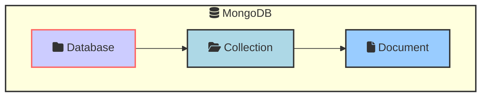


### CRUD Operations

CRUD stands for Create, Read, Update, and Delete. These are the basic operations for interacting with data in MongoDB.

#### Create

To insert a new document into a collection, you use the `insertOne()` or `insertMany()` methods.

```javascript
db.collection('users').insertOne({ name: 'Alice', age: 25 });
```

#### Read

To read documents from a collection, you use the `find()` method.

```javascript
db.collection('users').find({ name: 'Alice' });
```

#### Update

To update existing documents, you use the `updateOne()` or `updateMany()` methods.

```javascript
db.collection('users').updateOne({ name: 'Alice' }, { $set: { age: 26 } });
```

#### Delete

To delete documents from a collection, you use the `deleteOne()` or `deleteMany()` methods.

```javascript
db.collection('users').deleteOne({ name: 'Alice' });
```


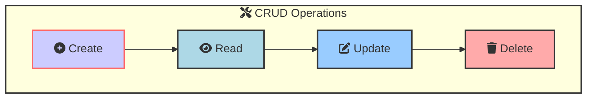

### Indexing

Indexing improves the performance of search operations in MongoDB. Indexes are special data structures that store a small portion of the collection's data set in an easy-to-traverse form.

#### Creating an Index

To create an index, you use the `createIndex()` method.

```javascript
db.collection('users').createIndex({ name: 1 });
```

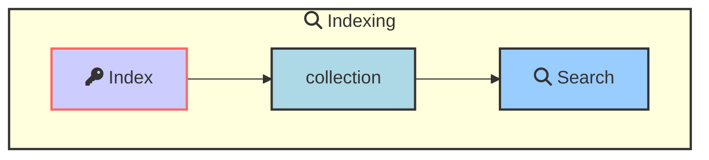

### Array Operations

MongoDB supports a variety of array operations for working with arrays in documents.

#### Adding Elements to an Array

To add elements to an array in a document, you use the `$push` operator.

```javascript
db.collection('users').updateOne({ name: 'Alice' }, { $push: { hobbies: 'Reading' } });
```

#### Removing Elements from an Array

To remove elements from an array in a document, you use the `$pull` operator.

```javascript

db.collection('users').updateOne({ name: 'Alice' }, { $pull: { hobbies: 'Reading' } });
```

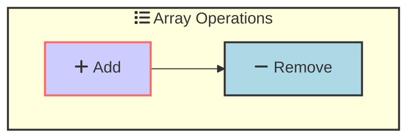


#### Querying Arrays with `$elemMatch`

Absolutely! Let's dive into how MongoDB's `$elemMatch` operator works with array queries and demonstrate why it's different from querying arrays without it.

**Scenario:**

Imagine a collection of documents representing students with their test scores:

```javascript
{
  "_id": ObjectId("64d39a7a8b0e8c284a2c1234"),
  "name": "Alice",
  "scores": [
    { "subject": "Math", "score": 95 },
    { "subject": "English", "score": 88 }
  ]
},
{
  "_id": ObjectId("64d39a808b0e8c284a2c1235"),
  "name": "Bob",
  "scores": [
    { "subject": "Math", "score": 78 },
    { "subject": "English", "score": 92 }
  ]
}
```

**Querying without $elemMatch:**

we want to find students who scored above 90 in any subject. We might try this query:

```javascript
db.students.find({ "scores.score": { $gt: 90 } })
```

**Result:** This will return **both** Alice and Bob, even though Bob didn't score above 90 in Math. This is because the query looks for any document where *at least one* score in the array matches the condition.

**Querying with $elemMatch:**

To find students who specifically scored above 90 in Math, we need `$elemMatch`:

```javascript
db.students.find({ 
  scores: { 
    $elemMatch: { subject: "Math", score: { $gt: 90 } } 
  } 
})
```

**Result:** This will return only Alice, as she is the only student with a score above 90 in the "Math" subject. `$elemMatch` ensures that *all* the conditions within the array element must be met.

Without $elemMatch, each condition in the query is evaluated independently against the array elements. With $elemMatch, all conditions within it must be true for the same array element to match.


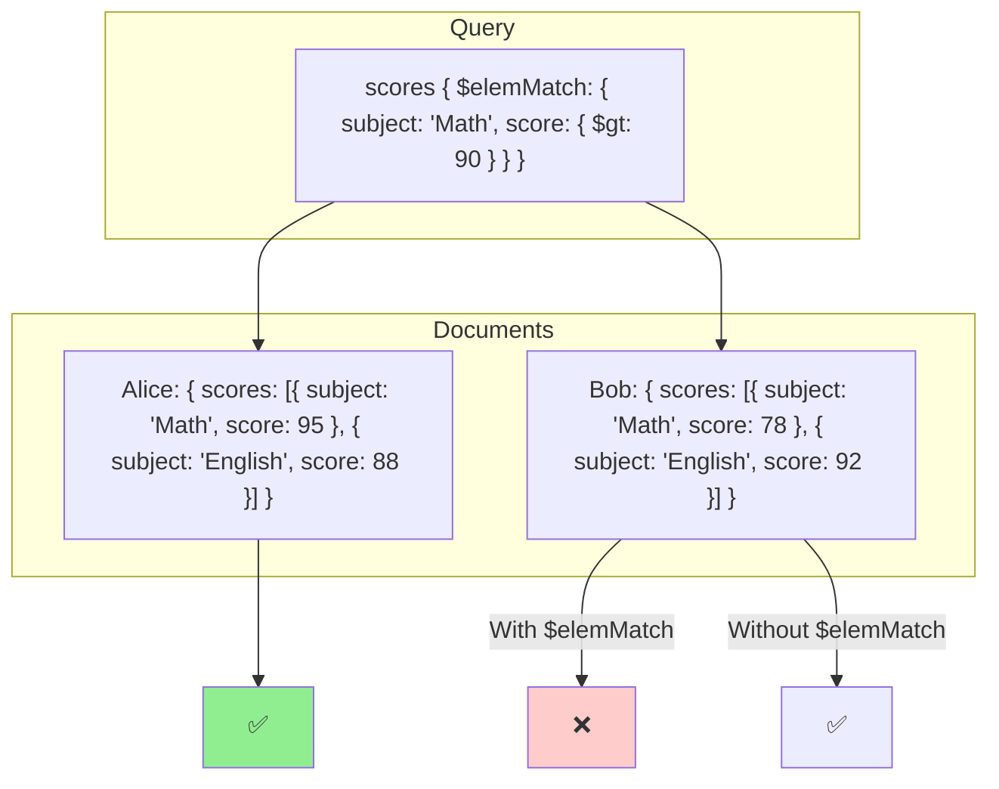

#### Updating Arrays with `$addToSet`

The `$addToSet` operator in MongoDB is used to add elements to an array only if they are not already present. This prevents duplicate entries in the array.

```javascript
db.collection('users').updateOne({ name: 'Alice' }, { $addToSet: { hobbies: 'Reading' } });
```

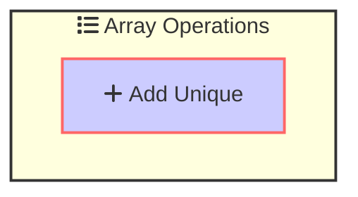


#### Updating Arrays with `$pullAll`

The `$pullAll` operator in MongoDB is used to remove all occurrences of specified values from an array.

```javascript
db.collection('users').updateOne({ name: 'Alice' }, { $pullAll: { hobbies: ['Reading', 'Swimming'] } });
```

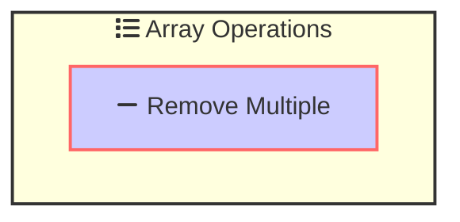

#### Updating Arrays with `$pop`

The `$pop` operator in MongoDB is used to remove the first or last element from an array.

```javascript
db.collection('users').updateOne({ name: 'Alice' }, { $pop: { hobbies: 1 } });
```

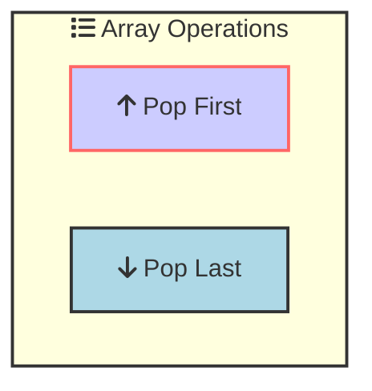

#### Updating Arrays with `$push` and `$each`

The `$push` operator in MongoDB is used to add elements to an array. The `$each` modifier allows you to add multiple elements to the array.

```javascript
db.collection('users').updateOne({ name: 'Alice' }, { $push: { hobbies: { $each: ['Reading', 'Swimming'] } } });
```

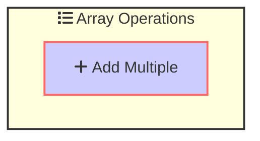

#### Updating Arrays with `$push` and `$sort`

The `$push` operator in MongoDB is used to add elements to an array. The `$sort` modifier allows you to sort the array elements.

```javascript
db.collection('users').updateOne({ name: 'Alice' }, { $push: { scores: { $each: [85, 90], $sort: -1 } } });
```

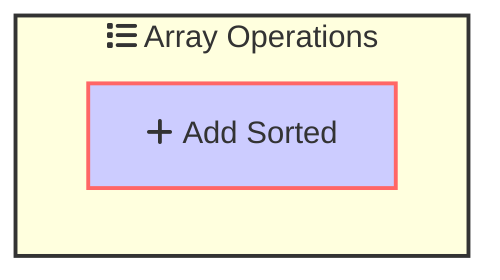

#### Updating Arrays with `$push` and `$slice`

The `$push` operator in MongoDB is used to add elements to an array. The `$slice` modifier allows you to limit the number of elements in the array.

```javascript
db.collection('users').updateOne({ name: 'Alice' }, { $push: { scores: { $each: [85, 90], $slice: -3 } } });
```

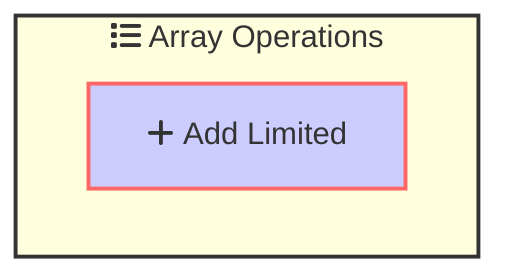

#### Updating Arrays with `$push` and `$position`

The `$push` operator in MongoDB is used to add elements to an array. The `$position` modifier allows you to specify the position where the elements should be added.

```javascript
db.collection('users').updateOne({ name: 'Alice' }, { $push: { scores: { $each: [85, 90], $position: 0 } } });
```

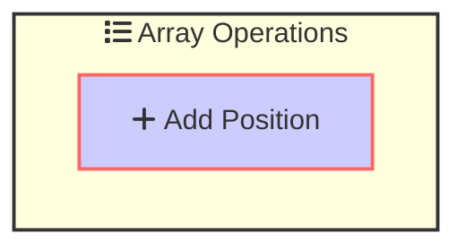

#### Updating Arrays with `$pull` and `$in`

The `$pull` operator in MongoDB is used to remove elements from an array. The `$in` modifier allows you to specify multiple values to remove.

```javascript
db.collection('users').updateOne({ name: 'Alice' }, { $pull: { hobbies: { $in: ['Reading', 'Swimming'] } } });
```


#### Updating Arrays with `$pull` and `$gt`

The `$pull` operator in MongoDB is used to remove elements from an array. The `$gt` modifier allows you to specify a condition for removing elements.

```javascript
db.collection('users').updateOne({ name: 'Alice' }, { $pull: { scores: { $gt: 85 } } });
```

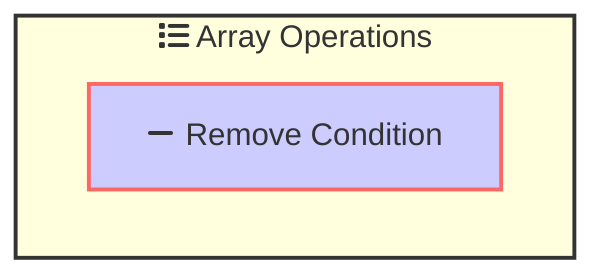
#### Updating Arrays with `$pull` and `$ne`

The `$pull` operator in MongoDB is used to remove elements from an array. The `$ne` modifier allows you to specify a condition for removing elements that are not equal to a value.

```javascript
db.collection('users').updateOne({ name: 'Alice' }, { $pull: { scores: { $ne: 85 } } });
```

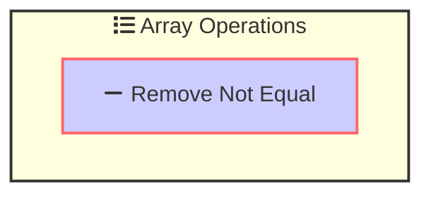

### Text Search

MongoDB provides text search capabilities to query string content in documents.

#### Creating a Text Index

To perform text search queries, you need to create a text index on the fields you want to search.

```javascript
db.collection('articles').createIndex({ content: 'text' });
```

#### Performing a Text Search

To perform a text search query, you use the `$text` operator.

```javascript
db.collection('articles').find({ $text: { $search: 'database' } });
```


### Aggregation

Aggregation operations process data records and return computed results. Aggregation allows you to perform complex data processing and transformation.

#### Aggregation Pipeline

The aggregation framework in MongoDB uses a pipeline approach, where multiple stages transform the documents.

```javascript
db.collection('orders').aggregate([
  { $match: { status: 'A' } },
  { $group: { _id: '$cust_id', total: { $sum: '$amount' } } },
  { $sort: { total: -1 } }
]);
```

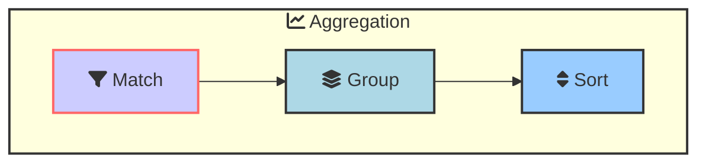

### Replica Sets

A replica set is a group of MongoDB instances that maintain the same data set. Replica sets provide redundancy and high availability.

#### Components of a Replica Set

- **Primary**: Receives all write operations.
- **Secondary**: Replicates data from the primary. Can be used for read operations.
- **Arbiter**: Participates in elections for primary but does not hold data.

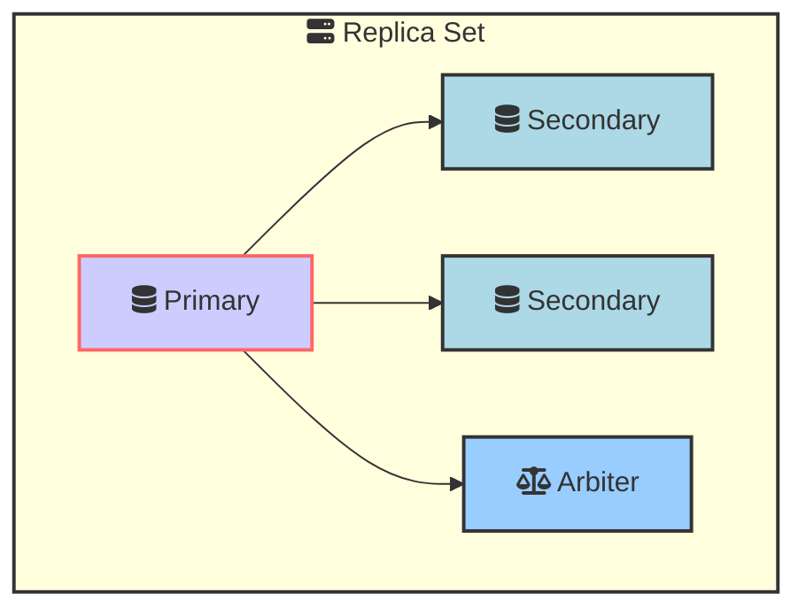