## MongoDB Architecture

MongoDB is a popular NoSQL database designed for high performance, high availability, and easy scalability. It stores data in flexible, JSON-like documents, making it easy to work with structured, semi-structured, and unstructured data.

- **Database**: A container for collections.
- **Collection**: A group of MongoDB documents.
- **Document**: A set of key-value pairs (similar to JSON objects).


## CRUD Operations

CRUD stands for Create, Read, Update, and Delete. These are the basic operations for interacting with data in MongoDB.


### Create

To insert a new document into a collection, you use the `insertOne()` or `insertMany()` methods.

```javascript
db.collection('users').insertOne({ name: 'Alice', age: 25 });
```

### Read

To read documents from a collection, you use the `find()` method.

```javascript
db.collection('users').find({ name: 'Alice' });
```


### Update

To update existing documents, you use the `updateOne()` or `updateMany()` methods.

```javascript
db.collection('users').updateOne({ name: 'Alice' }, { $set: { age: 26 } });

db.collection('users').updateMany({ city: 'New York' }, { $set: { city: 'San Francisco' } });
```

**Update Operators**
Operators in MongoDB are used to perform specific operations on fields in documents.


```javascript
// $set operator to update fields
db.collection('users').updateOne({ name: 'Alice' }, { $set: { age: 26, city: 'New York' } });

// $set operator to update nested fields
db.collection('users').updateOne({ name: 'Alice' }, { $set: { 'address.city': 'New York' } });

// $inc operator to increment a field
db.collection('users').updateOne({ name: 'Alice' }, { $inc: { age: 1 } });

// $mul operator to multiply a field value
db.collection('users').updateOne({ name: 'Alice' }, { $mul: { age: 2 } });

// $unset operator to remove a field
db.collection('users').updateOne({ name: 'Alice' }, { $unset: { city: '' } });

// $rename operator to rename a field
db.collection('users').updateOne({ name: 'Alice' }, { $rename: { city: 'location' } });

```


### Delete

To delete documents from a collection, you use the `deleteOne()` or `deleteMany()` methods.

```javascript
db.collection('users').deleteOne({ name: 'Alice' });

db.collection('users').deleteMany({ city: 'New York' });
```

## Model vs DAO Pattern

### Sample Todo Model

**Model Pattern**
- Encapsulates both data and behavior. This may include validation, business logic, and database operations. This can become "fat" but simpler implementation. 


```javascript
// src/config/database.js
const { MongoClient } = require('mongodb');

const dbConfig = {
  url: process.env.MONGODB_URI || 'mongodb://localhost:27017',
  dbName: 'todoapp'
};

let db = null;

const connectDB = async () => {
  try {
    const client = await MongoClient.connect(dbConfig.url, {
      useUnifiedTopology: true
    });
    db = client.db(dbConfig.dbName);
    console.log('Connected to MongoDB successfully');
    return db;
  } catch (error) {
    console.error('MongoDB connection error:', error);
    process.exit(1);
  }
};

const getDB = () => {
  if (!db) {
    throw new Error('Database not initialized');
  }
  return db;
};

module.exports = { connectDB, getDB };

// src/models/todo.model.js
onst { ObjectId } = require('mongodb');
const { getDB } = require('../config/database');

const COLLECTION_NAME = 'todos';

// Validation functions
const validateTodoData = (todoData) => {
  const errors = [];

  if (!todoData.title) {
    errors.push('Title is required');
  } else if (todoData.title.length < 3) {
    errors.push('Title must be at least 3 characters long');
  }

  if (todoData.status && !['pending', 'in-progress', 'completed'].includes(todoData.status)) {
    errors.push('Invalid status. Must be pending, in-progress, or completed');
  }

  if (todoData.dueDate && new Date(todoData.dueDate) < new Date()) {
    errors.push('Due date cannot be in the past');
  }

  if (todoData.priority && !['low', 'medium', 'high'].includes(todoData.priority)) {
    errors.push('Invalid priority. Must be low, medium, or high');
  }

  return errors;
};

const todoModel = {
  async create(todoData) {
    const errors = validateTodoData(todoData);
    if (errors.length > 0) {
      throw new Error(`Validation failed: ${errors.join(', ')}`);
    }

    const db = getDB();
    const todo = {
      ...todoData,
      title: todoData.title.trim(),
      status: todoData.status || 'pending',
      priority: todoData.priority || 'medium',
      createdAt: new Date(),
      updatedAt: new Date(),
      completedAt: null
    };

    const result = await db.collection(COLLECTION_NAME).insertOne(todo);
    return { ...todo, _id: result.insertedId };
  },

  async findById(id) {
    if (!ObjectId.isValid(id)) {
      throw new Error('Invalid todo ID');
    }

    const db = getDB();
    const todo = await db.collection(COLLECTION_NAME).findOne({ 
      _id: new ObjectId(id) 
    });

    if (!todo) {
      throw new Error('Todo not found');
    }

    return todo;
  },

  async find(query = {}, options = {}) {
    const db = getDB();
    const { 
      page = 1, 
      limit = 10,
      sortBy = 'createdAt',
      sortOrder = -1
    } = options;

    if (page < 1 || limit < 1) {
      throw new Error('Invalid pagination parameters');
    }

    const skip = (page - 1) * limit;
    const sortOptions = { [sortBy]: sortOrder };

    // Apply filters
    const filters = { ...query };
    if (filters.priority) {
      if (!['low', 'medium', 'high'].includes(filters.priority)) {
        throw new Error('Invalid priority filter');
      }
    }
    if (filters.status) {
      if (!['pending', 'in-progress', 'completed'].includes(filters.status)) {
        throw new Error('Invalid status filter');
      }
    }

    const [todos, totalCount] = await Promise.all([
      db.collection(COLLECTION_NAME)
        .find(filters)
        .sort(sortOptions)
        .skip(skip)
        .limit(limit)
        .toArray(),
      db.collection(COLLECTION_NAME)
        .countDocuments(filters)
    ]);

    return {
      todos,
      pagination: {
        total: totalCount,
        page,
        limit,
        pages: Math.ceil(totalCount / limit)
      }
    };
  },

  async update(id, updateData) {
    if (!ObjectId.isValid(id)) {
      throw new Error('Invalid todo ID');
    }

    const errors = validateTodoData(updateData);
    if (errors.length > 0) {
      throw new Error(`Validation failed: ${errors.join(', ')}`);
    }

    const db = getDB();
    const existingTodo = await this.findById(id);

    // Business logic for status changes
    if (updateData.status === 'completed' && existingTodo.status !== 'completed') {
      updateData.completedAt = new Date();
    }
    if (updateData.status && updateData.status !== 'completed') {
      updateData.completedAt = null;
    }

    const result = await db.collection(COLLECTION_NAME).findOneAndUpdate(
      { _id: new ObjectId(id) },
      { 
        $set: {
          ...updateData,
          updatedAt: new Date()
        }
      },
      { returnDocument: 'after' }
    );

    if (!result.value) {
      throw new Error('Todo not found');
    }

    return result.value;
  },

  async delete(id) {
    if (!ObjectId.isValid(id)) {
      throw new Error('Invalid todo ID');
    }

    const db = getDB();
    const result = await db.collection(COLLECTION_NAME).deleteOne({
      _id: new ObjectId(id)
    });

    if (result.deletedCount === 0) {
      throw new Error('Todo not found');
    }

    return true;
  },

  // Additional business logic methods
  async markAsComplete(id) {
    return await this.update(id, { 
      status: 'completed'
    });
  },

  async findOverdue() {
    const db = getDB();
    return await db.collection(COLLECTION_NAME).find({
      dueDate: { $lt: new Date() },
      status: { $ne: 'completed' }
    }).toArray();
  }
};
```


### Sample Todo DAO

**DAO Pattern**

- Data Access logic is separated from business logic. 
- Service layer for business logic and DAO layer for data access.
- Better for testing by mocking the data access layer. 
- Better support dependency injection. 
- More complex implementation and code repetition. 


```javascript
// src/config/database.js
const { MongoClient } = require('mongodb');

class Database {
  constructor(config) {
    this.config = {
      url: config.url || process.env.MONGODB_URI || 'mongodb://localhost:27017',
      dbName: config.dbName || process.env.DB_NAME || 'todoapp',
      options: {
        useUnifiedTopology: true,
        ...config.options
      }
    };
    this.client = null;
    this.db = null;
  }

  async connect() {
    try {
      this.client = await MongoClient.connect(this.config.url, this.config.options);
      this.db = this.client.db(this.config.dbName);
      console.log('Connected to MongoDB successfully');
      return this.db;
    } catch (error) {
      console.error('MongoDB connection error:', error);
      throw new DatabaseError('Failed to connect to database', error);
    }
  }

  async disconnect() {
    try {
      if (this.client) {
        await this.client.close();
        this.client = null;
        this.db = null;
        console.log('Disconnected from MongoDB');
      }
    } catch (error) {
      console.error('MongoDB disconnection error:', error);
      throw new DatabaseError('Failed to disconnect from database', error);
    }
  }

  getDB() {
    if (!this.db) {
      throw new DatabaseError('Database not initialized. Call connect() first.');
    }
    return this.db;
  }
}

// src/models/todo.entity.js
class Todo {
  static STATUS = {
    PENDING: 'pending',
    IN_PROGRESS: 'in-progress',
    COMPLETED: 'completed'
  };

  static PRIORITY = {
    LOW: 'low',
    MEDIUM: 'medium',
    HIGH: 'high'
  };

  constructor(data = {}) {
    this._id = data._id || null;
    this.title = data.title || '';
    this.description = data.description || '';
    this.status = data.status || Todo.STATUS.PENDING;
    this.priority = data.priority || Todo.PRIORITY.MEDIUM;
    this.dueDate = data.dueDate ? new Date(data.dueDate) : null;
    this.createdAt = data.createdAt ? new Date(data.createdAt) : new Date();
    this.updatedAt = data.updatedAt ? new Date(data.updatedAt) : new Date();
    this.completedAt = data.completedAt ? new Date(data.completedAt) : null;
    this.tags = Array.isArray(data.tags) ? [...data.tags] : [];
    this.assignedTo = data.assignedTo || null;
  }

  validate() {
    const errors = [];

    if (!this.title?.trim()) {
      errors.push('Title is required');
    } else if (this.title.trim().length < 3) {
      errors.push('Title must be at least 3 characters long');
    }

    if (this.status && !Object.values(Todo.STATUS).includes(this.status)) {
      errors.push(`Invalid status. Must be one of: ${Object.values(Todo.STATUS).join(', ')}`);
    }

    if (this.dueDate) {
      if (!(this.dueDate instanceof Date) || isNaN(this.dueDate.getTime())) {
        errors.push('Invalid due date format');
      } else if (this.dueDate < new Date()) {
        errors.push('Due date cannot be in the past');
      }
    }

    if (this.priority && !Object.values(Todo.PRIORITY).includes(this.priority)) {
      errors.push(`Invalid priority. Must be one of: ${Object.values(Todo.PRIORITY).join(', ')}`);
    }

    if (this.tags && !Array.isArray(this.tags)) {
      errors.push('Tags must be an array');
    }

    return errors;
  }

  isOverdue() {
    return this.dueDate && this.dueDate < new Date() && this.status !== Todo.STATUS.COMPLETED;
  }

  toJSON() {
    return {
      _id: this._id,
      title: this.title,
      description: this.description,
      status: this.status,
      priority: this.priority,
      dueDate: this.dueDate,
      createdAt: this.createdAt,
      updatedAt: this.updatedAt,
      completedAt: this.completedAt,
      tags: this.tags,
      assignedTo: this.assignedTo
    };
  }
}

// src/errors/index.js
class ValidationError extends Error {
  constructor(message) {
    super(message);
    this.name = 'ValidationError';
    this.status = 400;
  }
}

class DatabaseError extends Error {
  constructor(message, originalError = null) {
    super(message);
    this.name = 'DatabaseError';
    this.status = 500;
    this.originalError = originalError;
  }
}

class NotFoundError extends Error {
  constructor(message) {
    super(message);
    this.name = 'NotFoundError';
    this.status = 404;
  }
}

// src/daos/base.dao.js
class BaseDAO {
  constructor(db, collectionName) {
    if (!db) {
      throw new Error('Database connection is required');
    }
    if (!collectionName) {
      throw new Error('Collection name is required');
    }
    this.db = db;
    this.collection = this.db.collection(collectionName);
  }

  async findOne(filter) {
    try {
      return await this.collection.findOne(filter);
    } catch (error) {
      throw new DatabaseError('Database query failed', error);
    }
  }

  async find(filter = {}, options = {}) {
    try {
      return await this.collection.find(filter, options).toArray();
    } catch (error) {
      throw new DatabaseError('Database query failed', error);
    }
  }

  async insertOne(data) {
    try {
      return await this.collection.insertOne(data);
    } catch (error) {
      throw new DatabaseError('Database insert failed', error);
    }
  }

  async updateOne(filter, update, options = {}) {
    try {
      return await this.collection.updateOne(filter, update, options);
    } catch (error) {
      throw new DatabaseError('Database update failed', error);
    }
  }

  async deleteOne(filter) {
    try {
      return await this.collection.deleteOne(filter);
    } catch (error) {
      throw new DatabaseError('Database delete failed', error);
    }
  }
}

// src/daos/todo.dao.js
class TodoDAO extends BaseDAO {
  constructor(db) {
    super(db, 'todos');
  }

  async create(todoData) {
    const todo = new Todo(todoData);
    const errors = todo.validate();
    
    if (errors.length > 0) {
      throw new ValidationError(errors.join(', '));
    }

    const todoToInsert = {
      ...todo.toJSON(),
      title: todo.title.trim(),
      createdAt: new Date(),
      updatedAt: new Date()
    };

    try {
      const result = await this.insertOne(todoToInsert);
      return new Todo({ ...todoToInsert, _id: result.insertedId });
    } catch (error) {
      throw new DatabaseError('Failed to create todo', error);
    }
  }

  async findById(id) {
    if (!ObjectId.isValid(id)) {
      throw new ValidationError('Invalid todo ID');
    }

    const todo = await this.findOne({ _id: new ObjectId(id) });
    
    if (!todo) {
      throw new NotFoundError('Todo not found');
    }

    return new Todo(todo);
  }

  async find(query = {}, options = {}) {
    const { 
      page = 1, 
      limit = 10,
      sortBy = 'createdAt',
      sortOrder = -1,
      status,
      priority,
      searchTerm,
      fromDate,
      toDate,
      tags
    } = options;

    if (page < 1 || limit < 1) {
      throw new ValidationError('Invalid pagination parameters');
    }

    const filter = this._buildFilter({
      ...query,
      status,
      priority,
      searchTerm,
      fromDate,
      toDate,
      tags
    });

    const skip = (page - 1) * limit;
    const sortOptions = { [sortBy]: sortOrder };

    try {
      const [todos, totalCount] = await Promise.all([
        this.collection
          .find(filter)
          .sort(sortOptions)
          .skip(skip)
          .limit(limit)
          .toArray(),
        this.collection.countDocuments(filter)
      ]);

      return {
        todos: todos.map(todo => new Todo(todo)),
        pagination: {
          total: totalCount,
          page,
          limit,
          pages: Math.ceil(totalCount / limit)
        }
      };
    } catch (error) {
      throw new DatabaseError('Failed to fetch todos', error);
    }
  }

  async update(id, updateData) {
    const existingTodo = await this.findById(id);
    
    const updatedTodo = new Todo({
      ...existingTodo,
      ...updateData,
      _id: existingTodo._id,
      updatedAt: new Date()
    });

    const errors = updatedTodo.validate();
    if (errors.length > 0) {
      throw new ValidationError(errors.join(', '));
    }

    const result = await this.updateOne(
      { _id: new ObjectId(id) },
      { $set: updatedTodo.toJSON() },
      { returnDocument: 'after' }
    );

    if (result.matchedCount === 0) {
      throw new NotFoundError('Todo not found');
    }

    return updatedTodo;
  }

  async delete(id) {
    if (!ObjectId.isValid(id)) {
      throw new ValidationError('Invalid todo ID');
    }

    const result = await this.deleteOne({ _id: new ObjectId(id) });

    if (result.deletedCount === 0) {
      throw new NotFoundError('Todo not found');
    }

    return true;
  }

  _buildFilter(options) {
    const filter = {};

    if (options.status) {
      if (!Object.values(Todo.STATUS).includes(options.status)) {
        throw new ValidationError('Invalid status filter');
      }
      filter.status = options.status;
    }

    if (options.priority) {
      if (!Object.values(Todo.PRIORITY).includes(options.priority)) {
        throw new ValidationError('Invalid priority filter');
      }
      filter.priority = options.priority;
    }

    if (options.searchTerm) {
      filter.$or = [
        { title: { $regex: options.searchTerm, $options: 'i' } },
        { description: { $regex: options.searchTerm, $options: 'i' } }
      ];
    }

    if (options.fromDate || options.toDate) {
      filter.dueDate = {};
      if (options.fromDate) {
        filter.dueDate.$gte = new Date(options.fromDate);
      }
      if (options.toDate) {
        filter.dueDate.$lte = new Date(options.toDate);
      }
    }

    if (options.tags && Array.isArray(options.tags)) {
      filter.tags = { $all: options.tags };
    }

    return filter;
  }
}

// src/services/todo.service.js
class TodoService {
  constructor(todoDAO) {
    if (!todoDAO) {
      throw new Error('TodoDAO is required');
    }
    this.todoDAO = todoDAO;
  }

  async createTodo(todoData) {
    return await this.todoDAO.create(todoData);
  }

  async getTodoById(id) {
    return await this.todoDAO.findById(id);
  }

  async updateTodo(id, updateData) {
    return await this.todoDAO.update(id, updateData);
  }

  async deleteTodo(id) {
    return await this.todoDAO.delete(id);
  }

  async updateTodoStatus(id, status) {
    const todo = await this.todoDAO.findById(id);
    
    const updates = { 
      status,
      updatedAt: new Date()
    };
    
    if (status === Todo.STATUS.COMPLETED && todo.status !== Todo.STATUS.COMPLETED) {
      updates.completedAt = new Date();
    } else if (status !== Todo.STATUS.COMPLETED && todo.status === Todo.STATUS.COMPLETED) {
      updates.completedAt = null;
    }

    return await this.todoDAO.update(id, updates);
  }

  async findTodos(options = {}) {
    return await this.todoDAO.find({}, options);
  }

  async findOverdueTodos() {
    const now = new Date();
    return await this.todoDAO.find({
      dueDate: { $lt: now },
      status: { $ne: Todo.STATUS.COMPLETED }
    });
  }

  async findTodosByPriority(priority) {
    return await this.todoDAO.find({ priority });
  }

  async assignTodo(id, userId) {
    return await this.todoDAO.update(id, {
      assignedTo: userId,
      updatedAt: new Date()
    });
  }

  async addTags(id, tags) {
    const todo = await this.todoDAO.findById(id);
    const uniqueTags = [...new Set([...todo.tags, ...tags])];
    return await this.todoDAO.update(id, { tags: uniqueTags });
  }

  async removeTags(id, tags) {
    const todo = await this.todoDAO.findById(id);
    const updatedTags = todo.tags.filter(tag => !tags.includes(tag));
    return await this.todoDAO.update(id, { tags: updatedTags });
  }
}
```

## Indexing

Indexing in MongoDB improves query performance by creating efficient data structures for faster data retrieval.


- **Single Field Index**: Index on a single field of a document.
- **Compound Index**: Index on multiple fields.
- **Multikey Index**: Index on array fields.
- **Text Index**: Supports text search queries on string content.
  
### Single Field Index

To create an index, you use the `createIndex()` method.

```javascript
db.collection('users').createIndex({ name: 1 });
```

### Compound Index

A compound index in MongoDB is an index on multiple fields in a document.


```javascript
db.collection('users').createIndex({ name: 1, age: 1, city: 1, country: 1, hobbies: 1 });
```

Prefixes of a compound index can be used to satisfy queries that match the index fields from left to right.

```javascript
db.collection('users').find({ name: 'Alice', age: 25 });
db.collection('users').find({ name: 'Alice', age: 25, city: 'New York' });
```


### Multikey Index

A multikey index in MongoDB is an index on an array field.


```javascript
db.collection('users').createIndex({ hobbies: 1 });
```

#### Limitations of Multikey Indexes

- you cannot create a compound index if more than one field is an array.

```javascript
db.collection('users').createIndex({ "hobbies": 1, "tags": 1 }); // Not allowed if both hobbies and tags are arrays
```


### Text Index

A text index in MongoDB is used for text search queries on string content.

```javascript
db.collection('articles').createIndex({ content: 'text' });
```

Querying with a text index:

```javascript
db.collection('articles').find({ $text: { $search: 'database' } });
```


## Array Operations

MongoDB supports a variety of array operations for working with arrays in documents.


### Adding Elements to an Array


To add elements to an array in a document, you use the `$push` operator.

```javascript
db.collection('users').updateOne({ name: 'Alice' }, { $push: { hobbies: 'Reading' } });
```

### Querying Arrays with `$elemMatch`

Given a collection of students with scores in different subjects:

```javascript
{
  "_id": ObjectId("64d39a7a8b0e8c284a2c1234"),
  "name": "Alice",
  "scores": [
    { "subject": "Math", "score": 95 },
    { "subject": "English", "score": 88 }
  ]
},
{
  "_id": ObjectId("64d39a808b0e8c284a2c1235"),
  "name": "Bob",
  "scores": [
    { "subject": "Math", "score": 78 },
    { "subject": "English", "score": 92 }
  ]
}
```

**Querying with $elemMatch:**

To find students who specifically scored above 90 in Math, we need `$elemMatch`:

```javascript
db.students.find({ 
  scores: { 
    $elemMatch: { subject: "Math", score: { $gt: 90 } } 
  } 
})
```

**Result:** This will return only Alice, as she is the only student with a score above 90 in the "Math" subject. `$elemMatch` ensures that *all* the conditions within the array element must be met.


Without `$elemMatch` - This will return both Alice and Bob, as they both have scores above 90 in different subjects and not necessarily in the "Math" subject.

```mermaid
graph 
  subgraph query["Query"]
    elemMatchMath["scores { $elemMatch: { subject: 'Math', score: { $gt: 90 } } }"]
  end

  subgraph documents["Documents"]
    alice["Alice: { scores: [{ subject: 'Math', score: 95 }, { subject: 'English', score: 88 }] }"]
    bob["Bob: { scores: [{ subject: 'Math', score: 78 }, { subject: 'English', score: 92 }] }"]
  end



  elemMatchMath -->  alice --> found["✅"]
  elemMatchMath --> bob 
  bob --> |With $elemMatch|notFound["❌"]
   bob --> |Without $elemMatch|found2["✅"]

  style found fill:#90EE90
  style notFound fill:#FFCCCC

```




### Add Unique - `$addToSet`

The `$addToSet` operator in MongoDB is used to add elements to an array only if they are not already present. This prevents duplicate entries in the array.

```javascript
db.collection('users').updateOne({ name: 'Alice' }, { $addToSet: { hobbies: 'Reading' } });
```


### Add Multiple  `$push` and `$each`

The `$push` operator in MongoDB is used to add elements to an array. The `$each` modifier allows you to add multiple elements to the array.

```javascript
db.collection('users').updateOne({ name: 'Alice' }, { $push: { hobbies: { $each: ['Reading', 'Swimming'] } } });
```


### Add Sorted -  `$push` and `$sort`

The `$push` operator in MongoDB is used to add elements to an array. The `$sort` modifier allows you to sort the array elements.

```javascript
db.collection('users').updateOne({ name: 'Alice' }, { $push: { scores: { $each: [85, 90], $sort: -1 } } });
```

Push and Sort Array of Objects by a specific field

```javascript
db.collection('users').updateOne(
  { name: 'Alice' },
  {
    $push: {
      scores: {
        $each: [
          { score: 85, date: "2023-03-01" },
          { score: 90, date: "2023-04-01" }
        ],
        $sort: { date: -1 }
      }
    }
  }
);
```

### Add Limited -  `$push` and `$slice`

The `$push` operator in MongoDB is used to add elements to an array. The `$slice` modifier allows you to limit the number of elements in the array.

```javascript
db.collection('users').updateOne({ name: 'Alice' }, { $push: { scores: { $each: [85, 90], $slice: -3 } } });
```

If Alice currently has a scores array like [70, 75, 80], this query will push 85 and 90, making it [70, 75, 80, 85, 90]. The $slice: -3 will then trim it to the last 3 elements, resulting in [80, 85, 90].


### Removing Elements from an Array

To remove elements from an array in a document, you use the `$pull` operator.

```javascript

db.collection('users').updateOne({ name: 'Alice' }, { $pull: { hobbies: 'Reading' } });
```


### Remove the first or last element - `$pop` 

The `$pop` operator in MongoDB is used to remove the first or last element from an array.

```javascript
db.collection('users').updateOne({ name: 'Alice' }, { $pop: { hobbies: 1 } });
```


### Remove Multiple -  `$pullAll`

The `$pullAll` operator in MongoDB is used to remove all occurrences of specified values from an array.

```javascript
db.collection('users').updateOne({ name: 'Alice' }, { $pullAll: { hobbies: ['Reading', 'Swimming'] } });
```

### Remove Multiple - `$pull` and `$in`

The `$pull` operator in MongoDB is used to remove elements from an array. The `$in` modifier allows you to specify multiple values to remove.

```javascript
db.collection('users').updateOne({ name: 'Alice' }, { $pull: { hobbies: { $in: ['Reading', 'Swimming'] } } });
```


### Remove Condition - `$pull` and `$gt`

The `$pull` operator in MongoDB is used to remove elements from an array. The `$gt` modifier allows you to specify a condition for removing elements.

```javascript
db.collection('users').updateOne({ name: 'Alice' }, { $pull: { scores: { $gt: 85 } } });
```
### Remove Not Equal - `$pull` and `$ne`

The `$pull` operator in MongoDB is used to remove elements from an array. The `$ne` modifier allows you to specify a condition for removing elements that are not equal to a value.

```javascript
db.collection('users').updateOne({ name: 'Alice' }, { $pull: { scores: { $ne: 85 } } });
```

### Update Condition - `$set` and `$`

The `$set` operator in MongoDB is used to update fields in a document. The `$` positional operator allows you to update the first element that matches a condition in an array.

```javascript
db.collection('users').updateOne({ name: 'Alice', 'scores.subject': 'Math' }, { $set: { 'scores.$.score': 90 } });
```

### Update All - `$[]`

The `$[]` operator in MongoDB is used to update all elements in an array that match a condition.

```javascript
db.collection('users').updateOne({ name: 'Alice' }, { $set: { 'scores.$[].score': 90 } });
```

To increment a field in all elements of an array, you can use the `$[]` operator with the `$inc` operator.

```javascript
db.collection('users').updateOne({ name: 'Alice' }, { $inc: { 'scores.$[].score': 5 } });
```
### Update Filtered - `$[<identifier>]`

The `$[<identifier>]` operator in MongoDB is used to update elements in an array that match a condition.

```javascript
db.collection('users').updateOne({ name: 'Alice' }, { $set: { 'scores.$[elem].score': 90 } }, { arrayFilters: [{ 'elem.subject': 'Math' }] });
```


## Aggregation

Aggregation operations process data records and return computed results. Aggregation allows you to perform complex data processing and transformation.

### Aggregation Pipeline

The aggregation framework in MongoDB uses a pipeline approach, where multiple stages transform the documents.

```javascript
db.collection('orders').aggregate([
  { $match: { status: 'A' } },
  { $group: { _id: '$cust_id', total: { $sum: '$amount' } } },
  { $sort: { total: -1 } }
]);
```


### Join Collections

MongoDB does not support joins like relational databases. Instead, you can use the `$lookup` operator to perform a left outer join between two collections.

```javascript
db.collection('orders').aggregate([
  {
    $lookup: {
      from: 'customers',
      localField: 'cust_id',
      foreignField: '_id',
      as: 'customer'
    }
  }
]);
```


### Unwind Arrays

The `$unwind` operator in MongoDB is used to deconstruct an array field into multiple documents.

```javascript
db.collection('orders').aggregate([
  { $unwind: '$items' }
]);
```

#### Unwind and Group

```javascript
db.collection('orders').aggregate([
  { $unwind: '$items' },
  {
    $group: {
      _id: '$items.productId',
      totalQuantity: { $sum: '$items.quantity' },
      totalRevenue: { $sum: { $multiply: ['$items.price', '$items.quantity'] } },
      ordersCount: { $sum: 1 }
    }
  }
]);
```

#### Unwind Multiple Arrays

```javascript
db.collection('restaurants').aggregate([
  { $unwind: '$categories' },
  { $unwind: '$reviews' },
  {
    $group: {
      _id: '$categories',
      averageRating: { $avg: '$reviews.rating' },
      reviewCount: { $sum: 1 }
    }
  }
]);
```

### Group Documents

The `$group` operator in MongoDB is used to group documents by a specified key.

```javascript
db.collection('orders').aggregate([
  { $group: { _id: '$cust_id', total: { $sum: '$amount' } } }
]);
```

#### Group and Count 

```javascript
db.collection('orders').aggregate([
  { $group: { _id: '$status', count: { $sum: 1 } } }
]);
```

#### Group and Sum

```javascript
db.collection('orders').aggregate([
  { $group: { _id: '$status', total: { $sum: '$amount' } } }
]);
```

#### Group and Average

```javascript
db.collection('orders').aggregate([
  { $group: { _id: '$status', average: { $avg: '$amount' } } }
]);
```

#### Group and Push

```javascript
db.collection('orders').aggregate([
  { $group: { _id: '$cust_id', items: { $push: '$item' } } }
]);
```


#### Group with Multiple Fields
  
```javascript
db.collection('orders').aggregate([
  {
    $group: {
      _id: { 
        status: '$status',
        category: '$category'
      },
      count: { $sum: 1 },
      totalAmount: { $sum: '$amount' }
    }
  }
]);
```

#### Group with Date Operations

```javascript
db.collection('orders').aggregate([
  {
    $group: {
      _id: {
        year: { $year: '$orderDate' },
        month: { $month: '$orderDate' }
      },
      totalOrders: { $sum: 1 },
      revenue: { $sum: '$amount' }
    }
  }
]);
```


### Project Fields

The `$project` operator in MongoDB is used to include, exclude, or rename fields in the output documents.

```javascript
db.collection('orders').aggregate([
  { $project: { _id: 0, cust_id: 1, amount: 1 } }
]);
```

#### Project with Computed Fields

```javascript
db.collection('orders').aggregate([
  {
    $project: {
      _id: 0,
      cust_id: 1,
      amount: 1,
      discount: { $subtract: ['$total', '$amount'] }
    }
  }
]);
```

#### Project With Array Operations

```javascript
db.collection('orders').aggregate([
  {
    $project: {
      orderId: 1,
      itemCount: { $size: '$items' },
      firstItem: { $arrayElemAt: ['$items', 0] },
      lastItem: { $arrayElemAt: ['$items', -1] },
      items: {
        $map: {
          input: '$items',
          as: 'item',
          in: {
            name: '$$item.name',
            subtotal: {
              $multiply: ['$$item.price', '$$item.quantity']
            }
          }
        }
      }
    }
  }
]);
```

#### Project With String Operations

```javascript
db.collection('users').aggregate([
  {
    $project: {
      fullName: { $concat: ['$firstName', ' ', '$lastName'] },
      email: { $toLower: '$email' },
      age: { $toString: '$age' }
    }
  }
]);
```

### Project With Conditional Fields

```javascript
db.collection('users').aggregate([
  {
    $project: {
      name: 1,
      status: {
        $cond: {
          if: { $gte: ['$age', 18] },
          then: 'Adult',
          else: 'Minor'
        }
      }
    }
  }
]);
```


### Run Multiple Aggregations

You can run multiple aggregation pipelines in a single query using the `$facet` operator.

```javascript
db.collection('orders').aggregate([
  {
    $facet: {
      totalAmount: [
        { $group: { _id: null, total: { $sum: '$amount' } } }
      ],
      averageAmount: [
        { $group: { _id: null, average: { $avg: '$amount' } } }
      ]
    }
  }
]);
```

## Transactions

Transactions in MongoDB allow you to perform multiple operations as a single, all-or-nothing unit of work. They ensure data integrity and consistency across multiple documents and collections.


### Transaction Properties (ACID)

```mermaid
graph LR
    subgraph acidProperties["🧪 ACID Properties"]
        atomicity["💥 Atomicity"]
        consistency["🔄 Consistency"]
        isolation["🔒 Isolation"]
        durability["💾 Durability"]
    end

    atomicity --> |"All or Nothing"| atomicityDesc["Operations complete successfully or have no effect"]
    consistency --> |"Before and After"| consistencyDesc["Database remains in a consistent state"]
    isolation --> |"Concurrent Transactions"| isolationDesc["Do not interfere with each other"]
    durability --> |"Committed Changes"| durabilityDesc["Persist despite system failures"]

    style acidProperties fill:#f0f0ff,stroke:#333,stroke-width:2px
    style atomicity fill:#e6f2ff,stroke:#333,stroke-width:2px
    style consistency fill:#e6ffe6,stroke:#333,stroke-width:2px
    style isolation fill:#fff0f0,stroke:#333,stroke-width:2px
    style durability fill:#fff0ff,stroke:#333,stroke-width:2px
    style atomicityDesc fill:#f0f8ff,stroke:#333,stroke-width:1px
    style consistencyDesc fill:#f0fff0,stroke:#333,stroke-width:1px
    style isolationDesc fill:#fff5f5,stroke:#333,stroke-width:1px
    style durabilityDesc fill:#fdf0ff,stroke:#333,stroke-width:1px
```   



### Using Transactions

To use transactions in MongoDB, you typically follow these steps:


1. Start a session
2. Start a transaction
3. Perform operations
4. Commit or abort the transaction


```javascript
// Define a client

const { MongoClient } = require('mongodb');
const client = new MongoClient('mongodb://localhost:27017');
//...

// Start a session

const session = client.startSession();

try {
  session.startTransaction();

  // Perform multiple operations
  await collection1.updateOne({ _id: 1 }, { $set: { status: 'processing' } }, { session });
  await collection2.insertOne({ orderId: 1, items: ['item1', 'item2'] }, { session });

  // Commit the transaction
  await session.commitTransaction();
} catch (error) {
  // If an error occurred, abort the transaction
  await session.abortTransaction();
  console.error('Transaction aborted:', error);
} finally {
  // End the session
  session.endSession();
}
```

### Considerations for Transactions

- **Performance**: Transactions may impact performance, especially for write-heavy workloads.
- **Timeout**: Transactions have a default timeout of 60 seconds.
- **Replica Sets**: Transactions require a replica set configuration.
- **Sharded Clusters**: Transactions on sharded clusters have additional considerations and limitations.


By using transactions, you can ensure data consistency and integrity across multiple operations in MongoDB, especially when dealing with complex data models or critical business logic.


## Replica Sets

A replica set is a group of MongoDB instances that maintain the same data set. Replica sets provide redundancy and high availability.

### Components of a Replica Set

- **Primary**: Receives all write operations.
- **Secondary**: Replicates data from the primary. Can be used for read operations.
- **Arbiter**: Participates in elections for primary but does not hold data.


### Replica Set Configuration

To configure a replica set, you use the `rs.initiate()` method.

```javascript
rs.initiate({
  _id: 'rs0',
  members: [
    { _id: 0, host: 'mongo1:27017' },
    { _id: 1, host: 'mongo2:27017' },
    { _id: 2, host: 'mongo3:27017', arbiterOnly: true }
  ]
});
```

### Read Preference

Read preference in MongoDB determines how read operations are distributed across the replica set.


- **Primary**: Reads from the primary.
- **Secondary**: Reads from the secondary.
- **PrimaryPreferred**: Reads from the primary if available, otherwise from the secondary.
- **SecondaryPreferred**: Reads from the secondary if available, otherwise from the primary.
- **Nearest**: Reads from the nearest member of the replica set.

```javascript

db.collection('users').find().readPref('secondary');
```


### Write Concern

Write concern in MongoDB determines the level of acknowledgment for write operations.


- **w: 0**: No acknowledgment.
- **w: 1**: Acknowledgment from the primary.
- **w: majority**: Acknowledgment from the majority of the replica set.

```javascript

db.collection('users').insertOne({ name: 'Alice' }, { writeConcern: { w: 'major

```

### Automatic Failover

MongoDB uses a heartbeat mechanism to detect the availability of replica set members. If the primary becomes unavailable, a new primary is elected.

- `Primary` is elected based on the number of votes from the replica set members.
- `Secondary` can be promoted to primary if the primary is unavailable.
- `Arbiter` is used to break the tie in elections.


### Manual Failover

You can initiate a manual failover in MongoDB by forcing a replica set member to become the primary.

```javascript
rs.stepDown();
```


## Sharding

Sharding is a method for distributing data across multiple machines. It allows you to scale horizontally by adding more machines to your system.

A Collection is divided into chunks, and each chunk is stored on a different shard.

Each Shard is a subset of the data in a sharded cluster.


### Components of Sharding

- **Shard**: A subset of the data in a sharded cluster.
- **Config Server**: Stores metadata and configuration settings for the cluster.
- **Query Router**: Routes queries to the appropriate shard.

```mermaid
graph
  subgraph sharding["fa:fa-database Sharding"]
    shard1["fa:fa-database Shard 1"]
    shard2["fa:fa-database Shard 2"]
    shard3["fa:fa-database Shard 3"]
    configServer["fa:fa-cogs Config Server"]
    queryRouter["fa:fa-route Query Router"]
  end

  shard1 --> configServer
  shard2 --> configServer
  shard3 --> configServer
  queryRouter --> shard1
  queryRouter --> shard2
  queryRouter --> shard3

  style sharding stroke:#333,stroke-width:2px
  style shard1 fill:#ccf,stroke:#f66,stroke-width:2px
  style shard2 fill:#add8e6,stroke:#333,stroke-width:2px
  style shard3 fill:#9cf,stroke:#333,stroke-width:2px
  style configServer fill:#ccf,stroke:#f66,stroke-width:2px
  style queryRouter fill:#add8e6,stroke:#333,stroke-width:2px

```

### Sharding Key

The sharding key is the field used to distribute data across the shards. It should be chosen carefully to ensure a balanced distribution of data.

```javascript
db.collection.createIndex({ _id: 'hashed' });
```


When selecting a shard key, consider the following factors:

- **Cardinality**: The number of unique values in the shard key.
- **Write Scaling**: The ability to distribute write operations across shards.
- **Query Isolation**: The ability to target specific shards for read operations.

### Shard Key Strategies

- **Hashed Sharding**: Distributes data evenly across the shards using a hash function.
- **Range Sharding**: Distributes data based on a range of values in the shard key.
- **Compound Sharding**: Distributes data based on multiple fields in the shard key.

```javascript
db.collection.createIndex({ _id: 'hashed' });
db.collection.createIndex({ date: 1 });
db.collection.createIndex({ country: 1, city: 1 });
```

## Mongoose

Mongoose is an Object Data Modeling (ODM) library for MongoDB and Node.js. It provides a schema-based solution to model your application data.

```mermaid

graph 
  subgraph mongoose["fa:fa-database Mongoose"]
    connect["fa:fa-plug Connect"]
    schema["fa:fa-file Schema"]
    model["fa:fa-cube Model"]
    insert["fa:fa-plus-circle Insert"]
    find["fa:fa-eye Find"]
    update["fa:fa-edit Update"]
    delete["fa:fa-trash Delete"]
  end

  connect --> schema
  schema --> model
  model --> insert
  model --> find
  model --> update
  model --> delete

  style mongoose stroke:#333,stroke-width:2px
  style connect fill:#ccf,stroke:#f66,stroke-width:2px
  style schema fill:#add8e6,stroke:#333,stroke-width:2px
  style model fill:#9cf,stroke:#333,stroke-width:2px
  style insert fill:#ccf,stroke:#f66,stroke-width:2px
  style find fill:#add8e6,stroke:#333,stroke-width:2px
  style update fill:#9cf,stroke:#333,stroke-width:2px
  style delete fill:#faa,stroke:#333,stroke-width:2px
```


### Connecting to MongoDB

To connect to MongoDB using Mongoose, you use the `connect()` method.

```javascript
const mongoose = require('mongoose');

mongoose.connect('mongodb://localhost:27017/myapp', { useNewUrlParser: true, useUnifiedTopology: true });
```


### Defining a Schema

A Mongoose schema defines the structure of the documents in a collection.

```javascript
const userSchema = new mongoose.Schema({
  name: String,
  age: Number
});
```

### Creating a Model

A Mongoose model is a class that represents a collection in MongoDB.

```javascript
const User = mongoose.model('User', userSchema);
```

### Inserting Documents

To insert a document into a collection, you create an instance of the model and call the `save()` method.

```javascript
const user = new User({ name: 'Alice', age: 25 });

user.save();
```

### Querying Documents

To query documents from a collection, you use the `find()` method.

```javascript
User.find({ name: 'Alice' });
```

With Projection:

```javascript
User.find({ name: 'Alice' }, { name: 1, age: 1 });
```

### Updating Documents

To update documents in a collection, you use the `updateOne()` method.

```javascript
User.updateOne({ name: 'Alice' }, { age: 26 });
```

### Deleting Documents

To delete documents from a collection, you use the `deleteOne()` method.

```javascript
User.deleteOne({ name: 'Alice' });
```


### Middleware

Mongoose middleware are functions that are executed before or after certain operations.

```javascript
userSchema.pre('save', function(next) {
  console.log('Saving user...');
  next();
});
```

### Virtuals

Mongoose virtuals are document properties that you can get and set but that do not get persisted to MongoDB.

```javascript

userSchema.virtual('fullName').get(function() {
  return this.name + ' ' + this.age;
});
```

### Plugins

Mongoose plugins are reusable pieces of schema middleware that can be added to any schema.

```javascript
const timestampPlugin = require('./plugins/timestamp');

userSchema.plugin(timestampPlugin);
```

### Transactions

Mongoose transactions allow you to perform multiple operations on multiple documents in a single transaction.

```javascript

const session = await mongoose.startSession();
session.startTransaction();

try {
  await User.create({ name: 'Alice' }, { session });
  await User.create({ name: 'Bob' }, { session });

  await session.commitTransaction();
} catch (error) {
  await session.abortTransaction();
} finally {
  session.endSession();
}
```

### Aggregation

Mongoose provides a fluent API for building aggregation pipelines.

```javascript
const result = await User.aggregate([
  { $match: { name: 'Alice' } },
  { $group: { _id: '$name', total: { $sum: '$age' } }
]);
```

### Indexes

Mongoose allows you to define indexes on your schemas.

```javascript
userSchema.index({ name: 1 });
```

### Population

Mongoose population allows you to reference documents in other collections.

```javascript
const userSchema = new mongoose.Schema({
  name: String,
  posts: [{ type: mongoose.Schema.Types.ObjectId, ref: 'Post' }]
});
```

### Validation

Mongoose provides built-in validation for schema fields.

```javascript
const userSchema = new mongoose.Schema({
  name: { type: String, required: true }
});
```

## Patterns

- <a href="/posts/bucket-pattern">Bucket Pattern</a> 
- <a href="/posts/attribute-pattern">Attribute Pattern</a>
- <a href="/posts/outlier-pattern">Outlier Pattern</a>
- <a href="/posts/subset-pattern/">Subset Pattern</a>

| Pattern | Description | Use Case | Advantages | Disadvantages |
|---------|-------------|----------|------------|---------------|
| Bucket Pattern | Groups related documents into fixed-size "buckets" or arrays | Time-series data, IoT sensor readings | - Reduces number of documents<br>- Improves query performance for range scans | - Complex to update individual items<br>- May lead to document growth |
| Attribute Pattern | Stores a set of fields with similar access patterns as an embedded document | Products with varying attributes | - Flexible schema<br>- Efficient querying of common attributes | - More complex queries for specific attributes<br>- Potential for unused fields |
| Outlier Pattern | Stores common data in one collection and rare, oversized data in another | Social media posts with varying engagement levels | - Optimizes for common case performance<br>- Prevents document size issues | - Requires two queries for outliers<br>- More complex application logic |
| Subset Pattern | Stores a subset of fields from a document in a separate collection | User profiles with frequently accessed fields | - Improves read performance for common queries<br>- Reduces working set size | - Data duplication<br>- Requires keeping subsets in sync |


## Q&A

### What is .exec() in Mongoose?

The `exec()` function in Mongoose is used to execute a query and return a promise. It allows you to chain query methods and then execute the query at the end.

```javascript
User.find({ name: 'Alice' }).exec();
```

You can run the query without `exec()`, by callback or using async/await.

```javascript
User.find({ name: 'Alice' }, (error, users) => {
  console.log(users);
});
```

```javascript
const users = await User.find({ name: 'Alice' });
```

### What is the difference between `findOne()` and `find()` in Mongoose?

- `find()`: Returns an array of all documents that match the query criteria.
- `findOne()`: Returns the first document that matches the query criteria.

### What is the difference between Model.create() and new Model().save() in Mongoose?

- `Model.create()`: Creates a new document and saves it to the database in a single step.

```javascript
User.create({ name: 'Alice' });
```

- `new Model().save()`: reates a new instance of the model but doesn't save it to the database immediately. You can modify the instance, perform validations, or run any other operations before calling .save() to persist the changes.

```javascript
const doc = new Model({ name: 'John', age: 30 });
doc.age = 31; // Modify the document
await doc.save(); // Save the document after modification
```


### What is the purpose of the lean() method in Mongoose queries, and when should it be used?

The `lean()` method in Mongoose queries returns plain JavaScript objects instead of Mongoose documents which come with a lot of additional features, such as getters, setters, and methods that are useful for working with the document . It should be used when you don't need the full Mongoose document features and want to improve query performance.

```javascript
User.find({ name: 'Alice' }).lean();
```


### How to implement soft deletes in Mongoose?

Soft deletes in Mongoose involve marking documents as deleted instead of physically removing them from the database. You can achieve this by adding a `deleted` field to your schema and setting it to true when a document is deleted.

```javascript
const userSchema = new mongoose.Schema({
  name: String,
  deleted: { type: Boolean, default: false }
});
```

Use pre middleware to exclude deleted documents from query results.

```javascript
userSchema.pre(/^find/, function(next) {
  this.where({ deleted: false });
  next();
});
```

Add a method to "soft delete" a document.

```javascript
userSchema.methods.softDelete = function() {
  this.deleted = true;
  return this.save();
};
``` 


