## Fundamentals


Express.js is a popular web application framework for Node.js that simplifies building web applications and APIs.

- **Middleware**: Functions that access the request and response objects to modify, add data, or trigger other functions.
  
- **Router**: A mini-app that only deals with routing. It can have its middleware and routing logic.

- **Handler**: A function that handles a specific route or endpoint.

- **Error Middleware**: Middleware functions that have an extra parameter for error handling.

```mermaid
graph 
    subgraph expressApp["fa:fa-server Express.js Application"]
            request["🔴 Request"]
            middleware1["🚪Middleware 1"]
            middleware2["🚪Middleware 2"]
            router["fa:fa-sitemap Router"]
            routerMiddleware["🚪Router Middleware"]
            handler["fa:fa-wrench Handler"]
            errorMiddleware["🚨 Error Middleware"]
            response["🔵 Response"]
    end

    request --> middleware1 --> middleware2 --> router 
    router --> routerMiddleware --> handler 
    handler --> errorMiddleware --> response

    style request fill:#f9f,stroke:#333,stroke-width:2px
    style middleware1 fill:#ccf,stroke:#f66,stroke-width:2px
    style middleware2 fill:#ff9,stroke:#333,stroke-width:2px
    style router fill:#ccf,stroke:#f66,stroke-width:2px
    style routerMiddleware fill:#add8e6,stroke:#333,stroke-width:2px
    style handler fill:#9cf,stroke:#333,stroke-width:2px
    style errorMiddleware stroke:#333,stroke-width:2px
    style response fill:#9cf,stroke:#333,stroke-width:2px

    classDef requestClass fill:#f9f,stroke:#333,stroke-width:2px;
    classDef middlewareClass fill:#ccf,stroke:#f66,stroke-width:2px;
    classDef routerClass fill:#ccf,stroke:#f66,stroke-width:2px;
    classDef routerMiddlewareClass fill:#add8e6,stroke:#333,stroke-width:2px;
    classDef handlerClass fill:#9cf,stroke:#333,stroke-width:2px;
    classDef errorClass stroke:#333,stroke-width:2px;
    classDef responseClass fill:#9cf,stroke:#333,stroke-width:2px;

```
  
## Middleware

A **request-response cycle** in Express.js involves a series of middleware functions that execute sequentially. Each middleware can modify the request and response objects, end the request-response cycle, or call the next middleware in the stack.


**Middleware Functions**: Execute sequentially, each modifying the request/response objects or ending the request-response cycle. Examples: Logging, authentication, parsing data
  ```javascript
  const express = require('express');
  const app = express();

  app.use((req, res, next) => { // ( 🔴, 🔵, 🚪)
    console.log('Middleware 1');
    next();
  });

  app.use((req, res, next) => {
    console.log('Middleware 2');
    res.send('Hello, Middleware Flow!');
  });

  app.listen(3000);
  ```


Below is an example of how middleware functions involve in the request-response cycle.

```mermaid
graph TD
    

    subgraph   
        cors1[cors 🌐] --> passportInitialize["passport.initialize() (Passport) 🛂"]
        passportInitialize --> authLimiter["authLimiter (Rate Limiter) 🚦"]
        authLimiter --> routes["v1 Routes 🛣️"]
        routes --> docsRoute["Docs Route 📄"]
        docsRoute --> notFoundHandler["404 Handler ⚠️"]
        notFoundHandler --> errorConverter["errorConverter ⚙️"]
        errorConverter --> errorHandler["errorHandler 🚫"]
        errorHandler --> response["Response ➡️"]
        style passportInitialize fill:#ccf,stroke:#f66,stroke-width:2px
        style authLimiter fill:#ff9,stroke:#333,stroke-width:2px
        style routes fill:#9cf,stroke:#333,stroke-width:2px
        style docsRoute stroke:#333,stroke-width:2px
        style notFoundHandler fill:#ccc,stroke:#333,stroke-width:2px
        style errorConverter fill:#fcc,stroke:#333,stroke-width:2px
        style errorHandler fill:#faa,stroke:#333,stroke-width:2px
        style response fill:#9cf,stroke:#333,stroke-width:2px

    end

    subgraph Middleware["Middleware Flow"]
        request["Request 🌐"] --> morgan["Morgan (Logger) 📝"]
        morgan --> helmet["Helmet (Security) 🔒"]
        helmet --> expressJson["express.json() 📄"]
        expressJson --> expressUrlEncoded["express.urlencoded() 📝"]
        expressUrlEncoded --> expressFileupload["express-fileupload 📁"]
        expressFileupload --> xss["xss-clean 🧹"]
        xss --> mongoSanitize["express-mongo-sanitize 🛡️"]
        mongoSanitize --> compression["compression 🗜️"]
        compression --> cors["cors 🌐"]
        style request fill:#f9f,stroke:#333,stroke-width:2px
        style morgan fill:#ccf,stroke:#f66,stroke-width:2px
        style helmet fill:#ff9,stroke:#333,stroke-width:2px
        style expressJson fill:#9cf,stroke:#333,stroke-width:2px
        style expressUrlEncoded stroke:#333,stroke-width:2px
        style expressFileupload fill:#ccc,stroke:#333,stroke-width:2px
        style xss fill:#fcc,stroke:#333,stroke-width:2px
        style mongoSanitize fill:#faa,stroke:#333,stroke-width:2px
        style compression fill:#9cf,stroke:#333,stroke-width:2px
        style cors fill:#afa,stroke:#333,stroke-width:2px
    end

```


## Routing

```mermaid
graph 
subgraph expressApp["fa:fa-server Express.js Application"]
  request["🔴 Request"] --> middleware1["🚪Middlewares"] 
  middleware1 --> router

  subgraph router["fa:fa-sitemap Router"]
    authRoute["/auth 🔑"]
    userRoute["/user 🧑"]
    clientRoute["/client 🏢"]
    remains["..."]
    notFoundRoute["404"]
  end

  router --> errorMiddleware["🚨 Error Middleware"]
  errorMiddleware --> response["🔵 Response"]
end

style request fill:#f9f,stroke:#333,stroke-width:2px
style middleware1 fill:#ccf,stroke:#f66,stroke-width:2px
style router fill:#add8e6,stroke:#333,stroke-width:2px
style authRoute fill:#9cf,stroke:#333,stroke-width:2px
style userRoute stroke:#333,stroke-width:2px
style clientRoute fill:#ccc,stroke:#333,stroke-width:2px
style notFoundRoute fill:#faa,stroke:#333,stroke-width:2px
style errorMiddleware stroke:#333,stroke-width:2px
style response fill:#9cf,stroke:#333,stroke-width:2px


classDef requestClass fill:#f9f,stroke:#333,stroke-width:2px;
classDef middlewareClass fill:#ccf,stroke:#f66,stroke-width:2px;
classDef routerClass fill:#add8e6,stroke:#333,stroke-width:2px;
classDef routeHandlerClass fill:#9cf,stroke:#333,stroke-width:2px;
classDef errorClass stroke:#333,stroke-width:2px;
classDef responseClass fill:#9cf,stroke:#333,stroke-width:2px;

```

```js
const express = require('express');
const router = express.Router();

// Import Route Modules (Assume these contain route handlers)
const authRoute = require('./auth.route'); 
const userRoute = require('./user.route');
const clientRoute = require('./client.route');

// Mount Routes on the Router
router.use('/auth', authRoute);     // Authentication routes (e.g., login, signup)
router.use('/user', userRoute);     // User management routes
router.use('/client', clientRoute); // Client-related routes

// ... other routes (omitted for brevity)

// 404 Not Found Handler
router.use((req, res, next) => {
  // ... (Logic for handling 404 errors)
});

module.exports = router;

// ... In your main app.js file:
const app = express();
// ... (Other middleware like body-parser, cors, etc.)

// Mount the Router
app.use('/api', router); // Prefix all routes with '/api'

// ... (Error handling middleware)

app.listen(3000, () => {
  console.log('Server is running on port 3000');
});
```

- **Modular Routes**: Each route module (authRoute, userRoute, clientRoute) is responsible for a specific set of endpoints, promoting organization and maintainability.
- **Router Middleware**: You can add middleware functions directly to the router using router.use(). These middleware will only apply to the routes defined within this router.

- **404 Handler**: The router.use() at the end acts as a catch-all route to handle requests that don't match any defined routes. It would typically send a "Not Found" (404) response.

## Views

```mermaid
graph 
subgraph views["🖼️ Views"]
    engine["Engine"] --> template["📄 Template"]
    template --> data["Data"]
    data --> rendered["🖌️  Rendered HTML"]
end
```


- **Templates**: Use template engines like Pug, EJS, or Handlebars to create dynamic HTML.
  ```javascript
  const express = require('express');
  const app = express();
  app.set('view engine', 'pug');

  app.get('/', (req, res) => {
    res.render('index', { title: 'Express', message: 'Hello there!' });
  });

  app.listen(3000);
  ```

- **Rendering**: Generates and returns HTML based on the templates and data provided.
  ```javascript
  // views/index.pug
  html
    head
      title= title
    body
      h1= message
  ```

## Static Files

Static files are assets that don't change dynamically, such as images, CSS stylesheets, and client-side JavaScript files. `express.static()` is a middleware function, meaning it intercepts requests before they reach your route handlers.

  ```javascript
  const express = require('express');
  const app = express();

  app.use(express.static(path.join(__dirname, 'public'))); 

  app.listen(3000);
  ```

**Directory**: Specify the directory from which to serve static assets.

```mermaid
graph LR
    root["my-app/ 📂"] --> public["public/ 📁"];
    public --> images["images/ 🖼️"];
    public --> css["css/ 🎨"];
    public --> js["js/ ⚙️"];
    public --> csv["data.csv 📄"];

    classDef folder fill:#f9f,stroke:#333,stroke-width:2px;
    classDef file fill:#ccf,stroke:#f66,stroke-width:2px;

    

    style root fill:#F0E68C
    style public fill:#90EE90
    style images fill:#ADD8E6
    style css fill:#F08080
    style js fill:#98FB98
    style csv fill:#F0F8FF


```

Use `Stream` to download files  in public directory.
```js
const fs = require('fs');

app.get('/download-csv', (req, res) => {
  const filePath = path.join(__dirname, 'public', 'path/to/your/file.csv');

  // Check if file exists
  if (!fs.existsSync(filePath)) {
    return res.status(404).send('File not found');
  }

  // Set headers for download
  res.setHeader('Content-Disposition', 'attachment; filename=file.csv');
  res.setHeader('Content-Type', 'text/csv');

  // Pipe the file to the response
  const fileStream = fs.createReadStream(filePath);
  fileStream.pipe(res);
});
```
## Error Handling


**Error Handling in Express.js**


```mermaid
graph TD 
   
    routeHandler --error--> nextError["fa:fa-exclamation next(err)"]
    request["🔴"] --> middleware1["🚪Middleware 1"] --error--> nextError["fa:fa-door-open next"]
    middleware2 --error--> nextError
    middleware1 --> middleware2["🚪Middleware 2"]
    middleware2 --> routeHandler["fa:fa-wrench Route Handler"]
    routeHandler --> response["🔵"]
    nextError --> logErrors["logErrors 📝"]
    logErrors --> clientErrorHandler["clientErrorHandler 👥"]
    clientErrorHandler --> errorHandler["errorHandler 🚫"]
    errorHandler --> response


    
    style request fill:#f9f,stroke:#333,stroke-width:2px
    style middleware1 fill:#ccf,stroke:#f66,stroke-width:2px
    style middleware2 fill:#ff9,stroke:#333,stroke-width:2px
    style routeHandler fill:#ccf,stroke:#f66,stroke-width:2px
    style response fill:#9cf,stroke:#333,stroke-width:2px
    style nextError stroke:#333,stroke-width:2px
    style logErrors fill:#a0d2eb,stroke:#333,stroke-width:2px
    style clientErrorHandler fill:#f0e68c,stroke:#333,stroke-width:2px
    style errorHandler stroke:#333,stroke-width:2px

```


Error handling ensures your Express application gracefully manages errors that arise during request processing.


* **Synchronous Errors:** Errors thrown directly within route handlers or middleware. Express catches these automatically.
* **Asynchronous Errors:** Errors from asynchronous operations (e.g., database queries, file reading) must be passed to `next(err)`. Starting with Express 5, route handlers and middleware that return a Promise will call next(value) automatically when they reject or throw an error.
* **Error-Handling Middleware:** Functions with four arguments (`err`, `req`, `res`, `next`) that specifically handle errors.
**Error Handler:** A middleware function that acts as a final catch-all for errors, logging them and sending appropriate responses to the client.

```js
app.use(logErrors);
app.use(clientErrorHandler);
app.use(errorHandler); 
```

### Log Errors

Log errors to the console or a file for debugging and monitoring. Datadog, Sentry, or other services can be used for more advanced error logging.

```js
function logErrors(err, req, res, next) {
  console.error(err.stack); // Log to console in development
  // You can replace this with logging to a file or external service
  next(err); 
}
```

### Client Error Handler

Respond to client errors (e.g., AJAX requests) with JSON error messages.

```js
function clientErrorHandler(err, req, res, next) {
  if (req.xhr) {
    res.status(err.statusCode || 500).json({ error: err.message });
  } else {
    next(err); // Let the general error handler handle it
  }
}
```


### Error Handler

The final error handler sends an appropriate response to the client. In production, you might want to send a generic error message to the client to avoid leaking sensitive information.

```js
function errorHandler(err, req, res, next) {
  res.status(500).json({ 
    message: process.env.NODE_ENV === 'production' 
        ? 'Internal Server Error' 
        : err.message 
  });
}
```

## Q&A


### How does Express.js determine whether to call the next middleware or an error-handling middleware?

**It depends on how the `next` function is called:**
- **`next()`**: Without arguments, it proceeds to the next regular middleware.
- **`next(err)`**: With an error argument, it skips to the error-handling middleware.


```javascript
app.use((req, res, next) => {
    next(); // Calls the next regular middleware
});

app.use((req, res, next) => {
    next(new Error('Error occurred')); // Calls the error-handling middleware
});

app.use((err, req, res, next) => {
    res.status(500).send('Something broke!');
});
```


### What are the differences between req.query and req.params ?

- **`req.query`**: Contains the query parameters in the URL (e.g., `/users?name=John&age=30`).
- **`req.params`**: Contains route parameters defined in the route path (e.g., `/users/:id`).

```javascript
app.get('/users', (req, res) => {
    const { name, age } = req.query;
    res.send(`Name: ${name}, Age: ${age}`);
});

app.get('/users/:id', (req, res) => {
    const { id } = req.params;
    res.send(`User ID: ${id}`);
});
```

```mermaid

graph TD
    subgraph expressApp["fa:fa-server Express.js Application"]
        request["🔴 Request"]
        queryRoute["/users?name=John&age=30"]
        paramsRoute["/users/:id"]
        queryHandler["fa:fa-wrench Query Handler"]
        paramsHandler["fa:fa-wrench Params Handler"]
        response["🔵 Response"]
    end

    request --> queryRoute
    queryRoute --> queryHandler
    queryHandler --> response

    request --> paramsRoute
    paramsRoute --> paramsHandler
    paramsHandler --> response

    style request fill:#f9f,stroke:#333,stroke-width:2px
    style queryRoute fill:#ccf,stroke:#f66,stroke-width:2px
    style paramsRoute fill:#ff9,stroke:#333,stroke-width:2px
    style queryHandler fill:#9cf,stroke:#333,stroke-width:2px
    style paramsHandler fill:#9cf,stroke:#333,stroke-width:2px
    style response fill:#9cf,stroke:#333,stroke-width:2px
```

### How to parse the request body? 

- **`express.json()`**: Middleware to parse JSON bodies.
- **`express.urlencoded()`**: Middleware to parse URL-encoded bodies.
- **`express.text()`**: Middleware to parse text bodies.
- **`express.raw()`**: Middleware to parse raw bodies.

```javascript
const express = require('express');
const app = express();

app.use(express.json()); // Parse JSON bodies
app.use(express.urlencoded({ extended: true })); // Parse URL-encoded bodies

app.post('/users', (req, res) => {
    const { name, age } = req.body;
    res.send(`Name: ${name}, Age: ${age}`);
});

app.listen(3000);
```


### Explain the order of router precedence ?

- **Exact Match**: Routes with exact matches take precedence over dynamic routes.
- **Dynamic Routes**: Routes with dynamic parameters (e.g., `/users/:id`) are matched next.
- **Wildcard Routes**: Routes with wildcards (e.g., `/users/*`) are matched last.

```javascript
app.get('/users', (req, res) => {
    res.send('All users');
});

app.get('/users/new', (req, res) => {
    res.send('New user form');
});

app.get('/users/:id', (req, res) => {
    res.send(`User ID: ${req.params.id}`);
});

app.get('/users/*', (req, res) => {
    res.send('Wildcard route');
});
```

```mermaid
graph TD
    subgraph expressApp["fa:fa-server Express.js Application"]
        request["🔴 Request"]
        usersRoute["/users"]
        newUserRoute["/users/new"]
        userIdRoute["/users/:id"]
        wildcardRoute["/users/*"]
        response["🔵 Response"]
    end

    request --> usersRoute
    usersRoute --> response

    request --> newUserRoute
    newUserRoute --> response

    request --> userIdRoute
    userIdRoute --> response

    request --> wildcardRoute
    wildcardRoute --> response

    style request fill:#f9f,stroke:#333,stroke-width:2px
    style usersRoute fill:#ccf,stroke:#f66,stroke-width:2px
    style newUserRoute fill:#ff9,stroke:#333,stroke-width:2px
    style userIdRoute fill:#9cf,stroke:#333,stroke-width:2px
    style wildcardRoute fill:#9cf,stroke:#333,stroke-width:2px
    style response fill:#9cf,stroke:#333,stroke-width:2px
```

### How to handle file uploads ?

- **`express-fileupload`**: Middleware to handle file uploads.
- **`req.files`**: Object containing uploaded files.

```javascript
const express = require('express');
const fileUpload = require('express-fileupload');
const app = express();

app.use(fileUpload());

app.post('/upload', (req, res) => {
    if (!req.files || Object.keys(req.files).length === 0) {
        return res.status(400).send('No files were uploaded.');
    }

    let uploadedFile = req.files.file; // assuming the form field name is 'file'

    // Read the content of the file
    const fileContent = uploadedFile.data.toString();

    // Process the file content
    const updatedContent = processFile(fileContent);
    // ...
    res.send(updatedContent);
});

```

### How to protect SQL Injection?

- **`express-mongo-sanitize`**: Middleware to sanitize user input and prevent NoSQL injection.

- **`xss-clean`**: Middleware to sanitize user input and prevent XSS attacks.

```javascript
const express = require('express');
const mongoSanitize = require('express-mongo-sanitize');
const xss = require('xss-clean');
const app = express();

app.use(mongoSanitize());
app.use(xss());

///
app.listen(3000);
```

```mermaid

graph TD
    subgraph expressApp["fa:fa-server Express.js Application"]
        request["🔴 Request"]
        mongoSanitize["express-mongo-sanitize 🛡️"]
        xssClean["xss-clean 🧹"]
        handler["fa:fa-wrench Handler"]
        response["🔵 Response"]
    end

    request --> mongoSanitize
    mongoSanitize --> xssClean
    xssClean --> handler
    handler --> response

    style request fill:#f9f,stroke:#333,stroke-width:2px
    style mongoSanitize fill:#ccf,stroke:#f66,stroke-width:2px
    style xssClean fill:#ff9,stroke:#333,stroke-width:2px
    style handler fill:#9cf,stroke:#333,stroke-width:2px
    style response fill:#9cf,stroke:#333,stroke-width:2px
```

### How to implement rate limiting?

- **`express-rate-limit`**: Middleware to limit the number of requests from an IP address.

```javascript
const express = require('express');
const rateLimit = require('express-rate-limit');
const app = express();

const authLimiter = rateLimit({
    windowMs: 15 * 60 * 1000, // 15 minutes
    max: 100, // limit each IP to 100 requests per windowMs
    message: 'Too many requests from this IP, please try again after 15 minutes'
});

app.use('/auth', authLimiter);

app.post('/auth/login', (req, res) => {
    // Handle login logic
});

app.listen(3000);
```

```mermaid

graph TD
    subgraph expressApp["fa:fa-server Express.js Application"]
        request["🔴 Request"]
        authRoute["/auth/login"]
        authLimiter["authLimiter (Rate Limiter) 🚦"]
        handler["fa:fa-wrench Handler"]
        response["🔵 Response"]
    end

    request --> authRoute
    authRoute --> authLimiter
    authLimiter --> handler
    handler --> response

    style request fill:#f9f,stroke:#333,stroke-width:2px
    style authRoute fill:#ccf,stroke:#f66,stroke-width:2px
    style authLimiter fill:#ff9,stroke:#333,stroke-width:2px
    style handler fill:#9cf,stroke:#333,stroke-width:2px
    style response fill:#9cf,stroke:#333,stroke-width:2px
```

### How to handle versioning in APIs?

- **Route Prefixing**: Use a common prefix for all routes of a specific version.

```javascript
const express = require('express');
const app = express();

const v1Router = express.Router();
const v2Router = express.Router();

v1Router.get('/users', (req, res) => {
    res.send('Users v1');
});

v2Router.get('/users', (req, res) => {
    res.send('Users v2');
});

app.use('/v1', v1Router);
app.use('/v2', v2Router);

app.listen(3000);
```

```mermaid

graph TD
    subgraph expressApp["fa:fa-server Express.js Application"]
        request["🔴 Request"]
        v1Route["/v1/users"]
        v2Route["/v2/users"]
        v1Handler["fa:fa-wrench Users v1 Handler"]
        v2Handler["fa:fa-wrench Users v2 Handler"]
        response["🔵 Response"]
    end

    request --> v1Route
    v1Route --> v1Handler
    v1Handler --> response

    request --> v2Route
    v2Route --> v2Handler
    v2Handler --> response

    style request fill:#f9f,stroke:#333,stroke-width:2px
    style v1Route fill:#ccf,stroke:#f66,stroke-width:2px
    style v2Route fill:#ff9,stroke:#333,stroke-width:2px
    style v1Handler fill:#9cf,stroke:#333,stroke-width:2px
    style v2Handler fill:#9cf,stroke:#333,stroke-width:2px
    style response fill:#9cf,stroke:#333,stroke-width:2px
```

### How to handle CORS ?

- **`cors`**: Middleware to enable Cross-Origin Resource Sharing (CORS) in Express.

```javascript
const express = require('express');
const cors = require('cors');
const app = express();

app.use(cors( { origin: 'http://example.com' } ));

app.get('/users', (req, res) => {
    res.send('Users');
});

app.listen(3000);
```

```mermaid

graph TD
    subgraph expressApp["fa:fa-server Express.js Application"]
        request["🔴 Request"]
        corsRoute["/users"]
        cors["cors 🌐"]
        handler["fa:fa-wrench Users Handler"]
        response["🔵 Response"]
    end

    request --> corsRoute
    corsRoute --> cors
    cors --> handler
    handler --> response

    style request fill:#f9f,stroke:#333,stroke-width:2px
    style corsRoute fill:#ccf,stroke:#f66,stroke-width:2px
    style cors fill:#ff9,stroke:#333,stroke-width:2px
    style handler fill:#9cf,stroke:#333,stroke-width:2px
    style response fill:#9cf,stroke:#333,stroke-width:2px
```

### How to document APIs?

- **Swagger/OpenAPI**: Use tools like Swagger UI or OpenAPI to document your APIs.

```javascript
const express = require('express');
const swaggerUi = require('swagger-ui-express');
const swaggerDocument = require('./swagger.json');
const app = express();

app.use('/api-docs', swaggerUi.serve, swaggerUi.setup(swaggerDocument));

app.listen(3000);
```

```mermaid
graph TD
    subgraph expressApp["fa:fa-server Express.js Application"]
        request["🔴 Request"]
        swaggerRoute["/api-docs"]
        swaggerUi["swagger-ui-express 📄"]
        swaggerDocument["swagger.json 📄"]
        response["🔵 Response"]
    end

    request --> swaggerRoute
    swaggerRoute --> swaggerUi
    swaggerUi --> swaggerDocument
    swaggerDocument --> response

    style request fill:#f9f,stroke:#333,stroke-width:2px
    style swaggerRoute fill:#ccf,stroke:#f66,stroke-width:2px
    style swaggerUi fill:#ff9,stroke:#333,stroke-width:2px
    style swaggerDocument fill:#9cf,stroke:#333,stroke-width:2px
    style response fill:#9cf,stroke:#333,stroke-width:2px
```


### How to manage environment variables ?

- **`dotenv`**: Package to load environment variables from a `.env` file.

```javascript
require('dotenv').config();

const express = require('express');
const app = express();

const PORT = process.env.PORT || 3000;

app.listen(PORT, () => {
    console.log(`Server is running on port ${PORT}`);
});
```

```mermaid
graph TD
    subgraph expressApp["fa:fa-server Express.js Application"]
        dotenv["dotenv 📄"]
        handler["fa:fa-wrench Handler \n process.env"]
    end

  
    style dotenv fill:#ccf,stroke:#f66,stroke-width:2px
    style handler fill:#9cf,stroke:#333,stroke-width:2px

```


### How to nest routers?

- **Router Nesting**: Mount routers within other routers to create a nested routing structure.

```javascript
const express = require('express');
const app = express();

const userRouter = express.Router();
const profileRouter = express.Router();

userRouter.use('/profile', profileRouter);

profileRouter.get('/', (req, res) => {
    res.send('Profile');
});

app.use('/users', userRouter);

app.listen(3000);
```


### How to compress responses in Express.js?

- **`compression`**: Middleware to compress responses using gzip or deflate.

```javascript

const express = require('express');
const compression = require('compression');

const app = express();

app.use(compression());

app.get('/users', (req, res) => {
    res.send('Users');
});

app.listen(3000);
```

```mermaid
graph TD
    subgraph expressApp["fa:fa-server Express.js Application"]
        request["🔴 Request"]
        compression["compression 🗜️"]
        handler["fa:fa-wrench Handler"]
        response["🔵 Response"]
    end

    request --> compression
    compression --> handler
    handler --> response

    style request fill:#f9f,stroke:#333,stroke-width:2px
    style compression fill:#ccf,stroke:#f66,stroke-width:2px
    style handler fill:#9cf,stroke:#333,stroke-width:2px
    style response fill:#9cf,stroke:#333,stroke-width:2px
```


### How to validate request data ?

- **`express-validator`**: Middleware to validate and sanitize request data.

```javascript
const express = require('express');
const { body, validationResult } = require('express-validator');

const app = express();

app.post('/users', 
    body('email').isEmail(),
    body('password').isLength({ min: 6 }),
    (req, res) => {
        const errors = validationResult(req);
        if (!errors.isEmpty()) {
            return res.status(400).json({ errors: errors.array() });
        }
        res.send('User created');
    });

app.listen(3000);

```

```mermaid
graph TD
    subgraph expressApp["fa:fa-server Express.js Application"]
        request["🔴 Request"]
        validationRoute["/users"]
        validationMiddleware["express-validator 🛡️"]
        handler["fa:fa-wrench Handler"]
        response["🔵 Response"]
    end

    request --> validationRoute
    validationRoute --> validationMiddleware
    validationMiddleware --> handler
    handler --> response

    style request fill:#f9f,stroke:#333,stroke-width:2px
    style validationRoute fill:#ccf,stroke:#f66,stroke-width:2px
    style validationMiddleware fill:#ff9,stroke:#333,stroke-width:2px
    style handler fill:#9cf,stroke:#333,stroke-width:2px
    style response fill:#9cf,stroke:#333,stroke-width:2px
```


## Keywords To Remember

```mermaid
graph 
    subgraph expressApp["fa:fa-server Express.js Application"]
            request["🔴 "]
            middleware1["🚪"]
            middleware2["🚪"]
            router["fa:fa-sitemap"]
            routerMiddleware["🚪"]
            handler["fa:fa-wrench "]
            errorMiddleware["🚨"]
            response["🔵 "]
    end

    request --> middleware1 --> middleware2 --> router 
    router --> routerMiddleware --> handler 
    handler --> errorMiddleware --> response

    style request fill:#f9f,stroke:#333,stroke-width:2px
    style middleware1 fill:#ccf,stroke:#f66,stroke-width:2px
    style middleware2 fill:#ff9,stroke:#333,stroke-width:2px
    style router fill:#ccf,stroke:#f66,stroke-width:2px
    style routerMiddleware fill:#add8e6,stroke:#333,stroke-width:2px
    style handler fill:#9cf,stroke:#333,stroke-width:2px
    style errorMiddleware stroke:#333,stroke-width:2px
    style response fill:#9cf,stroke:#333,stroke-width:2px

    classDef requestClass fill:#f9f,stroke:#333,stroke-width:2px;
    classDef middlewareClass fill:#ccf,stroke:#f66,stroke-width:2px;
    classDef routerClass fill:#ccf,stroke:#f66,stroke-width:2px;
    classDef routerMiddlewareClass fill:#add8e6,stroke:#333,stroke-width:2px;
    classDef handlerClass fill:#9cf,stroke:#333,stroke-width:2px;
    classDef errorClass fill:#f61,stroke:#333,stroke-width:2px;
    classDef responseClass fill:#9cf,stroke:#333,stroke-width:2px;
```