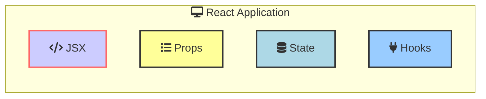

## Core Concepts

- **Components**: The building blocks of a React application. They are functional and are used to encapsulate parts of the UI.
  
- **JSX**: A syntax extension that allows writing HTML-like code in JavaScript, which React transforms into JavaScript objects.
  
- **Props**: Short for properties, props are read-only inputs to components used to pass data and event handlers down the component tree.
  
- **State**: A special object in React components that determines how components render and behave.
  
- **Hooks**: Special functions that let you use state and other React features in functional components.




## Functional Components

Functional components are simple JavaScript functions that return JSX.

```javascript
import React from 'react';

function Greeting(props) {
  return <h1>Hello, {props.name}!</h1>;
}

export default Greeting;
```

## JSX

JSX allows you to write HTML-like syntax within JavaScript. It is then transformed into JavaScript objects.

```jsx
const element = <h1>Hello, world!</h1>;
```

## Props

Props are used to pass data and event handlers to components. They are read-only.

```javascript
function Welcome(props) {
  return <h1>Hello, {props.name}</h1>;
}

const element = <Welcome name="Sara" />;
```

## State

State is a special object that controls how a component renders and behaves. State can be updated using `useState` in functional components.

### Using State in Functional Components with Hooks

```javascript
import React, { useState } from 'react';

function Counter() {
  const [count, setCount] = useState(0);

  return (
    <div>
      <p>Count: {count}</p>
      <button onClick={() => setCount(count + 1)}>Increment</button>
    </div>
  );
}
```

## Hooks

Hooks are special functions that let you use state and other React features in functional components.

### useEffect Hook

The `useEffect` hook lets you perform side effects in functional components, such as data fetching or subscribing to events.

```javascript
import React, { useState, useEffect } from 'react';

function Timer() {
  const [seconds, setSeconds] = useState(0);

  useEffect(() => {
    const interval = setInterval(() => {
      setSeconds(seconds => seconds + 1);
    }, 1000);

    // Cleanup interval on unmount
    return () => clearInterval(interval);
  }, []);

  return (
    <div>
      <h1>Timer: {seconds}s</h1>
    </div>
  );
}

export default Timer;
```


### useContext Hook

The `useContext` hook lets you access the value of a context in functional components.

```javascript
import React, { useContext } from 'react';
import { ThemeContext } from './ThemeContext';

function ThemeToggler() {
  const { theme, setTheme } = useContext(ThemeContext);

  return (
    <button onClick={() => setTheme(theme === 'light' ? 'dark' : 'light')}>
      Toggle Theme
    </button>
  );
}

export default ThemeToggler;
```

#### Life cycle

### Custom Hook

Custom hooks are functions that let you reuse logic across multiple components.

```javascript
import { useState, useEffect } from 'react';

function useUser() {
  const [user, setUser] = useState(null);
  const [isLoading, setIsLoading] = useState(true);

  useEffect(() => {
    // Fetch user data from an API or local storage
    // ...

    setIsLoading(false);
  }, []);

  const login = (credentials) => {
    // Implement login logic
    // ...
  };

  const logout = () => {
    // Implement logout logic
    // ...
  };

  return { user, isLoading, login, logout };
}

```

```javascript
import { useState, useEffect } from 'react';

function useUser() {
  const [user, setUser] = useState(null);
  const [isLoading, setIsLoading] = useState(true);

  useEffect(() => {
    // Fetch user data from an API or local storage
    // ...

    setIsLoading(false);
  }, []);

  const login = (credentials) => {
    // Implement login logic
    // ...
  };

  const logout = () => {
    // Implement logout logic
    // ...
  };

  return { user, isLoading, login, logout };
}
```

## Context

Context provides a way to pass data through the component tree without having to pass props down manually at every level.

```javascript
const ThemeContext = React.createContext('light');

function App() {
  return (
    <ThemeContext.Provider value="dark">
      <Toolbar />
    </ThemeContext.Provider>
  );
}

function Toolbar() {
  return (
    <div>
      <ThemedButton />
    </div>
  );
}

function ThemedButton() {
  const theme = useContext(ThemeContext);
  return <button className={theme}>Themed Button</button>;
}
```


## Handling Events

Handling events in React is similar to handling events in HTML. You can use event handlers like `onClick`, `onChange`, etc.

```javascript
function Toggle() {
  const [isOn, setIsOn] = useState(false);

  function handleClick() {
    setIsOn(!isOn);
  }

  return (
    <button onClick={handleClick}>
      {isOn ? 'ON' : 'OFF'}
    </button>
  );
}

export default Toggle;
```

## Conditional Rendering

You can conditionally render components in React using JavaScript expressions.

```javascript
function Greeting(props) {
  const isLoggedIn = props.isLoggedIn;

  return (
    <div>
      {isLoggedIn ? <UserGreeting /> : <GuestGreeting />}
    </div>
  );
}
```


## Lists and Keys

You can render lists of items in React using JavaScript `map` function.

```javascript
function NumberList(props) {
  const numbers = props.numbers;

  return (
    <ul>
      {numbers.map((number) => (
        <li key={number.toString()}>{number}</li>
      ))}
    </ul>
  );
}
```

## Controlled Components

Controlled components are form elements whose value is controlled by React state.

```javascript
function NameForm() {
  const [name, setName] = useState('');

  function handleChange(event) {
    setName(event.target.value);
  }

  function handleSubmit(event) {
    alert('Name submitted: ' + name);
    event.preventDefault();
  }

  return (
    <form onSubmit={handleSubmit}>
      <label>
        Name:
        <input type="text" value={name} onChange={handleChange} />
      </label>
      <button type="submit">Submit</button>
    </form>
  );
}
```

## Uncontrolled Components

Uncontrolled components are form elements whose value is handled by the DOM.

Use refs when you need to access the DOM directly to handle form input. For example, to get the value of an input field or to focus an input field.

```javascript
function NameForm() {
  const inputRef = useRef(null);

  function handleSubmit(event) {
    alert('Name submitted: ' + inputRef.current.value);
    event.preventDefault();
  }

  return (
    <form onSubmit={handleSubmit}>
      <label>
        Name:
        <input type="text" ref={inputRef} />
      </label>
      <button type="submit">Submit</button>
    </form>
  );
}
``` 

## Forms

You can handle form input in React using controlled components.

```javascript
function NameForm() {
  const [name, setName] = useState('');

  function handleChange(event) {
    setName(event.target.value);
  }

  function handleSubmit(event) {
    alert('Name submitted: ' + name);
    event.preventDefault();
  }

  return (
    <form onSubmit={handleSubmit}>
      <label>
        Name:
        <input type="text" value={name} onChange={handleChange} />
      </label>
      <button type="submit">Submit</button>
    </form>
  );
}
```


## Lifting State Up

Lifting state up is a technique in React where you move the state from child components to their parent component.

```javascript
function Parent() {
  const [count, setCount] = useState(0);

  return (
    <div>
      <Child count={count} setCount={setCount} />
    </div>
  );
}

function Child({ count, setCount }) {
  return (
    <div>
      <p>Count: {count}</p>
      <button onClick={() => setCount(count + 1)}>Increment</button>
    </div>
  );
}
```

## Composition 

Composition is a technique in React where components can be composed together to create more complex components.

```javascript
function FancyBorder(props) {
  return (
    <div className={'FancyBorder FancyBorder-' + props.color}>
      {props.children}
    </div>
  );
}

function WelcomeDialog() {
  return (
    <FancyBorder color="blue">
      <h1 className="Dialog-title">Welcome</h1>
      <p className="Dialog-message">Thank you for visiting our spacecraft!</p>
    </FancyBorder>
  );
}
```


## React Router

React Router is a library that allows you to handle routing in a React application.

```javascript
import { BrowserRouter as Router, Route, Link } from 'react-router-dom';

function App() {
  return (
    <Router>
      <div>
        <nav>
          <ul>
            <li>
              <Link to="/">Home</Link>
            </li>
            <li>
              <Link to="/about">About</Link>
            </li>
            <li>
              <Link to="/topics">Topics</Link>
            </li>
          </ul>
        </nav>

        <Route path="/" exact component={Home} />
        <Route path="/about" component={About} />
        <Route path="/topics" component={Topics} />
      </div>
    </Router>
  );
}
```


Got it. Here are the additional topics that were not mentioned previously:


## Programmatic Navigation

Programmatic navigation allows you to navigate to different routes programmatically.

```javascript
import { useHistory } from 'react-router-dom';

function MyComponent() {
  let history = useHistory();

  function handleClick() {
    history.push("/new-path");
  }

  return (
    <button onClick={handleClick}>
      Go to new path
    </button>
  );
}
```

## Higher-Order Components (HOCs):

Higher-order components are functions that take a component and return a new component with additional props.


### Higher-Order Components (HOCs)

Higher-Order Components (HOCs) are an advanced technique in React for reusing component logic. An HOC is a function that takes a component and returns a new component.

#### Why Use HOCs?

HOCs allow you to:

- Share common functionality between components.
- Enhance components with additional behavior.
- Abstract repetitive logic.

#### Creating an HOC

A simple example of an HOC is one that adds a loading spinner while data is being fetched.

```javascript
import React from 'react';

function withLoadingSpinner(WrappedComponent) {
  return function WithLoadingSpinner(props) {
    if (props.isLoading) {
      return <div>Loading...</div>;
    }
    return <WrappedComponent {...props} />;
  };
}

export default withLoadingSpinner;
```

In this example, `withLoadingSpinner` is a higher-order component that wraps another component and displays a loading spinner based on the `isLoading` prop.

#### Using HOCs

To use the HOC, simply wrap the component you want to enhance with the HOC function.

```javascript
import React, { useState, useEffect } from 'react';
import withLoadingSpinner from './withLoadingSpinner';

function DataComponent(props) {
  return (
    <div>
      <h1>Data:</h1>
      <pre>{JSON.stringify(props.data, null, 2)}</pre>
    </div>
  );
}

const DataComponentWithLoading = withLoadingSpinner(DataComponent);

function App() {
  const [data, setData] = useState(null);
  const [isLoading, setIsLoading] = useState(true);

  useEffect(() => {
    setTimeout(() => {
      setData({ name: 'React' });
      setIsLoading(false);
    }, 2000);
  }, []);

  return <DataComponentWithLoading isLoading={isLoading} data={data} />;
}

export default App;
```


## Testing

Testing is an important part of building React applications. You can write tests for React components using tools like Jest and React Testing Library.


Jest is a JavaScript testing framework that is commonly used for testing React applications.

To write tests for React components, create test files with the `.test.js` or `.spec.js` extension.

```javascript
import { render, screen } from '@testing-library/react';
import App from './App';

test('renders learn react link', () => {
  render(<App />);
  const linkElement = screen.getByText(/learn react/i);
  expect(linkElement).toBeInTheDocument();
});
```

