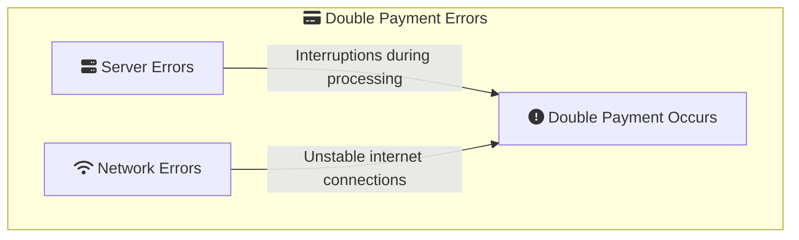
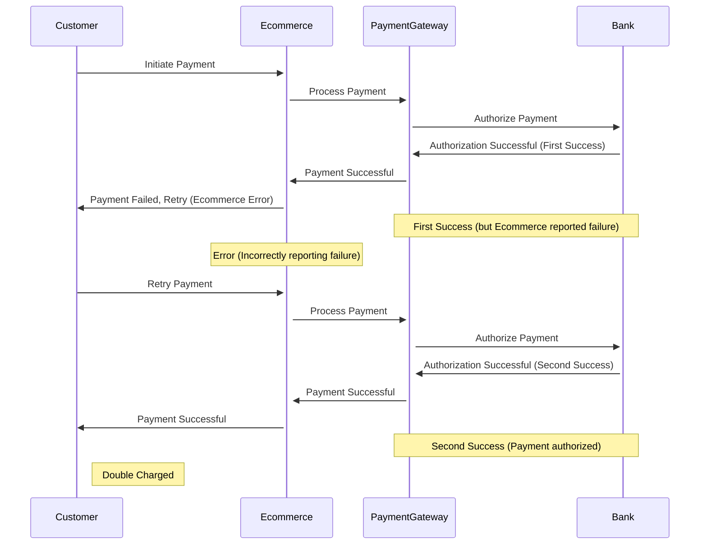
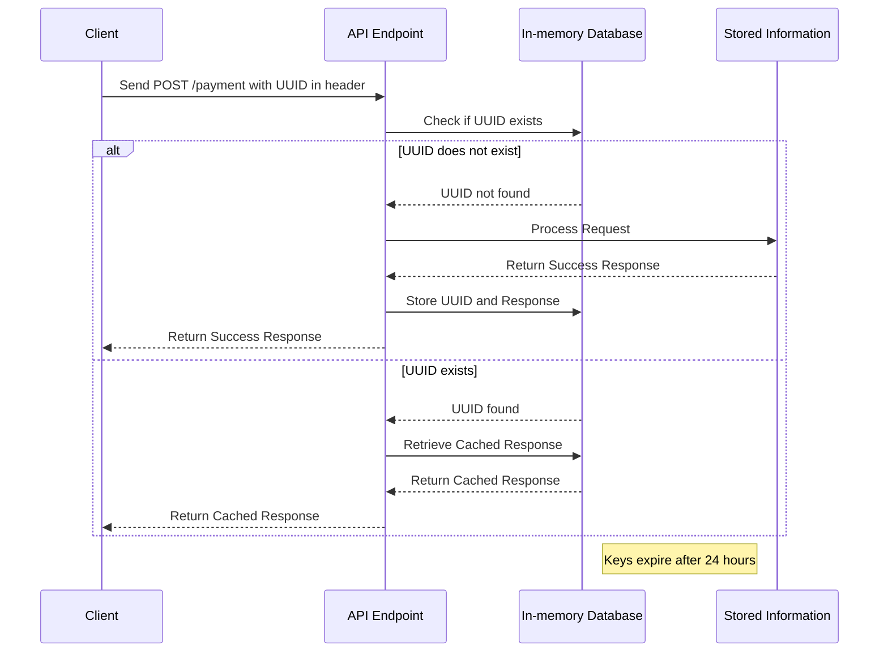
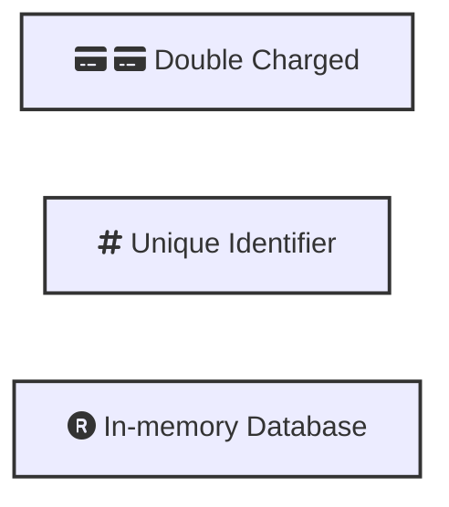

## Problem
In e-commerce systems, double payment errors can occur when customers are charged twice for the same transaction. 




This issue can arise due to various reasons, such as:


1. **Server Errors**: Interruptions during the processing of payment requests can lead to incomplete transactions, causing customers to retry the payment.
2. **Network Errors**: Unstable internet connections may prevent customers from receiving confirmation of a successful transaction, prompting them to initiate another payment.




In the scenario above, the payment gateway successfully processes the payment, but the e-commerce system incorrectly reports a failure to the customer. As a result, the customer retries the payment, leading to a double charge.


## Solution

To address the issue of double payment errors, a robust solution involves implementing an idempotent API by using unique identifiers known as idempotency keys. These keys ensure that each request is processed only once, even if the same request is sent multiple times.





## Idempotency Key

Each payment request is assigned a unique identifier, known as an idempotency key. This key is included in the request headers. Generate a new UUID whenever the request payload changes
   
   ```javascript
   const axios = require('axios');
   const { v4: uuidv4 } = require('uuid');

   const idempotencyKey = uuidv4();

   axios.post('https://api.example.com/payment', {
     // request body
   }, {
     headers: {
       'Idempotency-Key': idempotencyKey
     }
   })
   .then(response => {
     console.log(response.data);
   })
   .catch(error => {
     console.error(error);
   });
   ```


## In-memory Database

 **In-memory Database**: The server maintains an in-memory database to manage these idempotency keys. When a request is received, the server checks if the key already exists in the database.

- **Efficiency**: Since idempotency keys are short-lived (typically around 24 hours), storing them in memory is efficient. There's no need for the persistent storage capabilities of traditional disk-based databases.

- **Scalability**: In-memory databases can handle a large number of read and write operations per second, making them highly scalable. This is important for systems that process a high volume of transactions and need to quickly verify the uniqueness of idempotency keys.

- **Simplicity**: Managing short-lived, transient data such as idempotency keys is simpler in an in-memory database. There's no need to implement complex data management or storage policies that would be necessary for longer-lived data.

- **Consistent Performance**: In-memory databases provide consistent performance because data retrieval times are not affected by disk I/O, leading to predictable and reliable transaction processing times.


## Handling Requests

 - **New Request**: If the idempotency key is not found, the server processes the request, stores the result (including response body and status code), and saves the key in the database.
 - **Duplicate Request**: If the idempotency key is found, the server retrieves the stored response and returns it to the client without reprocessing the request.

 - **Key Expiry**: Idempotency keys and their associated responses are stored for a limited time (e.g., 24 hours). After this period, the keys expire and are removed from the database, allowing the same key to be reused if necessary.
- **Retry Mechanism**: To handle temporary issues like server errors or network instability, a retry mechanism using exponential backoff with jitter is employed. This algorithm gradually increases the wait time between retries and adds randomness to avoid simultaneous retries from multiple clients.


## Conclusion

  ```mermaid
  graph TD
    subgraph benefits["fa:fa-thumbs-up Benefits"]
        reliability["fa:fa-check Reliable Transactions"]
        consistency["fa:fa-balance-scale Consistent Processing"]
        scalability["fa:fa-chart-line Scalable Architecture"]
    end

    reliability --> |Prevents double payment errors| benefits
    consistency --> |Ensures each request is processed once| benefits
    scalability --> |Handles high transaction volumes| benefits
  ``` 


Implementing an idempotent API is a reliable way to prevent double payment errors in e-commerce systems. By assigning unique idempotency keys to each request and storing them in an in-memory database, you can ensure that transactions are processed only once, even if the same request is sent multiple times. This approach enhances the reliability and consistency of payment processing, leading to a better customer experience and fewer payment-related issues.

## Keywords To Remember



## References
- [systemdesign.one - Neo Kim](https://newsletter.systemdesign.one/p/idempotent-api)


