## The Bucket Pattern

When dealing with time series data, storing each measurement in its own document can lead to issues with data and index size as the application scales. For instance, a system recording heart rate several times a day would generate a new document for each measurement. This method requires indexing `employee_id` and `timestamp` for each entry.

By using the Bucket Pattern, data is grouped into documents based on time spans, reducing the number of documents and simplifying queries. This pattern stores measurements from a specific period in a single document, which includes aggregated information such as the sum of heart rates and the number of measurements.

## Before and After Applying the Bucket Pattern

**Original Data Stream**

```json
{
  "employee_id": 67890,
  "timestamp": "2023-07-01T08:00:00.000Z",
  "heart_rate": 72
},
{
  "employee_id": 67890,
  "timestamp": "2023-07-01T12:00:00.000Z",
  "heart_rate": 75
},
{
  "employee_id": 67890,
  "timestamp": "2023-07-01T16:00:00.000Z",
  "heart_rate": 70
}
```


## Data Stream with Bucket Pattern

Bucketing the data by day: storing all measurements for July 1, 2023, in a single document.

```json
{
  "employee_id": 67890,
  "date": "2023-07-01",
  "measurements": [
    {
      "timestamp": "2023-07-01T08:00:00.000Z",
      "heart_rate": 72
    },
    {
      "timestamp": "2023-07-01T12:00:00.000Z",
      "heart_rate": 75
    },
    {
      "timestamp": "2023-07-01T16:00:00.000Z",
      "heart_rate": 70
    }
  ],
  "transaction_count": 3,
  "sum_heart_rate": 217
}
```


## Benefits of the Bucket Pattern

1. **Index Size Savings**: Reduces the number of documents and indexes required.
2. **Query Simplification**: Pre-aggregated data simplifies queries.
3. **Efficient Data Storage**: Moves old data to archives to reduce load.
4. **Easy Aggregation**: Quickly calculates metrics like average heart rate from aggregated data.

By applying the Bucket Pattern, data for specific periods can be efficiently stored, queried, and archived, improving performance and scalability.

### Example: Calculating Average Heart Rate

With pre-aggregated `sum_heart_rate` and `transaction_count`, the average heart rate can be easily calculated:

```javascript
const averageHeartRate = sum_heart_rate / transaction_count;
```

By storing the sum and the count of the heart rate measurements, you can easily calculate the average heart rate for any desired time period. This approach allows you to perform additional calculations, such as summing heart rates across multiple buckets.

### Archiving Data

Old buckets can be moved to an archive, reducing the active data load. For example, heart rate data from several years ago can be archived since it is less frequently accessed.


## Mongoose Schema

If you are using MongoDB with Mongoose, you can define a schema for the bucket pattern as follows:

```javascript
const mongoose = require('mongoose');
const { Schema } = mongoose;

const measurementSchema = new Schema({
  timestamp: {
    type: Date,
    required: true,
  },
  heart_rate: {
    type: Number,
    required: true,
  },
});

const bucketSchema = new Schema({
  employee_id: {
    type: Number,
    required: true,
    index: true, // Indexing employee_id for efficient queries
  },
  date: {
    type: Date,
    required: true,
    index: true, // Indexing date for efficient queries
  },
  measurements: [measurementSchema], // Array of measurement sub-documents
  transaction_count: {
    type: Number,
    default: 0,
  },
  sum_heart_rate: {
    type: Number,
    default: 0,
  },
});

const Bucket = mongoose.model('Bucket', bucketSchema);

module.exports = Bucket;
```

## More Use Cases

- **Financial Transactions**: Storing daily transaction data in buckets for each account.
- **Sensor Readings**: Grouping sensor readings by hour or day for analysis.
- **Website Traffic**: Aggregating website traffic data by day or week for reporting.
- **Stock Prices**: Storing stock price data in buckets for each trading day.
- **Weather Data**: Grouping weather data by day or week for historical analysis.


## Considerations

- **Bucket Size**: Determine the optimal bucket size based on the frequency of data collection and the desired query performance. For example, buckets could be hourly, daily, or weekly.
- **Data Types**: While the example uses heart rate data, it would be helpful to mention that the bucket pattern can be applied to various types of time series data (e.g., financial transactions, sensor readings).
- **Time Series Databases**: Consider using time series databases for optimized storage and querying of time series data.

## Summary

The Bucket Pattern groups time series data into larger documents, reducing the number of documents and simplifying queries. This approach provides significant benefits in terms of performance, scalability, and efficient data storage, especially for applications dealing with large volumes of time series data.

## References   

- [Mongodb Bucket Pattern](https://www.mongodb.com/blog/post/building-with-patterns-the-bucket-pattern)

## Keywords To Remember

```mermaid
graph 
 subgraph  
        aggregation["📊 Aggregation"]
        archive["🗄️ Archive"]
        index["🔍 Index"] 
    end
    subgraph  
        timeSeriesData["⏲️ Time Series Data"]
        bucket["🪣 Bucket"]
    end 
   
```


