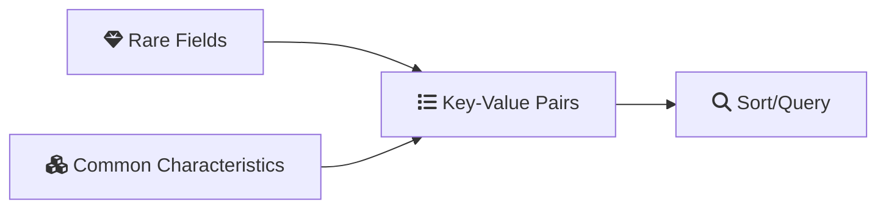
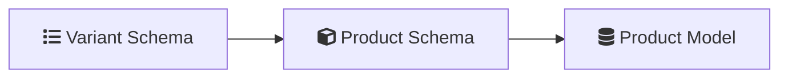
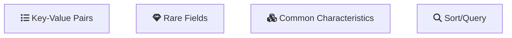

The **Attribute Pattern** is especially useful in the following scenarios:

- When dealing with large documents that have numerous similar fields, but a subset of these fields shares common characteristics, and we need to sort or query this subset.
- When the fields required for sorting are present only in a small subset of documents.

- When both of the above conditions apply to the documents.

To optimize our search performance, we might need multiple indexes for all subsets. However, creating many indexes can degrade performance. The Attribute Pattern offers an efficient solution for these scenarios.




## Original Data Structure

Let's consider a collection of products. Each document likely has fields such as product ID, name, base price, and various attributes such as color and storage options. If we want to search by attribute, the challenge is determining which attribute to use since products often have different variants.


```js
{
  "product_id": 12345,
  "name": "Smartphone",
  "base_price": 699.99,
  "color_variant_red": 749.99,
  "color_variant_blue": 739.99,
  "color_variant_green": 729.99,
  "storage_64gb": 699.99,
  "storage_128gb": 799.99,
  "storage_256gb": 899.99
}
```

Searching for a specific attribute would require multiple indexes:

```js
{ "color_variant_red": 1 }
{ "color_variant_blue": 1 }
{ "color_variant_green": 1 }
{ "storage_64gb": 1 }
{ "storage_128gb": 1 }
{ "storage_256gb": 1 }
```

## Improved Data Structure with the Attribute Pattern

By using the Attribute Pattern, we move the subset of attributes into an array of key-value pairs:

```js
{
  "product_id": 12345,
  "name": "Smartphone",
  "base_price": 699.99,
  "variants": [
    { "type": "color", "value": "red", "price": 749.99 },
    { "type": "color", "value": "blue", "price": 739.99 },
    { "type": "color", "value": "green", "price": 729.99 },
    { "type": "storage", "value": "64gb", "price": 699.99 },
    { "type": "storage", "value": "128gb", "price": 799.99 },
    { "type": "storage", "value": "256gb", "price": 899.99 }
  ]
}
```

Now, indexing becomes more manageable:

```js
{ "variants.type": 1, "variants.value": 1 }
```

## Handling Rare/Unpredictable Fields
In cases where products have rare or unique attributes, such as a limited edition variant, the Attribute Pattern provides a flexible solution:

```js
{
  "product_id": 12345,
  "name": "Smartphone",
  "base_price": 699.99,
  "limited_edition_gold_plated": 1299.99
}
```


**Improved Data Structure**:
```js
{
  "product_id": 12345,
  "name": "Smartphone",
  "base_price": 699.99,
  "variants": [
    { "type": "limited_edition", "value": "gold_plated", "price": 1299.99 }
  ]
}
```

## Mongoose Schema

If you're using Mongoose with Node.js, you can define the schema as follows:




```javascript
const mongoose = require('mongoose');
const { Schema } = mongoose;

const variantSchema = new Schema({
  type: {
    type: String,
    required: true,
  },
  value: {
    type: String,
    required: true,
  },
  price: {
    type: Number,
    required: true,
  },
});

const productSchema = new Schema({
  product_id: {
    type: Number,
    required: true,
    index: true, // Indexing product_id for efficient queries
  },
  name: {
    type: String,
    required: true,
  },
  base_price: {
    type: Number,
    required: true,
  },
  variants: [variantSchema], // Array of variant sub-documents
});

const Product = mongoose.model('Product', productSchema);

module.exports = Product;
```

## More Use Cases


1. **User Profiles with Custom Fields**:
   Social networks or professional platforms often allow users to add custom fields to their profiles. The Attribute Pattern can handle these efficiently:

   ```js
   {
     "user_id": "12345",
     "name": "John Doe",
     "email": "john@example.com",
     "attributes": [
       { "key": "skillset", "value": "JavaScript" },
       { "key": "languages", "value": "English" },
       { "key": "certifications", "value": "AWS Certified Developer" }
     ]
   }
   ```

2. **Content Management Systems (CMS)**:
   CMS platforms often need to handle different types of content with varying metadata:

   ```js
   {
     "content_id": "67890",
     "title": "10 Tips for Productive Remote Work",
     "content_type": "article",
     "metadata": [
       { "key": "author", "value": "Jane Smith" },
       { "key": "category", "value": "Productivity" },
       { "key": "reading_time", "value": "5 minutes" }
     ]
   }
   ```

3. **IoT Device Management**:
   IoT devices can have various sensors and capabilities that can be represented using the Attribute Pattern:

   ```js
   {
     "device_id": "sensor-001",
     "type": "environmental_sensor",
     "location": "warehouse-a",
     "sensors": [
       { "type": "temperature", "unit": "celsius", "value": 22.5 },
       { "type": "humidity", "unit": "percent", "value": 45 },
       { "type": "air_quality", "unit": "aqi", "value": 50 }
     ]
   }
   ```


## Summary

The Attribute Pattern groups similar fields into key-value pairs, reducing the need for multiple indexes and simplifying queries. This approach improves performance and scalability, making it ideal for applications dealing with diverse and unpredictable data structures.

## References   

- [MongoDB Attribute Pattern](https://www.mongodb.com/developer/products/mongodb/attribute-pattern/)

## Keywords To Remember

