## Outlier Pattern

Imagine you're building a social media platform where users can create posts, and others can like, comment, or share those posts. In most cases, the number of interactions per post is manageable. However, viral posts can accumulate massive amounts of likes, comments, and shares, potentially exceeding the document size limit or impacting query performance.


## Applying the Outlier Pattern


**Original Data Structure:**

Most posts have a reasonable number of interactions stored directly within the post document.

```js
{
  "_id": ObjectId("507f1f77bcf86cd799439011"),
  "content": "Check out my new blog post!",
  "likes": ["user00", "user01", "user02"], 
  "comments": ["user03", "user04"], 
  "shares": ["user05"]
}
```

**Outlier Post:**

When a post goes viral and accumulates a large number of interactions, you create an "overflow" document to store the excess data.

```mermaid
graph TD
    subgraph originalData["📁 Original Data Structure"]
        post["fa:fa-file Post: Cute Cat Video"]
        likes1["fa:fa-thumbs-up Likes: user00, user01, ..., user9999"]
        hasExtras["⚠️ Has Overflow Likes: true"]
        style post fill:#f9,stroke:#333,stroke-width:4px
        style likes1 fill:#bbf,stroke:#333,stroke-width:2px
        style hasExtras fill:#faa,stroke:#333,stroke-width:2px
    end
    post --> |contains|likes1
    post --> |indicates overflow|hasExtras

    subgraph overflowData["📁 Overflow Data"]
        postID["fa:fa-id-card Post ID: 507f191e810c19729de860ea"]
        likes2["fa:fa-thumbs-up Overflow Likes: user10000, user10001, ..."]
        style postID fill:#f9,stroke:#333,stroke-width:4px
        style likes2 fill:#bbf,stroke:#333,stroke-width:2px
    end
    postID --> |links to|likes2

```



```js
{
  "_id": ObjectId("507f191e810c19729de860ea"),
  "content": "This cute cat video is going viral!",
  "likes": ["user00", "user01", ..., "user9999"],
  "has_overflow_likes": true
}
```

**Overflow Document for Likes:**

```js
{
  "_id": ObjectId("507f191e810c19729de860eb"), 
  "post_id": ObjectId("507f191e810c19729de860ea"), 
  "overflow_likes": ["user10000", "user10001", ...] 
}
```


## Benefits of the Outlier Pattern

* **Optimized Performance:** Most posts are stored efficiently, leading to faster queries and better overall performance.
* **Scalability:** Viral posts won't hinder the system's scalability.
* **Flexibility:** You can easily add overflow documents for other types of interactions (comments, shares) as needed.

## Mongoose Schema

Here's a Mongoose schema for implementing the Outlier Pattern:

```javascript
const mongoose = require('mongoose');
const { Schema } = mongoose;

// Schema for overflow documents
const overflowSchema = new Schema({
  post_id: {
    type: mongoose.Schema.Types.ObjectId,
    required: true,
    ref: 'Post'
  },
  overflow_likes: [String]
  // Similarly, you can add fields for overflow_comments, overflow_shares, etc.
});

// Schema for regular post documents
const postSchema = new Schema({
  content: {
    type: String,
    required: true
  },
  likes: [String],
  comments: [String],
  shares: [String],
  has_overflow_likes: {
    type: Boolean,
    default: false
  }
  // Similarly, you can add fields for has_overflow_comments, has_overflow_shares, etc.
});

const Post = mongoose.model('Post', postSchema);
const Overflow = mongoose.model('Overflow', overflowSchema);

module.exports = { Post, Overflow };
```

## Retrieving All Likes

To retrieve all likes for a post where the `has_overflow_likes` flag is true:

```javascript

async function getAllLikes(postId) {
  // Find the post with the given ID
  const post = await Post.findById(postId);
  if (!post) {
    throw new Error('Post not found');
  }

  // Get all likes from the main post document
  let allLikes = [...post.likes];

  // If the post has overflow likes, get them from the overflow document
  if (post.has_overflow_likes) {
    const overflow = await Overflow.findOne({ post_id: postId });
    if (overflow) {
      allLikes = allLikes.concat(overflow.overflow_likes);
    }
  }

  return allLikes;
}

```


To add a new like to a post:

```javascript

const LIKES_THRESHOLD = 10000;

async function addLike(postId, userId) {
  const session = await mongoose.startSession();
  session.startTransaction();

  try {
    const post = await Post.findById(postId).session(session);
    if (!post) {
      throw new Error('Post not found');
    }

    if (post.has_overflow_likes) {
      await addToOverflowLikes(postId, userId, session);
    } else if (post.likes.length >= LIKES_THRESHOLD) {
      await createOverflowDocument(post, userId, session);
    } else {
      await addToPostLikes(post, userId, session);
    }

    await session.commitTransaction();
    session.endSession();

    return await Post.findById(postId);
  } catch (error) {
    await session.abortTransaction();
    session.endSession();
    console.error('Error adding like:', error.message);
    throw error;
  }
}

async function addToOverflowLikes(postId, userId, session) {
  await Overflow.updateOne(
    { post_id: postId },
    { $addToSet: { overflow_likes: userId } },
    { session }
  );
}

async function createOverflowDocument(post, userId, session) {
  post.has_overflow_likes = true;
  await Overflow.create([{
    post_id: post._id,
    overflow_likes: [userId]
  }], { session });
  await post.save({ session });
}

async function addToPostLikes(post, userId, session) {
  post.likes.addToSet(userId);
  await post.save({ session });
}

```

## Summary

The Outlier Pattern groups similar fields into key-value pairs, reducing the need for multiple indexes and simplifying queries. This approach improves performance and scalability, making it ideal for applications dealing with diverse and unpredictable data structures.

## Considerations

* **Application Logic:** Your application code needs to handle the logic for checking for overflow documents and retrieving the additional data when needed.
* **Data Consistency:** Ensure data consistency between the main post document and its overflow documents.
* **Code Maintenance:** Additional code maintenance may be required over time due to handling outliers within the application code.

## References

- [MongoDB Outlier Pattern](https://www.mongodb.com/blog/post/building-with-patterns-the-outlier-pattern)

