## Outlier Pattern

Imagine you're building a social media platform where users can create posts, and others can like, comment, or share those posts. In most cases, the number of interactions per post is manageable. However, viral posts can accumulate massive amounts of likes, comments, and shares, potentially exceeding the document size limit or impacting query performance.

```mermaid
graph TD
    subgraph originalData["📁 Original Data Structure"]
        post["🐈 Post: Cute Cat Video"]
        likes1["👍 Likes: user00, user01, ..., user999"]
    end
    post --> likes1
```



## Applying the Outlier Pattern

**Original Data Structure:**

Most posts have a reasonable number of interactions stored directly within the post document.

```js
{
  "_id": ObjectId("507f1f77bcf86cd799439011"),
  "content": "Check out my new blog post!",
  "likes": ["user00", "user01", "user02"], 
  "comments": [
    { "user": "user03", "text": "Great post!" },
    { "user": "user04", "text": "Thanks for sharing!" }
  ], 
  "shares": ["user05"]
}
```

**Outlier Post:**

When a post goes viral and accumulates a large number of interactions, you create an "overflow" document to store the excess data.

```mermaid
graph TD
    subgraph originalData["📁 Original Data Structure"]
        post["fa:fa-file Post: Cute Cat Video"]
        likes1["fa:fa-thumbs-up Likes: user00, user01, ..., user999"]
        hasExtras["⚠️ Has Overflow: true"]
        style post fill:#f9,stroke:#333,stroke-width:4px
        style likes1 fill:#bbf,stroke:#333,stroke-width:2px
        style hasExtras fill:#faa,stroke:#333,stroke-width:2px
    end
    post --> |contains|likes1
    post --> |indicates overflow|hasExtras

    subgraph overflowData["📁 Overflow Data"]
        postID["fa:fa-id-card Post ID: 507f191e810c19729de860ea"]
        likes2["fa:fa-thumbs-up Overflow Likes: user1000, user1001, ..."]
        style postID fill:#f9,stroke:#333,stroke-width:4px
        style likes2 fill:#bbf,stroke:#333,stroke-width:2px
    end
    postID --> |links to|likes2
```



```js
// Main post document
{
  "_id": ObjectId("507f191e810c19729de860ea"),
  "content": "This cute cat video is going viral!",
  "likes": ["user00", "user01", ..., "user999"],
  "has_overflow": true
}

// Overflow document
{
  "_id": ObjectId("507f191e810c19729de860eb"), 
  "post_id": ObjectId("507f191e810c19729de860ea"), 
  "likes": ["user1000", "user1001", ...],
  "comments": [
    { "user": "user1002", "text": "Adorable!" },
    { "user": "user1003", "text": "Made my day!" }
  ]
}
```


## Benefits of the Outlier Pattern

* **Optimized Performance:** Most posts are stored efficiently, leading to faster queries and better overall performance.
* **Scalability:** Viral posts won't hinder the system's scalability.
* **Flexibility:** You can easily add overflow documents for other types of interactions (comments, shares) as needed.

## Mongoose Schema

Here's an improved Mongoose schema for implementing the Outlier Pattern:

```javascript
const mongoose = require('mongoose');
const { Schema } = mongoose;

const commentSchema = new Schema({
  user: { type: String, required: true },
  text: { type: String, required: true },
  createdAt: { type: Date, default: Date.now }
});

const overflowSchema = new Schema({
  post_id: {
    type: Schema.Types.ObjectId,
    required: true,
    ref: 'Post'
  },
  likes: [String],
  comments: [commentSchema],
  shares: [String]
});

const postSchema = new Schema({
  content: {
    type: String,
    required: true
  },
  likes: [String],
  comments: [commentSchema],
  shares: [String],
  has_overflow: {
    type: Boolean,
    default: false
  }
});

const Post = mongoose.model('Post', postSchema);
const Overflow = mongoose.model('Overflow', overflowSchema);

module.exports = { Post, Overflow };
```

## Retrieving All Likes

To retrieve all likes for a post, including any overflow likes:

```javascript
async function getAllLikes(postId) {
  const post = await Post.findById(postId);
  if (!post) {
    throw new Error('Post not found');
  }

  let allLikes = [...post.likes];

  if (post.has_overflow) {
    const overflow = await Overflow.findOne({ post_id: postId });
    if (overflow && overflow.likes) {
      allLikes = allLikes.concat(overflow.likes);
    }
  }

  return allLikes;
}
```

## Adding a New Like

Here's an improved version of the function to add a new like to a post:

```javascript
const LIKES_THRESHOLD = 1000;

async function addLike(postId, userId) {
  const session = await mongoose.startSession();
  session.startTransaction();

  try {
    const post = await Post.findById(postId).session(session);
    if (!post) {
      throw new Error('Post not found');
    }

    if (post.likes.includes(userId) || (post.has_overflow && await userLikedInOverflow(postId, userId, session))) {
      throw new Error('User has already liked this post');
    }

    if (post.has_overflow) {
      await addToOverflow(postId, 'likes', userId, session);
    } else if (post.likes.length >= LIKES_THRESHOLD) {
      await createOverflowDocument(post, 'likes', userId, session);
    } else {
      post.likes.push(userId);
      await post.save({ session });
    }

    await session.commitTransaction();
    return post;
  } catch (error) {
    await session.abortTransaction();
    throw error;
  } finally {
    session.endSession();
  }
}

async function userLikedInOverflow(postId, userId, session) {
  const overflow = await Overflow.findOne({ post_id: postId }).session(session);
  return overflow && overflow.likes.includes(userId);
}

async function addToOverflow(postId, field, value, session) {
  await Overflow.updateOne(
    { post_id: postId },
    { $addToSet: { [field]: value } },
    { session }
  );
}

async function createOverflowDocument(post, field, value, session) {
  post.has_overflow = true;
  await Overflow.create([{
    post_id: post._id,
    [field]: [value]
  }], { session });
  await post.save({ session });
}
```

## More Use Cases

* **Comments:** Implement a similar approach for comments, creating overflow documents when the number of comments exceeds a certain threshold.
* **IOT sensor data:** In IoT systems, most sensors might report data within expected ranges. However, during anomalies or critical events, certain sensors might generate an unusually high volume of data points. The Outlier Pattern can help manage these spikes without affecting the overall system performance.
* **Transaction History:** In financial systems, most users might have a limited number of transactions. However, high-frequency traders or large corporations might generate a massive number of transactions. By separating these outliers into overflow documents, you can maintain optimal performance for the majority of users.


## Considerations

* **Application Logic:** Your application must handle checking for overflow documents and retrieving additional data when needed.
* **Data Consistency:** Ensure consistency between the main post document and its overflow documents, especially during concurrent operations.
* **Query Complexity:** Retrieving complete data may require multiple queries, potentially impacting read performance.
* **Indexing Strategy:** Carefully consider indexing on both main and overflow collections to optimize query performance.
* **Handling Extreme Outliers** : We can create multiple levels of overflow documents, shard the overflow collection.

## Summary

The Outlier Pattern efficiently handles viral posts or other data outliers by storing excess data in separate overflow documents. This approach ensures optimal performance for the majority of data while accommodating extreme outliers. By carefully managing the transition between main and overflow documents, you can maintain data consistency and query performance across the system.


## References

- [MongoDB Outlier Pattern](https://www.mongodb.com/blog/post/building-with-patterns-the-outlier-pattern)

