## Computed Pattern

The Computed Pattern involves precomputing values and storing the results to optimize performance and reduce CPU workload. This approach is particularly beneficial for applications with high read-to-write ratios, enhancing query speed and system scalability.

```mermaid
graph LR
    subgraph reviewData["📊 Review Data"]
        subgraph reviews[" "]
         review1["⭐ Review 1: 5 stars"]
         review2["⭐ Review 2: 4 stars"]
         review3["⭐ Review 3: 3 stars"]
        end
        style reviews stroke-width:0px
    end
    subgraph computationProcess["🧮 Computation Process"]
        avgRating["fa:fa-calculator Calculate Average"]
        totalReviews["fa:fa-list-ol Count Reviews"]
    end
    subgraph productData["📦 Product Data"]
        subgraph computed
            storedAvg["fa:fa-star Avg Rating: 4"]
            storedCount["fa:fa-hashtag Review Count: 3"]
        end
        style computed fill:#bff,stroke:#333,stroke-width:2px
    end

    reviewData -->  computationProcess
    avgRating --> |"Store"| storedAvg
    totalReviews --> |"Store"| storedCount


```



## Applying the Computed Pattern

### Original Data Structure:

In an e-commerce platform, each product can receive multiple ratings from users. Storing and recalculating the average rating on-the-fly for each view can be resource-intensive.

```javascript
{
  "_id": ObjectId("507f1f77bcf86cd799439011"),
  "product_name": "Wireless Mouse",
  "reviews": [
    {"user": "user01", "rating": 5, "date": ISODate("2024-08-01")},
    {"user": "user02", "rating": 4, "date": ISODate("2024-08-02")},
    {"user": "user03", "rating": 3, "date": ISODate("2024-08-03")}
  ]
}
```

### Computed Data Structure:

By applying the Computed Pattern, we precompute the average rating and total review count, storing them in the product document.


```javascript
{
  "_id": ObjectId("507f191e810c19729de860ea"),
  "product_name": "Wireless Mouse",
  "computed": {
    "average_rating": 4,
    "total_reviews": 3,
    "last_updated": ISODate("2024-08-04")
  },
  "reviews": [
    {"user": "user01", "rating": 5, "date": ISODate("2024-08-01")},
    {"user": "user02", "rating": 4, "date": ISODate("2024-08-02")},
    {"user": "user03", "rating": 3, "date": ISODate("2024-08-03")}
  ]
}
```

## Benefits of the Computed Pattern

* **Optimized Performance:** Precomputing values reduces the load on the CPU, leading to faster queries and better overall performance.
* **Scalability:** Efficiently managing computation ensures the system can scale without significant performance degradation.
* **Flexibility:** Aggregated data can be recomputed as needed without altering the source data.
* **Real-time Analytics:** Enables quick access to important metrics without complex aggregation queries.

## Mongoose Schema

If you're using Mongoose with Node.js, you can define the schema as follows:

```javascript
const mongoose = require('mongoose');
const { Schema } = mongoose;

const reviewSchema = new Schema({
  user: { type: String, required: true },
  rating: { type: Number, required: true, min: 1, max: 5 },
  date: { type: Date, default: Date.now }
});

const productSchema = new Schema({
  product_name: {
    type: String,
    required: true,
    index: true
  },
  computed: {
    average_rating: {
      type: Number,
      default: 0,
      min: 0,
      max: 5
    },
    total_reviews: {
      type: Number,
      default: 0,
      min: 0
    },
    last_updated: {
      type: Date,
      default: Date.now
    }
  },
  reviews: [reviewSchema]
});

productSchema.index({ 'computed.average_rating': -1 });

const Product = mongoose.model('Product', productSchema);

module.exports = { Product };
```

## Computing Aggregated Data

To compute and update the average rating for a product:

```javascript
async function updateProductComputedData(productId) {
  const product = await Product.findById(productId);
  if (!product) {
    throw new Error('Product not found');
  }

  const totalRating = product.reviews.reduce((sum, review) => sum + review.rating, 0);
  const totalReviews = product.reviews.length;

  product.computed = {
    average_rating: totalReviews > 0 ? totalRating / totalReviews : 0,
    total_reviews: totalReviews,
    last_updated: new Date()
  };

  await product.save();
  return product;
}

// Usage
try {
  const updatedProduct = await updateProductComputedData('507f191e810c19729de860ea');
  console.log('Updated product:', updatedProduct);
} catch (error) {
  console.error('Error updating product:', error);
}
```

## More Use Cases

### Social Media Analytics

In social media platforms, precomputing engagement metrics can significantly improve performance.

```javascript
{
  "_id": ObjectId("507f191e810c19729de860eb"),
  "post_content": "Check out this amazing sunset!",
  "author": "user123",
  "created_at": ISODate("2024-08-01T18:30:00Z"),
  "computed": {
    "likes_count": 1542,
    "comments_count": 89,
    "shares_count": 256,
    "last_updated": ISODate("2024-08-04T12:00:00Z")
  }
}
```


### Content Recommendation Systems

For content platforms, precomputing user preferences and content popularity can enhance recommendation speed.

```javascript
{
  "_id": ObjectId("507f191e810c19729de860ed"),
  "user_id": "user456",
  "computed": {
    "favorite_genres": ["Sci-Fi", "Thriller", "Documentary"],
    "average_watch_time": 65, // in minutes
    "content_completion_rate": 0.78,
    "recommended_content_ids": ["movie123", "series456", "docu789"],
    "last_updated": ISODate("2024-08-04T20:15:00Z")
  }
}
```

### Financial Portfolio Analysis

For financial applications, precomputing portfolio performance metrics can provide quick insights.

```javascript
{
  "_id": ObjectId("507f191e810c19729de860ee"),
  "portfolio_id": "port789",
  "user_id": "investor101",
  "computed": {
    "total_value": 250000.00,
    "day_change_percentage": 0.025,
    "year_to_date_return": 0.11,
    "risk_score": 7,
    "sector_diversity_score": 0.8,
    "last_updated": ISODate("2024-08-04T22:00:00Z")
  },
  "holdings": [
    {"stock": "AAPL", "quantity": 100, "purchase_price": 150.00},
    {"stock": "GOOGL", "quantity": 50, "purchase_price": 2000.00},
    // ... more holdings
  ]
}
```

### IoT Device Monitoring

For IoT applications, precomputing device health and performance metrics can aid in proactive maintenance.

```javascript
{
  "_id": ObjectId("507f191e810c19729de860ef"),
  "device_id": "smartlock001",
  "type": "Smart Lock",
  "computed": {
    "battery_level": 0.75,
    "avg_daily_operations": 24,
    "days_since_last_maintenance": 45,
    "firmware_up_to_date": true,
    "failure_probability": 0.02,
    "last_updated": ISODate("2024-08-04T23:45:00Z")
  },
  "operation_log": [
    {"timestamp": ISODate("2024-08-04T23:30:12Z"), "action": "unlock", "user": "resident1"},
    {"timestamp": ISODate("2024-08-04T23:40:18Z"), "action": "lock", "user": "resident1"},
    // ... more logs
  ]
}
```


## Considerations

* **Application Logic:** Ensure that your application logic accounts for the timing and frequency of computations. Consider using database triggers or scheduled jobs for updates.
* **Data Consistency:** Maintain consistency between source data and computed results. Implement error handling and retry mechanisms for failed updates.


## Summary

The Computed Pattern efficiently handles repeated data computations by precomputing values and storing the results. This approach optimizes performance and scalability, making it ideal for applications with high read-to-write ratios and the need for quick access to aggregated data.

## Keywords To Remember

```mermaid
graph LR
    preCalculation["fa:fa-calculator Pre-Calculation"] --> computedPattern["🖥️  Computed Pattern"]
    timeSeriesData["fa:fa-clock Time Series Data"] --> bucketPattern["fa:fa-bucket Bucket Pattern"]
    overflow["fa:fa-exclamation-circle Overflow"] --> outlierPattern["fa:fa-exclamation-triangle Outlier Pattern"]
    keyValue["fa:fa-key Key-Value"] --> attributePattern["fa:fa-tags Attribute Pattern"]

```



## References

- [MongoDB Computed Pattern](https://www.mongodb.com/blog/post/building-with-patterns-the-computed-pattern)


