## Subset Pattern: Optimizing MongoDB Working Sets

Large documents with infrequently used data can cause working sets to exceed RAM, leading to performance issues.

The Subset Pattern addresses this by splitting frequently accessed data into a main collection and infrequently accessed data into a secondary collection.

```mermaid
graph LR
    subgraph dataAccess["🔄 Data Access"]
        query["🔍 Query"]
        mainData["📊 Main Data"]
        secondaryData["📚 Secondary Data"]
    end
    query --> |"Frequent Access"| mainData
    query --> |"Occasional Access"| secondaryData
```



## Split Data

For example, a product document may contain both product information and all reviews. By splitting the reviews into a separate collection, the main collection only contains the most recent reviews, reducing the working set size.

```mermaid
graph LR
    subgraph originalData["📄 Original Document"]
        productInfo["👜 Product Info"]
        allReviews["📝 All Reviews"]
    end
    subgraph splitData["🔀 Split Data"]
        subgraph mainCollection["📊 Main Collection"]
            productInfoSplit["🏷️ Product Info"]
            recentReviews["📝 Recent Reviews"]
        end
        subgraph secondaryCollection["📚 Secondary Collection"]
            oldReviews["📜 Old Reviews"]
        end
    end
    originalData --> |"Split"| splitData
    productInfo --> productInfoSplit
    allReviews --> recentReviews
    allReviews --> oldReviews

    style originalData fill:#eeeeee,stroke:#333,stroke-width:2px
    style splitData fill:#eeeeee,stroke:#333,stroke-width:2px
    style mainCollection fill:#dbf0fe,stroke:#333,stroke-width:2px
    style secondaryCollection fill:#e6f3ff,stroke:#333,stroke-width:2px
    style productInfo fill:#ffb3ba,stroke:#333,stroke-width:2px
    style allReviews fill:#ffdfba,stroke:#333,stroke-width:2px
    style productInfoSplit fill:#baffc9,stroke:#333,stroke-width:2px
    style recentReviews fill:#bae1ff,stroke:#333,stroke-width:2px
    style oldReviews fill:#ffffba,stroke:#333,stroke-width:2px
```




### Before

```javascript
{
  "_id": ObjectId("507f1f77bcf86cd799439011"),
  "name": "Super Widget",
  "reviews": [
    // Potentially hundreds of reviews
  ]
}
```

### After

Product Collection:
```javascript
{
  "_id": ObjectId("507f1f77bcf86cd799439011"),
  "name": "Super Widget",
  "reviews": [
     {
       "review_id": 123,
       "review_text": "Great widget."
       },
      {
        "review_id": 456,
        "review_text": "Awesome widget."
     }

  ]
}
```

Review Collection:
```javascript
[ {
  "review_id": 786,
  "product_id": ObjectId("507f1f77bcf86cd799439011"),
  "review_text": "Amazing widget."
},

{
  "review_id": 789,
  "product_id": ObjectId("507f1f77bcf86cd799439011"),
  "review_text": "Fantastic widget."
}
]
```

## Mongoose Schema

If you're using Mongoose with MongoDB, you can define separate schemas for the main collection and the secondary collection.

```javascript
const mongoose = require('mongoose');

// Review Schema
const reviewSchema = new mongoose.Schema({
  author: String,
  text: String,
  rating: Number,
  createdAt: { type: Date, default: Date.now }
});

// Product Schema
const productSchema = new mongoose.Schema({
  name: String,
  description: String,
  price: Number,
  recentReviews: [reviewSchema]
});

// Separate Review Schema
const separateReviewSchema = new mongoose.Schema({
  productId: { type: mongoose.Schema.Types.ObjectId, ref: 'Product' },
  author: String,
  text: String,
  rating: Number,
  createdAt: { type: Date, default: Date.now }
});

const Product = mongoose.model('Product', productSchema);
const SeparateReview = mongoose.model('SeparateReview', separateReviewSchema);
```

## Add and Get Reviews

```javascript
// Function to add a new review
async function addReview(productId, reviewData) {
  const product = await Product.findById(productId);
  if (!product) throw new Error('Product not found');

  const newReview = new SeparateReview({
    productId: product._id,
    ...reviewData
  });
  await newReview.save();

  product.recentReviews.push(reviewData);
  if (product.recentReviews.length > 10) {
    product.recentReviews.shift();
  }
  await product.save();
}

// Function to get all reviews for a product
async function getAllReviews(productId) {
  const recentReviews = await Product.findById(productId).select('recentReviews');
  const oldReviews = await SeparateReview.find({ productId });
  return [...recentReviews, ...oldReviews];
}
```

## More Use Cases

- **Social Media Platforms**: 
  - **User Posts**: Maintain recent posts in user document, older posts in a separate collection.
  - **Friends List**: Store active friends in user document, inactive friends separately.

- **Content Streaming Platforms**: 
  - **Video Comments**: Keep recent comments with video data, older comments in a separate collection.
  - **Watch History**: Store recent history in user profile, older history in a separate collection.


- **IoT Systems**: 
  - **Device Logs**: Maintain recent logs with device data, archive older logs separately.
  - **Sensor Data**: Keep recent readings in device document, historical data in a separate collection.

- **Financial Systems**
  - **Transaction History**: Store recent transactions in account document, older transactions separately.
  - **Portfolio Performance**: Keep current holdings and recent performance in main document, historical data separately.


## Considerations

- **Data Consistency**: Ensure consistency between main and secondary collections.
- **Query Complexity**: Manage queries that span both collections.
- **Data Growth**: Plan for data growth and archival strategies.

## Summary

The Subset Pattern is a powerful technique for optimizing MongoDB performance by reducing working set size. It involves splitting large documents into frequently and infrequently accessed data, storing them in separate collections.
Key benefits include:

- Improved query performance
- Reduced memory usage
- Better scalability for large datasets

However, it comes with trade-offs such as increased complexity in data management and potential for additional queries.

## Rerferences

- [MongoDB: Subset Pattern](https://www.mongodb.com/blog/post/building-with-patterns-the-subset-pattern)