## Overview of ACID and BASE

ACID and BASE are database transaction models that determine how databases organize and manipulate data. They differ in their approach to consistency and availability. ACID databases prioritize consistency and ensure strict transaction compliance, while BASE databases prioritize availability and allow more flexible transaction handling, which may result in temporary inconsistencies.

```mermaid
graph TD
    databaseModels["🗄️ Database Transaction Models"]
    acid["🪨 ACID"]
    base["☁️ BASE"]
    
    databaseModels --> acid
    databaseModels --> base
    
    acid --> |"Prioritizes"|acidConsistency["🔄 Consistency"]
    base --> |"Prioritizes"|baseAvailability["🔌 Availability"]
    
    acid --> |"Stands for"|acidFull["Atomicity, Consistency, Isolation, Durability"]
    base --> |"Stands for"|baseFull["Basically Available, Soft State, Eventually Consistent"]

    style databaseModels fill:#FFDDC1,stroke:#FF9A76,stroke-width:2px;
    style acid fill:#FFEEAD,stroke:#FFD700,stroke-width:2px;
    style base fill:#B3E5FC,stroke:#81D4FA,stroke-width:2px;
    style acidConsistency fill:#D1C4E9,stroke:#B39DDB,stroke-width:2px;
    style baseAvailability fill:#C8E6C9,stroke:#A5D6A7,stroke-width:2px;
    style acidFull fill:#FFECB3,stroke:#FFC107,stroke-width:2px;
    style baseFull fill:#B2EBF2,stroke:#80DEEA,stroke-width:2px;
```

## ACID Properties

ACID stands for Atomicity, Consistency, Isolation, and Durability. These properties ensure that database transactions are processed reliably.

- **Atomicity:** Ensures that all operations within a transaction are completed successfully. If any operation fails, the entire transaction is aborted, and the database remains unchanged.
- **Consistency:** Ensures that a transaction can only bring the database from one valid state to another, maintaining all predefined rules and constraints.
- **Isolation:** Ensures that transactions are executed independently, without interference from other transactions.
- **Durability:** Ensures that once a transaction is committed, the changes are permanent, even in the event of a system failure.

```mermaid
graph LR
    acid["🪨 ACID"]
    
    subgraph acidProperties["ACID Properties"]
        atomicity["⚛️ Atomicity: All or nothing transactions"]
        consistency["🔄 Consistency: Data integrity maintained"]
        isolation["🔒 Isolation: Concurrent transactions don't interfere"]
        durability["💪 Durability: Committed changes are permanent"]
    end
    
    acid --> atomicity
    acid --> consistency
    acid --> isolation
    acid --> durability
    
    style acid fill:#FFEEAD,stroke:#FFD700,stroke-width:2px;
    style acidProperties stroke:#FFC107,stroke-width:2px;
    style atomicity fill:#FFECB3,stroke:#FFC107,stroke-width:2px;
    style consistency fill:#D1C4E9,stroke:#B39DDB,stroke-width:2px;
    style isolation fill:#FFCDD2,stroke:#E57373,stroke-width:2px;
    style durability fill:#C8E6C9,stroke:#A5D6A7,stroke-width:2px;
```

## BASE Properties

BASE stands for Basically Available, Soft State, and Eventually Consistent. These properties ensure that the system remains available and can handle large amounts of data, even if it means some temporary inconsistencies.

- **Basically Available:** Ensures that the database is always available for reading and writing operations, even if some data might be inconsistent.
- **Soft State:** Indicates that the state of the system can change over time, even without input. This allows the system to remain flexible and available.
- **Eventually Consistent:** Ensures that, given enough time, the database will become consistent. This means temporary inconsistencies are acceptable as long as the database eventually reaches a consistent state.

```mermaid
graph LR
    base["☁️ BASE"]
    
    subgraph baseProperties["BASE Properties"]
        basicAvailability["🔌 Basically Available: Always accessible"]
        softState["☁️ Soft State: State may change over time"]
        eventualConsistency["⏳ Eventually Consistent: Consistency achieved over time"]
    end
    
    base --> basicAvailability
    base --> softState
    base --> eventualConsistency
    
    style base fill:#B3E5FC,stroke:#81D4FA,stroke-width:2px;
    style baseProperties fill:#B2EBF2,stroke:#80DEEA,stroke-width:2px;
    style basicAvailability fill:#FFF9C4,stroke:#FFEB3B,stroke-width:2px;
    style softState fill:#E1BEE7,stroke:#CE93D8,stroke-width:2px;
    style eventualConsistency fill:#BBDEFB,stroke:#64B5F6,stroke-width:2px;
```

## Key Differences

ACID and BASE databases have distinct characteristics that make them suitable for different use cases.

- **Scale:**
  - **ACID:** Scales vertically, often requiring powerful single machines to handle increased loads.
  - **BASE:** Scales horizontally, adding more nodes to handle increased loads.
- **Flexibility:**
  - **ACID:** Less flexible, often blocking records to maintain strict consistency.
  - **BASE:** More flexible, allowing multiple applications to update records simultaneously.
- **Performance:**
  - **ACID:** Performance can decrease with large data volumes due to strict transaction handling.
  - **BASE:** Capable of handling large, unstructured data with high throughput due to more relaxed consistency.
- **Synchronization:**
  - **ACID:** Requires synchronization, adding delays.
  - **BASE:** No synchronization at the database level, allowing for faster operations but potential temporary inconsistencies.

```mermaid
graph 
    differences["🔍 Key Differences"]
    
    subgraph acidCharacteristics["ACID Characteristics"]
        acidScaling["🔼 Vertical Scaling"]
        acidFlexibility["🔒 Less Flexible"]
        acidPerformance["📉 Decreased Performance for Large Data"]
        acidSync["🔄 Requires Synchronization"]
    end
    
    subgraph baseCharacteristics["BASE Characteristics"]
        baseScaling["↔️ Horizontal Scaling"]
        baseFlexibility["🔓 More Flexible"]
        basePerformance["📈 Improved Performance for Large Data"]
        baseSync["🚫 No Synchronization"]
    end
    
    differences --> acidCharacteristics
    differences --> baseCharacteristics
    
    style differences fill:#FFDDC1,stroke:#FF9A76,stroke-width:2px;
    style acidCharacteristics fill:#FFECB3,stroke:#FFC107,stroke-width:2px;
    style baseCharacteristics fill:#B2EBF2,stroke:#80DEEA,stroke-width:2px;
    style acidScaling fill:#FFCCBC,stroke:#FF7043,stroke-width:2px;
    style acidFlexibility fill:#FFE0B2,stroke:#FFB74D,stroke-width:2px;
    style acidPerformance fill:#D1C4E9,stroke:#B39DDB,stroke-width:2px;
    style acidSync fill:#C8E6C9,stroke:#A5D6A7,stroke-width:2px;
    style baseScaling fill:#FFCCBC,stroke:#FF7043,stroke-width:2px;
    style baseFlexibility fill:#FFE0B2,stroke:#FFB74D,stroke-width:2px;
    style basePerformance fill:#D1C4E9,stroke:#B39DDB,stroke-width:2px;
    style baseSync fill:#C8E6C9,stroke:#A5D6A7,stroke-width:2px;
```

## Use Cases

Both ACID and BASE databases are suited for different applications based on their properties and the requirements of the system.

- **ACID:**
  - **Enterprise Applications:** Require strict data consistency and reliability, such as banking systems where transaction integrity is crucial.
- **BASE:**
  - **High-volume Data Processing:** Suitable for applications that prioritize availability and can tolerate temporary inconsistencies, such as e-commerce websites where real-time access is essential.

```mermaid
graph TD
    
    acid["🪨 ACID"]
    base["☁️ BASE"]
    
    acid --> |"Suitable for"|acidUseCase["💼 Enterprise Applications"]
    base --> |"Suitable for"|baseUseCase["🛒 High-volume Data Processing"]
    
    acidUseCase --> bankingExample["🏦 Banking: Strict consistency required"]
    baseUseCase --> ecommerceExample["🛍️ E-commerce: Real-time access prioritized"]
    
    style acid fill:#FFEEAD,stroke:#FFD700,stroke-width:2px;
    style base fill:#B3E5FC,stroke:#81D4FA,stroke-width:2px;
    style acidUseCase fill:#FFE0B2,stroke:#FFB74D,stroke-width:2px;
    style baseUseCase fill:#B3E5FC,stroke:#81D4FA,stroke-width:2px;
    style bankingExample fill:#FFECB3,stroke:#FFC107,stroke-width

    style ecommerceExample fill:#B2EBF2,stroke:#80DEEA,stroke-width:2px;
```

## CAP Theorem and ACID vs BASE

The CAP theorem states that a distributed data store can provide only two out of the following three guarantees: Consistency, Availability, and Partition Tolerance.

- **Consistency:** Every read receives the most recent write or an error.
- **Availability:** Every request receives a response, without guarantee that it contains the most recent write.
- **Partition Tolerance:** The system continues to operate despite an arbitrary number of messages being dropped or delayed by the network between nodes.

ACID databases prioritize consistency and partition tolerance, whereas BASE databases prioritize availability and partition tolerance. This means a database cannot be both highly consistent and always available simultaneously.

```mermaid
graph LR
    capTheorem["🔺 CAP Theorem"]
    
    capTheorem --> consistency["🔄 Consistency"]
    capTheorem --> availability["🔌 Availability"]
    capTheorem --> partitionTolerance["🌐 Partition Tolerance"]
    
    capTheorem --> |"States"|chooseTwo["Choose two out of three"]
    
    chooseTwo --> acidChoice["ACID: Consistency + Partition Tolerance"]
    chooseTwo --> baseChoice["BASE: Availability + Partition Tolerance"]
    
    conclusion["❗ A database can't be both ACID and BASE simultaneously"]
    
    style capTheorem fill:#FFDDC1,stroke:#FF9A76,stroke-width:2px;
    style consistency fill:#D1C4E9,stroke:#B39DDB,stroke-width:2px;
    style availability fill:#C8E6C9,stroke:#A5D6A7,stroke-width:2px;
    style partitionTolerance fill:#FFF9C4,stroke:#FFEB3B,stroke-width:2px;
    style chooseTwo fill:#E0F7FA,stroke:#80DEEA,stroke-width:2px;
    style acidChoice fill:#FFEEAD,stroke:#FFD700,stroke-width:2px;
    style baseChoice fill:#B3E5FC,stroke:#81D4FA,stroke-width:2px;
    style conclusion fill:#FFDDC1,stroke:#FF9A76,stroke-width:2px;
```

These expanded explanations and diagrams with light colors provide a comprehensive overview of the differences between ACID and BASE database models, highlighting their properties, key differences, use cases, and their relationship to the CAP theorem.

## Blockchain and ACID vs BASE

Blockchain systems do not fit neatly into either the traditional ACID or BASE (models of database transactions.  They exhibit characteristics of both, creating a unique hybrid.

- **Basically Available**: Blockchain networks are designed to be highly available. The distributed nature of blockchain means that even if some nodes go down, the network remains operational.
- **Soft State**: The state of a blockchain can change over time, especially during the consensus process.
- **Eventually Consistent**: Blockchain achieves consistency over time through consensus mechanisms. However, this consistency is stronger than in typical BASE systems.
- **Atomicity**: Transactions in a block are typically atomic - they either all succeed or all fail.
- **Consistency**: Once a block is confirmed, it ensures a consistent state across the network.
- **Isolation**: Transactions are processed independently and do not interfere with each other.
- **Durability**: Once a block is added to the blockchain, it is immutable and cannot be altered.

Some researchers propose a new model called **SALT** (Sequential, Agreed-upon, Ledgered, Tamper-resistant) to better describe blockchain transactions.

## References

- [What’s the Difference Between an ACID and a BASE Database](https://aws.amazon.com/compare/the-difference-between-acid-and-base-database/)
- [SALT](https://www.cs.ucy.ac.cy/~dzeina/courses/epl646/presentations/2017-O5.pdf)

## Keywords To Remember

```mermaid
graph LR
  subgraph  
    acid["🪨  ACID"]
    base["☁️  BASE"]
    cap["🔺  CAP Theorem"]
    consistency["🔄  Consistency"]
  end  
```

