## Fundamentals

Redis (Remote Dictionary Server) is an open-source, in-memory data structure store that serves as a database, cache, and message broker. It's known for its blazing-fast performance and versatility, making it a popular choice for various applications.

```mermaid
graph LR
subgraph redisFundamentals["🗄️ Redis Fundamentals"]
    dataStructures["📊 Data Structures"]
    persistence["💾 Persistence"]
    transactions["🔄 Transactions"]
    pubSub["📡 Pub/Sub"]
end

style redisFundamentals fill:#e6f3ff,stroke:#333,stroke-width:2px
```



## Data Structures

Redis supports several data structures, each optimized for specific use cases:

```mermaid
graph LR
subgraph dataStructures["📊 Data Structures"]
    strings["🔤 Strings"]
    lists["📜 Lists"]
    sets["🎭 Sets"]
    sortedSets["🏆 Sorted Sets"]
    hashes["🗝️ Hashes"]
end

strings --> |"store"| simpleValues["Simple Values"]
lists --> |"maintain"| orderedElements["Ordered Elements"]
sets --> |"hold"| uniqueItems["Unique Items"]
sortedSets --> |"combine"| uniqueScored["Unique Scored Items"]
hashes --> |"represent"| fieldValuePairs["Field-Value Pairs"]

style dataStructures fill:#fff0f5,stroke:#333,stroke-width:2px
```



Before using ioredis, initialize the client:

```javascript
const Redis = require('ioredis');
const redis = new Redis();
```

- **Strings**: Basic key-value pairs, ideal for caching simple values.
  ```js
  # Redis CLI
  SET user:1:name "John Doe"
  GET user:1:name

  # ioredis
  await redis.set('user:1:name', 'John Doe');
  const name = await redis.get('user:1:name');
  ```

- **Lists**: Ordered collections of strings, perfect for queues or recent updates.
  ```js
  # Redis CLI
  LPUSH latest_news "Breaking: New Discovery"
  LRANGE latest_news 0 -1

  # ioredis
  await redis.lpush('latest_news', 'Breaking: New Discovery');
  const news = await redis.lrange('latest_news', 0, -1);
  ```

- **Sets**: Unordered collections of unique strings, useful for tagging or unique visitor tracking.
  ```js
  # Redis CLI
  SADD user:1:skills "python" "javascript" "redis"
  SMEMBERS user:1:skills

  # ioredis
  await redis.sadd('user:1:skills', 'python', 'javascript', 'redis');
  const skills = await redis.smembers('user:1:skills');
  ```

- **Sorted Sets**: Sets with a score for each member, great for leaderboards or priority queues.
  ```js
  # Redis CLI
  ZADD leaderboard 100 "player1" 95 "player2" 120 "player3"
  ZRANGE leaderboard 0 -1 WITHSCORES

  # ioredis
  await redis.zadd('leaderboard', 100, 'player1', 95, 'player2', 120, 'player3');
  const leaderboard = await redis.zrange('leaderboard', 0, -1, 'WITHSCORES');
  ```

- **Hashes**: Maps between string fields and string values, representing objects.
  ```js
  # Redis CLI
  HSET user:1 name "John Doe" age "30" city "New York"
  HGETALL user:1

  # ioredis
  await redis.hset('user:1', 'name', 'John Doe', 'age', '30', 'city', 'New York');
  const user = await redis.hgetall('user:1');
  ```




```mermaid
graph LR
    subgraph redisCommands["📁 Redis Commands by Data Structure"]
        subgraph strings["🔤 Strings"]
            setCommand["fa:fa-file-code SET"]
            getCommand["fa:fa-search GET"]
        end
        
        subgraph lists["📜 Lists"]
            lpushCommand["fa:fa-plus-circle LPUSH"]
            rpushCommand["fa:fa-plus-circle RPUSH"]
            lpopCommand["fa:fa-minus-circle LPOP"]
            rpopCommand["fa:fa-minus-circle RPOP"]
        end
        
        subgraph sets["🎭 Sets"]
            saddCommand["fa:fa-plus SADD"]
            sremCommand["fa:fa-minus SREM"]
            smembersCommand["fa:fa-list SMEMBERS"]
            sismemberCommand["fa:fa-question SISMEMBER"]
        end
        
        subgraph sortedSets["🏆 Sorted Sets"]
            zaddCommand["fa:fa-plus ZADD"]
            zremCommand["fa:fa-minus ZREM"]
            zrangeCommand["fa:fa-sort-amount-asc ZRANGE"]
            zrankCommand["fa:fa-signal ZRANK"]
        end
        
        subgraph hashes["🗝️ Hashes"]
            hsetCommand["fa:fa-file-code HSET"]
            hgetCommand["fa:fa-search HGET"]
        end
        
        subgraph general["🔧 General"]
            delCommand["fa:fa-trash DEL"]
        end
    end

    style redisCommands fill:#e0f7fa,stroke:#0288d1,stroke-width:2px
    style strings fill:#e8f5e9,stroke:#4caf50,stroke-width:2px
    style lists fill:#f3e5f5,stroke:#9c27b0,stroke-width:2px
    style sets fill:#ffe0b2,stroke:#ff9800,stroke-width:2px
    style sortedSets fill:#fff3e0,stroke:#ff9800,stroke-width:2px
    style hashes fill:#f1f8e9,stroke:#8bc34a,stroke-width:2px
    style general fill:#ffebee,stroke:#e91e63,stroke-width:2px
```

## Transactions

Redis Transactions allow executing a group of commands atomically. They involve commands like MULTI, EXEC, DISCARD, and WATCH. Transactions guarantee that commands are executed in sequence, ensuring isolation from other client requests. If EXEC is called, all queued commands are executed. If not, none are executed.

Transactions also support optimistic locking using WATCH, which monitors keys for changes. If any watched key is modified before EXEC, the transaction aborts.


```js

// Redis CLI
WATCH mykey
val = GET mykey
// ... perform some check or calculation with val ...
MULTI
SET mykey newval
// ... other commands ...
EXEC

// ioredis
const Redis = require('ioredis');
const redis = new Redis();

async function performTransactionWithOptimisticLock(key) {
  try {
    await redis.watch(key);
    
    // Get the current value and perform some operation
    const currentVal = await redis.get(key);
    const newVal = someOperation(currentVal);

    // Perform the transaction
    const result = await redis
      .multi()
      .set(key, newVal)
      // ... other commands ...
      .exec();
    
    if (result === null) {
      console.log('Transaction aborted due to concurrent modification');
      return false;
    } else {
      console.log('Transaction successful:', result);
      return true;
    }
  } catch (error) {
    console.error('Transaction error:', error);
    return false;
  }
}

function someOperation(value) {
  // Perform some operation on the value
  return value; // Placeholder for actual operation
}

// Usage
performTransactionWithOptimisticLock('mykey')
  .then(success => console.log('Transaction success:', success))
  .catch(error => console.error('Error:', error))
  .finally(() => redis.quit());
```

Redis transactions don't support partial execution or **rollbacks**. In the scenario of 10 operations, it's not possible for only 4 to succeed. Either all operations in the transaction are executed, or none are. This is a key feature of Redis transactions - they are atomic

If a watched key is changed between MULTI and EXEC, no error is thrown. Instead, the transaction is quietly aborted, and EXEC returns a null result (in ioredis) or an empty array (in Redis CLI). It's up to your code to check for this condition and handle it appropriately.

## Caching Layer 

Redis is an excellent choice for implementing a caching layer in Node.js applications due to its speed and ease of use. By caching frequently accessed data in Redis, you can significantly reduce the load on your database and improve response times for your users.


```javascript
const express = require('express');
const Redis = require('ioredis');
const app = express();

// Initialize Redis client
const redis = new Redis();

// Middleware to check cache
async function cache(req, res, next) {
  const { id } = req.params;
  
  try {
    // Check if the data is in Redis
    const cachedData = await redis.get(`user:${id}`);
    
    if (cachedData) {
      // If found, serve from cache
      return res.json(JSON.parse(cachedData));
    }
    
    // If not found, proceed to the next middleware
    next();
  } catch (err) {
    console.error('Error checking cache:', err);
    next();
  }
}

// Route to get user data
app.get('/user/:id', cache, async (req, res) => {
  const { id } = req.params;
  
  try {
    // Simulate a database query
    const user = await getUserFromDatabase(id);
    
    // Cache the result in Redis
    await redis.set(`user:${id}`, JSON.stringify(user), 'EX', 3600); // Cache for 1 hour
    
    res.json(user);
  } catch (err) {
    console.error('Error fetching user:', err);
    res.status(500).send('Server error');
  }
});

// Simulated database query function
async function getUserFromDatabase(id) {
  // Placeholder for actual database query

}

// Start the server
app.listen(3000, () => {
  console.log('Server running on port 3000');
});
```

### Key Concepts

- **Cache Key**: The key used to store and retrieve data from Redis. In the example above, `user:${id}` is used as the key.
- **Expiration (TTL)**: The time-to-live (TTL) for cached data, set using the `EX` option in Redis. This ensures that stale data is automatically removed after a certain period.
- **Cache Miss**: When data is not found in the cache, requiring a query to the database.
- **Cache Hit**: When data is found in the cache, allowing the request to be served without querying the database.


### Caching Strategies

- **Lazy Caching (Cache-aside)**: The application checks the cache first, and if the data isn't found, it queries the database and caches the result. This is the approach demonstrated above.
- **Write-through Caching**: Data is written to the cache at the same time it is written to the database, ensuring that the cache is always up-to-date.
- **Read-through Caching**: The application always queries the cache first. If the data is not found, the cache itself fetches the data from the database and updates the cache.

#### Lazy Caching (Cache-aside)

```mermaid
flowchart TD
    subgraph lazyCaching["🐢 Lazy Caching (Cache-aside)"]
        style lazyCaching fill:#e6f7ff,stroke:#69c0ff
        
        app["📱 Application"]
        cache["💾 Redis Cache"]
        db["🗄️ Database"]
        
        app --> |"1. Check cache"| cache
        cache --> |"2. Cache miss"| app
        app --> |"3. Query database"| db
        db --> |"4. Return data"| app
        app --> |"5. Update cache"| cache
    end
```



Lazy caching checks the cache first and only queries the database on a cache miss.

```javascript
app.get('/user/:id', async (req, res) => {
  const { id } = req.params;
  const cacheKey = `user:${id}`;

  try {
    let userData = await redis.get(cacheKey);

    if (!userData) {
      const result = await pool.query('SELECT * FROM users WHERE id = $1', [id]);
      userData = result.rows[0];

      if (userData) {
        await redis.setex(cacheKey, 3600, JSON.stringify(userData));
      }
    } else {
      userData = JSON.parse(userData);
    }

    res.json(userData || { error: 'User not found' });
  } catch (error) {
    console.error('Error:', error);
    res.status(500).json({ error: 'Internal server error' });
  }
});
```

Pros:
- Reduced database load
- Faster response times for cached data
- Only caches data that is actually requested

Cons:
- Initial requests for uncached data are slower
- Potential for stale data if not properly invalidated
- Complexity in managing cache consistency

#### Write-through Caching

```mermaid
flowchart TD
    subgraph writeThroughCaching["✍️ Write-through Caching"]
        style writeThroughCaching fill:#f6ffed,stroke:#95de64
        
        app["📱 Application"]
        cache["💾 Redis Cache"]
        db["🗄️ Database"]
        
        app --> |"1. Write data"| cache
        app --> |"1. Write data"| db
        cache --> |"2. Acknowledge"| app
        db --> |"2. Acknowledge"| app
    end
```



Write-through caching updates both the cache and the database simultaneously.

```javascript
app.post('/user', async (req, res) => {
  const { userData } = req.body;
  const userId = generateUniqueId();
  const cacheKey = `user:${userId}`;

  try {
    await Promise.all([
      redis.setex(cacheKey, 3600, JSON.stringify(userData)),
      pool.query('INSERT INTO users (id, data) VALUES ($1, $2)', [userId, userData])
    ]);

    res.json({ message: 'User created successfully', userId });
  } catch (error) {
    console.error('Error:', error);
    res.status(500).json({ error: 'Internal server error' });
  }
});
```

Pros:
- Cache is always up-to-date with the database
- Simplified read operations

Cons:
- Increased write latency
- Higher resource usage for writes
- May cache infrequently accessed data

#### Read-through Caching

```mermaid
flowchart TD
    subgraph readThroughCaching["📖 Read-through Caching"]
        style readThroughCaching fill:#fff7e6,stroke:#ffd591
        
        app["📱 Application"]
        cache["💾 Redis Cache"]
        db["🗄️ Database"]
        
        app --> |"1. Request data"| cache
        cache --> |"2. Cache miss"| db
        db --> |"3. Return data"| cache
        cache --> |"4. Update cache"| cache
        cache --> |"5. Return data"| app
    end
```



Read-through caching handles cache misses transparently, with the cache itself responsible for loading data from the database.

```javascript
class ReadThroughCache {
  constructor(redis, db) {
    this.redis = redis;
    this.db = db;
  }

  async get(key, fetchFn) {
    let data = await this.redis.get(key);

    if (!data) {
      data = await fetchFn();
      if (data) {
        await this.redis.setex(key, 3600, JSON.stringify(data));
      }
    } else {
      data = JSON.parse(data);
    }

    return data;
  }
}

const cache = new ReadThroughCache(redis, pool);

app.get('/user/:id', async (req, res) => {
  const { id } = req.params;
  const cacheKey = `user:${id}`;

  try {
    const userData = await cache.get(cacheKey, async () => {
      const result = await pool.query('SELECT * FROM users WHERE id = $1', [id]);
      return result.rows[0];
    });

    res.json(userData || { error: 'User not found' });
  } catch (error) {
    console.error('Error:', error);
    res.status(500).json({ error: 'Internal server error' });
  }
});
```

Pros:
- Simplified application logic
- Consistent caching behavior across the application
- Reduced chance of stale data compared to lazy loading

Cons:
- Increased complexity in cache implementation
- Potential for increased latency on cache misses
- May cache infrequently accessed data


## Pub/Sub

Redis Pub/Sub (Publish/Subscribe) is a messaging paradigm where senders (publishers) send messages to channels without knowledge of which receivers (subscribers) will receive them. Subscribers express interest in one or more channels and only receive messages from the channels they're subscribed to.

```mermaid
graph LR
    subgraph pubSub["📡 Redis Pub/Sub System"]
        publisher["👤 Publisher"]
        subscriber1["👥 Subscriber 1"]
        subscriber2["👥 Subscriber 2"]
        channel1["📢 Channel 1"]
        channel2["📢 Channel 2"]
    end

    publisher -->|"Publish"| channel1
    publisher -->|"Publish"| channel2
    channel1 -->|"Broadcast"| subscriber1
    channel1 -->|"Broadcast"| subscriber2
    channel2 -->|"Broadcast"| subscriber1

    style pubSub fill:#f5f5f5,stroke:#333,stroke-width:2px
    style publisher fill:#bbdefb,stroke:#1976d2,stroke-width:2px
    style subscriber1 fill:#c8e6c9,stroke:#388e3c,stroke-width:2px
    style subscriber2 fill:#c8e6c9,stroke:#388e3c,stroke-width:2px
    style channel1 fill:#ffe0b2,stroke:#f57c00,stroke-width:2px
    style channel2 fill:#ffe0b2,stroke:#f57c00,stroke-width:2px
```




1. **Channels**: Named destinations for messages. They don't need to be created explicitly.
2. **Publishers**: Clients that send messages to channels.
3. **Subscribers**: Clients that listen for messages on specific channels.
4. **Messages**: The data sent from publishers to subscribers via channels.

### Implementation with ioredis:

1. **Setting up connections**:
   ```javascript
   const publisher = new Redis();
   const subscriber = new Redis();
   ```
   We create separate Redis connections for publishing and subscribing to avoid blocking issues.

2. **Subscribing to channels**:
   ```javascript
   subscriber.subscribe('news_channel', 'tech_channel', (err, count) => {
     // Callback after subscription
   });
   ```
   A client can subscribe to multiple channels at once.

3. **Handling incoming messages**:
   ```javascript
   subscriber.on('message', (channel, message) => {
     console.log(`Received ${message} from ${channel}`);
   });
   ```
   This event listener is triggered for every message received on subscribed channels.

4. **Publishing messages**:
   ```javascript
   publisher.publish(channel, message, (err, count) => {
     // Callback after publishing
   });
   ```
   This sends a message to a specified channel. The callback receives the count of subscribers who received the message.

5. **Unsubscribing and cleanup**:
   ```javascript
   subscriber.unsubscribe();
   subscriber.quit();
   publisher.quit();
   ```
   It's important to properly close connections when they're no longer needed.

### Use Cases:

1. **Real-time notifications**: Sending updates to multiple clients simultaneously.
2. **Chat applications**: Broadcasting messages to chat rooms or users.
3. **Live feeds**: Distributing live data (e.g., stock prices, sports scores).
4. **Distributed system events**: Communicating events across different parts of a distributed system.

### Considerations:

- Messages are fire-and-forget. If a subscriber is offline, it won't receive messages sent while it was down.
- Redis Pub/Sub doesn't persist messages. For message queuing with persistence, consider Redis Streams.
- Subscribers that are subscribed to channels are in "subscriber mode" and can only use a subset of Redis commands.


## BullMQ

BullMQ is a modern, high-performance job queue for Node.js applications, built on top of Redis. It allows you to manage background jobs and tasks efficiently, leveraging Redis's speed and reliability.

### Key Concepts

BullMQ is designed to be scalable and robust, providing several key features:

- **Queues**: Manage jobs and tasks by organizing them into queues.
- **Workers**: Processes jobs from a queue, can be run concurrently.
- **Jobs**: The tasks you want to process, with support for retries, delays, and prioritization.
- **Events**: BullMQ emits events at different stages of a job's lifecycle, such as when a job is completed, failed, or delayed.


### Basic Usage

   ```javascript
   const { Queue, Worker, QueueScheduler } = require('bullmq');
   const IORedis = require('ioredis');

   // Redis connection
   const connection = new IORedis();

   // Create a new queue
   const myQueue = new Queue('myQueue', { connection });

   // Add a job to the queue
   myQueue.add('myJob', { foo: 'bar' });

   // Schedule worker to process jobs
   const worker = new Worker('myQueue', async job => {
     console.log(`Processing job: ${job.id}`);
     console.log(`Job data: ${JSON.stringify(job.data)}`);
     // Job processing logic here
   }, { connection });

   worker.on('completed', job => {
     console.log(`Job completed: ${job.id}`);
   });

   worker.on('failed', (job, err) => {
     console.log(`Job failed: ${job.id} - ${err.message}`);
   });
   ```




```mermaid
graph LR
    subgraph bullMQFlow["🚀 BullMQ Flow"]
        queue["📋 Queue"] --> |"Add Job"| job["📝 Job"]
        job --> |"Schedule"| worker["👷 Worker"]
        worker --> |"Process"| completed["✅ Job Completed"]
        worker --> |"Handle Error"| failed["❌ Job Failed"]
        worker --> |"Retry"| retry["🔄 Retry Job"]
    end

    style bullMQFlow fill:#fff3e0,stroke:#f57c00,stroke-width:2px
    style queue fill:#bbdefb,stroke:#1976d2,stroke-width:2px
    style job fill:#e1bee7,stroke:#8e24aa,stroke-width:2px
    style worker fill:#c8e6c9,stroke:#388e3c,stroke-width:2px
    style completed fill:#dcedc8,stroke:#689f38,stroke-width:2px
    style failed fill:#ffcdd2,stroke:#d32f2f,stroke-width:2px
    style retry fill:#ffe0b2,stroke:#ff9800,stroke-width:2px
```

### Use Cases

BullMQ is ideal for:

- **Background Job Processing**: Handle tasks like image processing, sending emails, or performing heavy computations in the background.
- **Task Scheduling**: Run jobs at specific times or after delays.
- **Rate-Limited Jobs**: Control the rate of job execution to prevent overwhelming your system.


## Leaderboards

Sorted Sets in Redis are a powerful data structure for implementing leaderboards, rankings, and scoring systems. By using the `ZADD`, `ZINCRBY`, and `ZRANGE` commands, you can efficiently manage player scores, ranks, and top scorers, with operations typically running in O(logN) time complexity, making them highly efficient for large datasets.


```javascript
const Redis = require('ioredis');
const redis = new Redis();

const LEADERBOARD_KEY = 'game:leaderboard';

class Leaderboard {
  // Increment player's score
  static async incrementScore(playerId, increment) {
    try {
      const newScore = await redis.zincrby(LEADERBOARD_KEY, increment, playerId);
      return { playerId, newScore: parseFloat(newScore) };
    } catch (error) {
      console.error('Error incrementing score:', error);
      throw error;
    }
  }

  // Get top players
  static async getTopPlayers(count) {
    try {
      const topPlayers = await redis.zrevrange(LEADERBOARD_KEY, 0, count - 1, 'WITHSCORES');
      return topPlayers.reduce((acc, cur, i) => {
        if (i % 2 === 0) {
          acc.push({ playerId: cur, score: parseFloat(topPlayers[i + 1]) });
        }
        return acc;
      }, []);
    } catch (error) {
      console.error('Error fetching top players:', error);
      throw error;
    }
  }

  // Get player's rank and score
  static async getPlayerRank(playerId) {
    try {
      const [rank, score] = await Promise.all([
        redis.zrevrank(LEADERBOARD_KEY, playerId),
        redis.zscore(LEADERBOARD_KEY, playerId)
      ]);
      
      if (rank !== null && score !== null) {
        return { playerId, rank: rank + 1, score: parseFloat(score) };
      } else {
        return null;
      }
    } catch (error) {
      console.error('Error fetching player rank:', error);
      throw error;
    }
  }
}

// Example usage
async function runExample() {
  try {
    // Increment scores for some players
    await Leaderboard.incrementScore('player1', 50);
    await Leaderboard.incrementScore('player2', 30);
    await Leaderboard.incrementScore('player3', 70);
    await Leaderboard.incrementScore('player1', 20);

    // Get top 3 players
    const topPlayers = await Leaderboard.getTopPlayers(3);
    console.log('Top 3 players:', topPlayers);

    // Get rank for player1
    const player1Rank = await Leaderboard.getPlayerRank('player1');
    console.log('Player 1 rank:', player1Rank);

  } catch (error) {
    console.error('Error in example:', error);
  } finally {
    redis.quit();
  }
}

runExample();
```

#### Key Features

1. **Efficient Score Updates**: `ZINCRBY` increments scores atomically.
2. **Fast Retrieval of Top Players**: `ZREVRANGE` quickly fetches top scores.
3. **Player Ranking**: `ZREVRANK` provides player rankings efficiently.
4. **Automatic Sorting**: Redis keeps the set sorted, eliminating manual sorting.

#### Use Cases

- Gaming leaderboards
- Real-time analytics dashboards
- Top contributor lists
- Trending items (e.g., most-viewed articles)


## Q&A

### How does Redis achieve its high performance?

Redis achieves its high performance through several key factors:

1. In-memory storage: All data is stored in RAM, allowing for extremely fast read and write operations.
2. Single-threaded architecture: Eliminates the need for context switching and locking mechanisms.
3. Asynchronous operations: Non-blocking I/O operations allow Redis to handle multiple clients efficiently.
4. Optimized data structures: Redis uses custom, highly optimized data structures.


### What are the limitations of Redis?

While Redis is powerful, it has some limitations:

1. **Memory Constraint**: Dataset size limited by available RAM, potentially costly for large datasets.
2. **Limited Query Capabilities**: Lacks complex querying of relational databases; no native full-text search.
3. **Eventual Consistency**: In distributed setups, may have data inconsistencies between master and replicas.
4. **Single-Threaded**: Can't fully utilize multi-core CPUs for a single instance.
5. **Persistence Tradeoffs**: Balancing between performance and data durability in persistence settings.

### Can Redis be used as a primary database? 

While Redis is highly performant and supports a variety of data structures, it is not typically used as a primary database due to its in-memory nature, which limits data size to the available RAM. However, for specific use cases like caching, session management, or real-time analytics, Redis can serve as the primary datastore.

### How does Redis handle data replication?

Redis supports data replication through a master-slave replication model. The master instance serves as the primary node for read and write operations, while one or more slave instances replicate data from the master. Replication can be synchronous or asynchronous, with slaves able to handle read operations to distribute the load.