## LeetCode Calendar 

This problem is taken from LeetCode:

```
https://leetcode.com/problems/my-calendar-i/
```

You are implementing a program to use as your calendar. You can add a new event if adding the event will not cause a double booking.


A **double booking** happens when two events have some non-empty intersection (i.e., some moment is common to both events).


> [!NOTE]
Overlap Cases
> - Case 1 (Partial Start): The new event starts before the existing event and ends within the existing event.
> - Case 2 (Partial End): The new event starts within the existing event and ends after the existing event.
> - Case 3 (Complete Overlap): The new event completely overlaps with the existing event.
> - Case 4 (Exact Match): The new event is an exact match for the existing event.


The event can be represented as a pair of integers `start` and `end` that represent a booking on the half-open interval `[start, end)`, the range of real numbers `x` such that `start <= x < end`.

### Implement the `MyCalendar` Class:

- **MyCalendar()**: Initializes the calendar object.
- **boolean book(int start, int end)**: Returns `true` if the event can be added to the calendar successfully without causing a double booking. Otherwise, return `false` and do not add the event to the calendar.

**Example:**

**Input**:
```
["MyCalendar", "book", "book", "book"]
[[], [10, 20], [15, 25], [20, 30]]
```

**Output**:
```
[null, true, false, true]
```

**Explanation**:
```java
MyCalendar myCalendar = new MyCalendar();
myCalendar.book(10, 20); // return True
myCalendar.book(15, 25); // return False, It cannot be booked because time 15 is already booked by another event.
myCalendar.book(20, 30); // return True, The event can be booked, as the first event takes every time less than 20, but not including 20.
```

**Constraints**:

- `0 <= start < end <= 10^9`
- At most 1000 calls will be made to `book`.

### Solution

#### Straightforward Approach

The problem is simple to solve if we keep track of all the events in a list. We can then iterate over the list to check for any overlap with the new event.

```ts
class MyCalendar {
    private events: [number, number][];

    constructor() {
        this.events = [];
    }

    book(start: number, end: number): boolean {
        // Check for overlap with existing events
        for (const [existingStart, existingEnd] of this.events) {
            if (start < existingEnd && end > existingStart) {
                return false; // Overlap found
            }
        }

        // No overlap found, add the new event
        this.events.push([start, end]);
        return true;
    }
}
```
#### BST Approach

The straighforward approach has a time complexity of `O(n)` for each `book` operation, where `n` is the number of events. We can improve this to `O(log n)` by using a binary search tree (BST) to store the events.

```mermaid
graph LR
    subgraph bstStructure["🌳 Expanded BST Calendar Structure"]
        style bstStructure fill:#E6F3FF,stroke:#4D94FF

        root["📅 [12, 15]"]
        left1["👈 [8, 12]"]
        right1["👉 [16, 20]"]
        left2["🕐 [5, 8]"]
        right2["🕑 [21, 25]"]
        left3["🕒 [10, 11]"]
        right3["🕓 [18, 19]"]

        root --> left1
        root --> right1
        left1 --> left2
        left1 --> left3
        right1 --> right2
        right1 --> right3

        classDef nodeStyle fill:#FFF9C4,stroke:#FFA000,stroke-width:2px,rx:5,ry:5
        class root,left1,right1,left2,right2,left3,right3 nodeStyle
    end

    
```




```ts
class CalendarNode {
    start: number;
    end: number;
    left: CalendarNode | null;
    right: CalendarNode | null;

    constructor(start: number, end: number) {
        this.start = start;
        this.end = end;
        this.left = null;
        this.right = null;
    }
}

class MyCalendar {
    private root: CalendarNode | null;

    constructor() {
        this.root = null;
    }

    book(start: number, end: number): boolean {
        if (!this.root) {
            this.root = new CalendarNode(start, end);
            return true;
        }

        return this.insertNode(this.root, start, end);
    }

    private insertNode(node: CalendarNode, start: number, end: number): boolean {
        // Check for overlap
        if (start < node.end && end > node.start) {
            return false;
        }

        if (start >= node.end) {
            if (node.right) {
                return this.insertNode(node.right, start, end);
            } else {
                node.right = new CalendarNode(start, end);
                return true;
            }
        } else {
            if (node.left) {
                return this.insertNode(node.left, start, end);
            } else {
                node.left = new CalendarNode(start, end);
                return true;
            }
        }
    }
}
```

#### Summary

**Sorted Array:**
- **Time**: O(n) for booking
- **Space**: O(n)
- **Pro**: Simple implementation
- **Con**: Slow for large datasets


**BST (Binary Search Tree):**
- **Time**: O(log n) average case, O(n) worst case for booking
- **Space**: O(n)
- **Pro**: Fast for both search and insertion in average case
- **Con**: Can degrade to O(n) if tree becomes unbalanced. 


## Doctor Appointment

Let's consider a more complex scenario where we need to manage appointments between doctors and patients in a medical clinic. To effectively handle these appointments, we'll extend the previous calendar-based system to incorporate the use of a database. This will allow us to store, retrieve, and manage appointment data more efficiently.

### MongoDB Schema Design

We'll use MongoDB as our database and define the following schemas for doctors, patients, and appointments:

```typescript
import mongoose from 'mongoose';

const doctorSchema = new mongoose.Schema({
  name: { type: String, required: true },
  specialization: { type: String, required: true },
});

const patientSchema = new mongoose.Schema({
  name: { type: String, required: true },
  email: { type: String, required: true, unique: true },
});

const appointmentSchema = new mongoose.Schema({
  doctor: { type: mongoose.Schema.Types.ObjectId, ref: 'Doctor', required: true },
  patient: { type: mongoose.Schema.Types.ObjectId, ref: 'Patient', required: true },
  start: { type: Date, required: true },
  end: { type: Date, required: true },
  reason: { type: String, required: true },
  status: { type: String, enum: ['scheduled', 'completed', 'cancelled'], default: 'scheduled' }
});

// Indexes for faster querying
appointmentSchema.index({ doctor: 1, start: 1, end: 1 });
appointmentSchema.index({ patient: 1, start: 1, end: 1 });

// Define models
const Doctor = mongoose.model('Doctor', doctorSchema);
const Patient = mongoose.model('Patient', patientSchema);
const Appointment = mongoose.model('Appointment', appointmentSchema);
```

### Functions for Booking and Retrieving Appointments


The overlapping appointment is similar to the previous calendar. We'll use a MongoDB transaction to ensure data consistency when booking appointments.

```typescript
// Function to book an appointment
async function bookAppointment(doctorId: string, patientId: string, start: Date, end: Date, reason: string): Promise<boolean> {
  const session = await mongoose.startSession();
  session.startTransaction();

  try {
      // Check for any of the doctor's appointments that are scheduled and overlap with the new appointment
    const overlappedAppointments = await Appointment.find({
      doctor: doctorId,
      status: 'scheduled',
      $or: [
        { start: { $lt: end }, end: { $gt: start } },
        { start: { $gte: start, $lt: end } },
        { end: { $gt: start, $lte: end } }
      ]
    }).session(session);

    if (overlappedAppointments.length > 0) {
      await session.abortTransaction();
      return false;
    }

    // Check patient's existing appointments
    const patientAppointments = await Appointment.find({
      patient: patientId,
      status: 'scheduled',
      $or: [
        { start: { $lt: end }, end: { $gt: start } },
        { start: { $gte: start, $lt: end } },
        { end: { $gt: start, $lte: end } }
      ]
    }).session(session);

    if (patientAppointments.length > 0) {
      await session.abortTransaction();
      return false;
    }

    // Create new appointment
    const newAppointment = new Appointment({
      doctor: doctorId,
      patient: patientId,
      start,
      end,
      reason
    });

    await newAppointment.save({ session });

    await session.commitTransaction();
    return true;
  } catch (error) {
    await session.abortTransaction();
    throw error;
  } finally {
    session.endSession();
  }
}

```

## Summary

In this article, we discussed how to prevent double booking in a calendar system using a straightforward approach and a more efficient BST-based approach. We then extended the calendar system to manage appointments between doctors and patients in a medical clinic using MongoDB. We defined schemas for doctors, patients, and appointments, and implemented functions to book and retrieve appointments while ensuring data consistency using MongoDB transactions.
