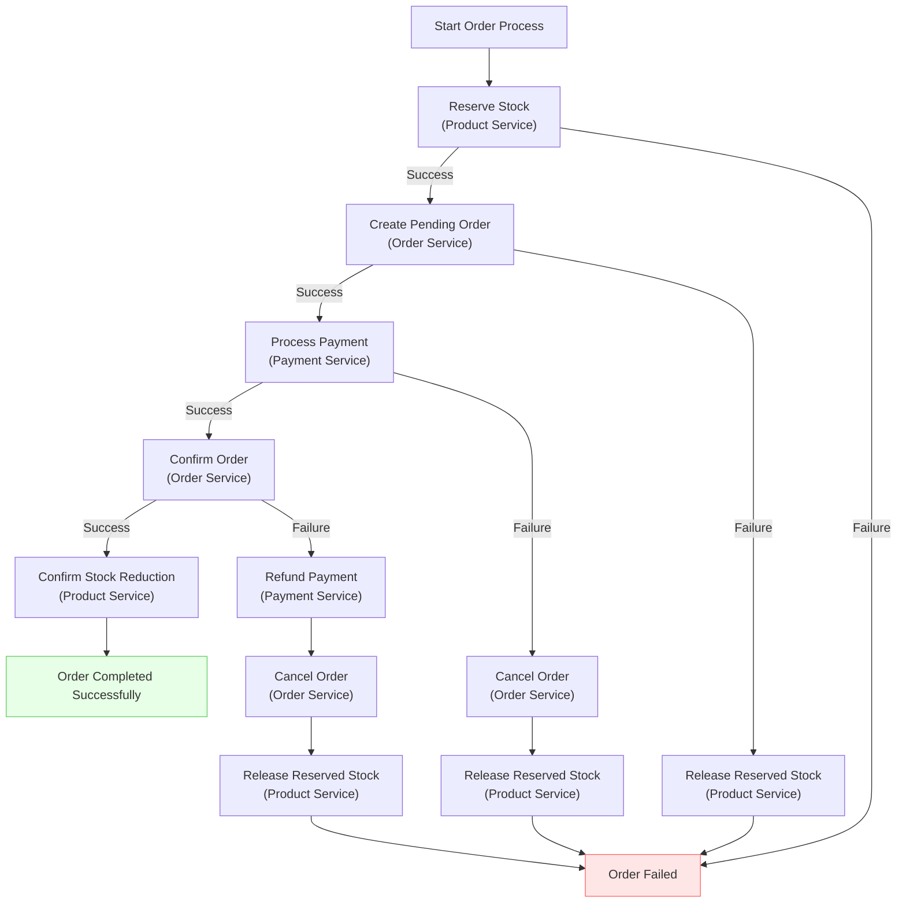
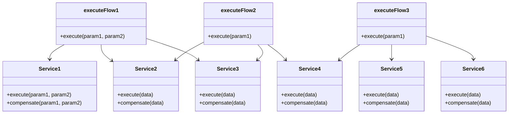
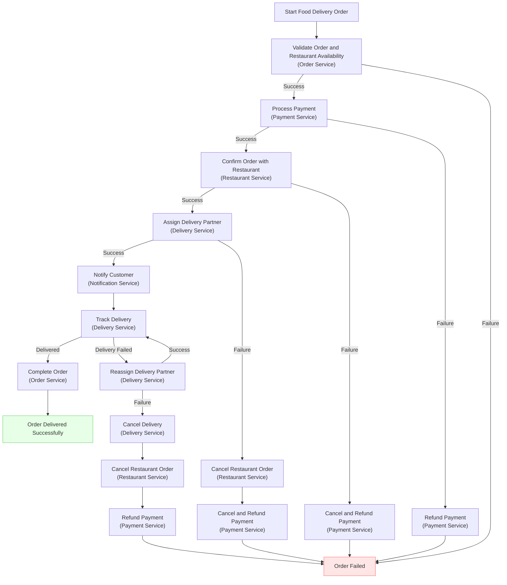

## Introduction
In a monolithic system, updating inventory and creating an order happen within a single transaction, ensuring atomicity and consistency. However, in a microservices architecture, these operations are split across different services. The challenge is to maintain data consistency across these services when one operation could fail while others succeed.

## The Problem

### Data Inconsistency in Microservices

When dealing with distributed systems, especially in e-commerce platforms, several services interact to complete a single business transaction:

- **Product Service**: Manages inventory.
- **Order Service**: Handles order creation and management.
- **Payment Service**: Processes payments.

The primary challenge is ensuring that operations across these services are consistent. For example, what happens if the inventory is reserved, but the payment fails? Without proper handling, this could lead to:

- **Stock Discrepancies**: Inventory remains reserved indefinitely.
- **Incomplete Orders**: Orders remain in an inconsistent state.
- **Financial Errors**: Payments may be processed without corresponding orders.

## The Solution: Implementing the Saga Pattern

### What is the Saga Pattern?

The **Saga Pattern** is a design pattern that provides a way to manage data consistency across microservices in distributed transaction scenarios. It does this by:

- **Breaking Down Transactions**: Splitting a transaction into a series of smaller, local transactions.
- **Compensating Actions**: If a transaction fails, compensating transactions are executed to undo the changes made by preceding transactions.
- **Asynchronous Execution**: Transactions are executed asynchronously, improving system performance and scalability.


## Updated Architecture Overview


### Services Involved

1. **Product Service**: Manages inventory stock levels.
2. **Order Service**: Handles order creation and status updates.
3. **Payment Service**: Processes payments and handles refunds.
4. **Orchestrator Service**: Coordinates the workflow between services, implementing the Saga Pattern.


### High-Level Workflow



### Error Handling and Compensating Transactions

- **Stock Reservation Fails**: Return error to client; no further action needed.
- **Order Creation Fails**: Release reserved stock.
- **Payment Fails**: Cancel order and release reserved stock.
- **Order Confirmation Fails**: Initiate compensating transactions, such as refunding the payment and releasing reserved stock. 

## Detailed Code Implementation

```javascript
// Product Service
const productService = {
  async reserveStock(productId, quantity) {
    const session = await mongoose.startSession();
    session.startTransaction();

    try {
      const product = await Product.findOne({ _id: productId }).session(session);
      if (!product || product.stock - product.reservedQuantity < quantity) {
        throw new Error('Insufficient available stock');
      }

      await Product.updateOne(
        { _id: productId },
        { $inc: { reservedQuantity: quantity } }
      ).session(session);

      await session.commitTransaction();
      return true;
    } catch (error) {
      await session.abortTransaction();
      console.error('Stock reservation failed:', error);
      return false;
    } finally {
      session.endSession();
    }
  },

  async confirmStockReduction(productId, quantity) {
    await Product.updateOne(
      { _id: productId },
      { 
        $inc: { 
          stock: -quantity,
          reservedQuantity: -quantity 
        } 
      }
    );
  },

  async releaseReservedStock(productId, quantity) {
    await Product.updateOne(
      { _id: productId },
      { $inc: { reservedQuantity: -quantity } }
    );
  }
};

// Order Service
const orderService = {
  async createPendingOrder(productId, quantity, userId) {
    try {
      const order = await Order.create({ 
        productId, 
        quantity, 
        userId,
        status: 'pending'
      });
      return order._id;
    } catch (error) {
      console.error('Pending order creation failed:', error);
      return null;
    }
  },

  async confirmOrder(orderId) {
    await Order.updateOne({ _id: orderId }, { status: 'confirmed' });
  },

  async cancelOrder(orderId) {
    await Order.updateOne({ _id: orderId }, { status: 'cancelled' });
  }
};

// Payment Service (simplified)
const paymentService = {
  async processPayment(orderId, amount) {
    // Simulate payment processing
    const success = Math.random() > 0.1; // 90% success rate
    return { success, transactionId: success ? 'txn_' + Date.now() : null };
  }
};

// Orchestrator Service (implementing Saga pattern)
async function createOrder(productId, quantity, userId) {
  // Step 1: Reserve stock
  const stockReserved = await productService.reserveStock(productId, quantity);
  if (!stockReserved) {
    return { success: false, message: 'Failed to reserve stock' };
  }

  // Step 2: Create pending order
  const orderId = await orderService.createPendingOrder(productId, quantity, userId);
  if (!orderId) {
    await productService.releaseReservedStock(productId, quantity);
    return { success: false, message: 'Failed to create pending order' };
  }

  // Step 3: Process payment
  const { success: paymentSuccess, transactionId } = await paymentService.processPayment(orderId, quantity * 100); // Assume $1 per item
  if (!paymentSuccess) {
    await orderService.cancelOrder(orderId);
    await productService.releaseReservedStock(productId, quantity);
    return { success: false, message: 'Payment failed' };
  }

  // Step 4: Confirm order and update stock
  try {
    await orderService.confirmOrder(orderId);
    await productService.confirmStockReduction(productId, quantity);
    return { 
      success: true, 
      message: 'Order processed successfully', 
      orderId, 
      transactionId 
    };
  } catch (error) {
    // If confirmation fails, we need a compensating transaction
    // This part would typically be handled by a separate process to ensure eventual consistency
    console.error('Order confirmation failed, initiating compensating transaction:', error);
    await paymentService.refundPayment(transactionId);
    await orderService.cancelOrder(orderId);
    await productService.releaseReservedStock(productId, quantity);
    return { success: false, message: 'Order confirmation failed', error: error.message };
  }
}

// Usage
createOrder('product123', 5, 'user456')
  .then(result => console.log(result))
  .catch(error => console.error('Order processing failed:', error));
```  

**Key Points:**

- **Step 1: Reserve Stock**
  - Calls `productService.reserveStock`.
  - If fails, returns an error to the client.
- **Step 2: Create Pending Order**
  - Calls `orderService.createPendingOrder`.
  - If fails, releases reserved stock.
- **Step 3: Process Payment**
  - Calls `paymentService.processPayment`.
  - If fails, cancels the order and releases reserved stock.
- **Step 4: Confirm Order and Update Stock**
  - Calls `orderService.confirmOrder` and `productService.confirmStockReduction`.
  - If fails, initiates compensating transactions:
    - Calls `paymentService.refundPayment`.
    - Cancels the order.
    - Releases reserved stock.

### Usage Example

```javascript
// Usage
createOrder('product123', 5, 'user456')
  .then(result => console.log(result))
  .catch(error => console.error('Order processing failed:', error.message));
```


## Multiple Flows

It's common to encounter scenarios where multiple business processes involve overlapping sets of services. 

- Flow 1: Service1 → Service2 → Service3
- Flow 2: Service2 → Service3 → Service4
- Flow 3: Service4 → Service5 → Service6

An Orchestrator-based Saga pattern is most suitable. Here's why:

- **Centralized Control**: An orchestrator can manage the execution of multiple, overlapping flows more effectively than a choreographed approach.
- **Simplified** Error Handling: Centralized error detection and compensation management become crucial when dealing with intertwined processes.
- **Visibility**: It's easier to monitor and debug the overall system state with a central orchestrator.
- **Flexibility**: New flows can be added or existing ones modified without changing the individual services.





```js
// Orchestrator Service
// Flow 1: service 1, service 2, service 3
async function executeFlow1(param1, param2) {
  // Step 1: Service 1
  const result1 = await service1.execute(param1, param2);
  if (!result1.success) {
    return { success: false, message: 'Service 1 failed', error: result1.error };
  }

  // Step 2: Service 2
  const result2 = await service2.execute(result1.data);
  if (!result2.success) {
    await service1.compensate(param1, param2);
    return { success: false, message: 'Service 2 failed', error: result2.error };
  }

  // Step 3: Service 3
  const result3 = await service3.execute(result2.data);
  if (!result3.success) {
    await service2.compensate(result1.data);
    await service1.compensate(param1, param2);
    return { success: false, message: 'Service 3 failed', error: result3.error };
  }

  return { success: true, message: 'Flow 1 completed successfully', data: result3.data };
}

// Flow 2: service 2, service 3, service 4
async function executeFlow2(param1) {
  // Step 1: Service 2
  const result2 = await service2.execute(param1);
  if (!result2.success) {
    return { success: false, message: 'Service 2 failed', error: result2.error };
  }

  // Step 2: Service 3
  const result3 = await service3.execute(result2.data);
  if (!result3.success) {
    await service2.compensate(param1);
    return { success: false, message: 'Service 3 failed', error: result3.error };
  }

  // Step 3: Service 4
  const result4 = await service4.execute(result3.data);
  if (!result4.success) {
    await service3.compensate(result2.data);
    await service2.compensate(param1);
    return { success: false, message: 'Service 4 failed', error: result4.error };
  }

  return { success: true, message: 'Flow 2 completed successfully', data: result4.data };
}

// Flow 3: service 4, service 5, service 6
async function executeFlow3(param1) {
  // Step 1: Service 4
  const result4 = await service4.execute(param1);
  if (!result4.success) {
    return { success: false, message: 'Service 4 failed', error: result4.error };
  }

  // Step 2: Service 5
  const result5 = await service5.execute(result4.data);
  if (!result5.success) {
    await service4.compensate(param1);
    return { success: false, message: 'Service 5 failed', error: result5.error };
  }

  // Step 3: Service 6
  const result6 = await service6.execute(result5.data);
  if (!result6.success) {
    await service5.compensate(result4.data);
    await service4.compensate(param1);
    return { success: false, message: 'Service 6 failed', error: result6.error };
  }

  return { success: true, message: 'Flow 3 completed successfully', data: result6.data };
}

// Usage example
async function runFlow1() {
  try {
    const result = await executeFlow1('param1', 'param2');
    console.log(result);
  } catch (error) {
    console.error('Flow 1 failed:', error);
  }
}

```


## Additional Considerations

### Transactions and Data Consistency

- **Limitations of Distributed Transactions**: Traditional ACID transactions don't span multiple microservices. The Saga Pattern helps manage this by ensuring eventual consistency.
- **Eventual Consistency**: Accept that data may be temporarily inconsistent. Design services to handle such inconsistencies gracefully.


### Handling Idempotency

Implement idempotency keys or checks to handle retry scenarios, ensuring that repeated requests do not lead to inconsistent data.

### Asynchronous Communication

Consider using message queues or event buses for communication between services to improve decoupling and scalability.

### Addressing the Orchestrator as a Potential Bottleneck

- **Scalability**: Design the orchestrator to be stateless and scalable horizontally.
- **High Availability**: Implement failover mechanisms to prevent the orchestrator from becoming a single point of failure.
- **Distributed Orchestration**: Explore distributed orchestrators or move towards a choreography-based Saga if appropriate.

### Monitoring and Logging

Implement robust monitoring and logging to track the flow of transactions and quickly identify and resolve issues.


## More Examples

### Food Delivery 




## Conclusion

By enhancing the implementation of the Saga Pattern and incorporating a Payment Service, we've created a more robust and realistic microservices architecture that handles distributed transactions effectively. This approach ensures data consistency across services, improves error handling, and aligns with the principles of scalable and resilient microservices design.

## Q&A

### What is the primary challenge in maintaining data consistency across microservices in a distributed system?

The primary challenge is ensuring that operations across different services are consistent when one operation could fail while others succeed.

### What does 'eventual consistency' mean in the context of the Saga Pattern and distributed systems?

Eventual consistency means that data may be temporarily out of sync across different services during a transaction. However, the system ensures that all data will eventually become consistent, either by completing all steps successfully or by undoing partial changes.


### Differentiate between the two types of Saga implementations: Orchestration-Based Saga and Choreography-Based Saga.

Orchestration-Based Saga uses a central coordinator (orchestrator) to manage the transaction steps and compensating actions across services. It provides centralized control and visibility but can become a single point of failure. Choreography-Based Saga, in contrast, distributes responsibility among participating services, with each service publishing events that trigger the next action. This approach is more decentralized and loosely coupled, but can be harder to track and debug. The choice between them depends on the complexity of the transaction and the desired level of centralization in the system architecture.


### Any alternatives to the Saga Pattern for managing distributed transactions in microservices?


