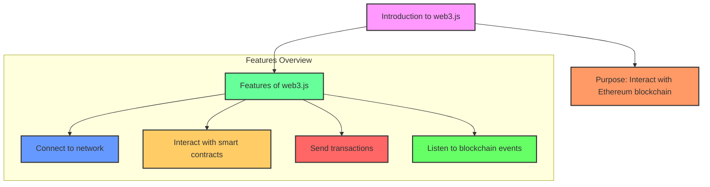
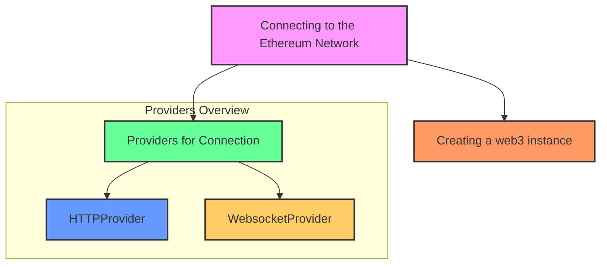
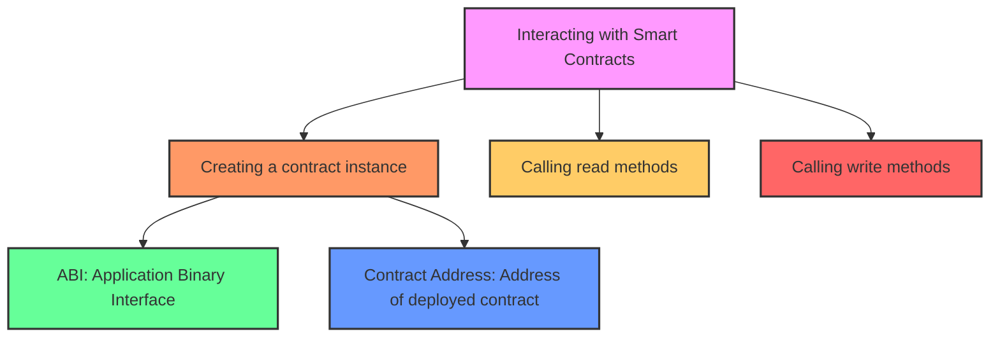
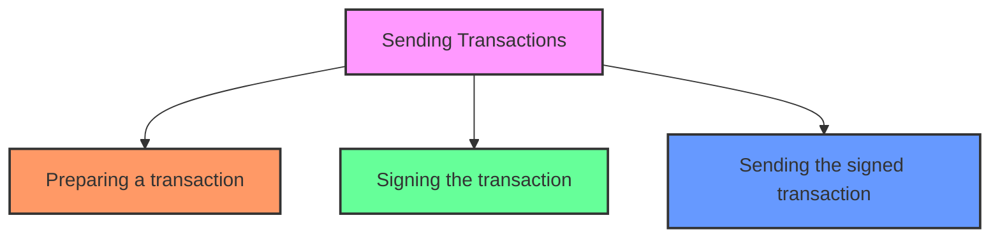
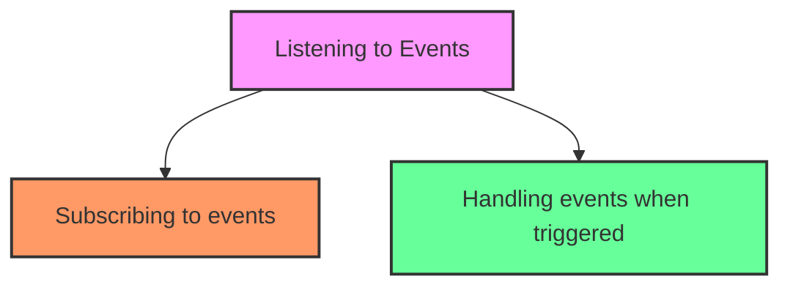

## Introduction to web3.js

**Web3.js** is a JavaScript library that allows you to interact with the Ethereum blockchain. It's used to create web applications that can communicate with the Ethereum network, enabling actions such as querying blockchain data, sending transactions, and interacting with smart contracts.

## Connecting to the Ethereum Network

To interact with the Ethereum blockchain, you need to establish a connection using web3.js. This involves creating a web3 instance and selecting a provider that suits your needs.

- **HTTPProvider**: Connects using HTTP, suitable for most basic interactions.
- **WebsocketProvider**: Connects using WebSocket, which is useful for real-time updates and listening to events.

## Interacting with Smart Contracts

Smart contracts are the backbone of many decentralized applications (dApps) on the Ethereum blockchain. Web3.js provides essential tools for interacting with these smart contracts, enabling your dApp to leverage their functionality.

## Sending Transactions

Sending transactions is a fundamental operation in web3.js. Transactions are used to change the blockchain state, such as transferring Ether or calling a smart contract method that alters data.

- **Preparing a transaction**: This step involves setting up the transaction details, such as the recipient address, amount of Ether to send, gas limit, and gas price.
- **Signing the transaction**: Transactions need to be signed with the sender's private key to authorize them. This adds a digital signature to the transaction.
- **Sending the signed transaction**: Once signed, the transaction can be broadcast to the Ethereum network for processing.

## Listening to Events

Listening to events is an essential feature of web3.js, allowing applications to respond to changes on the blockchain. Smart contracts can emit events during transactions, which can be captured and processed by your application.

- **Subscribing to events**: Setting up listeners for specific events emitted by smart contracts.
- **Handling events**: Defining what actions to take when an event is triggered.