## Basic
### What is NodeJs ?

Node.js is a JavaScript runtime built on Chrome's V8 JavaScript engine. It uses an event-driven, non-blocking I/O model that makes it lightweight and efficient. Node.js is ideal for building scalable network applications, as it can handle a large number of connections simultaneously.

In Node.js, I/O (Input/Output) refers to the operations that involve reading and writing data to various sources such as files, networks, databases, and other streams. I/O operations are fundamental in any application that interacts with external resources. Node.js is designed to handle these operations efficiently using a non-blocking, asynchronous I/O model.

```js
const fs = require('fs');

fs.readFile('file.txt', 'utf8', (err, data) => {
  if (err) throw err;
  console.log(data);
});

// The program can continue executing other tasks here
console.log('This will print before the file content');

```



```mermaid
graph LR
subgraph Fundamentals["⚡ Fundamentals"]
    runtime["🏃 Runtime"]
    nonblocking["🚫 Non-Blocking I/O"]
    eventdriven["⚡ Event-Driven"]
    eventloop["🔁 Event Loop"]
end
```

### What is Event Driven ?

Event-driven Node.js refers to the programming paradigm where the flow of the application is determined by events like user actions or system messages. Node.js uses an event loop to handle asynchronous operations efficiently, allowing non-blocking I/O operations. This approach enables building scalable, real-time applications that can handle multiple concurrent connections with optimal performance.

```mermaid
graph TD
    subgraph eventLoop["🔄 Event Loop"]
    end

    callStack["📚 Call Stack"]
    
    subgraph callbackQueue["fa:fa-lines-leaning Callback Queue"]
        callback1([📞 Callback 1])
        callback2([📞 Callback 2])
    end

    subgraph webAPIs["🌐 APIs"]
        setTimeout["⏳ setTimeout()"]
        fetch["🌐 fetch()"]
        readFile["📂 fs.readFile()"]
    end

    eventLoop --> callStack
    eventLoop --> callbackQueue
    webAPIs --> callbackQueue
    
    style eventLoop fill:#f9f,stroke:#333,stroke-width:2px
    style callStack fill:#ccf,stroke:#f66,stroke-width:2px
    style callbackQueue fill:#ff9,stroke:#333,stroke-width:2px
    style webAPIs fill:#9cf,stroke:#333,stroke-width:2px
```



- **Event Loop**: Continuously checks if the Call Stack  is empty.

  - If empty, it takes the next callback from the Callback Queue.
  - If not empty, it continues checking.
- **Call Stack**: Executes JavaScript code, including callbacks. After execution, control returns to the Event Loop.

- **Callback Queue**: Holds callbacks until they are ready to be executed. Receives callbacks from Web APIs.

- **Web APIs**: Perform asynchronous operations (timers, network requests, etc.). When complete, they add their callbacks to the Callback Queue.

### What are I/O operations in computing, and why are they significant ? 


I/O (Input/Output) operations refer to the communication between a computer program and the outside world, typically involving reading from or writing to a device or file. In Node.js, I/O operations are crucial as they deal with tasks like reading/writing files, network communications, and database interactions. Node.js uses a non-blocking, event-driven architecture for I/O operations, allowing it to handle many concurrent connections efficiently. This design makes Node.js particularly well-suited for building scalable network applications and web servers that can manage numerous simultaneous I/O operations

```mermaid
graph TD
    subgraph nodeJs["📦 Node.js"]
        style nodeJs fill:#e6fff2,stroke:#66cc99
        application["💻 Application"]
        eventLoop["🔄 Event Loop"]
    end

    subgraph ioOperations["🔌 I/O Operations"]
        style ioOperations fill:#fff0f5,stroke:#ff69b4
        fileSystem["📁 File System"]
        network["🌐 Network"]
        database["🗄️ Database"]
    end

    application -->|"Requests"| ioOperations
    ioOperations -->|"Responds"| eventLoop
    eventLoop -->|"Handles"| application
```



### If other languages also support non-blocking I/O, why is it a standout feature in Node.js?

Non-blocking I/O is a core feature in Node.js, integrated from the ground up, ensuring that almost all I/O operations are asynchronous by default. Unlike other languages where non-blocking I/O is an optional feature, in Node.js, it's the default behavior. This leads to simplified development and improved performance for I/O-bound applications. The rich ecosystem of libraries and built-in support for non-blocking I/O further distinguishes Node.js in this regard. For CPU-bound tasks Node.js is not the best choice.


### Is it true that 1 nodejs application is 1 process and 1 thread

While a basic Node.js application does run in a single process with one main JavaScript execution thread, it's not strictly limited to one thread overall, and you have options to utilize multiple processes or additional threads if needed.

### What are the main approaches to implementing asynchronicity in Node.js

```mermaid
graph LR
subgraph Asynchronous["⏱ Asynchronous"]
    callback["📞 Callback"]
    promise["🤝 Promise"]
    asyncawait["⏳ Async/Await"]
end
```



- **Callback:** A function passed as an argument to be executed later (after an async operation completes)
  

```js
function fetchData(callback) {
  setTimeout(() => {
    callback('Data received');
  }, 1000);
}

fetchData((data) => {
  console.log(data);
});
```


- **Promise**: A cleaner way to handle asynchronous results and errors. Prevents callback hell.

```javascript
const fetchData = () => {
  return new Promise((resolve, reject) => {
    setTimeout(() => {
      resolve('Data received');
    }, 1000);
  });
};

fetchData().then(data => console.log(data));
```

- **Async/Await**:  Makes asynchronous code look synchronous.

```javascript
const fetchData = () => {
return new Promise((resolve, reject) => {
  setTimeout(() => {
    resolve('Data received');
    // Uncomment the following line to simulate an error:
    // reject(new Error('Failed to fetch data'));
  }, 1000);
});
};

async function getData() {
  try {
    const data = await fetchData();
    console.log(data);
  } catch (error) {
    console.error('Error:', error);
  }
}

getData();

```

  
### What are the key differences between CommonJS and ES Modules ?

The key differences between CommonJS and ES Modules are:

1. Syntax: CommonJS uses `require()` and `module.exports`, while ES Modules use `import` and `export` statements.
2. Loading: CommonJS modules load synchronously at runtime, whereas ES Modules load asynchronously and support static analysis.
3. Structure: ES Modules offer named exports and a default export, providing more flexibility than CommonJS's single object export.
4. Browser compatibility: ES Modules are natively supported in modern browsers, making them ideal for frontend development without bundling.


### How does the `console.log()` function work ?

When `console.log()` is called, it invokes the Console object in the Node.js runtime, which then calls the `process` object. The Process object writes to the `stdout` stream, which is buffered and eventually flushed to the operating system's I/O operations. Finally, the OS handles the actual output, displaying it in the terminal, writing to a file, or allowing it to be captured by another process.

```mermaid
graph TD
    subgraph javascriptLayer["💻 JavaScript Layer"]
        style javascriptLayer fill:#e6f7ff,stroke:#4db8ff
        consoleLogCall["📢 console.log() call"]
    end

    subgraph nodejsRuntime["⚙️ Node.js Runtime"]
        style nodejsRuntime fill:#fff0f5,stroke:#ff69b4
        consoleObject["🖥️ Console Object"]
        processObject["🔄 Process Object"]
        stdoutStream["📤 stdout Stream"]
        streamBuffer["💾 Stream Buffer"]
    end

    subgraph operatingSystem["🖥️ Operating System"]
        style operatingSystem fill:#f0fff0,stroke:#90ee90
        osIO["🔌 OS I/O Operations"]
    end

    subgraph output["📺 Output"]
        style output fill:#fff5e6,stroke:#ffa500
        terminalOutput["💻 Terminal Output"]
        fileOutput["📄 File Output"]
        processCapture["🔍 Process Capture"]
    end

    consoleLogCall -->|"Invokes"| consoleObject
    consoleObject -->|"Calls"| processObject
    processObject -->|"Writes to"| stdoutStream
    stdoutStream -->|"Buffers in"| streamBuffer
    streamBuffer -->|"Flushes to"| osIO
    osIO -->|"Displays in"| terminalOutput
    osIO -->|"Writes to"| fileOutput
    osIO -->|"Captured by"| processCapture
```





### How does Winston enhance logging capabilities ? 

Winston enhances Node.js logging by offering multiple transports, allowing simultaneous logging to console, files, and databases. It provides customizable logging levels and formatting, enabling better categorization and presentation of log messages.

```javascript
const winston = require('winston');

const logger = winston.createLogger({
  level: 'info',
  format: winston.format.json(),
  transports: [
    new winston.transports.File({ filename: 'error.log', level: 'error' }),
    new winston.transports.File({ filename: 'combined.log' }),
  ],
});

if (process.env.NODE_ENV !== 'production') {
  logger.add(new winston.transports.Console({
    format: winston.format.simple(),
  }));
}

// Usage
logger.log({
  level: 'info',
  message: 'Hello distributed log files!'
});

logger.info('Hello again distributed logs');
```


### How to build a web server in Node.js? 

Node.js provides a built-in `http` module that allows you to create web servers. You can use the `http.createServer` method to create a server that listens for incoming requests and sends responses. You can define request handlers to process incoming requests and generate responses. Here's an example of how to build a simple web server in Node.js:

```javascript

const http = require('http');

const server = http.createServer((req, res) => {
  res.writeHead(200, { 'Content-Type': 'text/plain' });
  res.end('Hello, World!');
});

server.listen(3000, () => {
  console.log('Server running on port 3000');
});
```



```mermaid
graph LR
subgraph CoreModules["📦 Core Modules"]
    http["🌐 http"]
end
```

### How can you implement graceful shutdown in a Node.js application?

Graceful shutdown in a Node.js application can be implemented by listening for process termination signals like SIGINT or SIGTERM. When these signals are received, the application should stop accepting new requests, finish processing ongoing operations, close database connections, and release other resources. Finally, the process can exit cleanly, ensuring that all data is saved and resources are properly released before shutdown.

```javascript
const server = require('http').createServer();
const db = require('./db'); // Assume this is your database connection

function gracefulShutdown() {
  console.log('Starting graceful shutdown');
  
  server.close(() => {
    console.log('HTTP server closed');
    
    db.close(() => {
      console.log('Database connection closed');
      process.exit(0);
    });
  });

  // Force shutdown after 30 seconds
  setTimeout(() => {
    console.error('Could not close connections in time, forcefully shutting down');
    process.exit(1);
  }, 30000);
}

process.on('SIGTERM', gracefulShutdown);
process.on('SIGINT', gracefulShutdown);

// Your server logic here
server.listen(3000);

```


### How are buffers implemented and why use them instead of strings? 

Buffers are contiguous memory blocks for raw binary data, typically fixed-size and mutable. Buffers allow for faster I/O operations, especially when dealing with large amounts of data or binary information. Strings often use more memory due to character encoding (e.g., UTF-8, UTF-16).

```js
import fs from 'fs/promises';
import crypto from 'crypto';

async function advancedBufferExamples() {
  try {
    // 1. Reading file into buffer
    const fileBuffer: Buffer = await fs.readFile('example.txt');
    console.log('File content:', fileBuffer.toString());
    // Output: File content: Hello, this is an example file.

    // 2. Creating buffer from string
    const str = 'Hello, Buffer!';
    const strBuffer: Buffer = Buffer.from(str, 'utf-8');
    console.log('String as buffer:', strBuffer);
    // Output: String as buffer: <Buffer 48 65 6c 6c 6f 2c 20 42 75 66 66 65 72 21>
    console.log('Buffer back to string:', strBuffer.toString());
    // Output: Buffer back to string: Hello, Buffer!

    // 3. Working with binary data
    const binaryBuffer = Buffer.from([0x48, 0x65, 0x6c, 0x6c, 0x6f]);
    console.log('Binary buffer as string:', binaryBuffer.toString());
    // Output: Binary buffer as string: Hello

    // 4. Buffer concatenation
    const buffer1 = Buffer.from('Hello ');
    const buffer2 = Buffer.from('World');
    const combinedBuffer = Buffer.concat([buffer1, buffer2]);
    console.log('Combined buffer:', combinedBuffer.toString());
    // Output: Combined buffer: Hello World

    // 5. Buffer slicing
    const slicedBuffer = combinedBuffer.slice(0, 5);
    console.log('Sliced buffer:', slicedBuffer.toString());
    // Output: Sliced buffer: Hello

    // 6. Buffer comparison
    console.log('Buffers equal:', Buffer.compare(buffer1, buffer2) === 0);
    // Output: Buffers equal: false

    // 7. Writing integer to buffer
    const intBuffer = Buffer.alloc(4);
    intBuffer.writeInt32BE(123456789);
    console.log('Int32 buffer:', intBuffer);
    // Output: Int32 buffer: <Buffer 07 5b cd 15>

    // 8. Reading integer from buffer
    const readInt = intBuffer.readInt32BE(0);
    console.log('Read int32:', readInt);
    // Output: Read int32: 123456789

    // 9. Base64 encoding/decoding
    const base64Str = strBuffer.toString('base64');
    console.log('Base64 encoded:', base64Str);
    // Output: Base64 encoded: SGVsbG8sIEJ1ZmZlciE=
    const decodedBuffer = Buffer.from(base64Str, 'base64');
    console.log('Decoded buffer:', decodedBuffer.toString());
    // Output: Decoded buffer: Hello, Buffer!

    // 10. Using buffer with crypto
    const hash = crypto.createHash('sha256');
    hash.update(strBuffer);
    console.log('SHA256 hash:', hash.digest('hex'));
    // Output: SHA256 hash: 3d3748055cb22d3bbd36f50cb9b84b74807feb52d8b45c57a7a09c4a7ba9d0a4

  } catch (error) {
    console.error('Error in buffer operations:', error);
  }
}

advancedBufferExamples();
```


## Building terminal aplication

### How can you implement command-line arguments parsing ?

you can use the built-in `process.argv` array or a third-party library like `yargs`


Use `process.argv`

```js
const args = process.argv.slice(2);  
  
// Parse the arguments  
const parsedArgs = {};  
for (let i = 0; i < args.length; i += 2) {  
    const key = args[i].replace(/^--/, '');  
    const value = args[i + 1];  
    parsedArgs[key] = value;  
}  
  
console.log('Parsed arguments:', parsedArgs);
```

Using `yargs`

```js
const yargs = require('yargs/yargs');
const { hideBin } = require('yargs/helpers');

const argv = yargs(hideBin(process.argv))
  .option('name', {
    alias: 'n',
    type: 'string',
    description: 'Your name'
  })
  .option('age', {
    alias: 'a',
    type: 'number',
    description: 'Your age'
  })
  .argv;

console.log('Hello,', argv.name);
console.log('You are', argv.age, 'years old');
```


run this script

```js
node index.js --name John --age 30
```


### What is `process.stdin` ?

`process.stdin` is a readable stream in Node.js that represents the standard input.
It allows you to read input from the command line or other input sources.
process.stdin is an instance of a Readable Stream, providing methods to handle input.
It's commonly used for creating interactive console applications or processing piped data.
You can listen for 'data' events or use methods like .read() to access incoming data.

`process.stdin` is particularly useful for creating interactive command-line interfaces (CLIs).

```js
const readline = require('readline');

// Create an interface for reading from stdin and writing to stdout
const rl = readline.createInterface({
  input: process.stdin,
  output: process.stdout
});

console.log('Welcome to the Simple Calculator!');
console.log('Enter an expression (e.g., 2 + 3) or type "exit" to quit.');

// Function to evaluate a simple mathematical expression
function evaluateExpression(expr) {
  try {
    return eval(expr);
  } catch (error) {
    return 'Invalid expression';
  }
}

// Use readline to continuously prompt for input
function promptUser() {
  rl.question('> ', (input) => {
    if (input.toLowerCase() === 'exit') {
      console.log('Goodbye!');
      rl.close();
      return;
    }

    const result = evaluateExpression(input);
    console.log(`Result: ${result}`);
    promptUser(); // Prompt again for the next input
  });
}

// Start the prompt loop
promptUser();

// Handle the close event
rl.on('close', () => {
  process.exit(0);
});
```




```mermaid
graph 
    start["🚀 Start"]
    prompt["❓ Prompt User"]
    process["⚙️ Process Input"]
    evaluate["🧮 Evaluate"]
    display["📊 Display Result"]
    checkExit["🚪 Exit?"]
    end1["👋 End"]

    start --> prompt
    prompt --> process
    process --> evaluate
    evaluate --> display
    display --> checkExit
    checkExit -->|"No"| prompt
    checkExit -->|"Yes"| end1

    classDef lightBlue fill:#e6f7ff,stroke:#1890ff;
    classDef lightGreen fill:#f6ffed,stroke:#52c41a;
    classDef lightRed fill:#fff1f0,stroke:#ff4d4f;

    class start,end1 lightGreen;
    class prompt,process,evaluate,display lightBlue;
    class checkExit lightRed;
```

### How can you create progress bars to show long-running tasks in a terminal application?

Example to show progress bard when download the Bitcoin whitepaper with `cli-progress`


```js
const axios = require('axios');
const fs = require('fs');
const cliProgress = require('cli-progress');

async function downloadFile(fileUrl, outputPath) {
  const writer = fs.createWriteStream(outputPath);
  
  const response = await axios({
    method: 'get',
    url: fileUrl,
    responseType: 'stream'
  });

  const totalLength = response.headers['content-length'];

  const progressBar = new cliProgress.SingleBar({
    format: 'Downloading [{bar}] {percentage}% | ETA: {eta}s | {value}/{total} bytes',
    barCompleteChar: '\u2588',
    barIncompleteChar: '\u2591',
    hideCursor: true
  });

  progressBar.start(totalLength, 0);

  response.data.on('data', (chunk) => {
    writer.write(chunk);
    progressBar.increment(chunk.length);
  });

  response.data.on('end', () => {
    writer.end();
    progressBar.stop();
    console.log('Download completed');
  });

  writer.on('finish', () => {
    console.log('File saved as:', outputPath);
  });

  writer.on('error', (err) => {
    console.error('Error writing file:', err);
  });
}

// Bitcoin whitepaper URL
const fileUrl = 'https://bitcoin.org/bitcoin.pdf';
const outputPath = './bitcoin_whitepaper.pdf';

console.log('Starting download of Bitcoin whitepaper...');
downloadFile(fileUrl, outputPath).catch(console.error);
```

When you run this script, you'll see a progress bar

```js
Starting download of Bitcoin whitepaper...
Downloading [████████████████████████████████████████] 100% | ETA: 0s | 184292/184292 bytes
Download completed
File saved as: ./bitcoin_whitepaper.pdf

```

## Working with files

### How can you read from and write to files ?

Node.js provides file I/O operations through the built-in `fs` module. To read a file, you can use `fs.readFile()` for asynchronous reading or `fs.readFileSync()` for synchronous reading. For writing, use `fs.writeFile()` (asynchronous) or `fs.writeFileSync()` (synchronous). These methods allow you to interact with the file system, handling text and binary data. For larger files or streams of data, Node.js also offers more efficient streaming operations using `fs.createReadStream()` and `fs.createWriteStream()`.

```js
const fs = require('fs');

// Asynchronous read
fs.readFile('input.txt', 'utf8', (err, data) => {
  if (err) {
    console.error('Error reading file:', err);
    return;
  }
  console.log('Asynchronous read:', data);
});

// Synchronous read
try {
  const data = fs.readFileSync('input.txt', 'utf8');
  console.log('Synchronous read:', data);
} catch (err) {
  console.error('Error reading file:', err);
}

// Asynchronous write
fs.writeFile('output.txt', 'Hello, Node.js!', (err) => {
  if (err) {
    console.error('Error writing file:', err);
    return;
  }
  console.log('File written successfully');
});

// Synchronous write
try {
  fs.writeFileSync('output-sync.txt', 'Hello, Node.js! (Sync)');
  console.log('File written successfully (Sync)');
} catch (err) {
  console.error('Error writing file:', err);
}

// Reading and writing streams for larger files
const readStream = fs.createReadStream('large-input.txt');
const writeStream = fs.createWriteStream('large-output.txt');

readStream.pipe(writeStream);

readStream.on('end', () => {
  console.log('Finished copying large file');
});
```

### How can you monitor a file for changes ?

You can monitor a file for changes in Node.js using the `fs.watch()` method, which watches for changes to a file or directory. You can specify the type of changes to watch for (e.g., 'change', 'rename') and handle events accordingly. 


```js
const fs = require('fs');

function watchFile(filePath) {
  let fileSize = fs.statSync(filePath).size;

  fs.watch(filePath, (eventType) => {
    if (eventType === 'change') {
      const newSize = fs.statSync(filePath).size;

      if (newSize > fileSize) {
        const stream = fs.createReadStream(filePath, { 
          start: fileSize,
          encoding: 'utf8'
        });

        stream.on('data', (chunk) => {
          console.log('New content:', chunk);
        });

        stream.on('end', () => {
          fileSize = newSize;
          console.log('Finished reading new content');
        });
      }
    }
  });

  console.log(`Watching for changes on ${filePath}`);
}

// Usage
watchFile('./path/to/your/file.txt');
```

### How to determine the current directory and file location ?

Node.js provides two global variables, `__dirname` and `__filename`, that allow you to access the current directory and file path, respectively. `__dirname` returns the absolute path of the current directory, while `__filename` returns the absolute path of the current file. You can use these variables to reference files or directories relative to the current location.

Let's assume we have the following project structure:

```js
my-node-project/
│
├── src/
│   ├── index.js
│   └── utils/
│       └── config-reader.js
│
└── config/
    └── app-config.json
```


We're working in the `config-reader.js` file and want to access the `app-config.json`. Use `path.join()` to construct the path to our config file

```javascript
// File: src/utils/config-reader.js

const path = require('path');
const fs = require('fs');

console.log('Current directory:', __dirname);
// Output: Current directory: /path/to/my-node-project/src/utils

console.log('Current file:', __filename);
// Output: Current file: /path/to/my-node-project/src/utils/config-reader.js

// Construct the path to the config file
const configFilePath = path.join(__dirname, '..', '..', 'config', 'app-config.json');

console.log('Path to config file:', configFilePath);
// Output: Path to config file: /path/to/my-node-project/config/app-config.json

```


