## Fundamentals


Express.js is a popular web application framework for Node.js that simplifies building web applications and APIs.

- **Middleware**: Functions that access the request and response objects to modify, add data, or trigger other functions.
  
- **Router**: A mini-app that only deals with routing. It can have its middleware and routing logic.

- **Handler**: A function that handles a specific route or endpoint.

- **Error Middleware**: Middleware functions that have an extra parameter for error handling.

```mermaid
graph 
    subgraph expressApp["fa:fa-server Express.js Application"]
            request["🔴 Request"]
            middleware1["🚪Middleware 1"]
            middleware2["🚪Middleware 2"]
            router["fa:fa-sitemap Router"]
            routerMiddleware["🚪Router Middleware"]
            handler["fa:fa-wrench Handler"]
            errorMiddleware["🚨 Error Middleware"]
            response["🔵 Response"]
    end

    request --> middleware1 --> middleware2 --> router 
    router --> routerMiddleware --> handler 
    handler --> errorMiddleware --> response

    style request fill:#f9f,stroke:#333,stroke-width:2px
    style middleware1 fill:#ccf,stroke:#f66,stroke-width:2px
    style middleware2 fill:#ff9,stroke:#333,stroke-width:2px
    style router fill:#ccf,stroke:#f66,stroke-width:2px
    style routerMiddleware fill:#add8e6,stroke:#333,stroke-width:2px
    style handler fill:#9cf,stroke:#333,stroke-width:2px
    style errorMiddleware stroke:#333,stroke-width:2px
    style response fill:#9cf,stroke:#333,stroke-width:2px

    classDef requestClass fill:#f9f,stroke:#333,stroke-width:2px;
    classDef middlewareClass fill:#ccf,stroke:#f66,stroke-width:2px;
    classDef routerClass fill:#ccf,stroke:#f66,stroke-width:2px;
    classDef routerMiddlewareClass fill:#add8e6,stroke:#333,stroke-width:2px;
    classDef handlerClass fill:#9cf,stroke:#333,stroke-width:2px;
    classDef errorClass stroke:#333,stroke-width:2px;
    classDef responseClass fill:#9cf,stroke:#333,stroke-width:2px;

```
  
## Middleware

A **request-response cycle** in Express.js involves a series of middleware functions that execute sequentially. Each middleware can modify the request and response objects, end the request-response cycle, or call the next middleware in the stack.

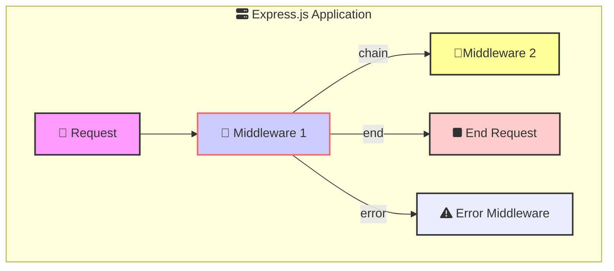
**Middleware Functions**: Execute sequentially, each modifying the request/response objects or ending the request-response cycle. Examples: Logging, authentication, parsing data
  ```javascript
  const express = require('express');
  const app = express();

  app.use((req, res, next) => { // ( 🔴, 🔵, 🚪)
    console.log('Middleware 1');
    next();
  });

  app.use((req, res, next) => {
    console.log('Middleware 2');
    res.send('Hello, Middleware Flow!');
  });

  app.listen(3000);
  ```


Below is an example of how middleware functions involve in the request-response cycle.

```mermaid
graph TD
    

    subgraph   
        cors1[cors 🌐] --> passportInitialize["passport.initialize() (Passport) 🛂"]
        passportInitialize --> authLimiter["authLimiter (Rate Limiter) 🚦"]
        authLimiter --> routes["v1 Routes 🛣️"]
        routes --> docsRoute["Docs Route 📄"]
        docsRoute --> notFoundHandler["404 Handler ⚠️"]
        notFoundHandler --> errorConverter["errorConverter ⚙️"]
        errorConverter --> errorHandler["errorHandler 🚫"]
        errorHandler --> response["Response ➡️"]
        style passportInitialize fill:#ccf,stroke:#f66,stroke-width:2px
        style authLimiter fill:#ff9,stroke:#333,stroke-width:2px
        style routes fill:#9cf,stroke:#333,stroke-width:2px
        style docsRoute stroke:#333,stroke-width:2px
        style notFoundHandler fill:#ccc,stroke:#333,stroke-width:2px
        style errorConverter fill:#fcc,stroke:#333,stroke-width:2px
        style errorHandler fill:#faa,stroke:#333,stroke-width:2px
        style response fill:#9cf,stroke:#333,stroke-width:2px

    end

    subgraph Middleware["Middleware Flow"]
        request["Request 🌐"] --> morgan["Morgan (Logger) 📝"]
        morgan --> helmet["Helmet (Security) 🔒"]
        helmet --> expressJson["express.json() 📄"]
        expressJson --> expressUrlEncoded["express.urlencoded() 📝"]
        expressUrlEncoded --> expressFileupload["express-fileupload 📁"]
        expressFileupload --> xss["xss-clean 🧹"]
        xss --> mongoSanitize["express-mongo-sanitize 🛡️"]
        mongoSanitize --> compression["compression 🗜️"]
        compression --> cors["cors 🌐"]
        style request fill:#f9f,stroke:#333,stroke-width:2px
        style morgan fill:#ccf,stroke:#f66,stroke-width:2px
        style helmet fill:#ff9,stroke:#333,stroke-width:2px
        style expressJson fill:#9cf,stroke:#333,stroke-width:2px
        style expressUrlEncoded stroke:#333,stroke-width:2px
        style expressFileupload fill:#ccc,stroke:#333,stroke-width:2px
        style xss fill:#fcc,stroke:#333,stroke-width:2px
        style mongoSanitize fill:#faa,stroke:#333,stroke-width:2px
        style compression fill:#9cf,stroke:#333,stroke-width:2px
        style cors fill:#afa,stroke:#333,stroke-width:2px
    end

```


## Routing

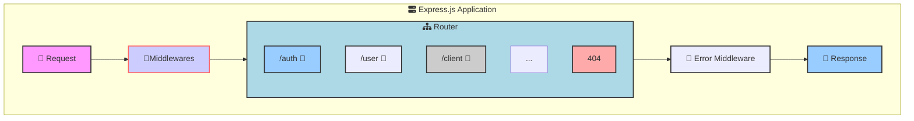

```js
const express = require('express');
const router = express.Router();

// Import Route Modules (Assume these contain route handlers)
const authRoute = require('./auth.route'); 
const userRoute = require('./user.route');
const clientRoute = require('./client.route');

// Mount Routes on the Router
router.use('/auth', authRoute);     // Authentication routes (e.g., login, signup)
router.use('/user', userRoute);     // User management routes
router.use('/client', clientRoute); // Client-related routes

// ... other routes (omitted for brevity)

// 404 Not Found Handler
router.use((req, res, next) => {
  // ... (Logic for handling 404 errors)
});

module.exports = router;

// ... In your main app.js file:
const app = express();
// ... (Other middleware like body-parser, cors, etc.)

// Mount the Router
app.use('/api', router); // Prefix all routes with '/api'

// ... (Error handling middleware)

app.listen(3000, () => {
  console.log('Server is running on port 3000');
});
```

- **Modular Routes**: Each route module (authRoute, userRoute, clientRoute) is responsible for a specific set of endpoints, promoting organization and maintainability.
- **Router Middleware**: You can add middleware functions directly to the router using router.use(). These middleware will only apply to the routes defined within this router.

- **404 Handler**: The router.use() at the end acts as a catch-all route to handle requests that don't match any defined routes. It would typically send a "Not Found" (404) response.

### Pamaeters and Query Strings

- **Route Parameters**: Extracted from the URL path using a colon followed by the parameter name (e.g., `/users/:id`).
- **Query Strings**: Extracted from the URL query string using the `req.query` object (e.g., `/users?name=John`).

```javascript
// Route Parameters
app.get('/users/:id', (req, res) => {
  const { id } = req.params;
  res.send(`User ID: ${id}`);
});

// Query Strings
app.get('/users', (req, res) => {
  const { name } = req.query;
  res.send(`User Name: ${name}`);
});
```

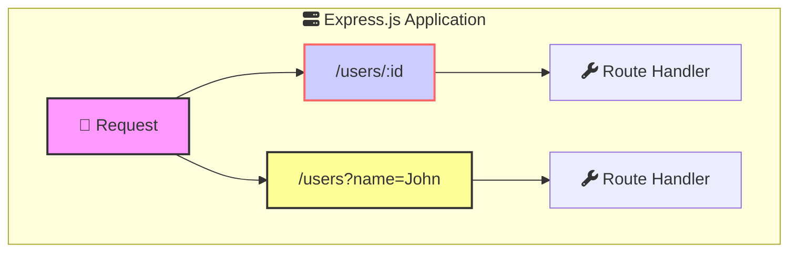

### Priority of Routes

- **Exact Match**: Routes with exact matches take precedence over dynamic routes.
- **Dynamic Routes**: Routes with dynamic parameters (e.g., `/users/:id`) are matched next.
- **Wildcard Routes**: Routes with wildcards (e.g., `/users/*`) are matched last.

```javascript
app.get('/users', (req, res) => {
    res.send('All users');
});

app.get('/users/new', (req, res) => {
    res.send('New user form');
});

app.get('/users/:id', (req, res) => {
    res.send(`User ID: ${req.params.id}`);
});

app.get('/users/*', (req, res) => {
    res.send('Wildcard route');
});
```

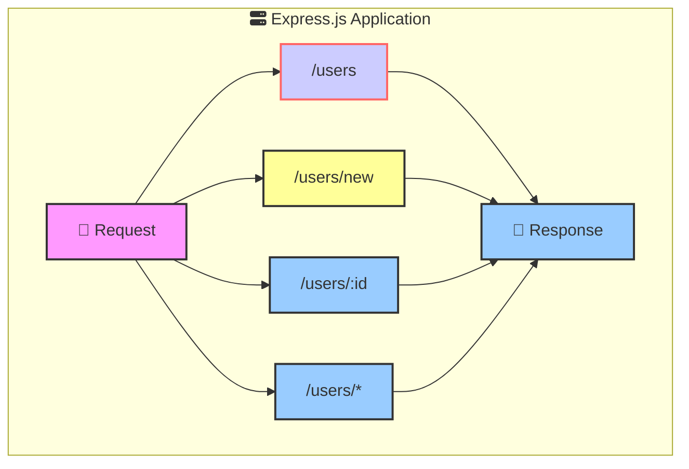

### Route Composition

- **Route Composition**: Use `express.Router()` to create modular, mountable route handlers. This allows you to define routes in separate files and mount them at any path.

```javascript

// routes/auth.route.js
const express = require('express');
const router = express.Router();

router.post('/login', (req, res) => {
  // Login logic
});

router.post('/signup', (req, res) => {
  // Signup logic
});

module.exports = router;

// routes/user.route.js

const express = require('express');
const router = express.Router();

router.get('/', (req, res) => {
  // Get all users
});

router.get('/:id', (req, res) => {
  // Get user by ID
});

module.exports = router;

// app.js
const express = require('express');
const app = express();

const authRoute = require('./routes/auth.route');
const userRoute = require('./routes/user.route');

app.use('/auth', authRoute);
app.use('/users', userRoute);

app.listen(3000);
```

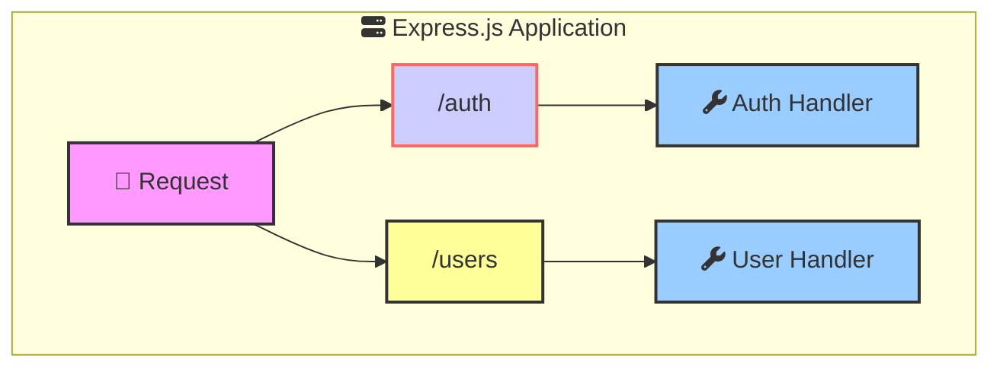


## Views

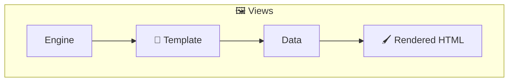


- **Templates**: Use template engines like Pug, EJS, or Handlebars to create dynamic HTML.
  ```javascript
  const express = require('express');
  const app = express();
  app.set('view engine', 'pug');

  app.get('/', (req, res) => {
    res.render('index', { title: 'Express', message: 'Hello there!' });
  });

  app.listen(3000);
  ```

- **Rendering**: Generates and returns HTML based on the templates and data provided.
  ```javascript
  // views/index.pug
  html
    head
      title= title
    body
      h1= message
  ```

## Static Files

Static files are assets that don't change dynamically, such as images, CSS stylesheets, and client-side JavaScript files. `express.static()` is a middleware function, meaning it intercepts requests before they reach your route handlers.

  ```javascript
  const express = require('express');
  const app = express();

  app.use(express.static(path.join(__dirname, 'public'))); 

  app.listen(3000);
  ```

**Directory**: Specify the directory from which to serve static assets.

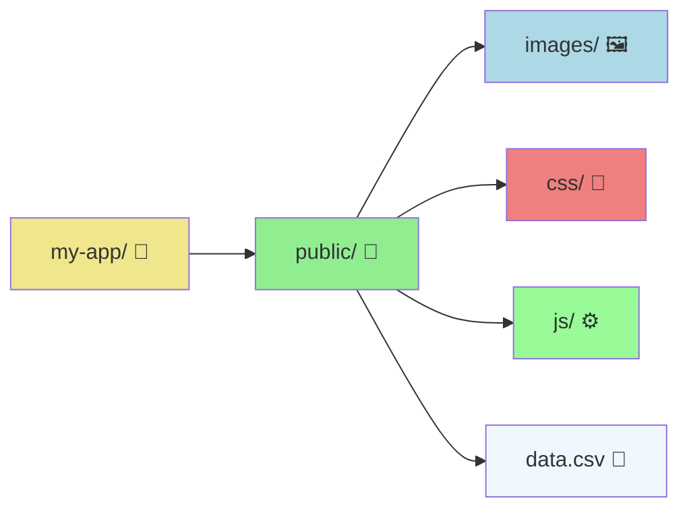

Use `Stream` to download files  in public directory.
```js
const fs = require('fs');

app.get('/download-csv', (req, res) => {
  const filePath = path.join(__dirname, 'public', 'path/to/your/file.csv');

  // Check if file exists
  if (!fs.existsSync(filePath)) {
    return res.status(404).send('File not found');
  }

  // Set headers for download
  res.setHeader('Content-Disposition', 'attachment; filename=file.csv');
  res.setHeader('Content-Type', 'text/csv');

  // Pipe the file to the response
  const fileStream = fs.createReadStream(filePath);
  fileStream.pipe(res);
});
```


## Logging

Log errors to the console or a file for debugging and monitoring. Datadog, Sentry, or other services can be used for more advanced error logging.

```js
function logErrors(err, req, res, next) {
  console.error(err.stack); // Log to console in development
  // You can replace this with logging to a file or external service
  next(err); 
}
```
Modern applications need standardized logging to monitor and debug issues effectively. Winston and Morgan are popular logging libraries for Node.js applications. Key requirements for logging include:
- Structured Format: Log messages should be in a structured format (e.g., JSON) for easy parsing and analysis.
- Log Levels: Different log levels (e.g., info, warn, error) help categorize log messages based on severity.'
- Timestamps: Include timestamps in log messages to track when events occurred.
- Context: Additional metadata.
- Monitoring: Centralized logging solutions (e.g., Datadog, Sentry) for monitoring and alerting.


```js
// src/config/logger.js
const winston = require('winston');
const path = require('path');

const logger = winston.createLogger({
  level: process.env.LOG_LEVEL || 'info',
  format: winston.format.combine(
    winston.format.timestamp(),
    winston.format.json()
  ),
  transports: [
    // Console transport
    new winston.transports.Console({
      format: winston.format.combine(
        winston.format.colorize(),
        winston.format.simple()
      )
    }),
    // Error file transport
    new winston.transports.File({
      filename: path.join(__dirname, '../../logs/error.log'),
      level: 'error'
    }),
    // Combined file transport
    new winston.transports.File({
      filename: path.join(__dirname, '../../logs/combined.log')
    })
  ]
});

module.exports = logger;
```

Log Outputs


```js

// Example usage in your application:
try {
  // Some operation that might fail
  throw new Error('Database connection failed');
} catch (error) {
  // Error level (most serious issues)
  logger.error('Database connection error', {
    error: error.message,
    stack: error.stack,
    database: 'postgres'
  });
  /* Output:
  {
    "level": "error",
    "message": "Database connection error",
    "timestamp": "2024-11-08T10:30:45.123Z",
    "error": "Database connection failed",
    "stack": "Error: Database connection failed\n    at ...",
    "database": "postgres"
  }
  */

  // Warning level (potential issues)
  logger.warn('High API latency detected', {
    latency: 1500,
    endpoint: '/api/users'
  });
  /* Output:
  {
    "level": "warn",
    "message": "High API latency detected",
    "timestamp": "2024-11-08T10:30:45.123Z",
    "latency": 1500,
    "endpoint": "/api/users"
  }
  */

  // Info level (normal operations)
  logger.info('API request received', {
    method: 'GET',
    path: '/api/users'
  });
  /* Output:
  {
    "level": "info",
    "message": "API request received",
    "timestamp": "2024-11-08T10:30:45.123Z",
    "method": "GET",
    "path": "/api/users"
  }
  */
}
```


## Error Handling


### Logging Errors


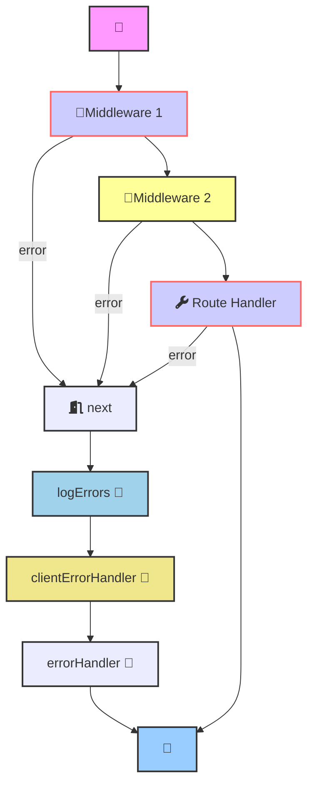


For small to medium applications, it's better to centralize logging in middleware for consistency and easier maintenance. Here's why:

```js
// ❌ First Version - Don't mix logging and throwing
const logger = require('../config/logger');

class UserService {
  async getUser(id) {
    const user = await User.findById(id);
    
    if (!user.isActive) {
      // Bad practice: Logging before throwing
      logger.error('Inactive user attempted access', {  
        userId: user.id,
        status: user.status
      });
      throw new Error('Inactive user access denied');
    }
    return user;
  }
}

// ✅ Second Version - Better approach with centralized logging
// errors/AppError.js
class AppError extends Error {
  constructor(message, code) {
    super(message);
    this.code = code;
  }
}

class InactiveUserError extends AppError {
  constructor(userId, status) {
    super('Inactive user access denied', 'INACTIVE_USER');
    this.userId = userId;
    this.status = status;
  }
}

// services/userService.js
class UserService {
  async getUser(id) {
    const user = await User.findById(id);
    
    if (!user.isActive) {
      throw new InactiveUserError(user.id, user.status);
    }
    return user;
  }
}

// middleware/errorMiddleware.js
const logger = require('../config/logger');

function logErrors(err, req, res, next) {
  logger.error('Error occurred', {
    // Error details
    error: {
      message: err.message,
      stack: process.env.NODE_ENV === 'development' ? err.stack : undefined,
      code: err.code || 'UNKNOWN_ERROR',
      // Include any custom properties from custom error classes
      ...(err instanceof InactiveUserError ? {
        userId: err.userId,
        status: err.status
      } : {})
    },

    // Request context
    request: {
      path: req.path,
      method: req.method,
      params: req.params,
      query: req.query,
      ip: req.ip
    },

    // User context (if available)
    user: req.user ? {
      id: req.user.id,
      email: req.user.email
    } : 'anonymous',

    // Timestamp and environment
    timestamp: new Date().toISOString(),
    env: process.env.NODE_ENV
  });

  next(err);
}

// Example of how to use in Express app:
app.use(logErrors);
```

Benefits of centralized logging:
1. Single place to modify logging logic
2. Consistent log format
3. Easier to maintain
4. Cleaner service code
5. Separation of concerns

The only exception might be audit logging or business-specific logging that needs to be in the service layer.


### Handling different types of errors

To handle different types of errors, you can create custom error classes that extend the built-in Error class. This approach allows you to categorize errors based on their type and provide a consistent error structure.

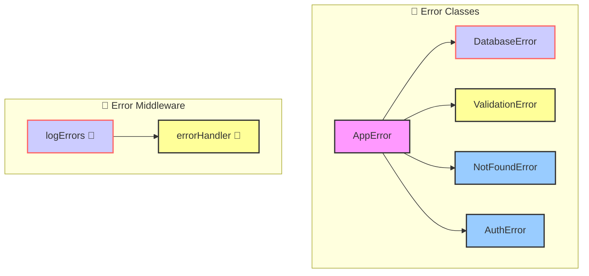

```js
// src/utils/AppError.js
class AppError extends Error {
  constructor(message, statusCode, code) {
    super(message);
    this.statusCode = statusCode;
    this.code = code;
  }
}

class DatabaseError extends AppError {
  constructor(message = 'Database error occurred') {
    super(message, 500, 'DATABASE_ERROR');
  }
}

class ValidationError extends AppError {
  constructor(message = 'Validation failed') {
    super(message, 400, 'VALIDATION_ERROR');
  }
}

class NotFoundError extends AppError {
  constructor(message = 'Resource not found') {
    super(message, 404, 'NOT_FOUND');
  }
}

class AuthError extends AppError {
  constructor(message = 'Authentication failed') {
    super(message, 401, 'AUTH_ERROR');
  }
}

module.exports = {
  AppError,
  DatabaseError,
  ValidationError,
  NotFoundError,
  AuthError
};

// Usage in your service
// userService.js
const { DatabaseError, NotFoundError } = require('../utils/AppError');

class UserService {
  async getUser(id) {
    try {
      const user = await User.findById(id);
      
      if (!user) {
        throw new NotFoundError('User not found');
      }
      
      return user;
    } catch (error) {
      if (error.name === 'MongoError') {
        throw new DatabaseError('Database query failed');
      }
      throw error;
    }
  }
}

// Then in your error middleware
// middleware/errorMiddleware.js
const logger = require('../config/logger');

function logErrors(err, req, res, next) {
  logger.error('Error occurred', {
    error: {
      message: err.message,
      code: err.code,
      statusCode: err.statusCode,
      stack: process.env.NODE_ENV === 'development' ? err.stack : undefined
    },
    request: {
      path: req.path,
      method: req.method
    },
    user: req.user?.id || 'anonymous'
  });

  next(err);
}

function errorHandler(err, req, res, next) {
  const statusCode = err.statusCode || 500;
  
  res.status(statusCode).json({
    status: 'error',
    code: err.code || 'UNKNOWN_ERROR',
    message: err.message
  });
}
```

This approach:
- Keeps error types organized
- Provides consistent error structure
- Makes error handling predictable
- Easy to add new error types
- Simple to use in services

## Q&A


### How does Express.js determine whether to call the next middleware or an error-handling middleware?

**It depends on how the `next` function is called:**
- **`next()`**: Without arguments, it proceeds to the next regular middleware.
- **`next(err)`**: With an error argument, it skips to the error-handling middleware.


```javascript
app.use((req, res, next) => {
    next(); // Calls the next regular middleware
});

app.use((req, res, next) => {
    next(new Error('Error occurred')); // Calls the error-handling middleware
});

app.use((err, req, res, next) => {
    res.status(500).send('Something broke!');
});
```

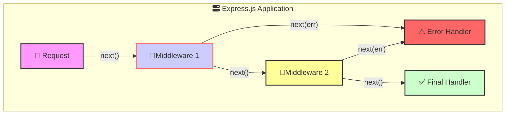

### What are the differences between req.query and req.params ?

- **`req.query`**: Contains the query parameters in the URL (e.g., `/users?name=John&age=30`).
- **`req.params`**: Contains route parameters defined in the route path (e.g., `/users/:id`).

```javascript
app.get('/users', (req, res) => {
    const { name, age } = req.query;
    res.send(`Name: ${name}, Age: ${age}`);
});

app.get('/users/:id', (req, res) => {
    const { id } = req.params;
    res.send(`User ID: ${id}`);
});
```

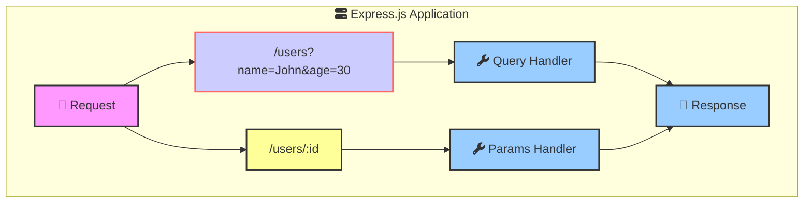

### How to parse the request body? 

- **`express.json()`**: Middleware to parse JSON bodies.
- **`express.urlencoded()`**: Middleware to parse URL-encoded bodies.
- **`express.text()`**: Middleware to parse text bodies.
- **`express.raw()`**: Middleware to parse raw bodies.

```javascript
const express = require('express');
const app = express();

app.use(express.json()); // Parse JSON bodies
app.use(express.urlencoded({ extended: true })); // Parse URL-encoded bodies

app.post('/users', (req, res) => {
    const { name, age } = req.body;
    res.send(`Name: ${name}, Age: ${age}`);
});

app.listen(3000);
```

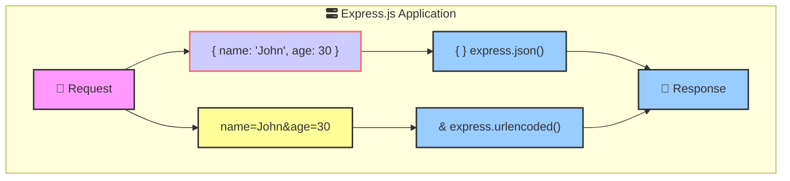

### Explain the order of router precedence ?

- **Exact Match**: Routes with exact matches take precedence over dynamic routes.
- **Dynamic Routes**: Routes with dynamic parameters (e.g., `/users/:id`) are matched next.
- **Wildcard Routes**: Routes with wildcards (e.g., `/users/*`) are matched last.

```javascript
app.get('/users', (req, res) => {
    res.send('All users');
});

app.get('/users/new', (req, res) => {
    res.send('New user form');
});

app.get('/users/:id', (req, res) => {
    res.send(`User ID: ${req.params.id}`);
});

app.get('/users/*', (req, res) => {
    res.send('Wildcard route');
});
```


### How to handle file uploads ?

- **`express-fileupload`**: Middleware to handle file uploads.
- **`req.files`**: Object containing uploaded files.

```javascript
const express = require('express');
const fileUpload = require('express-fileupload');
const app = express();

app.use(fileUpload());

app.post('/upload', (req, res) => {
    if (!req.files || Object.keys(req.files).length === 0) {
        return res.status(400).send('No files were uploaded.');
    }

    let uploadedFile = req.files.file; // assuming the form field name is 'file'

    // Read the content of the file
    const fileContent = uploadedFile.data.toString();

    // Process the file content
    const updatedContent = processFile(fileContent);
    // ...
    res.send(updatedContent);
});

```

### How to protect SQL Injection?

- **`express-mongo-sanitize`**: Middleware to sanitize user input and prevent NoSQL injection.

- **`xss-clean`**: Middleware to sanitize user input and prevent XSS attacks.

```javascript
const express = require('express');
const mongoSanitize = require('express-mongo-sanitize');
const xss = require('xss-clean');
const app = express();

app.use(mongoSanitize());
app.use(xss());

///
app.listen(3000);
```

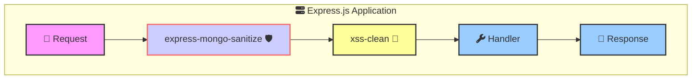

### How to implement rate limiting?

- **`express-rate-limit`**: Middleware to limit the number of requests from an IP address.

```javascript
const express = require('express');
const rateLimit = require('express-rate-limit');
const app = express();

const authLimiter = rateLimit({
    windowMs: 15 * 60 * 1000, // 15 minutes
    max: 100, // limit each IP to 100 requests per windowMs
    message: 'Too many requests from this IP, please try again after 15 minutes'
});

app.use('/auth', authLimiter);

app.post('/auth/login', (req, res) => {
    // Handle login logic
});

app.listen(3000);
```

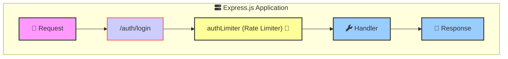

### How to handle versioning in APIs?

- **Route Prefixing**: Use a common prefix for all routes of a specific version.

```javascript
const express = require('express');
const app = express();

const v1Router = express.Router();
const v2Router = express.Router();

v1Router.get('/users', (req, res) => {
    res.send('Users v1');
});

v2Router.get('/users', (req, res) => {
    res.send('Users v2');
});

app.use('/v1', v1Router);
app.use('/v2', v2Router);

app.listen(3000);
```

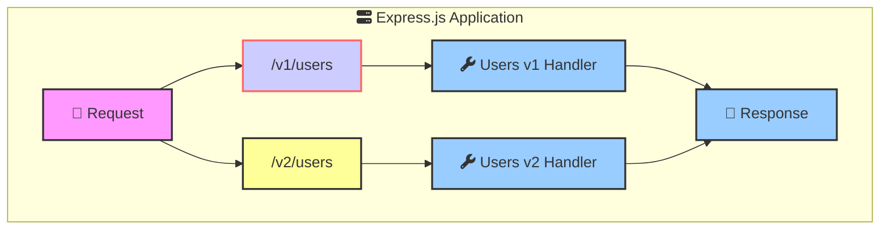

### How to handle CORS ?

- **`cors`**: Middleware to enable Cross-Origin Resource Sharing (CORS) in Express.

By default, browsers restrict cross-origin HTTP requests for security reasons, meaning a request from a different origin (like a frontend running on http://localhost:3000 trying to access an API on http://localhost:5000) would be blocked.

With app.use(cors()), you’re allowing the server to accept requests from different origins, making it suitable for a frontend application hosted on a different domain than your API.


```javascript
const express = require('express');
const cors = require('cors');
const app = express();

// Configuration object based on environment
const corsOptions = {
  origin: function (origin, callback) {
    // List of allowed origins based on environment
    const allowedOrigins = {
      production: ['https://mywebside.com'],
      development: ['https://dev.myside.com'],
      local: ['http://localhost:3000']
    };

    // Get current environment from NODE_ENV (defaults to 'development')
    const environment = process.env.NODE_ENV || 'development';
    const whitelist = allowedOrigins[environment];

    // Allow requests with no origin (like mobile apps, curl, postman)
    if (!origin) {
      return callback(null, true);
    }

    if (whitelist.indexOf(origin) !== -1) {
      callback(null, true);
    } else {
      callback(new Error('Not allowed by CORS'));
    }
  },
  credentials: true, // Allow credentials (cookies, authorization headers, etc)
  methods: ['GET', 'POST', 'PUT', 'DELETE', 'OPTIONS'],
  allowedHeaders: ['Content-Type', 'Authorization']
};

// Apply CORS middleware
app.use(cors(corsOptions));

// Example route
app.get('/', (req, res) => {
  res.json({ message: 'Hello World!' });
});

const PORT = process.env.PORT || 3000;
app.listen(PORT, () => {
  console.log(`Server running in ${process.env.NODE_ENV || 'development'} mode on port ${PORT}`);
});
```

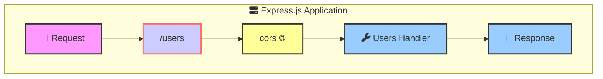

### How to document APIs?

- **Swagger/OpenAPI**: Use tools like Swagger UI or OpenAPI to document your APIs.

```javascript
const express = require('express');
const swaggerUi = require('swagger-ui-express');
const swaggerDocument = require('./swagger.json');
const app = express();

app.use('/api-docs', swaggerUi.serve, swaggerUi.setup(swaggerDocument));

app.listen(3000);
```

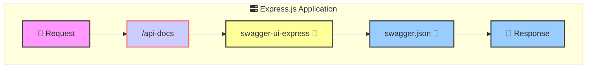


### How to manage environment variables ?

- **`dotenv`**: Package to load environment variables from a `.env` file.

```javascript
require('dotenv').config();

const express = require('express');
const app = express();

const PORT = process.env.PORT || 3000;

app.listen(PORT, () => {
    console.log(`Server is running on port ${PORT}`);
});
```

```mermaid
graph TD
    subgraph expressApp["fa:fa-server Express.js Application"]
        dotenv["dotenv 📄"]
        handler["fa:fa-wrench Handler \n process.env"]
    end

  
    style dotenv fill:#ccf,stroke:#f66,stroke-width:2px
    style handler fill:#9cf,stroke:#333,stroke-width:2px

```


### How to nest routers?

- **Router Nesting**: Mount routers within other routers to create a nested routing structure.

```javascript
const express = require('express');
const app = express();

const userRouter = express.Router();
const profileRouter = express.Router();

userRouter.use('/profile', profileRouter);

profileRouter.get('/', (req, res) => {
    res.send('Profile');
});

app.use('/users', userRouter);

app.listen(3000);
```

```mermaid
graph TD
    subgraph expressApp["fa:fa-server Express.js Application"]
        request["🔴 Request"]
        userRoute["/users"]
        profileRoute["/profile"]
        profileHandler["fa:fa-wrench Profile Handler"]
        response["🔵 Response"]
    end

    request --> userRoute
    userRoute --> profileRoute
    profileRoute --> profileHandler
    profileHandler --> response

    style request fill:#f9f,stroke:#333,stroke-width:2px
    style userRoute fill:#ccf,stroke:#f66,stroke-width:2px
    style profileRoute fill:#ff9,stroke:#333,stroke-width:2px
    style profileHandler fill:#9cf,stroke:#333,stroke-width:2px
    style response fill:#9cf,stroke:#333,stroke-width

```

### How to compress responses in Express.js?

- **`compression`**: Middleware to compress responses using gzip or deflate.

```javascript

const express = require('express');
const compression = require('compression');

const app = express();

app.use(compression());

app.get('/users', (req, res) => {
    res.send('Users');
});

app.listen(3000);
```

```mermaid
graph TD
    subgraph expressApp["fa:fa-server Express.js Application"]
        request["🔴 Request"]
        compression["compression 🗜️"]
        handler["fa:fa-wrench Handler"]
        response["🔵 Response"]
    end

    request --> compression
    compression --> handler
    handler --> response

    style request fill:#f9f,stroke:#333,stroke-width:2px
    style compression fill:#ccf,stroke:#f66,stroke-width:2px
    style handler fill:#9cf,stroke:#333,stroke-width:2px
    style response fill:#9cf,stroke:#333,stroke-width:2px
```


### How to validate request data ?

- **`express-validator`**: Middleware to validate and sanitize request data.

```javascript
const express = require('express');
const { body, validationResult } = require('express-validator');

const app = express();

app.post('/users', 
    body('email').isEmail(),
    body('password').isLength({ min: 6 }),
    (req, res) => {
        const errors = validationResult(req);
        if (!errors.isEmpty()) {
            return res.status(400).json({ errors: errors.array() });
        }
        res.send('User created');
    });

app.listen(3000);

```

```mermaid
graph TD
    subgraph expressApp["fa:fa-server Express.js Application"]
        request["🔴 Request"]
        validationRoute["/users"]
        validationMiddleware["express-validator 🛡️"]
        handler["fa:fa-wrench Handler"]
        response["🔵 Response"]
    end

    request --> validationRoute
    validationRoute --> validationMiddleware
    validationMiddleware --> handler
    handler --> response

    style request fill:#f9f,stroke:#333,stroke-width:2px
    style validationRoute fill:#ccf,stroke:#f66,stroke-width:2px
    style validationMiddleware fill:#ff9,stroke:#333,stroke-width:2px
    style handler fill:#9cf,stroke:#333,stroke-width:2px
    style response fill:#9cf,stroke:#333,stroke-width:2px
```

### How do you implement rate limiting in Express.js?

- **`express-rate-limit`**: Middleware to limit the number of requests from an IP address.

```javascript
const express = require('express');
const rateLimit = require('express-rate-limit');
const app = express();
const authLimiter = rateLimit({
    windowMs: 15 * 60 * 1000, // 15 minutes
    max: 100, // limit each IP to 100 requests per windowMs
    message: 'Too many requests from this IP, please try again after 15 minutes'
}); 
app.use('/auth', authLimiter);
app.post('/auth/login', (req, res) => {
    // Handle login logic
});

app.listen(3000);
```


### What's the recommended way to handle async errors in Express route handlers?

Using async/await with express-async-handler is a common pattern to handle async errors in Express route handlers. This library wraps route handlers with a try-catch block and forwards errors to the error-handling middleware.


```javascript

const express = require('express');
const asyncHandler = require('express-async-handler');

const app = express();

app.get('/route', asyncHandler(async (req, res) => {
    // Simulate an async operation
    const result = await someAsyncFunction();
    res.send(result);
}));

// Error-handling middleware
app.use((err, req, res, next) => {
    res.status(500).json({ message: err.message });
});

function someAsyncFunction() {
    return new Promise((resolve, reject) => {
        setTimeout(() => reject(new Error("Something went wrong!")), 1000);
    });
}

app.listen(3000, () => {
    console.log('Server is running on port 3000');
});

```

### How to implement session management in Express.js?

- **`express-session`**: Middleware to manage sessions in Express.

```javascript
const express = require('express');

const session = require('express-session');

const app = express();

app.use(session ({
    secret
    resave: false,
    saveUninitialized: true,
    cookie: { secure: false }
}));

app.get('/', (req, res) => {
    if (req.session.views) {
        req.session.views++;
    } else {
        req.session.views = 1;
    }
    res.send(`Views: ${req.session.views}`);
});

app.listen(3000);
```
### How to Redirect in Express.js?

- **`res.redirect()`**: Method to redirect to a different URL.

```javascript
const express = require('express');
const app = express();

app.get('/old', (req, res) => {
    res.redirect('/new');
});

app.get('/new', (req, res) => {
    res.send('New route');
});

app.listen(3000);
```


## Keywords To Remember

```mermaid
graph 
    subgraph expressApp["fa:fa-server Express.js Application"]
            request["🔴 "]
            middleware1["🚪"]
            middleware2["🚪"]
            router["fa:fa-sitemap"]
            routerMiddleware["🚪"]
            handler["fa:fa-wrench "]
            errorMiddleware["🚨"]
            response["🔵 "]
    end

    request --> middleware1 --> middleware2 --> router 
    router --> routerMiddleware --> handler 
    handler --> errorMiddleware --> response

    style request fill:#f9f,stroke:#333,stroke-width:2px
    style middleware1 fill:#ccf,stroke:#f66,stroke-width:2px
    style middleware2 fill:#ff9,stroke:#333,stroke-width:2px
    style router fill:#ccf,stroke:#f66,stroke-width:2px
    style routerMiddleware fill:#add8e6,stroke:#333,stroke-width:2px
    style handler fill:#9cf,stroke:#333,stroke-width:2px
    style errorMiddleware stroke:#333,stroke-width:2px
    style response fill:#9cf,stroke:#333,stroke-width:2px

    classDef requestClass fill:#f9f,stroke:#333,stroke-width:2px;
    classDef middlewareClass fill:#ccf,stroke:#f66,stroke-width:2px;
    classDef routerClass fill:#ccf,stroke:#f66,stroke-width:2px;
    classDef routerMiddlewareClass fill:#add8e6,stroke:#333,stroke-width:2px;
    classDef handlerClass fill:#9cf,stroke:#333,stroke-width:2px;
    classDef errorClass fill:#f61,stroke:#333,stroke-width:2px;
    classDef responseClass fill:#9cf,stroke:#333,stroke-width:2px;
```